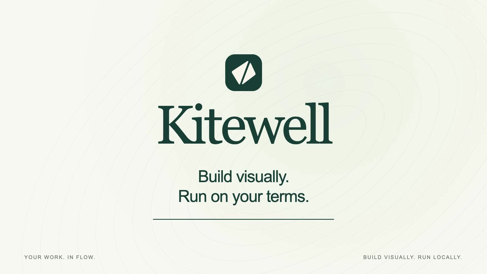
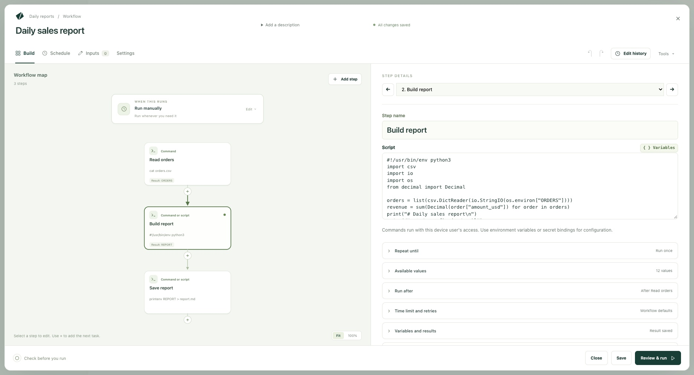
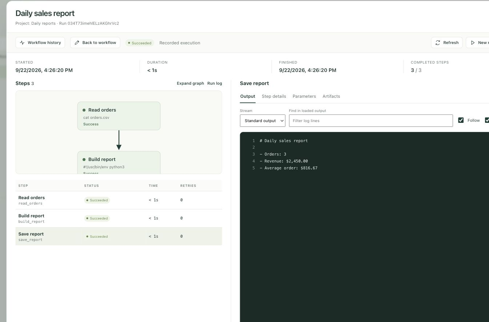

<p align="center">
  <a href="https://kitewell.app/#film">
    
  </a>
</p>

<p align="center">
  <strong>Build and run workflows on your own machine.</strong><br>
  <a href="https://kitewell.app/#film">▶ Watch the 60-second film</a> ·
  <a href="https://kitewell.app/videos/kitewell-social.mp4">30-second version</a>
</p>

<p align="center">
  <a href="https://kitewell.app">Website</a> ·
  <a href="https://kitewell.app/docs/">Documentation</a> ·
  <a href="https://kitewell.app/download/">Download</a> ·
  <a href="https://kitewell.app/pricing/">Pricing</a> ·
  <a href="https://github.com/dagucloud/kitewell/issues">Support</a>
</p>

---

Kitewell is a desktop app for connecting scripts, APIs, containers, and AI
agents in a visual editor. Build a workflow on a canvas, schedule it, and
inspect the output of each step. Workflow definitions and execution logs stay
on your machine.

**Public beta coming soon.** The first installers will support macOS 13+ on
Apple Silicon and Intel. Linux and Windows support is planned. No installers
have been published yet.



## What you can do

- **Build visually.** Connect steps on a canvas and edit each one in the
  inspector, or switch to YAML.
- **Use your tools.** Run commands and scripts, Docker images, AI harnesses
  such as Codex, Claude Code, and Gemini, remote servers over SSH, and AI
  decisions that choose the next path.
- **Call APIs without code.** Import an OpenAPI spec, choose an operation, and
  fill in its request form. Pass response values to later steps.
- **Schedule runs.** Run on demand, daily, on weekdays, or on a custom
  schedule. On macOS, Kitewell keeps working from the menu bar.
- **Inspect every run.** See which steps finished or failed, and read each
  step's output and errors.
- **Work with agents and teammates.** Connect MCP clients or the REST API with
  API keys. Export a project to use it on another device.



Try it with the
[daily report example](https://kitewell.app/docs/workflow-builder/#example-build-a-daily-report):
read a CSV, build a Markdown report with Python, and check the result in the
run log.

## Pricing

Free for one project, with no Kitewell account required. Pro supports up to
ten projects for $15/month (USD). These are planned launch prices; see
[Pricing](https://kitewell.app/pricing/).

## Documentation

- [Getting started](https://kitewell.app/docs/getting-started/)
- [Workflow builder](https://kitewell.app/docs/workflow-builder/)
- [AI agents and models](https://kitewell.app/docs/ai/)
- [APIs](https://kitewell.app/docs/apis/)
- [Scheduling](https://kitewell.app/docs/scheduling/)
- [MCP and API access](https://kitewell.app/docs/mcp/)
- [Project sharing](https://kitewell.app/docs/sharing/)
- [Troubleshooting](https://kitewell.app/docs/troubleshooting/)

## Support

- Questions and bug reports:
  [GitHub issues](https://github.com/dagucloud/kitewell/issues)
- Security vulnerabilities: report privately as described in
  [SECURITY.md](SECURITY.md)
- Release notes: [GitHub Releases](https://github.com/dagucloud/kitewell/releases)

## About this repository

This repository contains the kitewell.app website, customer documentation,
release notes, and public releases. Application source is not published here.

### Website development

Requires Node 24 and npm. From this checkout:

```sh
cd website
npm ci
npm run dev
```

Before pushing:

```sh
npm run check
npm test
npm run build
```

The website uses Astro for marketing pages and Starlight for documentation.
Docs are Markdown under `website/src/content/docs/docs/`; the nested `docs`
segment preserves the public `/docs/` route. Published Markdown notes live in
`releases/`. The build checks internal links, including documentation anchors.
