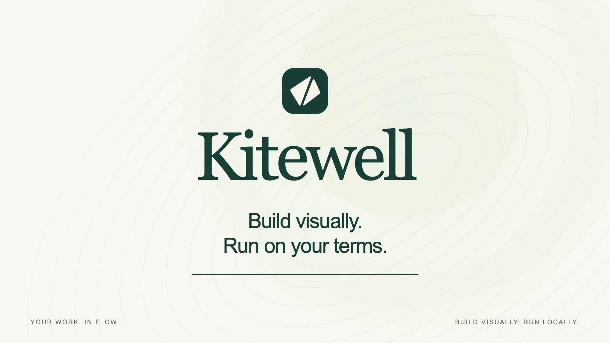
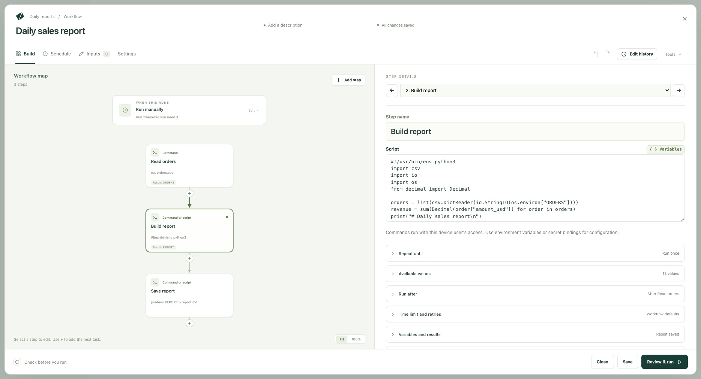
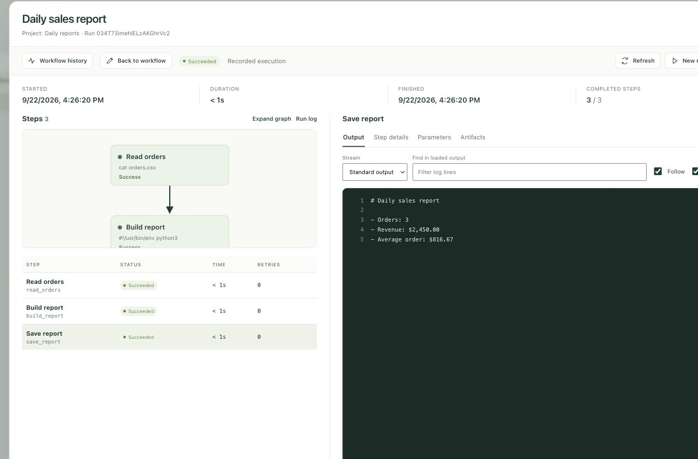

<p align="center">
  <a href="https://kitewell.app/#film">
    
  </a>
</p>

<p align="center">
  <strong>AI automation that runs on your own computer.</strong><br>
  <a href="https://kitewell.app/#film">▶ Watch the 60-second film</a> ·
  <a href="https://kitewell.app/videos/kitewell-social-v2.mp4">30-second version</a>
</p>

<p align="center">
  <a href="https://kitewell.app">Website</a> ·
  <a href="https://kitewell.app/docs/">Documentation</a> ·
  <a href="https://kitewell.app/download/">Download</a> ·
  <a href="https://kitewell.app/pricing/">Pricing</a> ·
  <a href="https://github.com/dagucloud/kitewell/issues">Support</a>
</p>

---

Kitewell automates websites, desktop apps, email, scripts, and coding agents
on your own Mac or PC. Build a workflow on a canvas or by asking the
assistant, schedule it, put an approval where it matters, and read the log of
every step. Your credentials and data stay on your machine.

**First installers coming soon.** They will support macOS 13+ on
Apple Silicon and Intel, and Windows 10 (version 1809) or later and Windows 11
on x64. Linux support is planned. No installers have been published yet.



## What you can do

- **Automate websites.** Open pages, click, type, and collect information in
  your own Chrome from instructions in plain words; sign-ins stay on the
  device.
- **Automate desktop apps.** On macOS or Windows, a model reads the screen and
  uses the mouse and keyboard for the app that has no API.
- **Automate email.** Find, organize, and send email in Gmail, Microsoft 365,
  or any IMAP mailbox connected on your computer.
- **Use your tools.** Run commands and scripts, Docker images, coding agents
  such as Codex, Claude Code, and Gemini, remote servers over SSH, AI
  decisions that choose the next path, and operations from any OpenAPI spec.
- **Build by asking.** The assistant proposes workflows as a diff you apply,
  or connect Claude Code or Codex through MCP.
- **Keep control.** Approval gates and human tasks, a test for one step, and
  replay of website and desktop actions that worked.
- **Schedule runs.** Run on demand, daily, on weekdays, or on a custom
  schedule. Kitewell keeps working from the menu bar on macOS or the tray on
  Windows.
- **Inspect every run.** See which steps finished or failed, and read each
  step's output and errors.
- **Work with agents and teammates.** Connect MCP clients or the REST API with
  API keys. Export a project to use it on another device, or sync it with Dagu
  Cloud to share it with your team. Secret values stay on each device.



Start from a complete [example](https://kitewell.app/examples/): an inbox
digest, invoices from email into a ledger, a nightly dependency update with
approval, a price watch, desktop-app entry, and more.

## Pricing

Free for one project with up to 10 workflows and one API key, with no Kitewell
account required. Pro supports up to ten projects of 200 workflows each, any
number of API keys, alerts, and team sync for $25 per person per month (USD).
These are planned launch prices; see
[Pricing](https://kitewell.app/pricing/).

## Documentation

- [Getting started](https://kitewell.app/docs/getting-started/)
- [Workflow builder](https://kitewell.app/docs/workflow-builder/)
- [Automate a website](https://kitewell.app/docs/browser/)
- [Automate a desktop app](https://kitewell.app/docs/desktop/)
- [Automate email](https://kitewell.app/docs/email/)
- [What leaves your computer](https://kitewell.app/docs/data-flow/)
- [AI agents and models](https://kitewell.app/docs/ai/)
- [APIs](https://kitewell.app/docs/apis/)
- [Scheduling](https://kitewell.app/docs/scheduling/)
- [MCP and API access](https://kitewell.app/docs/mcp/)
- [Project sharing](https://kitewell.app/docs/sharing/)
- [Troubleshooting](https://kitewell.app/docs/troubleshooting/)

## Support

- Questions and bug reports:
  [GitHub issues](https://github.com/dagucloud/kitewell/issues)
- Security vulnerabilities: report privately as described in
  [SECURITY.md](SECURITY.md)
- Release notes: [GitHub Releases](https://github.com/dagucloud/kitewell/releases)

## About this repository

This repository contains the kitewell.app website, customer documentation,
release notes, and public releases. Application source is not published here.

### Website development

Requires Node 24 and npm. From this checkout:

```sh
cd website
npm ci
npm run dev
```

Before pushing:

```sh
npm run check
npm test
npm run build
```

The website uses Astro for marketing pages and Starlight for documentation.
Docs are Markdown under `website/src/content/docs/docs/`; the nested `docs`
segment preserves the public `/docs/` route. Published Markdown notes live in
`releases/`. The build checks internal links, including documentation anchors.
