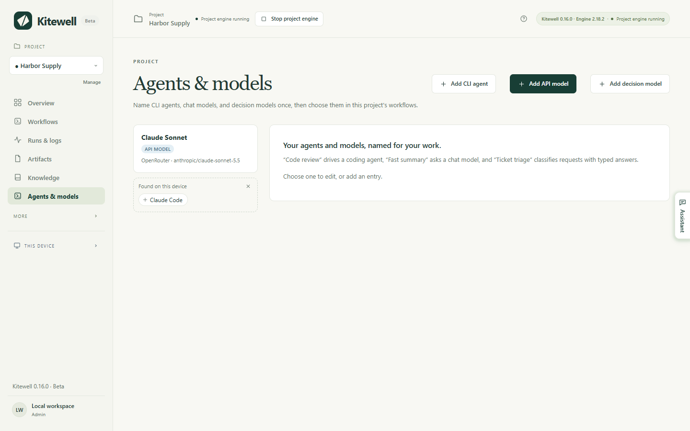
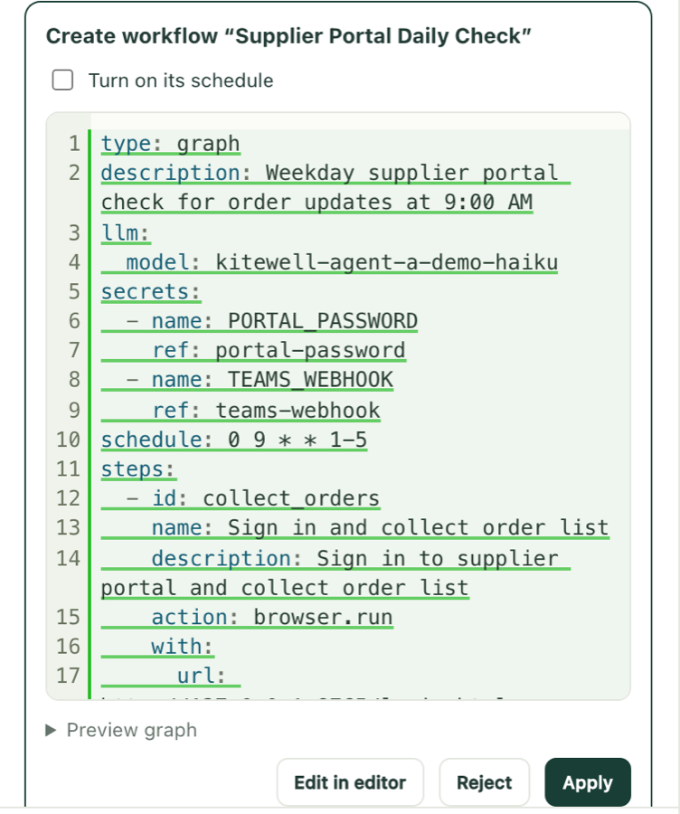

Kitewell does not come with an AI account. You bring your own — an API key
from a provider, or a coding tool already installed on this computer — and
tell the project about it once. From then on the assistant can build your
workflows with you, a failed run can explain itself, a sheet can read a value
out of each run, and a workflow can ask a model a question in the middle of
its work.

## What you need

- A provider's API key, for anything that calls a model over the internet. If
  the project already has one, **Agents & models** in the sidebar lists it.
- For a command-line coding agent, the tool installed on this computer and
  signed in there. Kitewell starts it; it never signs in for you.
- The **Agents & models** page is for administrators and editors. What the
  provider charges for a request is yours to pay.

## Add a model the project can use

1. Choose **Agents & models** in the sidebar, then **Add API model**.
2. Pick the **Provider**: Anthropic, OpenAI, Google Gemini, OpenRouter, Z.ai,
   OpenCode Zen, or Local server (Ollama, vLLM). A local server needs no key.
3. Under **API key**, choose the project [secret](/docs/secrets/) that holds
   the key — a secret is a password or key stored so it never shows in a log.
   An administrator can also choose **New key…** and **Paste the API key**
   here, which saves it as a secret in one step. The key is bound to each run
   that uses this model; the workflow itself never contains it.
4. Enter the **Model ID**. For OpenRouter, OpenCode Zen and a running local
   server this lists every model the provider offers, so you can type part of
   a name to search. For the others it suggests, and any ID your provider
   accepts works.
5. Give it a name of your own — "Fast summary", "Invoice reader" — and choose
   **Test model**. Before anything is sent, the panel shows the exact prompt,
   where it goes, which key it uses, and what is left behind.

The page holds three kinds of entry, chosen with **Kind**:

- **API model** asks a provider's model directly and returns its answer. It
  fills **Ask a model** tasks, the assistant, failure diagnosis, a sheet's
  result columns, and the **Automate a website** and
  **Automate a desktop app** tasks.
- **Decision model** classifies, scores, and answers yes-or-no questions, with
  a probability on each answer. **Add decision model** offers OpenRouter or
  TypeSafe. A **Make an AI decision** task uses it to sort or score something
  so a later step can branch on the answer, and a
  [sheet](/docs/batches/) uses it to judge yes-or-no, choice, and level
  columns.
- **CLI agent** drives a coding agent installed on this device.

An entry can fall back to another when it fails: its card then reads "Falls
back to" and names them. Each attempt is a fresh request, billed again.

## Use a coding agent on this computer

Install the tool and sign in to it first. Kitewell knows Aider, Amp, Claude
Code, Cline, Codex, Cursor, DeepSeek, Droid, Gemini, GitHub Copilot, Goose,
Kiro, OpenCode, Pi, and Qwen, and runs anything else as a **Custom command**.
Tools it finds on this computer that no agent uses yet appear under **Found on
this device**, one click from their own entry.

1. Choose **Add CLI agent** and pick the **Harness**. The list says which are
   installed on this device and which are not.
2. For Claude Code, Codex and OpenCode, **Load models** fills in what that
   tool offers. The others take a model name you type.
3. Choose **Test agent**. The panel shows the prompt it will send, the folder
   it will work in — a new empty temporary folder it removes afterwards — and
   anything it would bypass, before it runs.
4. In a workflow, add an **Ask an AI agent** task, choose the **Agent**, and
   write **Prompt · describe the task**. Under **Agent settings and context**,
   set the **Project folder** it works in.

A coding agent is a program running on this computer as you, with whatever
access you gave the tool itself. It can read and change files and run
commands. **Bypass permission prompts** on the agent turns off the tool's own
confirmations, and an agent with any set carries a **Bypasses approvals** mark
on its card. Never hand such an agent text that arrived from outside — the
workflow editor warns you when an email's text would reach one, because
whoever sent the email could then instruct it. Use **Ask a model** for that,
which cannot run anything.

## The assistant

The assistant builds and fixes workflows with you. Open it with **Assistant**
on any project page, or press ⌘J on a Mac, Ctrl+J on Windows. It is for
administrators and editors, and it uses one of the project's API models. If
the project has none, an administrator can connect one from the panel itself.

Nothing it proposes is saved until you apply it.

It proposes a new or changed workflow as a card with the change in it, and
**Preview graph** opens a picture of it. Choose **Apply**, or
**Edit in editor**, or **Reject**, which asks why. A new workflow that names a schedule
is saved paused unless you tick **Turn on its schedule**. After applying,
**Run now** opens the run form and **Open** opens the workflow. A change to an
existing workflow can be undone with **Undo**; a workflow it just created
cannot.

The rest of what it can do:

- It proposes rows and columns for a [sheet](/docs/batches/), shown in the
  open sheet until you decide. Applying can also start the runs it touched,
  and then it cannot be undone.
- It can run a draft as a trial to see whether the thing works. The first time
  in a conversation it asks, with **Allow trial runs**. A trial really runs
  commands, browser steps, reads and model calls, with the project's secrets.
  Anything that would send or change something elsewhere — a POST, an email, a
  command on another machine — goes only as far as reporting what it would
  have sent. It cannot delete a workflow or start a real run.
- It can put up to six short questions to you as one small form, which you
  answer with **Send answers** or pass with **Skip**.
- It can read a public web page you point it to. Addresses on this device or
  its own network are refused.
- It can ask for a secret by name. You type the value into its card, it is
  saved to the project's secret store, and the assistant never sees it. Only
  an administrator can add one this way, and only an administrator's assistant
  can list secret names — never values.
- It reads the project's [knowledge](/docs/knowledge/) every message and
  writes down what it learns as you work. Once the conversation has read a web
  page or a run's output, it
  [asks first](/docs/knowledge/#what-the-assistant-does).

On a failed run, **Ask the assistant** asks it to find out why and propose a
fix.

Conversations stay on this device. **Device settings → Assistant** sets
**Conversations kept per project**, 100 by default; when a new conversation
starts, the least recently used beyond that number are deleted.

## Why a run failed

Kitewell can read a failed run and say what to do about it.

1. Open **Project settings → Failure diagnosis** and turn on **Diagnose
   failed runs automatically**.
2. Choose the **Model** it should use.
3. Under **Workflows**, leave each workflow on **Project default**, or set it
   to **On** or **Off** on its own. Choose **Save diagnosis settings**.

Only the first failure of a run of failures is diagnosed, not every failed
run after it; a success ends the streak. The answer appears on the failed run
as one of **Try again**, **Needs you**, **Workflow change**, or **Unclear**,
with the cause and a next step. **Diagnose** asks for one on any failed run,
and **Diagnose again** asks for a fresh answer.

The model is sent the failed steps' results, the tail of their logs, what a
browser, desktop or agent step was doing when it stopped, the failures of a
child run, and the definition the run actually used. It is given no tools, so
nothing a run printed can act. Diagnoses stay on this device and are deleted
with their runs.

## What leaves this computer

Prompts and their context go to the provider or tool you chose, and that
provider's billing, retention and privacy rules then apply. A workspace that
lives on your computer does not mean every task stays on it.

- Before running, **Tools → Review AI prompts** in the workflow editor shows
  the instructions each AI task will receive. Runtime values are filled in
  when the run starts.
- After running, **Runs & logs** shows the prompt the run recorded and what
  came back.
- The assistant sends the project name, your workflows and the editor's
  current draft, the knowledge pages, the workbook you have open, and what a
  tool it used returned. Secret values are never sent.
- When the assistant's model is an OpenRouter model on OpenRouter's own
  address, its requests ask OpenRouter to route them only to providers that
  neither store nor train on what they receive.

See [What leaves your computer](/docs/data-flow/) for the whole picture.
