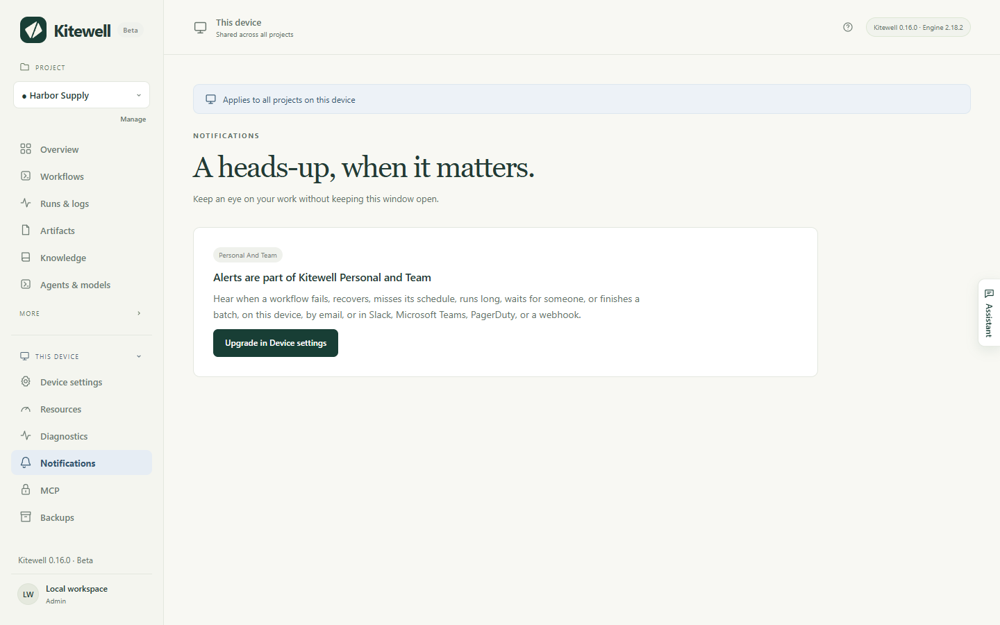

An alert tells you when a workflow needs you — it failed, it is waiting for
somebody to approve something, it did not start when it should have — so you
do not have to keep Kitewell open to find out.

## What you need

Alerts are part of Kitewell Personal and Team. On the free plan the **Notifications** page
offers the upgrade instead, and nothing is sent: not an email, not a message,
not even a notification on this computer. Nothing is held back for later
either, so alerts start from the moment the plan is in place.

A channel saved under an earlier plan stays listed under **Saved channels**,
where you can remove it. It sends nothing until the plan is back.

## Choose where alerts go

Open **This device → Notifications**. A channel is somewhere alerts arrive.
Choose **Add channel**, pick its **Type**, give it a **Name**, and fill in
what it needs:

- **This device** shows a notification on this computer. It is there from the
  start: turn on **Notify on this device** under **Desktop notifications**,
  and allow notifications when the system asks. It needs the installed
  Kitewell app, not just a browser window.
- **Email** takes **Recipients**, a list of addresses. The server they go
  through is set once for the whole device under **Email server**:
  **SMTP server**, **Port**, **Username**, **Password**, **Send from**, and
  **Connection security**, which offers **STARTTLS (usually port 587)** and
  **TLS (usually port 465)**. An encrypted connection is required. Use an app
  password if your provider asks for one.
- **Slack** takes an **Incoming webhook URL**. Add an incoming webhook to the
  channel in Slack and paste its address.
- **Microsoft Teams** takes a **Workflow URL**. In Teams, create a workflow
  from the template that posts to a channel when a webhook request is
  received, and paste its address.
- **PagerDuty** takes an **Integration key** from an Events API v2
  integration, and a **Service region**: **United States** or
  **European Union**. An alert opens an incident and its recovery closes it.
- **Webhook** takes a **Receiver URL** and posts signed JSON to it, in the
  [Standard Webhooks](https://www.standardwebhooks.com/) format. A
  **Signing secret** is made when you save the channel and shown once; give it
  to whoever receives the messages.

**Send test** delivers a sample alert using the values you have typed, before
you save them, so a mistake shows up straight away. A PagerDuty test opens an
incident and closes it again, so nobody is paged.

Each channel says whether its last delivery arrived, and **Recent alerts**
lists what was sent and what is still being retried. **Send workflow alerts**
turns every alert from this device off; turning it back on starts from then,
not from what happened while it was off.

## Choose what you hear about

Rules decide which events reach which channels, in three layers:

1. **Default alert rules** on the **Notifications** page apply to every
   project without rules of its own. Out of the box they send **Fails**,
   **Needs input**, **Misses a schedule** and **Finishes a batch** to
   **This device**.
2. **Project settings → Notifications** gives one project rules of its own:
   choose **Use rules for this project** instead of
   **Follow this device's default rules**. A project's rules replace the
   defaults rather than add to them.
3. The bell on a workflow, in its editor or in the **Workflows** list, is for
   that one workflow. **Mute** it **For 1 hour**, **For 1 day**,
   **For 1 week**, or **Until I unmute it**; give it its own rules with
   **Use rules for this workflow**; or set **Counts as running long** to
   **Automatically, from recent runs**, **After a set time**, or **Never**.
   Choose **Save alerts**. These apply at once on this device and leave the
   workflow itself untouched, so they never travel with it.

**Missed after**, in the default and the project rules, is how many minutes
late a scheduled run may start before it counts as missed. It starts at 5.

## What each event means

- **Fails**: the run failed, after its last automatic retry. You hear when a
  run of failures begins, not on every failed run, and you hear again when the
  next run succeeds — a recovery always goes to the same channels the failure
  did.
- **Needs input**: a person's task or an approval is waiting for somebody. A
  step that waits again after being answered is announced again.
- **Misses a schedule**: scheduled runs did not start, with how many and why —
  the computer was asleep, Kitewell was not running, the project's engine was
  stopped. A second message follows when the workflow runs on time again.
- **Runs long**: the run is still going well past the time its recent
  successes took, or past a limit you set with the bell. You hear once per
  run.
- **Is cancelled** and **Succeeds**: off unless you route them somewhere.
- **Finishes a batch**: every row of a [batch](/docs/batches/) has finished
  and its values were read, with how many did not succeed and what changed by
  column, such as "Price: 9 dropped, 3 rose". A batch you cancelled is not
  announced, and neither is a scheduled one where every row succeeded and
  nothing changed. A scheduled batch that could not start is announced with
  why. The rows of a batch do not raise the other events one by one.

PagerDuty accepts only **Fails**, **Misses a schedule** and **Runs long**: an
incident needs something that later closes it, and those are the three that
end.

## What an alert says

An alert names the project, the workflow, what started the run, when it began
and how long it took, and — when something failed — which step and how, with
its exit code or its time limit. It never carries what a step printed, or the
values the run was given: an alert leaves this computer, and output can hold
anything.

Its link opens the run in Kitewell on the computer that ran it, so it works
for whoever is sitting there. A missed-schedule alert opens the project's
**Workflows** page, and a batch alert opens its sheet.

Alert messages themselves are written in English, whatever language Kitewell
is set to.

## When alerts are sent

The background service sends them while the computer is awake and Kitewell is
running. An alert that cannot be delivered is retried, further apart each
time, for up to a day. Kitewell does not watch your computer from somewhere
else: while it is asleep or off nothing is sent, and the schedules it missed
are reported once it wakes. A run that finished more than a day ago is not
announced when Kitewell finds it late.

## Alerts, not event handlers

[Event handlers](/docs/workflow-builder/#run-a-task-when-the-workflow-ends)
are tasks that run when a workflow succeeds, fails, is cancelled, or ends.
They are for cleaning up and recovering. Use alerts to tell people.

A workflow cannot mail anybody by itself: `mail_on`, `smtp`, `error_mail`,
`info_mail` and `mail_on_error` are refused when you save it, because an alert
sent that way would answer to no rule, no mute, and no delivery record.

## If something goes wrong

- **Nothing arrives at all.** Check the plan, then **Send workflow alerts**,
  then the rules: a project with its own rules does not follow the defaults.
- **Nothing arrives on this computer.** **This device** needs the installed
  Kitewell app and the system's permission to show notifications. Use
  **Send a test notification** to check.
- **A channel says it is failing.** Its card shows the error and when it
  started. **Edit** it and use **Send test** to try the fix before saving.
- **One workflow has gone quiet.** Look for the bell on its row in
  **Workflows**: it may be muted, or have rules of its own.

## Details

- Alerts need Kitewell Personal or Team. Reading what is set up, and removing a channel,
  work on any plan.
- A device may hold up to 50 channels.
- An undelivered alert is retried after a minute, then two, four, eight,
  sixteen and thirty, and is given up after a day. A reply that says the
  message was understood and refused is not retried.
- **Recent alerts** keeps the last 200 deliveries and shows the newest 20.
- **Missed after** accepts 1 to 1,440 minutes. A workflow's own
  running-long limit accepts up to a week.
- "Runs long" works itself out from the last successful runs of that
  workflow, and needs at least five of them before it will say anything.
- A webhook channel may post to an `http` address as well as `https`. Slack
  accepts only `hooks.slack.com` addresses, and Teams only `https`.
