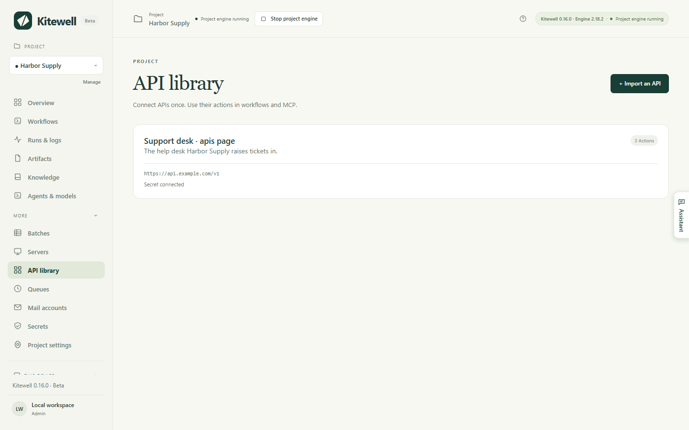
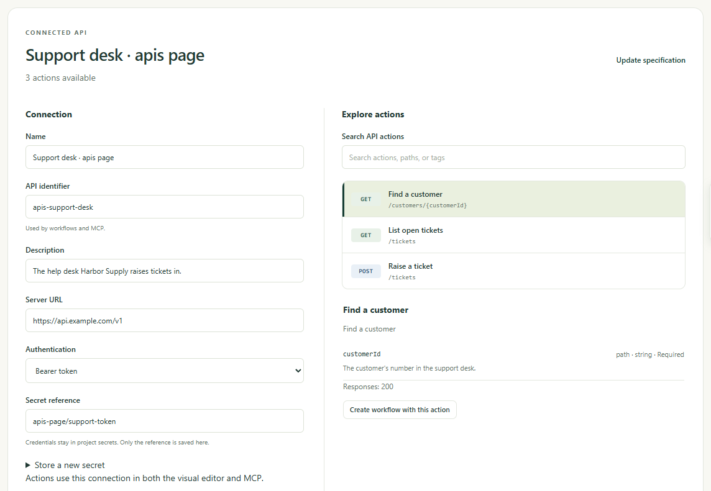

Make the things another service already does — look up a customer, raise a
ticket, post an order — into steps you can pick from a list. You import the
service's description once, and Kitewell builds the forms, so a workflow step
is a few fields to fill in rather than a request to write.

## What you need

- An OpenAPI document for the service: a JSON or YAML file in OpenAPI 3.0 or
  3.1. Whoever runs the service publishes it, often as a link on their
  developer page named "OpenAPI" or "openapi.json". Ask them for it if you
  cannot find it.
- The token, key, or password the service expects, if it needs one. Keep it
  ready, but do not type it into a workflow: it belongs in a
  [secret](/docs/secrets/).

A connection belongs to one project, and every workflow in that project can
use it.

## Import a service

1. In the project sidebar, open **More → API library** and choose
   **Import an API**.
2. Choose how the document reaches Kitewell: **Upload file**, **From URL**, or
   **Paste specification**.
3. Choose **Preview actions**. Kitewell reads the document and opens
   **Review & connect**, which lists everything the service can do.
4. Under **Explore actions**, search by name, path, or tag and select an
   action to read its inputs and responses. An action Kitewell cannot run as a
   step says why, right there.
5. Under **Connection**, check **Name**, **API identifier**, and
   **Server URL**. Fill in the server address yourself if the document has
   none.
6. Choose **Authentication** and connect a secret if the service needs one.
   See [Connect credentials](#connect-credentials) below.
7. Choose **Connect API**.

The connection then appears as a card in **API library**, with how many
actions it has and whether a secret is attached.

Choose the card to come back to the same screen at any time: its settings on
the left, its actions on the right.

**API identifier** is the name workflows use to find this connection, so it
stays the same once saved. The document itself is stored in the project, even
when it came from a URL, so nothing is fetched again at run time. Previewing
or connecting never calls the service.

If the document's URL needs a sign-in of its own, download the file in your
browser first and use **Upload file** or **Paste specification**.

## Connect credentials

Under **Authentication**, choose what the service expects:
**No authentication**, **Bearer token**, **API key**, or
**Username and password**. For **API key**, also give its **Key name** and
choose **Send key in**: **Header**, **Query parameter**, or **Cookie**.

Then name the secret that holds the value. Type or pick an existing
**Secret reference** from the same project, such as `services/support-token`.
To make one here, open **Store a new secret**, type the value under
**Password or access token**, and choose **Store secret**.

For a bearer token or an API key, the secret holds the token or key itself.
For **Username and password**, type the **Username** into the connection and
keep the password in the secret.

The connection stores only the reference. Kitewell looks the value up and
adds it to every request that uses the connection, and the value itself never
appears in a workflow or a log. See [Secrets](/docs/secrets/) for replacing a
value later.

OAuth sign-in and automatic token refresh are not included. For a service
that accepts an OAuth access token, get the token yourself and connect it as
a **Bearer token**. Replace the secret's value when the token expires.

## Use an action in a workflow

1. Open the workflow, go to **Build**, and choose **Add step**.
2. Choose **Use an API action**.
3. Choose a **Connected API**, then search under **Find an API action** and
   pick the one you want.
4. Fill in the inputs Kitewell generated. The required ones come first; open
   **Optional parameters** for the rest. A **Request body** form appears when
   the action takes one.
5. Use **Variables** beside an input to insert a workflow input or a value
   from an earlier step.
6. Choose **Tools → Check workflow**, then save and run it, and read the
   result under **Runs & logs**.

You can also start from the service: open its card in **API library**, select
an action under **Explore actions**, and choose
**Create workflow with this action**.

## Pass a result to the next step

Open **Response fields** on the API step to see the fields the document
describes. In a later step, open **Variables** beside an input and pick one of
them. Kitewell adds the mapping and connects the two steps, so the later step
waits for the API call to finish.

A customer lookup can hand its `id` to a step that raises a ticket, for
example. Which fields are offered depends on what the document says the
response contains. When it describes nothing in detail, the whole response is
available as one value.

## Update a service's description

Kitewell keeps the document as it was when you imported it. A change at the
original URL does not reach the project on its own.

1. Open the connection in **API library** and choose **Update specification**.
2. Upload, fetch, or paste the new document, then choose **Preview actions**.
3. Review the actions and choose **Save connection**.

Kitewell checks the project's workflows before it saves. If the new document
would break a saved workflow — an action it uses is gone, or its inputs
changed — the update is refused and the old connection stays. Fix those
workflows first, or import the new document under a different
**API identifier** and move the workflows over one at a time.

For the same reason, a connection cannot be deleted while a saved workflow
uses it. **Delete API** names the workflow that is holding it.

## Share a connection without its credentials

A [project export](/docs/sharing/) carries the imported document and the
connection's settings: the server address, the kind of authentication, and the
secret's name. Secret values are not included. On the receiving device the
secret shows **Value needed** in **Secrets** until someone sets it there, or
you point the connection at another secret in that project.

The export also keeps the address the document came from. A credential typed
straight into the document, a server address, or a workflow input is not
removed for you. Look over those fields before you share the file.

## What the importer accepts

- One JSON or YAML document, up to 8 MiB. A Swagger 2 document has to be
  converted to OpenAPI 3.0 or 3.1 first; Kitewell says so if you try.
- References must point inside the same document. Bundle external references
  before importing.
- A request body may be JSON, a URL-encoded form, or text. File uploads,
  other multipart bodies, and binary bodies are not available as API steps;
  use a web-service step for those.
- An action that needs two credentials at once, or an authentication scheme
  Kitewell does not handle, is marked in the action list with the reason.
- Paging is not automatic. Give the page or cursor input yourself, and repeat
  the request in the workflow.

The same imported actions and schemas are also open to an AI assistant with
edit access. See [MCP and API access](/docs/mcp/).
