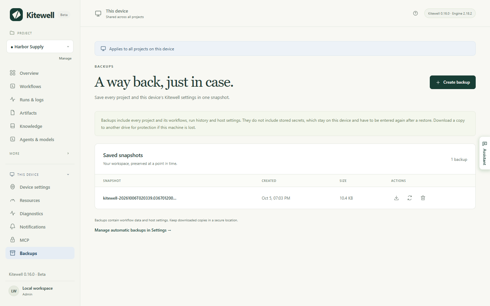
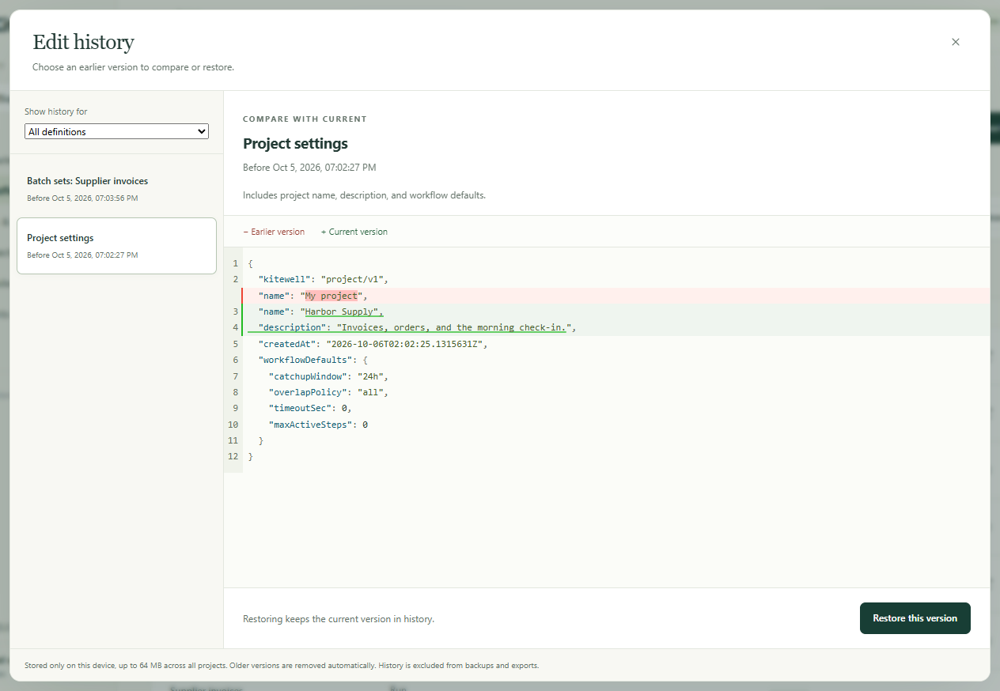

A snapshot puts every project on this device — workflows, run history,
settings, sheets, and knowledge — into one file you can keep somewhere safe
and put back later. Kitewell can take one every night on its own. It also
keeps the earlier versions of anything you edit, so a change to one workflow
can be undone without restoring the lot.

## What you need

Administrator access on this device. **Backups** appears under **This device**
in the sidebar.

## Make a backup now

1. Open **This device → Backups** and choose **Create backup**.
2. Wait a moment. Each project's engine stops while the snapshot is taken and
   starts again afterwards.
3. The snapshot appears under **Saved snapshots** with its **Created** time and
   **Size**.
4. Choose **Download backup**, the arrow beside the snapshot, and save the
   file somewhere you control.



A snapshot that only ever sits on this device is useful for undoing a change.
It is no help if the device itself is lost or stolen, so keep a downloaded copy
on another drive or in storage your team protects.

## Back up every day

Turn on **Device settings → Automatic backups → Daily backups** and choose the
**Backup hour**. Kitewell then takes one snapshot a day, soon after that hour,
in this device's own time zone. If the device is asleep at the time, the
snapshot is taken after it wakes.

Kitewell keeps the 10 newest automatic snapshots and removes older ones. A
snapshot you asked for yourself, and the safety snapshot taken before a
restore, stay until you delete them.

Two things stop an automatic snapshot. A workflow that is running, queued, or
waiting — including one waiting for an approval — holds it up, and Kitewell
tries again every 15 minutes. And a device with every project stopped takes
none at all, because nothing is running to protect.

## Undo one change instead

Every time you save a workflow, a sheet, or a project setting, Kitewell keeps
the version you replaced. Choose **Edit history** on the **Workflows** page,
in **Project settings**, or in the workflow editor's toolbar.

1. Pick a version in the list. Each one is labelled with the time you saved
   over it.
2. Read the comparison. **Earlier version** is what you are looking at,
   **Current version** is what is saved now.
3. Choose **Restore this version**, then **Restore** to confirm.



Restoring keeps the current version in history, so you can go back again.
**Show history for** narrows the list to one workflow or setting. A workflow
you deleted is still in here: restoring it brings it back with its schedules
paused.

This history lives only on this device. It is not in a snapshot and not in a
project export, and restoring a snapshot clears it.

## Restore everything from a snapshot

1. Let the work in progress finish. A restore is refused while a workflow is
   running, queued, or waiting.
2. Open **This device → Backups** and choose **Restore backup**, the circling
   arrows beside the snapshot.
3. Read the warning and confirm with **Restore backup**. Kitewell saves a
   safety snapshot first, replaces every project and this device's settings,
   and reloads.
4. Read what the restore reports and work through it.

The restore names, for each project, the secrets to enter again, the mailboxes
to connect again, and the website steps that will sign in again on their next
run. Container registry sign-ins are cleared, so enter those again too.

This device keeps what is its own: its sign-in, its API keys, and which
projects were stopped. No snapshot can lock you out, and no snapshot carries
someone else's keys onto your device.

A restore never writes to Dagu Cloud. A [synced project](/docs/cloud-sync/)
comes back as the snapshot had it, and its next update takes Dagu Cloud's
copy.

## What a snapshot holds

| In the snapshot | Left out |
| --- | --- |
| Device settings, alert channels and rules | Secret values and the keys that decipher them |
| Projects, workflow definitions, workflow defaults | Alert channel passwords, webhook addresses and keys |
| Imported OpenAPI files and API connection settings | Mailbox sign-ins |
| Batch sheets, releases, knowledge pages | Saved website sign-ins and replay caches |
| Secret names and descriptions | What desktop steps recorded of the screen |
| Run history and artifacts | Run output logs |
| Assistant conversations and failure diagnoses | Edit history, alert history |
| Copies of a linked Excel file kept for Undo | This device's sign-in and API keys |
| What this device decided per project: approved SSH hosts, key paths, which workflows run here | The Dagu Cloud connection, a file at the top of the data folder |

What is left out is left out on purpose. A snapshot carrying both a secret and
the key that deciphers it would hold that secret in the open, so a restored
device asks for credentials again instead.

The file is not encrypted, and some of what it holds is your own business
data: a run's output and artifacts, what the assistant discussed, and up to
ten copies of each Excel file a sheet writes back to. A credential typed
straight into a workflow, an OpenAPI file, or a source URL is in there as
written. Treat a downloaded snapshot as sensitive, and encrypt it yourself
before putting it in shared storage.

Kitewell backs up only what it keeps itself. Scripts your steps call, the
files they read, Docker volumes, mounted folders, and the services your
workflows reach are not in it. Back those up the way you back up the rest of
the computer.

## If something goes wrong

- **"has a workflow running, queued, or waiting".** Something is still going.
  Let it finish, or answer the approval it is waiting on, then try again.
- **The backup fails on size.** A snapshot holds at most 2 GiB of data and
  100,000 files. Delete run history you no longer need first.
- **The restore says the backup uses a layout this version does not read.**
  The snapshot came from a different Kitewell. Install the version that wrote
  it, or restore a newer snapshot.
- **A workflow comes back held after a restore.** The definition is kept and
  reported so you can correct it in place; the other workflows run.

See [Troubleshooting](/docs/troubleshooting/) for anything else.

## Keep an eye on space

**Project settings → Storage** shows how much the project uses and how much
the disk has left, and warns you when it runs low. It lists:

- each workflow's run history, with **Delete history…**
- saved website sign-ins, with **Forget sign-in…**
- the replay caches website and desktop steps keep, with **Clear**
- everything else the project holds, as one figure

Once a day, at the **Backup hour**, Kitewell clears out run history older than
**Device settings → Run history retention**, the finished sheet launches that
went with it, and files from runs that no longer exist. Lowering the retention
setting clears the old history at once rather than waiting for the night.

Run logs have no size limit of their own. One noisy run can still fill a disk
before its history is due to go.

## Where the data lives

```text
macOS:    ~/Library/Application Support/Kitewell
Windows:  %LOCALAPPDATA%\Kitewell
```

`data` holds the projects and settings, `backups` the snapshots, `runtime` the
downloaded engine versions, and `logs` what the service wrote. Quit Kitewell
before moving any of it by hand, and never delete the folder to fix an
installation problem without a snapshot you have downloaded.

## Details

- Snapshots are `kitewell-<timestamp>.tar.gz` under `backups`, gzipped tar,
  owner-only, with `-auto` in the name for the ones Kitewell took itself.
  Pruning counts only those.
- The limit is 2 GiB of uncompressed data and 100,000 files per archive.
- Edit history is capped at 64 MB across all projects, 1,000 versions in all,
  and 100 versions per workflow or setting; the oldest go first. It lives in
  `data/history/<project>`.
- A backup leaves out `credentials.json`, `state.json`, `mail.key`,
  `data/history`, each project's `mail.json`, every `logs` directory, and the
  `auth`, `secrets`, `browser`, and `computer` directories under each
  project's engine. The three device files are copied through a restore rather
  than taken from the archive.
- The daily cleanup also removes failure diagnoses and asks the engine to
  reclaim artifacts no run claims any more. A workflow can keep its own
  history with `hist_retention_days` or `hist_retention_runs` in its YAML,
  which wins over the device setting. The cleanup is skipped while an engine
  update is quarantined.
- A restore replaces the running MCP listener with the settings from the
  archive. Runs already in flight are neither waited for nor ended.
