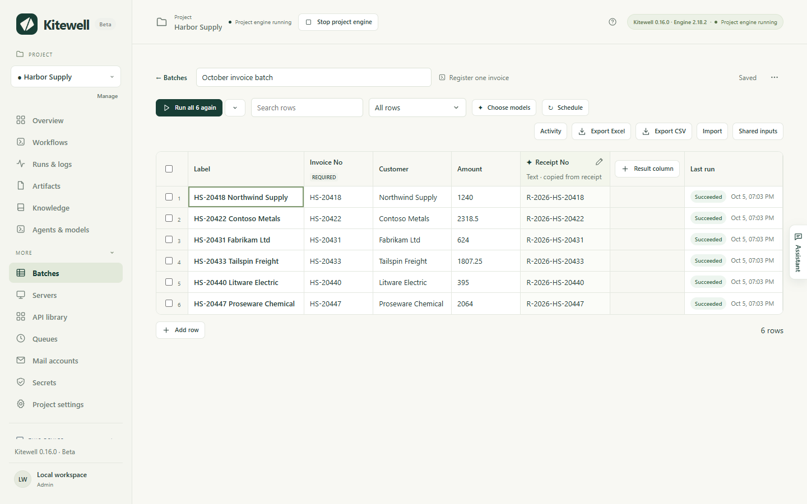

You have a list of things to get through — this month's invoices, a hundred
suppliers to check, every property in a search — and one workflow that handles
one of them. A sheet puts the list in rows and runs that workflow once for
every row, with that row's own values. What each run found comes back into
result columns beside it, so the whole job reads as a table you can sort,
filter, and export.

Rows that failed can be run again on their own. Rows you have already done are
left alone. Nobody sits and clicks.

## What you need

- A workflow that does the job for one item, with named inputs for the things
  that change from item to item. A workflow with no inputs can still run over
  a sheet, but every row would do the same thing.
- Nothing else, for a sheet whose columns copy a value a step already
  collects. To have a model read something out of each run instead, the
  project needs an API model under [Agents & models](/docs/ai/).

## Make a sheet

1. In the sidebar, open **More** and choose **Batches**, then **New sheet**.
2. Pick the **Workflow** and give the sheet a **Sheet name**, then choose
   **Create sheet**.
3. The sheet opens with one column for each of the workflow's inputs, carrying
   their types, defaults, and allowed values, plus **Label** at the left.
   **Label** names a row for you and is never passed to the workflow.
4. Put the rows in — see below — and choose the run button.

You can also start from a workflow's run form: switch from **Single run** to
**Batch sheet**, and whatever you had typed becomes the new sheet's shared
values. That switch is on a fresh run form only, not on a retry.

A sheet holds up to 5,000 rows and 30 result columns.

## Put the rows in

- Type into the grid, or paste cells copied from a spreadsheet starting at the
  cell you are on. Rows are added as needed. **Add row** adds one by hand.
- **Import** an Excel workbook or a CSV file, drop one anywhere on the sheet,
  or paste the rows into the panel's **Rows** box and choose
  **Preview columns**. A preview shows the first rows with the row of column
  names picked for you; choose another with **Use row 3 as column names**, or
  **No column names**. Then map each column to an input, to **Label**, or to
  **Skip column**. A **Separator** picker handles a file that is not
  comma-separated.
- **Shared inputs** are values every row uses unless the row sets its own. An
  empty cell shows, in grey italics, the shared value or workflow default it
  will use.
- **Fill rows from a workflow's run** lets a run find the items, such as the
  listings a search turns up, and keeps the rows up to date.
- **Link a workbook on this device** keeps the connection to an Excel file
  rather than copying the rows in, so each row's result is written back into
  the row it came from. See [Automate Excel](/docs/spreadsheets/).
- The assistant can propose rows and columns, shown in the open sheet until
  you decide.

Rows above the column names, blank rows and total rows such as 合計 or Subtotal
are left out of an import, each counted, with a tickbox to include the totals
after all. A workbook opens on the sheet Excel opens on and offers its other
sheets. Hidden rows are imported unless you tick the box that leaves them out.
Importing only reads the file; it never changes it.

Each value is read by its input's type: text as typed, numbers, `true` or
`false`, and lists or objects as JSON. A value that does not fit is refused as
you type it, skipped when you paste, and kept but marked when it arrives from
a file. A marked cell carries a red ring and the reason, and nothing starts
until you fix it: one unfit cell in the rows you are about to run stops the
whole launch, naming the row.

A workbook's cells arrive the way Excel shows them:

- dates as `2026-10-01`, date and time as `2026-10-01 12:00:00`, times as
  `09:30:00`;
- numbers without separators or currency signs, and never in scientific
  notation; percentages as fractions, so 12% is `0.12`;
- `TRUE` and `FALSE` as lowercase `true` and `false`, which is what a yes-or-no
  input expects;
- codes such as `00123` with their zeros, whether the cell is text or a number
  formatted with leading zeros;
- a cell merged down over several rows repeats on each; a merge within one row
  stays in its first cell;
- a formula gives the result Excel last saved;
- a cell showing an Excel error such as `#N/A` arrives empty, and is counted.

An older `.xls` file and a workbook protected with a password are refused:
save it as `.xlsx`, or remove the password, first. A file can be up to 16 MiB.
`.csv`, `.tsv` and `.txt` work too.

The sheet saves as you edit, and says **Saved**.

## Run the rows

The run button starts the obvious group of rows and says which. With nothing
run yet it reads **Run 6 not run yet**; once some have failed,
**Run 2 failed again**; in the end, run them all again. The chevron beside it
opens **More ways to run**, where you pick the group yourself. Rows marked
**No longer listed** are left out of every group except a selection.

Each row becomes its own run in the workflow's queue. The banner shows how
many have finished, how many run at once, the queue's name, and — once three
rows have finished — about how long is left. The **default** queue runs 5 at a
time across the whole project. If a site turns away bursts of requests, choose
**Change how many run at once** in the banner, which opens that queue on the
**Queues** page, where **Simultaneous runs** is the number to lower.

Rows join the queue about ten at a time on the default queue, and the rest
show **Pending** until there is room, then **Queued** once the engine has them.
A scheduled run of another workflow sharing the queue therefore waits for one
round of rows at most, never the whole sheet.

- **Cancel queued rows** cancels rows still waiting. Running rows continue.
- **Stop all** stops the running rows as well. Finished results stay.

A launch keeps its own copy of the workflow and of each row's values, so
editing the sheet or the workflow afterwards does not change runs already
queued. A row whose inputs have changed since its run shows **Changed**, and
the **Changed since last run** filter lists them. Editing a shared input marks
every row that uses it.

### When a row fails

Select the row to see the step it stopped at and that step's error.
**Set up retries for Register it on the portal** opens that step in the
workflow editor with **Retry limit** ready to set: a site that refuses a burst
usually lets a later try through. New retry rules apply when the rows run
again, not to runs already queued.

## Collect a result from each run

A result column collects one value from each run. Choose how under
**Where the value comes from** when you add the column.

**A value the workflow publishes** copies it from each run as it is: no model,
no cost, and exactly what the step found, as soon as the run finishes. Rows
that ran before the column existed fill in too. Pick it under **Output**.

- A new sheet whose workflow publishes values offers them, ticked, under
  "This workflow publishes these values. Add them as columns?"
- **Result column** at the right of the grid adds one.
- A value that does not fit the column's type, such as `¥12,800` in a number
  column, shows as published and marked. Its details offer
  **Change the column to Text** or **Let a model read it**.
- A column whose value the workflow no longer publishes is marked in its
  header.

Only values that reach a run's outputs can be copied: those of website and
desktop extracts, email steps, and results a command step declares — not a
person's form answers, and not the steps inside a loop. When two steps publish
the same name, the one that ran last wins.

**A model reads the run** covers everything else. Name the column, choose a
type — **Text**, **Number**, **Yes or no**, **Choice**, or **Level** — and
under **What to read** describe what to look for, such as the unit and which
value to take when there are several. **Choice** and **Level** take their
**Options** or **Levels, lowest first**.

These columns are filled by API models from **Agents & models**, chosen under
**Choose models**:

- The **Extraction model** reads text and number columns, and the other
  columns when there is no decision model. Each value comes with a quote,
  **Quoted from the run**, marked when the quote was not found word for word
  in what was sent.
- A **Decision model** is optional. It judges yes-or-no, choice, and level
  columns with a probability, faster and at lower cost, without a quote.
  **Mark judgments unsure below** sets the confidence under which a judgment
  is flagged for a person; 70% by default.

Values are read after each run succeeds, if the sheet already had a column and
a model when the rows were launched. **Fill 4 rows** in the banner reads
finished rows that are missing values, and **Read again** in a cell's details
reads one run again. Neither runs the workflow again. A value read before you
changed that column's definition is marked out of date; changing the model
does not mark anything.

The model is sent the row's inputs, the run's step results, its published
outputs, up to five text files it produced, and the end of up to four steps'
logs — no screenshots. Choose a provider you trust with that.

## Let a run find the rows

Rows can come from a list a workflow's run finds, so new items become rows
without anyone adding them. Under **Import**, or below a new sheet's blank
row, choose **Fill rows from a workflow's run**.

1. Pick the **Workflow**, which may be the sheet's own, and the **List** its
   runs publish: a [website](/docs/browser/) or [desktop](/docs/desktop/)
   step's **List of items**, the emails a **Find emails** step finds, or any
   output a step publishes as a list.
2. Check the first items of its latest run. When it has not run, or its fields
   are only known from a run, choose **Run it now**.
3. Under **What fills each input**, each input takes the item field of the
   same name. Pick the one that tells items apart with **Match rows by this**,
   and set the inputs the list's own run takes.
4. Choose **Fill rows**. The workflow runs once and adds a row for each item.

The toolbar then shows where rows come from, and **Refresh rows** runs the
workflow again. When the run succeeds:

- An item fills the row with the same key. A row you added by hand with that
  key is taken over rather than repeated. A key is compared as text, except
  that anything that reads as a number is compared as one.
- A new item adds a row, marked **New** until it runs.
- A row whose item is gone stays, greyed as **No longer listed**, and comes
  back when its item does. The **No longer listed** filter shows them, with
  a button to remove them all at once.
- Items with no key, items repeating another's key, and items past the
  5,000-row limit are skipped and counted.

A failed run changes nothing and says why. So does a list that came back
empty, or with no item that has a key: a broken run never greys out the whole
sheet. A list that is genuinely shorter does mark its missing rows.

When the source stops fitting — the workflow was deleted or no longer
publishes the list, an input it fills was renamed, or the list's items lost a
field — the sheet says so and the Batches list marks it. **Change the source**
opens the panel with the mapping refitted.

## Run it on a schedule and see what changed

To watch values over time, such as prices or listings checked every morning,
choose **Schedule** in the sheet's toolbar and set **Run every row again** to
**Every hour**, **Every day**, **Weekdays**, **Every week**, or a
**Custom schedule** in cron form; **Off** removes it. A sheet runs at most once
an hour. The toolbar and the sheet list show the next run.

- The schedule belongs to this device. It never syncs with the sheet, so a
  sheet a teammate shares runs only where someone schedules it, and never on
  two computers by accident.
- It runs while this computer is awake and this project's engine is running.
  For a run missed while the computer was off or asleep, choose what happens
  when it comes back: **Run it when back, unless the next run is nearer**,
  which is the default, **Always run it when back**, or **Skip it**. At most
  one missed run happens either way.
- A due time that finds the last run still going is skipped, and says so.
- A sheet whose rows come from a workflow's run refreshes them first, so new
  items run as new rows and rows no longer listed are left out. Untick
  **Refresh rows from Find new listings first** to run the rows as they are.

Each row keeps the values its previous run with the same inputs read. A result
that changed since is marked in its cell: an arrow when both the old and new
values are numbers, a dot for anything else, with what it was on hover
and in the cell's details. A banner counts the changes, and **Show them**
applies the **Results changed** filter.

Only text columns ignore differences of spacing and letter case; other types
are compared exactly. A model can word the same value differently from run to
run, so copy what a step publishes wherever you can.

## See what each run changed

**Activity** in the sheet's toolbar lists the sheet's last 50 finished
launches, newest first. Each says how many rows ran and failed, what rose,
dropped, or changed in each column, which rows are new, back in the list, or
no longer listed, and up to 20 of the values that changed, with what they
were. Select a changed value to open its row.

Select a value and its **History** shows every point at which it changed over
the past year, with a line for numbers.

This history stays on the device that ran the sheet: one file a month,
compressed once the month is over and removed after twelve months.

## Export, duplicate, and delete

- **Export Excel** and **Export CSV** save the inputs, the values, each
  judgment's probability, what each changed result was before, and each row's
  **Status**, **Run ID** and **Error**, in a file named after the sheet and the
  day. The workbook opens with a frozen header with filters, numbers and dates
  as cells Excel can sort, and each row's status coloured. Importing it again
  maps its inputs for you. For a sheet filled from a workflow's run, a
  **Listing** column says which rows are new or no longer listed.
- The sheet menu, **Sheet actions**, offers **Duplicate**, a copy with the same
  rows, inputs, result columns, and models, and **Duplicate without rows**, the
  same setup with one empty row. Copies start without results, since values
  belong to the runs that produced them, and without the schedule.
- **Delete sheet** removes the sheet and the values read on this device. Runs
  stay in **Runs & logs**. A sheet cannot be deleted while its rows are still
  running.

## Details

- The **Finishes a batch** [alert](/docs/alerts/) tells you once every row of a
  launch has finished and its values were read: how many did not succeed and
  what changed by column, and, when the rows were refreshed first, how many are
  new, back in the list, or no longer listed. A scheduled run where every row
  succeeded and nothing changed stays quiet; a manual one still reports. A
  scheduled run that could not start says why. Batch rows do not raise run
  alerts one by one, except when a row waits for a person.
- [MCP clients](/docs/mcp/) can list and read sheets, with what each workflow
  publishes and what each changed value was; create, replace, and delete them;
  fill rows from a workflow's run and refresh them; schedule them on this
  device; run rows, read values again, and cancel runs; and link or unlink a
  workbook. Replacing a sheet replaces it whole, so a row or column left out
  is deleted with its values.
- The sheet itself belongs to the project, so it travels with project exports
  and [syncs with Dagu Cloud](/docs/cloud-sync/), including its rows' values,
  where its rows come from, and which rows are no longer listed. Row statuses,
  the values read from runs, what they were before, the latest refresh, the
  activity and value history, and the sheet's schedule stay on the device that
  ran them.
