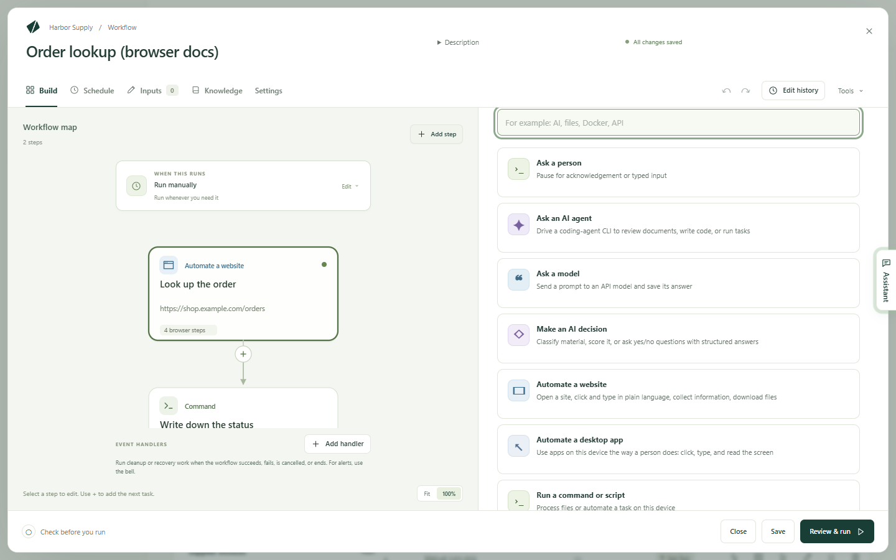
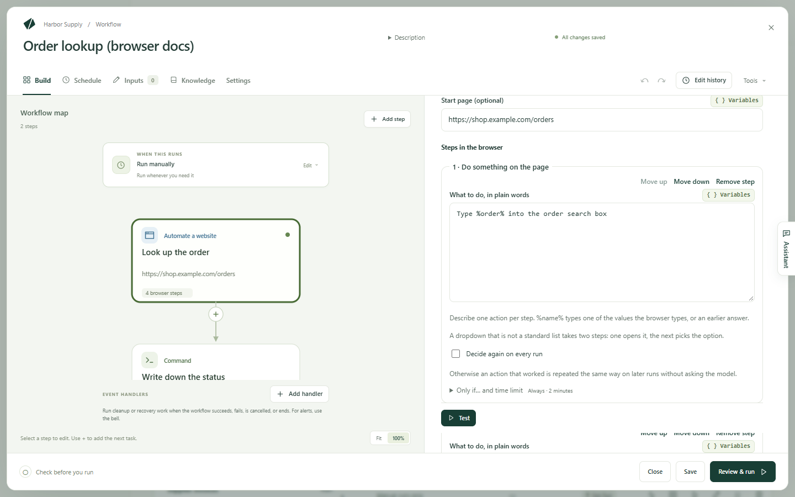

Kitewell can work a website for you: open pages, sign in, click and type,
read what a page shows, and pass what it found to the next step. You write
what to do in ordinary words, and a model works out how to do it on each
page. There is nothing to record and no selectors to write.

Work it takes off your hands:

- Download this month's invoices from a supplier portal.
- Look up the status of every order in a spreadsheet.
- Copy figures from a web dashboard into a daily report.
- Fill in the same web form for each row of a list.
- Check that a site's sign-in and checkout still work after a release.

The browser runs on your own computer, and a sign-in it makes stays on that
computer.

## What you need

A browser on this computer. On a Mac, install Google Chrome in
`/Applications`. On Windows, Kitewell uses the Chrome or Microsoft Edge that
is already installed. To use Chromium, Brave, Edge on a Mac, or a Chrome kept
somewhere else, give its full path in
**Device settings → Browser → Browser executable**. The step says whether a
browser was found, and which one it will open.

A model. A website step asks an API model what to do on each page.
[Add one](/docs/ai/) under **Agents & models**, then pick it in the step's
**Model** — or set one for the whole workflow in
**Settings → Execution & retries → Default model for browser and desktop steps**.
Use an Anthropic, OpenAI, or Gemini model. Small local models usually cannot
drive a browser.

Then choose **Check the browser**, on the step or in **Device settings**. It
opens the browser once from Kitewell's background service, the way a run
does, so a browser that cannot start turns up now instead of in the middle of
a scheduled run. On a Mac it also lets macOS ask its questions while you are
there to answer them.

## Build your first website step

This example looks up an order on a shop's site and hands its status to the
next step.

1. Open a workflow and choose **Add step**. The task picker opens.

   

2. Choose **Automate a website**. Give it a **Step name** such as
   `Look up the order`. Under **Technical settings**, **Step identifier** is
   the short name later steps use to read what this step collects; make it
   something plain, such as `order`.
3. Choose the **Model**, and set **Start page (optional)** to the page to
   begin on, such as `https://shop.example.com/orders`.
4. Under **Values the browser types**, choose **Add a value**, name it
   `order`, and set its **Value** to the order number. It can be typed text,
   a workflow input, or a secret — a password or key stored so it never shows
   in a log.
5. Under **Steps in the browser**, use **Add a browser step** to add, in
   order:
   - **Do something on the page**, with **What to do, in plain words** set to
     `Type %order% into the order search box`
   - **Do something on the page**, with `Click the Search button`
   - **Make sure that…**, with **The page should…** set to
     `The order's details are shown`
   - **Collect information**, with **What to look for** set to
     `The order's status and the expected delivery date`, and two values under
     **What to collect**: `status` and `delivery`, each with **Type** set to
     **Text**

   

6. Open **Browser settings**, turn on **Show the browser window**, then choose
   **Test** to watch the step work on its own.
7. Add a later step that uses what it collected, written as
   `${steps.order.outputs.status}`.

In a new workflow, **Or start from an example** offers two website examples to
copy instead: **Collect data from a website** and
**Sign in once, then collect**.

## Write instructions the model can follow

One instruction, one action. A **Do something on the page** step carries out
only its first action, so `Type the code and click Continue` stops after the
typing. Write two steps instead.

A dropdown that is not a plain list also takes two steps: one opens it, the
next picks the option.

Name what is on the page, the way you would to a colleague:

- `Click Download next to the latest invoice`
- `Type %customer% into the Customer field`
- `Open the Reports menu`

A step that collects describes what you want rather than an action:
`The order number and total on the confirmation page`. Say what the value is,
not where it sits on the screen.

## What a website step can do

The steps inside run in order, in one browser.

- **Open a page** goes to a **Web address**.
- **Do something on the page** does one thing, written under
  **What to do, in plain words**. `%name%` types one of the values the browser
  types, or an answer you gave earlier.
- **Collect information** reads **What to look for** and fills in the values
  under **What to collect**. Each value has a **Name**, a **Type** — **Text**,
  **Number**, **Yes or no**, **List**, or **List of items** — and a
  **Description (optional)** that tells the model what it is. A
  **List of items** sets out what **Each item holds**, such as a listing's
  `url`, `title`, and `price`. Later steps read each value as
  `${steps.<identifier>.outputs.<name>}`.
- **Make sure that…** fails the step when the page does not look right.
  **How to check** picks how. **In plain words (the model judges)** reads
  **The page should…** and asks the model.
  **Page contains the text**, **Address contains**, and
  **Element appears (CSS selector)** read the page themselves, with no model
  and the same answer on every run. **Keep checking for (optional)** gives the
  page time to get there.
- **Wait** waits **For a fixed time**, under **How long**, or
  **Until an element appears (CSS selector)**.
- **Take a screenshot** saves a PNG with the run's files, under the
  **Screenshot name** you give it.
- **Ask me for input** shows your **Question to show you** and pauses the run
  until you answer — for a one-time code, say. **Use the answer as** names the
  answer so later steps can type it.

Every step also has **Only if… and time limit**, which runs it only when a
condition holds and caps how long it may take. A step with neither set takes
at most two minutes.

## Keep passwords out of the model

**Values the browser types** holds whatever the step types: a customer number,
a workflow input, a password. The instructions name each one as `%name%`, and
the model only ever sees that name.

For anything sensitive, choose a secret as the value. It stays out of the
instructions, out of the model, and out of the logs. An instruction that
spells out a secret's value fails rather than send it, and **Review & run**
says so before you run.

## Sign in once and stay signed in

Turn on **Stay signed in between runs** in **Browser settings**. Cookies and
sign-in state stay on this computer, so the next run opens the site already
signed in. The **Sign in once, then collect** example starts this way: its
first step shows the window and waits while you sign in yourself, and every
step and run after it reuses that sign-in.

**Project settings → Storage → Sign-ins** lists what is saved, which
workflows use each one, and **Forget sign-in…** to drop one. Backups do not
carry a sign-in, so a restored computer signs in again, as it asks for your
secrets again.

A loop that runs its items at the same time cannot share one sign-in. Set the
loop to one item at a time, or turn **Stay signed in between runs** off.

## What a run looks like

Open the run under **Runs & logs**. **What the browser did** lists the steps
in order with the screenshots they took, beside the **Model** that was asked
and **Model usage**, the tokens that went in and out.

**Replayed without the model** says how many actions ran from memory. An
action that worked once is remembered and repeated the same way next time,
which is faster and costs nothing. When the site changes and a remembered
action no longer works, the model is asked again. **Decide again on every
run**, on one step, turns that off, and
**Project settings → Storage → Replay cache** clears what a workflow
remembers after a site is redesigned. **Collect information** and checks
written in plain words ask the model every run.

When a step reaches **Ask me for input**, the run waits. Open it under
**Runs & logs → Waiting**, or from the notification, type into
**Your answer**, and choose **Answer** — or **Reject** to fail the step. The
answer is kept with the run, so use it for codes that expire, not for
passwords. If the browser closed before you got there,
**Restart the browser step** runs the step again from its first step.

## Run it for many items

- A list in a spreadsheet: give the workflow an input such as the order
  number, then run it from a [batch sheet](/docs/batches/), one row per item.
  The sheet shows progress, failures, and time left.
- A list the site shows: collect a **List of items**, such as every result in
  a search, and [let it fill a sheet's rows](/docs/batches/#let-a-run-find-the-rows).
  Refreshing adds new ones and marks those that are gone.
- A list inside one run: put the step in a **For each item** loop.
- On a schedule: add a [schedule](/docs/scheduling/), leave
  **Show the browser window** off so Chrome does not open while you work, and
  let [alerts](/docs/alerts/) tell you when a run fails or waits for an answer.

## If something goes wrong

Look at the step's screenshots first: a sign-in wall, a cookie banner, or a
bot check explains most failures. Then:

- The step says nothing on the page matches the instruction. Reword it to name
  what is on the page, or split it in two.
- The browser will not start. Run **Check the browser**, and if no browser was
  found, set **Device settings → Browser → Browser executable**.
- A site the step needs will not load. If you filled in
  **Allowed websites · one per line (optional)**, every host the site uses has
  to be listed, including its sign-in and image servers.

The rest is in [Troubleshooting](/docs/troubleshooting/#a-website-step-fails).

## Details

**Browser settings**, on the step, also holds **Save screenshots** —
**When a step fails**, **When a step fails, and at the end**,
**After every step**, or **Never** — and **Window width** and
**Window height** in pixels.
**Allowed websites · one per line (optional)** takes host names such as
`example.com` or `*.example.com`; local addresses, ports, and paths are
refused.

What reaches the model is the visible text and layout of the page, once for
each action it decides, billed by the provider you chose. Replayed actions
and checks that read the page directly send nothing, and neither do the
values the browser types or your secrets. See
[What leaves your computer](/docs/data-flow/).

Some sites refuse automated browsers. A saved sign-in and a start page past
the cookie banner get around the usual cases; CAPTCHAs are not solved. The
computer has to be awake for a scheduled run.

The same workflow in YAML:

```yaml
type: graph
steps:
  - id: order
    name: Look up the order
    action: browser.run
    with:
      url: https://shop.example.com/orders
      variables:
        order: "10042"
      do:
        - act: Type %order% into the order search box
        - act: Click the Search button
        - expect: The order's details are shown
        - extract:
            instruction: The order's status and the expected delivery date
            schema:
              type: object
              properties:
                status:
                  type: string
                delivery:
                  type: string
  - id: report
    name: Write down the status
    depends: [order]
    run: echo "${steps.order.outputs.status} ${steps.order.outputs.delivery}"
```
