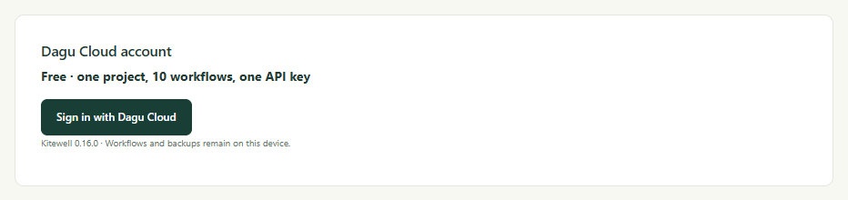

Edit a workflow on your laptop and have the office computer run the new
version, without sending anyone a file. [Dagu Cloud](https://console.dagu.sh)
keeps the project's definitions; every computer still runs the work itself,
with its own passwords, and secret values never leave the device they were
typed on.

Syncing is a choice you make per project. A project stays on its computer
until you sync it, and nothing reaches Dagu Cloud before you do.

## What you need

- A Dagu Cloud account. It is free, and a free account syncs one project.
- To share with other people, Kitewell Team. Its planned price is $29 a
  month for each computer the workspace connects, for up to 25 people; a
  larger team takes [Enterprise](/pricing/#enterprise). The team's owner pays
  for the workspace and members need no subscription of their own. Kitewell
  Personal, planned at $20 a month, is for one person on one computer and
  cannot invite anyone. See [Pricing](/pricing/).

## Sign in

1. Open **This device → Device settings** and find **Dagu Cloud account**. It
   shows which plan this computer is on.
2. Choose **Sign in with Dagu Cloud**.
3. Kitewell shows a short code and a **Continue in browser** button. Open it,
   sign in, check that the code in the browser matches the one Kitewell shows,
   and connect the computer.

A computer syncs with one workspace, named in **Dagu Cloud account** once it
is connected. A workspace holds as many computers as its plan: one on a free
account and on Kitewell Personal, and the number bought on Kitewell Team.
Connecting one more disconnects your own oldest computer in the workspace; if
the others all belong to other people, it is refused until one is disconnected
or the plan holds more.

Signing in alone sends nothing. A signed-in computer checks its plan and
reports its Kitewell version and its own name and ID. It sends no workflows,
settings, run history, logs, or secrets.

## Sync a project

1. Open the project selector and choose **Manage**.
2. In **Manage projects**, choose **Sync to Dagu Cloud** beside the project,
   and confirm.

The project uploads, is marked **Synced**, and from then on every save goes to
Dagu Cloud first.

:::caution
Workflow YAML, batch inputs, and API addresses are shared exactly as written.
Remove any password you typed into one of those before you sync, and keep it
in a [secret](/docs/secrets/) instead.
:::

If an upload is cut short, the project shows **Upload incomplete** and offers
**Resume upload**. Saves wait until the upload finishes.

A free account syncs one project. Kitewell Personal syncs up to ten projects
and Kitewell Team up to 15, each with up to 100 workflows. A workspace holds
as many computers as its plan: one on a free account and on Kitewell
Personal, and the number bought on Kitewell Team. Connecting one more
disconnects your own oldest computer in the workspace; if the others all
belong to other people, it is refused until one is disconnected or the plan
holds more. Syncing a project the plan has no room for is refused, and says
why. Synced projects count against the workspace's plan, not the computer's
own project limit.

To move between plans, open the **Kitewell** page in Dagu Cloud and choose
**Switch to Kitewell Team** or **Switch to Kitewell Personal**. On Team, change
the number of computers there too. Stripe adjusts your next invoice for either
change. Before moving to Personal, remove the other people, revoke their
invitations, and leave one computer connected.

## Work on the project from another computer

1. Sign that computer in to the same workspace.
2. Open **Manage projects** and choose **Download from Dagu Cloud**.
3. In **Projects in Dagu Cloud**, choose **Download** beside the project.

The list marks what is already **On this device**, and marks **View only** any
project your role only lets you read. A project whose name matches one already
on the computer is refused until you rename one of them.

Downloaded workflows arrive paused. Run one by hand, then enable the ones this
computer should run.

A workflow that works a mailbox is the exception: it runs on one computer at a
time, because two would read the same email twice. Enabling such a workflow
where another computer already runs it says so, and offers **Run it here** to
move it.

## Stay up to date

Kitewell takes changes made elsewhere when it starts, when you open the
project, and when you open a workflow to edit it, asking Dagu Cloud at most
once a minute. On Personal and Team a computer also checks on its own, about every
five minutes, so a computer nobody is sitting at still picks up a new version.
A free account checks only at those three moments and when you ask.

To check at any other time, choose **Update from Dagu Cloud** in
**Manage projects**. A workflow open in the editor takes the update in place
as long as you have not typed anything.

Taking a change restarts the project's engine. Runs already in progress carry
on with the definition they started with. A workflow that is new to this
computer arrives paused; one that is already here keeps whether it is on,
where it runs, and its alerts.

If someone saved the same item since you opened it, your save stops and shows
**Changed in Dagu Cloud**. Choose **Overwrite** to replace their change with
yours, or **Cancel** to keep your edit without saving it.

Kitewell owns a synced project's files. Edits made to them outside Kitewell
are replaced when a change arrives from Dagu Cloud, or the next time the item
is saved in Kitewell.

## What syncs, and what stays

A synced project carries what a [project export](/docs/sharing/) carries:
workflow definitions and schedules, agents and models, API connections and
their imported documents, servers and server groups, queues, image
registries, batch sheets, the names and descriptions of secrets, the
project's workflow defaults, and its [knowledge](/docs/knowledge/). It also
carries the project's [releases](/docs/releases/), which exports leave out.

:::note[Secret values stay on your computer]
A synced project lists the secrets it uses by name only. Each computer keeps
its own value, set on that computer; until it is,
**Secrets** shows **Value needed**.
:::

Each computer also keeps to itself its registry sign-ins, SSH keys and
approved host keys, working directories, which workflows are enabled, its
alerts, its run history, and its logs. None of that reaches Dagu Cloud.

## Work as a team

The workspace owner manages the team on the **Kitewell** page in Dagu Cloud:

- **Invite** a person by email address. The invitation counts toward the 25
  people until it is accepted, revoked, or expires after seven days. The
  person signs in to Dagu Cloud with that address to accept it.
- **Synced projects** lists every project the team syncs and gives each member
  a role on each one:
  - **Viewer** reads and downloads the project.
  - **Editor** also saves changes to it.
  - **Admin** can also delete it from Dagu Cloud.
  - **No access** hides it.

The owner can open every project. A member who syncs a project becomes its
admin. A member connects a computer the same way you did, choosing the team's
workspace when Dagu Cloud asks.

:::caution
An editor's saved change runs on every computer that syncs the project, as
soon as that computer takes the update. Give the editor role only to people
you would trust to run commands on your team's computers.
:::

A project where your role is **Viewer** shows **View only** in the page header
and in the download list. You can still run its workflows, set its secret
values on your computer, and enable the workflows this computer should run.
Kitewell hides the edits Dagu Cloud would refuse: changing workflows, cutting
or applying releases, and declaring secrets.

## When a plan ends

When a paid plan ends, alerts, MCP Events, and webhooks stop. Everything else
keeps running for 7 days, and a banner on every page says on which day the
projects, workflows, and API keys or connected apps beyond the free plan stop.

- **Choose what stays.** In the banner or **Device settings**, pick which
  projects, workflows, and keys or apps stay active, up to the plan's limits.
  If you choose nothing, the ones that ran or were used most recently stay.
- **Not in plan.** Anything beyond the limits is marked **Not in plan**. It does
  not run, by schedule or by hand, and cannot be edited, but you can still open
  it, read its run history, export it, or delete it. Runs already under way
  finish.
- **Nothing is deleted.** Subscribe again and everything runs as before, with
  its schedules.

The same applies when you move to a plan with lower limits. A device that
cannot reach Dagu Cloud keeps its last paid plan until that license expires,
then has the same 7 days.

## Stop syncing

- **Stop syncing** in **Manage projects** keeps the project both on this
  computer and in Dagu Cloud. Later saves here stay local.
- **Delete from Dagu Cloud**, offered in the download list where your role is
  **Admin**, removes a project this computer does not sync and frees its place
  in the plan. Copies on other computers can no longer save to Dagu Cloud.
- A project synced with a different workspace shows **Another workspace** and
  offers only **Stop syncing**.

If a project is deleted from Dagu Cloud, or you lose access to it, it stays on
your computer as a local project.

While a computer is offline, saves to its synced projects are refused.
Changes that stay on the computer still work — enabling a workflow, setting a
secret value — and enabled workflows keep running from the copy that is
there. If Dagu Cloud stops accepting the computer's connection, choose
**Reconnect account** in **Device settings**.
