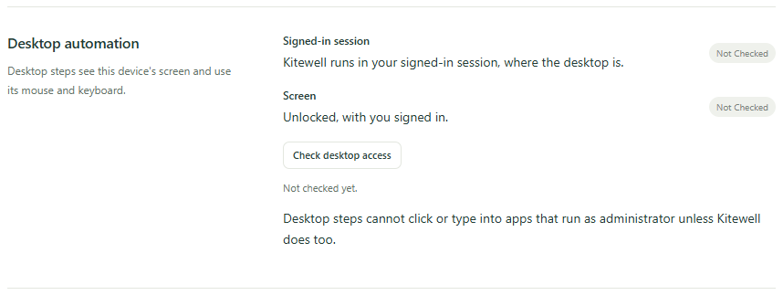
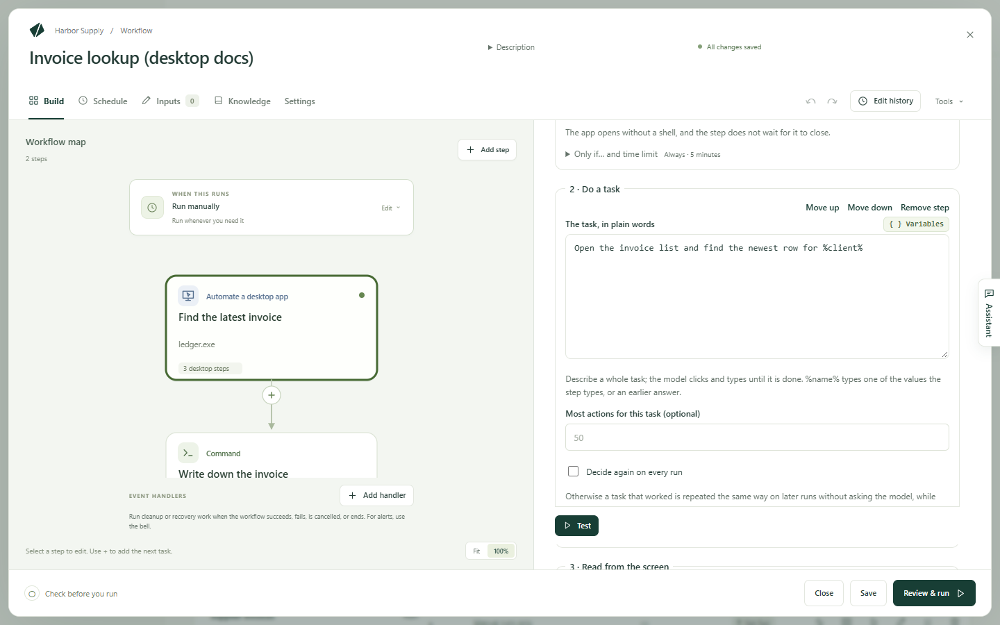

Kitewell can use the apps on your computer the way a person does: it looks at
the screen, then clicks and types. You describe the task in ordinary words —
"Create an invoice for %client% and save it" — and a model works until it is
done.

That reaches the accounting package or the ERP client that has no API and no
web version:

- Copy each row of a spreadsheet into an accounting or sales app.
- Read a figure from a desktop dashboard and pass it to the next step.
- Export a report from an app that only exports through its menus.
- Check that an app shows what it should after an update.

It works on macOS and Windows, on the screen in front of you. While it runs it
takes the mouse and keyboard, and it gives them back the moment you touch
them.

## What you need

A model that can operate a computer, such as Gemini 3.6 Flash, Claude
Sonnet 5, or GPT-5.4. [Add one](/docs/ai/) under **Agents & models**, then
pick it in the step's **Model**, or set one for the whole workflow in
**Settings → Execution & retries → Default model for browser and desktop steps**.
Another vision model that can call tools still works.
**How the model uses the desktop**, under **Desktop settings**, is normally
**Automatic**; **Plain tools, for any vision model** makes a model without a
computer-use tool work through plain click-and-type tools — more slowly, and
less reliably.

Permission to use the screen. Open **Device settings → Desktop automation**.
Each row says **Not checked** until you choose **Check desktop access**, and
then **Ready** or **Needs attention**.



- On a Mac the rows are **Screen Recording** and **Accessibility**. The first
  check asks macOS for both, in dialogs that name **Kitewell Agent** —
  Kitewell's background service, which is what actually drives the screen.
  Allow them, and **Open System Settings** takes you to the right pane if you
  dismissed a dialog.
- On Windows the row is **Signed-in session**: Kitewell has to run in your
  signed-in session rather than as a Windows service. A desktop step also
  cannot click or type into an app that runs as administrator unless Kitewell
  does too.

An unlocked screen with you signed in. Desktop steps use the screen you see,
so a locked or sleeping computer cannot run them — including on a schedule.

## Build your first desktop step

This example opens the accounting app, finds a client's latest invoice, and
hands its number to the next step.

1. Open a workflow, choose **Add step**, and choose
   **Automate a desktop app**. Give it a **Step name** such as
   `Find the latest invoice`. Under **Technical settings**,
   **Step identifier** is the short name later steps use to read what this
   step reads; make it something plain, such as `invoice`.
2. Choose the **Model**.
3. Under **Values the step types**, choose **Add a value**, name it `client`,
   and set its **Value** to the client's name. It can be typed text, a
   workflow input, or a secret — a password or key stored so it never shows in
   a log.
4. Under **Steps on the desktop**, use **Add a desktop step** to add, in
   order:
   - **Open an app**. On a Mac, fill in **App**, or pick it with
     **Choose an app…**. On Windows, fill in **Program** with the program's
     path, or pick it with **Choose a program…**.
   - **Do a task**, with **The task, in plain words** set to
     `Open the invoice list and find the newest row for %client%`
   - **Read from the screen**, with **What to read** set to
     `The invoice number and the total in that row`, and two values under
     **Values to read**: `number` with **Type** set to **Text**, and `total`
     with **Type** set to **Number**

   

5. Choose **Test**, take your hands off the mouse and keyboard, and watch.
6. Add a later step that uses what it read, written as
   `${steps.invoice.outputs.number}`.

In a new workflow, **Or start from an example** offers
**Copy data out of a desktop app**, which opens an app this computer already
has and reads what it shows.

## Write a task the model can finish

A website step does one action at a time; a desktop step takes a whole task.
The model keeps clicking and typing until the task is done, so write what you
want finished, not each click:

- `Open the invoice list and find the newest row for %client%`
- `Create a new invoice for %client% for %amount% and save it as a draft`
- `Export this month's sales report as a CSV into the Documents folder`

**Most actions per task**, under **Desktop settings**, caps how many clicks
and keystrokes one task may take. The default is 50, and
**Most actions for this task (optional)** sets a different cap on one task. A
task that needs more fails, so either split it or raise the cap.

## What a desktop step can do

The steps inside run in order, on this computer's screen.

- **Open an app** starts an app or program. It does not wait for it to close.
  On a Mac, **Run a command instead** takes a **Command** and
  **Arguments · one per line (optional)**.
- **Do a task** carries out **The task, in plain words**. `%name%` types one
  of the values the step types, or an answer you gave earlier.
- **Read from the screen** reads **What to read** and fills in the values
  under **Values to read**, each with a **Name**, a **Type**, and a
  **Description (optional)** that tells the model what it is. Later steps read
  each value as `${steps.<identifier>.outputs.<name>}`.
- **Make sure that…** fails the step when the screen does not look right. The
  model judges **The screen should show…** from a screenshot, and
  **Keep checking for (optional)** gives the app time to get there.
- **Wait** waits for **How long** you say.
- **Take a screenshot** saves a PNG of the whole screen with the run's files,
  under the **Screenshot name** you give it.
- **Ask me for input** shows your **Question to show you** and pauses until
  you answer. **Use the answer as** names the answer so later steps can type
  it. Other desktop steps may use the screen while it waits.

Every step also has **Only if… and time limit**, which runs it only when a
condition holds and caps how long it may take. A step with neither set takes
at most five minutes.

## Keep passwords out of the model

**Values the step types** holds whatever the step types, named in the task as
`%name%`. The model only ever sees the name.

For anything sensitive, choose a secret as the value. It stays out of the
task, out of the model, and out of the logs. A task that spells out a
secret's value fails rather than send it, and **Review & run** says so before
you run.

## Sharing the screen with you

Desktop steps run one at a time: there is one screen, so a second step waits
for the first. That holds inside a **For each item** loop and inside a
[batch sheet](/docs/batches/) too — the items take turns rather than run
together.

Before a step clicks or types, it waits until nobody has used the mouse or
keyboard for fifteen seconds, and it pauses the moment you use them again, so
it never takes the input out from under you.
**Wait until nobody has used the mouse or keyboard for**, under
**Desktop settings**, changes that wait; `0` turns it off on a computer
nobody works at.

While a desktop step runs, the Kitewell icon in the menu bar or the system
tray turns into a pointer, and the menu leads with each running step — using
your computer, paused while you use it, or waiting for another desktop step —
followed by **Stop**, which ends only the runs those steps belong to. Nothing
is drawn on top of the screen, because the model would see it in its
screenshots and might click it.

## What a run looks like

Open the run under **Runs & logs**. **What happened on the desktop** lists
the steps in order with their screenshots, and says where the step waited for
you to stop using the mouse and keyboard, or for another desktop step. Beside
them are the **Model** that was asked and **Model usage**, the tokens that
went in and out.

**Replayed without the model** says how many tasks ran from memory. A task
that finished once is repeated the same way on later runs while the screen
still looks the same, which is faster and costs nothing.
**Decide again on every run** turns that off for one task, or for the whole
step under **Desktop settings**, and
**Project settings → Storage → Replay cache** clears what a workflow
remembers after an app changes. The cache stays on this computer and is not
carried in backups.

## When the provider asks you to confirm

Some model providers stop and ask a person to approve an action, such as a
purchase. The step stops with it.
**When the model provider asks to confirm an action**, under
**Desktop settings**, is **Stop the step**; **Go ahead** lets those actions
run unapproved. The safer pattern is an **Ask me for input** step before the
task, so the decision is yours and is recorded with the run.

## If something goes wrong

Look at the step's screenshots first. Then:

- The step says it needs a permission. Run **Check desktop access** again and
  allow what the row names.
- The screen was locked, or someone else was signed in. Desktop steps need
  this computer's screen, unlocked, with you signed in.
- The task ran out of actions. Split it into two tasks, or raise
  **Most actions per task**.
- Someone used the mouse or keyboard for the whole time limit, so the step
  never got the screen. Run it when the computer is free, or give the step a
  longer time limit.

The rest is in [Troubleshooting](/docs/troubleshooting/#a-desktop-step-fails).

## Details

Every action the model decides sends a screenshot of the whole screen, other
open windows included, to the model's provider, and is billed by that
provider. Close what should not be seen before a run, or use a computer
nobody else works at. Values the step types and your secrets are never sent.
Screenshots saved with the run stay on this computer, under the run's
retention. See [What leaves your computer](/docs/data-flow/).

Desktop steps run on macOS and Windows only, on this computer's own screen.
An app that blocks screen recording cannot be operated, and neither can one
running as administrator on Windows while Kitewell is not.

The same workflow in YAML, on a Mac:

```yaml
type: graph
params:
  - CLIENT: Acme
steps:
  - id: invoice
    name: Find the latest invoice
    action: computer.run
    with:
      variables:
        client: ${params.CLIENT}
      do:
        - launch: {command: open, args: [-a, Numbers]}
        - act: Open the invoice list and find the newest row for %client%
        - extract:
            instruction: The invoice number and the total in that row
            schema:
              type: object
              properties:
                number: {type: string}
                total: {type: number}
  - id: report
    name: Write down the invoice
    depends: [invoice]
    run: echo "${steps.invoice.outputs.number}"
```

On Windows, `launch` takes the program instead, such as `launch: notepad.exe`,
or `{command, args}` to pass arguments.
