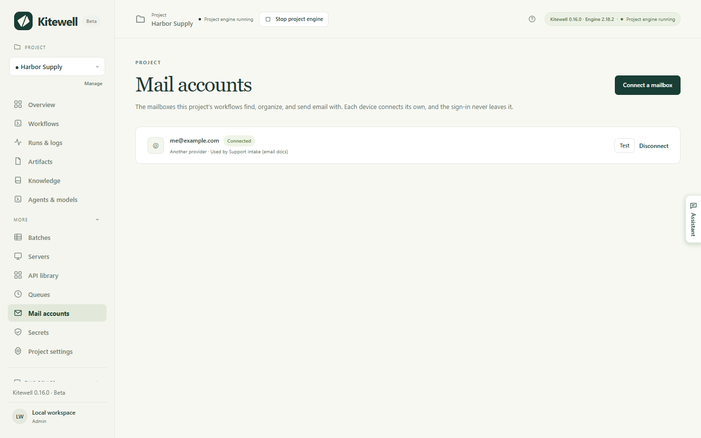
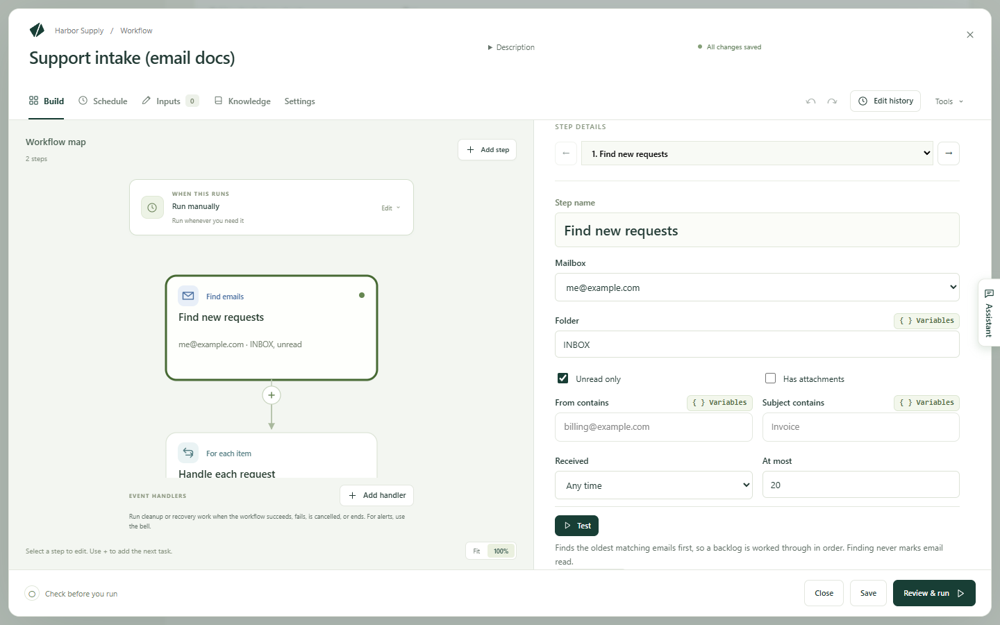

Kitewell can work your inbox for you: find the email that matters, do
something with it, and file it away — or write and send mail of its own. It
works in a mailbox you connect on this computer, and the sign-in never leaves
the computer.

Work that starts or ends in an inbox:

- File each unread invoice's attachment and record its total.
- Turn support requests into tickets through a connected API.
- Summarize what arrived in the last 24 hours and send the digest.
- Sort incoming mail into folders, with a model choosing where each goes.
- Draft a reply to each request, have someone approve it, then send it.

## What you need

A mailbox connected on this computer: Gmail or Google Workspace, Microsoft 365
or Outlook.com, iCloud, Yahoo, Fastmail, or any IMAP mailbox.
**Mail accounts**, in the project, lists the mailboxes the project's workflows
use and the state of each one on this computer.



To add one, choose **Connect a mailbox** there — or **Connect a mailbox…** in
the **Mailbox** field of any email task — and type the address. Kitewell works
out the provider from the address, or from where a custom domain's mail
goes, and the **Provider** list corrects a wrong guess.

| Provider | Connects with |
| --- | --- |
| Gmail, Google Workspace | An app password while Google reviews Kitewell |
| Microsoft 365, Outlook.com | A sign-in in your browser |
| iCloud, Yahoo, Fastmail | An app password made on the provider's site, which the dialog links to; the servers are filled in |
| Any other mailbox | IMAP and SMTP server, port, security, user name, and password |

A browser sign-in opens the provider's page, waits, and carries on by itself
once you approve. Kitewell then signs in once, lists the folders, and reports
how many unread emails the inbox holds — or why the sign-in failed. Nothing is
saved until that check passes.

Per provider:

- Google blocks Kitewell's browser sign-in for most accounts until it finishes
  reviewing Kitewell's Gmail access. Its page says "This app is blocked" and
  offers no way past. Until then the dialog starts a Gmail mailbox from an app
  password: turn on 2-Step Verification, make an app password named Kitewell,
  and paste it. A browser sign-in that does work has to use the address you
  typed and tick the Gmail box. A Google Workspace administrator who restricts
  third-party apps has to allow Kitewell under API controls.
- A Microsoft 365 mailbox needs IMAP and Authenticated SMTP turned on, which
  an administrator does in the Microsoft 365 admin center, under the user's
  Mail, then Manage email apps. An organization that allows only approved apps
  gets a link for its administrator to approve Kitewell once. A shared mailbox
  connects by signing in as a member who can open it.
- An app password is made on the provider's site and can be revoked there.

A connection lasts until the provider ends it: Kitewell keeps a browser
sign-in current while the computer is on. A mailbox whose sign-in stopped
working shows **Reconnect** on **Mail accounts**, on **Overview**, and beside
any run it failed.

## Build your first email workflow

This example finds unread email in a support inbox, creates a ticket for each
through a connected API, and marks each email read once its ticket exists.

1. Open a workflow, choose **Add step**, and choose **Find emails**. Pick the
   **Mailbox**, leave **Folder** on `INBOX` and **Unread only** on, and give
   it a **Step name** such as `Find new requests`. Choose **Test** to see
   which emails match — a test never marks anything read.

   

2. Choose **For each email…**. Kitewell adds a **For each item** loop over
   what the step found, ending in an **Organize emails** step that marks the
   current email read.
3. Inside the loop, before that step, add **Use an API action** with the
   ticket system's "Create issue" operation. In its fields, the variable
   picker offers the current email's sender, subject, date, and text.
4. Add a [schedule](/docs/scheduling/), such as every five minutes.

In a new workflow, **Or start from an example** offers
**Handle each new email**, which is this shape with the work left for you to
fill in.

## What the email steps do

**Find emails** lists matching email in a **Folder**, oldest first, with each
sender, subject, date, and text. Narrow it with **Unread only**,
**Has attachments**, **From contains**, **Subject contains**, and
**Received** — **Any time**, **Last hour**, **Last 24 hours**,
**Last 7 days**, or **Last 30 days**.
**Save attachments into the run's files** puts the files with the run's
artifacts. **At most** caps how many to take, 20 by default and 50 at the
most, so a backlog drains in order over several runs. Finding never marks
email read. Later steps read the list as
`${steps.<identifier>.outputs.messages}`.

**Organize emails** acts on the **Emails** you give it: what a **Find emails**
step found, one of them, or an AI task's answer naming each email and where
it goes. **Mark** sets **Mark read**, **Mark unread**, **Flag**,
**Remove the flag**, or **Leave as is**. **Move** sets **Leave in place**,
**Move to a folder** — named in **Folder**, and created if the mailbox has
none by that name — **Archive**, or **Move to Trash**. Nothing is ever deleted
permanently, and an email someone already moved is reported as missing without
failing the step. **Test** only previews the change.

**Send email** sends from the mailbox in **Send from**, with **To**,
**Subject**, **Message**, and **Attachments · one file path per line**.
Inside a loop over found emails, **Reply to the current email** threads the
reply under it, addressed to its sender with `Re:` and its subject unless
**To** and **Subject** say otherwise. Gmail and Microsoft 365 keep a copy in
Sent; other providers may not.

## Handle each email once

Keep **Unread only** on, and mark each email read — or move it — inside the
loop, right after that email's own steps. An email whose work failed then
stays unread, so the next run retries only that one.

Marking after the loop instead would mark the failed email too, because the
steps after a loop run even when some items fail, and it would never be tried
again. For work on the whole batch, such as a digest, one **Organize emails**
step at the end is right.

**Review & run** warns when found email is never marked, when it is marked
only after the loop, and when an email's text reaches a command or an AI agent
that can run commands. Whoever sent the email wrote that text, so treat it as
theirs: for a model that reads email, use an **Ask a model** step, which
cannot run commands.

## Run it as a team

A mailbox address travels inside the workflow like any other text; a
connection never does. A project that arrives from a teammate or from
[Dagu Cloud](/docs/cloud-sync/) lists the mailboxes to connect on its
**Overview**, and a run that needs one is refused until it is connected on this
computer.

In a synced project, a scheduled workflow that works a mailbox runs on one
computer at a time, so two computers never process the same email. Turning it
on where another computer already runs it asks whether to move it here; the
other computer turns it off when it next syncs. The workflow list says which
computer runs it.

## If something goes wrong

- A run is refused because a mailbox is not connected here. Open
  **Mail accounts** and choose **Connect** or **Reconnect**. The dialog says
  what the provider refused.
- Google says "This app is blocked". Close that page, go back to Kitewell, and
  choose **Use an app password instead**.
- Every run finds the same emails again. The emails are never marked: add an
  **Organize emails** step inside the loop that sets **Mark** to
  **Mark read**.

The rest is in
[Troubleshooting](/docs/troubleshooting/#a-mailbox-needs-reconnecting).

## Details

Credentials are kept out of backups, exports, and sync; a restored computer
asks you to connect again. Email a step reads is stored with the run on this
computer, under the run's retention, and leaves only where your workflow sends
it — such as to the model you choose in an AI task. See
[What leaves your computer](/docs/data-flow/).

A Gmail browser sign-in asks to read, label, trash, and send email
(`gmail.modify`), never to delete it permanently; the consent page and the
[privacy policy](/privacy/) say so. An app password, by contrast, gives IMAP
and SMTP access to the whole mailbox.

A **Find emails** step takes at most 50 emails per run. There is no
forwarding, no drafts, and no trigger on a single email arriving; a schedule
with **Unread only** does that job. A Microsoft 365 tenant with IMAP or
Authenticated SMTP turned off cannot connect at all.

The same workflow in YAML:

```yaml
type: graph
steps:
  - id: find
    name: Find new requests
    action: mail.search
    with:
      mailbox: support@example.com
      unread: true
  - id: each
    name: Handle each request
    depends: [find]
    foreach:
      items: ${steps.find.outputs.messages}
      as: email
      key: ${foreach.email.id}
      max_concurrent: 1
      steps:
        - id: ticket
          name: Create a ticket
          action: api.request
          # the connected "Create issue" operation, with the email's fields
        - id: done
          name: Mark it handled
          depends: [ticket]
          action: mail.organize
          with:
            mailbox: support@example.com
            emails: ${foreach.email.id}
            mark: read
```
