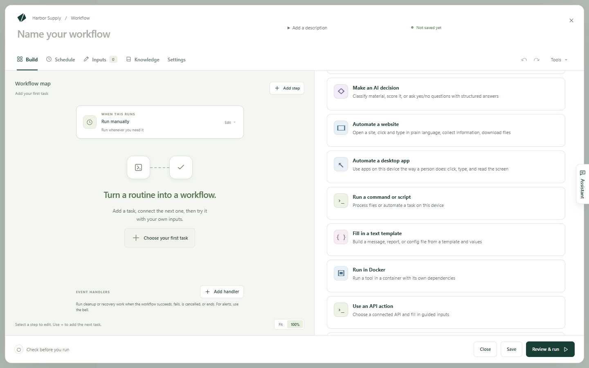
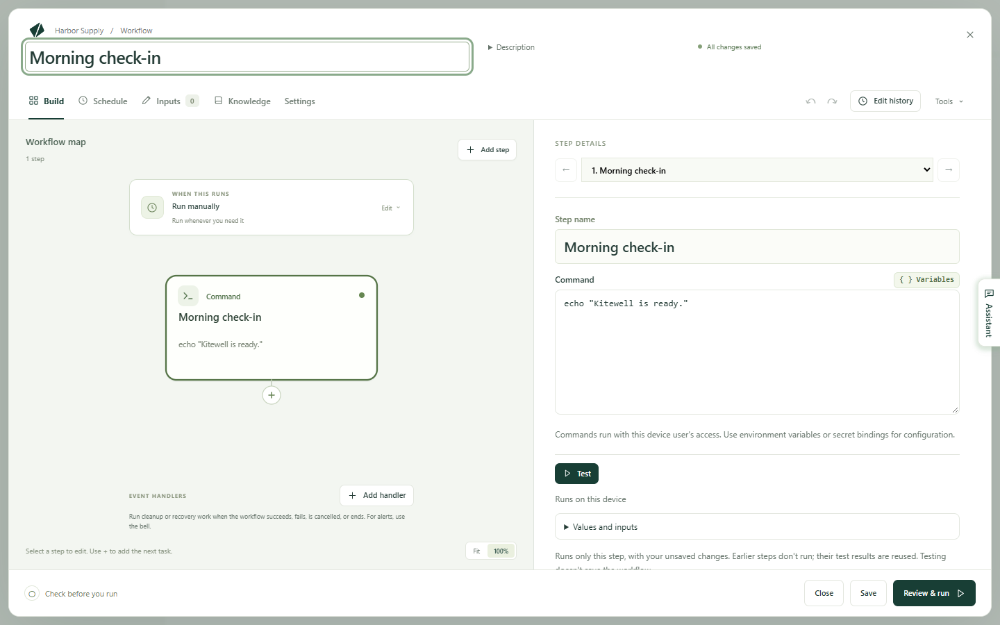
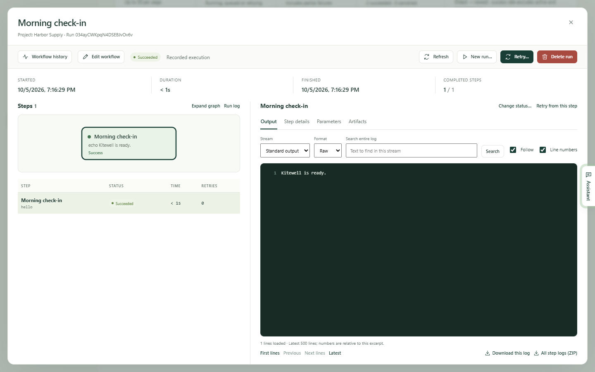

A workflow is one routine, made of steps. This page builds the smallest one
there is: a single command that prints a line. It runs entirely on your own
computer, contacts nothing, and needs no AI account. Once it works, you swap
the command for the one you actually want and give it a schedule.

## What you need

Kitewell, [installed](/docs/install/) and open, with a project. If this is the
first time you open Kitewell, choose **Start on this device** and it makes one
for you. A short tour then points out where things are. **Skip tour** sends it
away, and the question mark in the top bar, **Show me around**, brings it
back.

## Build it

1. Choose **Create a workflow**. The editor opens on **Build**, with an empty
   map.
2. Type `Morning check-in` into **Workflow name**.
3. Choose **Choose your first task**. Kitewell lists what a step can be.
4. Choose **Run a command or script**.

   

5. In **Command**, type this line:

   ```sh
   echo "Kitewell is ready."
   ```

6. In **Step name**, type `Morning check-in` as well, so the step reads
   clearly in the map and in every run.

The map on the left now shows one step. Select a step to edit it on the right.
The **+** under a step adds the next one, and **Add step** adds one anywhere.



## Run it

1. Choose **Review & run**. Kitewell checks the workflow and says whether it
   is ready.
2. Choose **Save and run…**. The workflow is saved, and a form opens for the
   values this run needs. This one needs none.
3. Choose **Start run**.

Saving and running are separate. **Save** stores the workflow without starting
it, and you can save as often as you like while you work.

## See what happened

Open **Runs & logs**. The newest run is at the top. Choose **View run** beside
it.

The run opens with its result, its steps, and the output of whichever step you
select. The line your command printed is there.



## Give it a schedule

1. Open the workflow again and choose **Schedule**.
2. Under **Run**, choose **Every day** and pick a time.
3. Check that **Enable saved schedules** is ticked. Schedules start working
   when you save.
4. Choose **Save**.

Kitewell runs the workflow at that time every day, as long as the computer is
awake, you are signed in, and Kitewell is running. Closing the window is fine;
it keeps going in the menu bar or the tray. Read
[Scheduling](/docs/scheduling/) before you rely on unattended runs.

## If something goes wrong

- The run failed. Open it from **Runs & logs**. The summary at the top names
  the step that failed and offers **Inspect failure**, which shows that step's
  log.
- The command works in your terminal but not here. Kitewell's environment is
  not your terminal's. Give the program its full path, and set a working
  folder on the step. See
  [Troubleshooting](/docs/troubleshooting/#a-command-works-in-a-terminal-but-fails-in-kitewell).

## Make it your own

Replace the sample command with something you already run by hand. Then:

- Put values that change between runs into **Inputs**, so each run can be
  given its own.
- Keep passwords and keys in [Secrets](/docs/secrets/), never in the command
  itself.
- Add other kinds of step — Docker, AI, a pause for a person, a command on
  another machine — from [Build a workflow](/docs/workflow-builder/).
- To run the same workflow once per row of a list, use a
  [batch sheet](/docs/batches/).

If you have set up an API model, you can also describe the workflow you want
in plain language and let [the assistant](/docs/ai/#the-assistant) draft it.
Nothing is saved until you accept its proposal.

## Details

- `echo "…"` is one of the few commands that behaves the same in PowerShell on
  Windows and in a shell on a Mac. A command written for one system does not
  always run on the other.
- Commands run with the permissions of the user account running Kitewell.
- **Tools → Check workflow** checks a draft against the installed workflow
  engine without saving or running it. **Review & run** makes the same check
  part of its summary.
