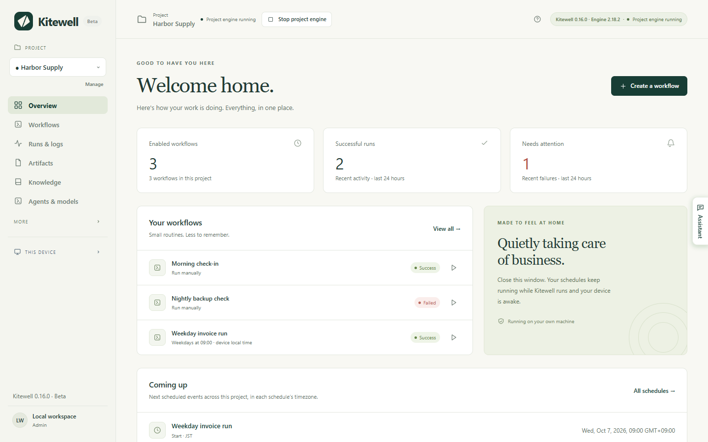

Kitewell does the routines your team does by hand. You describe a routine
once, it runs on your own computer at the times you choose, and every run is
kept with its result and its output.

## Start here

1. [Install Kitewell](/docs/install/) on a Mac or a Windows PC.
2. [Build your first workflow](/docs/getting-started/). A workflow is one
   routine, made of steps.
3. [Set a schedule](/docs/scheduling/), and learn what Kitewell needs in order
   to run unattended.
4. [Share workflows with your team](/docs/sharing/).

No account is needed to start.

## What a workflow can do

- **[Build it from steps](/docs/workflow-builder/)**: commands and scripts,
  containers, another machine over SSH, web requests, AI, and a pause for a
  person to approve.
- **[Start it from a webhook](/docs/webhooks/)**: a run begins when GitHub,
  Stripe, a form, or Zapier sends a request, with no port or tunnel to set up.
- **[Automate a website](/docs/browser/)**, a
  **[desktop app](/docs/desktop/)**, or **[email](/docs/email/)**, described in
  plain language rather than in code.
- **[Automate Excel](/docs/spreadsheets/)**: read the workbooks your office
  already has, and write each result back into the row it came from.
- **[Run it over a sheet](/docs/batches/)** once per row, and collect what each
  run found.
- **[Ask the assistant](/docs/ai/#the-assistant)** to draft a workflow or fix
  one, and have a failed run [diagnosed](/docs/ai/#failure-diagnosis).
- **[Import an OpenAPI description](/docs/apis/)** and fill in the request
  forms Kitewell builds from it.
- **[Share a project](/docs/sharing/)** with a teammate, or
  **[sync it with Dagu Cloud](/docs/cloud-sync/)** so every copy matches. Each
  device supplies its own credentials and enables only what it should run.

:::note[Early releases]
Kitewell is new, so features and limits may still change. The public
installers are for macOS and Windows. Linux is planned. See
[Downloads](/download/) for what is available now.
:::

## What it costs

One project, up to 10 workflows in it, and one API key or connected app are
free, and need no Kitewell account. Each project holds its own workflows,
history, and secrets.

Kitewell Personal is planned at $20 a month for one person on one computer:
ten projects of 100 workflows each, any number of API keys and connected apps,
[alerts](/docs/alerts/), and [webhooks](/docs/webhooks/). Kitewell Team is
planned at $29 a month for each computer, for up to 25 people: 15 projects and
a team that syncs them. See [pricing](/pricing/).

## What runs where

Your projects stay on your device unless you
[sync one with Dagu Cloud](/docs/cloud-sync/). Secret values never leave the
device. Assistant conversations, failure diagnoses, and the values read into
sheets stay on it too.

AI steps send what they read to the model provider you choose: run output,
workflow definitions, the text of a page.
[What leaves your computer](/docs/data-flow/) lists every destination.

Closing the window stops nothing. Kitewell keeps running in the menu bar on a
Mac and in the tray on Windows, and your schedules keep firing.
**Quit Kitewell** in that menu is what stops the service and the workflow
engines.

Your computer has to be awake and you have to be signed in for scheduled work
to run. Kitewell does not provide a machine in the cloud. AI providers, remote
servers, containers, and outside services have their own requirements and
costs.

## Details

Kitewell runs a local Dagu workflow engine for each project. Each engine has
its own data directory, scheduler, and encryption key. Steps run with the
permissions of the user account running Kitewell, so run only workflow
definitions and commands you trust.
