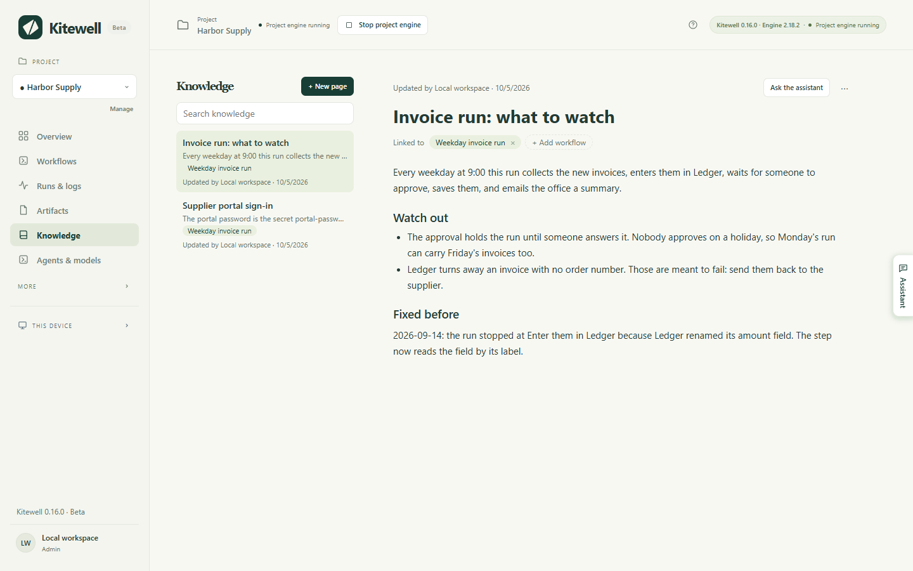
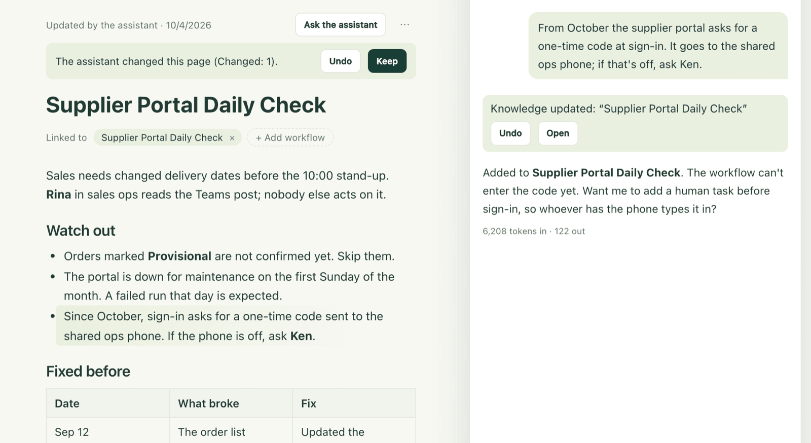

Every team knows things it never writes down: why the portal asks for a code
at the start of the month, which invoices are meant to fail, what broke last
September and how it was fixed. Knowledge is where a project keeps those
notes. The assistant reads them before it answers you, and adds to them as you
work, so the next conversation and the next colleague start from what the team
already knows.

A page says what a workflow's definition cannot. The steps, the schedule, and
the inputs stay in the workflow; the page says why.

## Write a page

1. Choose **Knowledge** in the sidebar. The project's pages are listed newest
   first, and the one you open shows beside them.
2. Choose **New page** and type a title. The page is created as soon as it has
   one.
3. Type the note. Type `/` for headings, lists, checklists, quotes, code,
   tables, and dividers, or select text to get a small toolbar with **Bold**,
   **Italic**, **Strikethrough**, **Code**, and **Link**. `## ` starts a
   heading as you type, `- ` a list, `1. ` a numbered list.
4. Choose **Add workflow** and pick the workflow the page is about. Its name
   then appears under **Linked to**, and clicking it opens the workflow. A
   page about no workflow — a supplier's website, a team rule — is fine too.
5. There is nothing to save. A moment after you stop typing, the line above
   the page reads **Saving…** and then **Saved**. ⌘S on a Mac, Ctrl+S on
   Windows, saves at once, and leaving the page saves it too.

Each page in the list shows its first line, the workflows it is about, and who
changed it last. A page the assistant wrote carries an AI mark. **Search
knowledge** finds a page by any word in its title or its text, whether you
type it in full-width or half-width characters.

The same pages come to you where they help:

- The **Knowledge** tab of the workflow editor shows the pages about that
  workflow, and **Add a page** starts one already linked to it.
- A failed run shows **Related knowledge** under its error. What broke before,
  and how it was fixed, is often there.

## What the assistant does

The assistant reads the project's knowledge before every message: a one-line
summary of every page, and in full the page you have open and up to three
pages about the workflow you are looking at. It can read any other page, or
search them all, when it needs to.

It also writes them. When you tell it a lasting fact, a rule, or a correction,
when it changes a workflow for a reason the definition does not show, or when
a failure is fixed, it saves that to a page at once and shows a receipt in its
panel — "Knowledge added" for a new page, "Knowledge updated" for a change —
with **Undo** and **Open**. When it creates a workflow, the page about it
comes on the same card, and **Apply** saves both.

If you have the page open while it writes, the parts it changed are marked,
with **Undo** and **Keep** above them. The marks go when you start typing.

Two rules keep this safe to leave on:

- It asks first once a conversation has read anything from outside. After
  the assistant has fetched a web page, or read a run's log, an artifact, or a
  sheet, it stops saving by itself: the change becomes a card showing exactly
  what it would add, and nothing is saved until you choose **Apply**. Text on
  a web page or in a log cannot reach everyone's knowledge unseen.
- It writes only what is true. It writes what you said or decided, or what
  a run proved, in the language you write in. When a page disagrees with the
  workflow itself, the workflow wins and the assistant corrects the page.

Pages reach the assistant as reference material. Nothing written on a page is
treated as an instruction to it.

## When someone else changes the same page

If a teammate, another device, or the assistant changes a page while you are
typing in it, nothing you typed is lost. The page says who changed it and
offers **Keep my version** or **Use their version**; using theirs can be
undone with ⌘Z on a Mac, Ctrl+Z on Windows. If the page was deleted while you
were in it, the choice is **Keep it as a new page** or **Discard my edits**.

## If something goes wrong

- The status says **Not saved**. The page has no title, or it is over 2,000
  characters. Fix that and choose **Try again**. Edits that could not be saved
  stay on the page and come back if you open it again while Kitewell is still
  running; they are not kept across a restart.
- The page opens as Markdown. It holds an image, some HTML, or a link that
  is not `https://`, which the formatted editor cannot show without losing it.
  Edit it there, or move that part out.

## Details

- A page holds a title of up to 60 characters and 2,000 characters of text,
  names up to 20 workflows, and a project keeps up to 100 pages. From 1,800
  characters a counter appears above the page; over the limit it refuses to
  save and asks you to move the rest into a page of its own.
- **⋯** → **Edit as Markdown** shows the page's Markdown for anyone who prefers
  it, and **Edit as formatted text** goes back. **⋯** → **Delete page** deletes it
  for everyone on the project, after a confirmation.
- Pasting keeps what a page can hold: a table copied from a spreadsheet stays
  a table with its first row as the header, and Markdown text becomes
  formatted text. Only `https://` links are kept.
- Pages belong to one project. Everyone on it reads them; editors and the
  assistant change them. They [sync with Dagu Cloud](/docs/cloud-sync/) and
  travel in [project exports](/docs/sharing/). They are not part of
  [releases](/docs/releases/), which carry workflows and secret names only.
- [MCP clients](/docs/mcp/) read pages with `read` and `target: "knowledge"` —
  the whole index, one page by its ID, or a search. With the **Edit and run**
  permission they also write them with `change` and a type of
  `upsert_knowledge` or `delete_knowledge`. Reading a workflow returns the
  pages about it as well.
