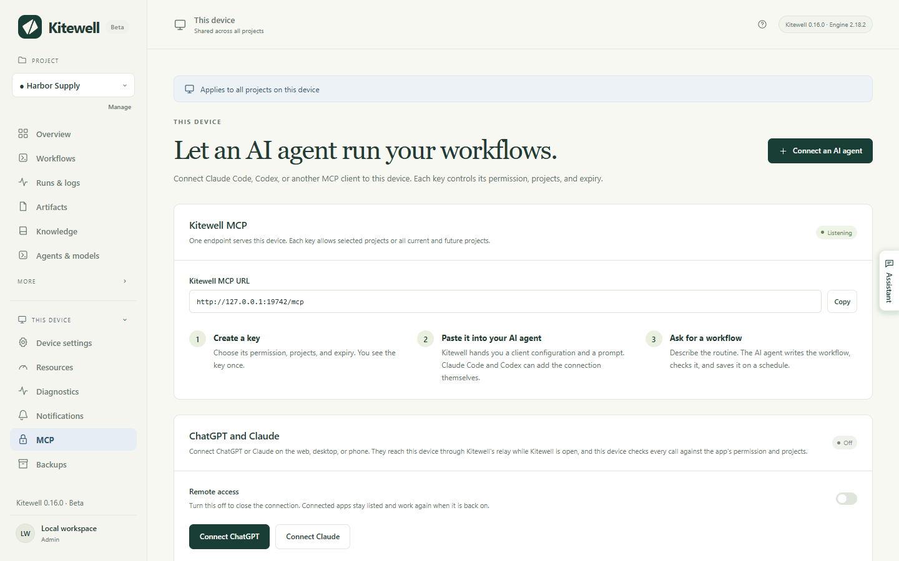
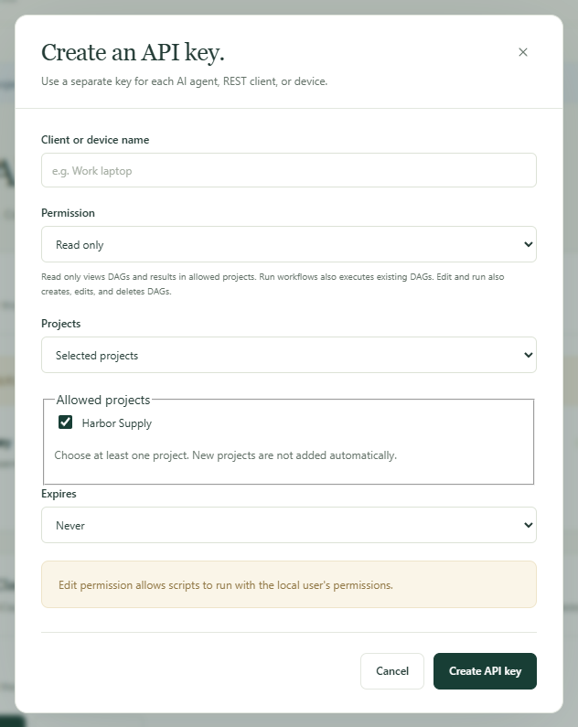
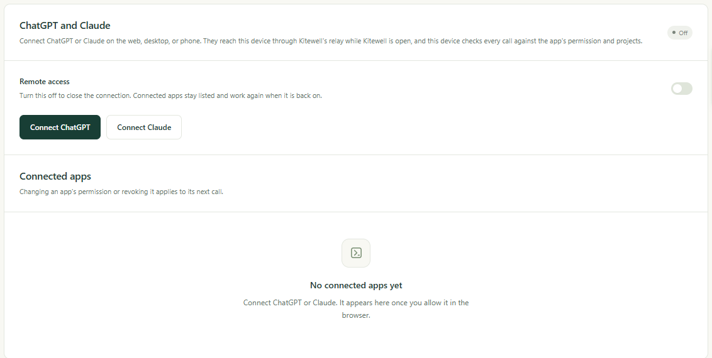

Ask ChatGPT, Claude, or Claude Code to run one of your workflows, read what a
run did, or write a new workflow for you. The work still happens on your own
computer, in the projects you allow, and you can take the access away again
whenever you like.

## What you need

- Kitewell open on the computer that holds the workflows, with the computer
  awake. No call reaches a sleeping computer.
- For an assistant on the same computer, such as Claude Code or Codex, nothing
  else. Kitewell already listens at `http://127.0.0.1:19742/mcp`.
- For ChatGPT or Claude on the web, desktop, or phone, a Dagu Cloud account,
  with this computer [signed in](/docs/cloud-sync/#sign-in) to it. They call
  from their own clouds, so they reach your computer through Kitewell's relay
  rather than that address.

All of it lives on one page: **This device → MCP**. The badge beside
**Kitewell MCP** reads **Listening** when the connection is ready, and the
**Kitewell MCP URL** below it is the address to hand a client.



The free plan holds one API key or connected app in total. Kitewell Personal
and Team hold any number. Revoking one makes room for another. When a paid
plan ends, keys and apps beyond the free plan stop working 7 days later, and
you choose which one stays; see
[When a plan ends](/docs/cloud-sync/#when-a-plan-ends).

## Connect an assistant on this computer

This is the way for Claude Code, Codex, and any other client you run
yourself. It uses a key: a long secret the client sends with every call.

1. Open **This device → MCP** and choose **Connect an AI agent**.
2. Fill in **Client or device name**, such as Claude Code on the work laptop.
   The name is only so you recognize it later.
3. Choose a **Permission**: **Read only**, **Run workflows**, or
   **Edit and run**. The next section says what each one allows.
4. Choose **Projects**. **Selected projects** allows the ones you tick under
   **Allowed projects** and nothing else; **All current and future projects**
   also covers projects you make later.
5. Choose **Expires**: **Never**, **30 days**, **90 days**, or
   **Custom date and time**.
6. Choose **Create API key**.



Kitewell then shows the key once, under **API key**, with three ways to hand
it over:

- **Kitewell MCP URL** is the address the client connects to.
- **Kitewell MCP client configuration** is the same thing as a block of
  settings many clients accept as it is.
- **Prompt for an AI agent** is a request you paste into Claude Code or
  Codex, which then adds the connection itself. It carries the key, so paste
  it only into an assistant you trust.

Copy what you need before closing the dialog. The key is never shown again.
If you lose it, revoke it and make another.

A client set up by hand needs the URL, Streamable HTTP, and the header
`Authorization: Bearer <your key>`. The client must support a credential you
type in yourself. ChatGPT and Claude cannot do that; they sign in instead, as
described below.

Back on the page, **Things to ask for** holds three requests to copy into a
connected assistant to try it out: **Schedule a command**,
**Schedule an AI agent step**, and **Look into a failure**. Each one names
the project you have open, and asks the assistant to check the workflow and
leave its schedule off until you have read it.

## What each permission allows

| Permission | What the assistant may do |
| --- | --- |
| **Read only** | Look at your projects, workflows, runs, their logs, the files a run left behind, and the project's knowledge. It changes nothing. |
| **Run workflows** | All of the above, and start, retry, re-run, or cancel a run; approve, reject, send back, or complete a step waiting for a person; answer a website or desktop step that is waiting; and run a sheet's rows. |
| **Edit and run** | All of the above, and create, change, or delete workflows, agents and models, servers, queues, workflow defaults, API connections, sheets, and knowledge pages. |

Start with the least that does the job. **Read only** is enough to ask what
failed last night. **Run workflows** is enough to ask for a run. Only
**Edit and run** lets an assistant write a workflow, and a workflow's commands
run as you do on that computer: they can change files and reach other
services. Give **Edit and run** only to an assistant you would trust to run
commands there yourself.

A permission applies inside the allowed projects only. It is not a lock on the
rest of the computer.

What a connection can see is whatever is in its projects: the text of workflow
commands, the logs of their runs, and the values a run was given. What it
cannot see is your secret values, your mailbox passwords, your Dagu Cloud
sign-in, other API keys, and anything in a project it was not given. A secret
stays on the device, and a workflow reads it by name while it runs.

## Connect ChatGPT or Claude

ChatGPT and Claude reach your computer at `https://mcp.kitewell.app/mcp`, over
a connection your computer opens. No port on your network is opened, and your
computer checks every call against the permission and projects you approved,
exactly as it does for a key.

1. In Kitewell, open **This device → MCP** and choose **Connect ChatGPT** or
   **Connect Claude**. A computer not yet signed in to Dagu Cloud signs in
   first, and **Remote access** turns on.
2. Choose the **Permission** and the **Projects**, then choose
   **Save and show the steps**. Kitewell shows the URL and the steps for that
   app, and keeps your choice for the next time you connect it.
3. Add Kitewell in the app with that URL, as described for
   [Claude](#claude) or [ChatGPT](#chatgpt) below.
4. The app opens Dagu Cloud. Sign in with the account this computer is signed
   in to.
5. The consent page opens with your choice already filled in. Check the
   computer, the permission, and the projects, change anything you like, then
   choose **Allow**.



The app then appears under **Connected apps**, with its **Permission**,
**Projects**, when it connected, and when it last called.

### Claude

1. In Claude, open **Customize → Connectors**, choose **+ Add**, then
   **Add custom connector**.
2. Name it Kitewell, paste the URL, and choose **Continue**. Keep the
   suggested sign-in settings and choose **Add**.
3. Sign in to Dagu Cloud, check the permission and projects, and choose
   **Allow**.

On Team and Enterprise plans, an owner adds Kitewell under
**Organization settings → Connectors** first; members then choose **Connect**
on it. Claude's Free plan allows one custom connector.

### ChatGPT

ChatGPT connects on the web only, through developer mode. To give the entry
Kitewell's icon,
<a href="/kitewell-icon-256.png" download>download the Kitewell icon (PNG)</a>
first. It is 256 × 256 px, within ChatGPT's 10 KB limit.

1. In ChatGPT on the web, open **Plugins**, choose **Add**, then
   **Create custom MCP server**. If it isn't there, first turn on
   **Developer mode** in **Settings → Security and login**, or on Business,
   Enterprise, and Edu in **Settings → Apps → Advanced settings**.
2. Name it Kitewell, add the Kitewell icon if you want one, paste the URL
   under **Server URL**, keep **OAuth**, tick
   **I understand and want to continue**, and choose **Create as a plugin**.
3. Choose **Proceed to Kitewell**, sign in to Dagu Cloud, check the permission
   and projects, and choose **Allow**.
4. Choose **Try in chat**. In any later chat you can also type **@** and pick
   Kitewell, or choose it from the **+** tools menu.

Kitewell then appears under **Plugins → Personal → Created by you**, and its
page shows the account it signed in with.

Two limits here are ChatGPT's own, not Kitewell's:

- On Plus and Pro, ChatGPT uses only Kitewell's read-only tools. Starting runs
  and editing workflows need ChatGPT Business, Enterprise, or Edu.
- On Business, only admins and owners can use developer mode. On Enterprise
  and Edu, an admin grants it first.

ChatGPT also warns that a custom MCP server is a risk. Kitewell gets only the
permission and projects you approve.

### If a call says the computer is not reachable

The computer must be on, awake, and running Kitewell. Otherwise the app still
lists Kitewell's tools, but every call answers that Kitewell on that computer
is not reachable, and says when it was last seen. Open Kitewell there and ask
again. See [Troubleshooting](/docs/troubleshooting/#chatgpt-and-claude) if it
still fails.

## Change or take away access

- A key: **Edit** in **API keys** changes its name, permission, projects, or
  expiry without replacing the secret. **Revoke** ends it.
- A connected app: **Change** and **Revoke** under **Connected apps**.
  Revoking the connection in ChatGPT or Claude itself reaches your computer
  within five minutes.
- ChatGPT and Claude together: turn off **Remote access**. The connection
  closes, and connected apps stay listed and work again when it is back on.
  Keys on this computer are unaffected.

Edits, revocation, and expiry apply to the next call. A run already started
carries on. An expired key works again if you extend or remove its expiry.

A workflow's webhook uses the same relay but has a URL of its own, and keeps
working while **Remote access** is off. See
[Start a workflow from another service](/docs/webhooks/)
for that.

## Tell ChatGPT when something happens

An app that supports MCP Events can be told instead of asking again and again:

- `run.finished` — a run finished. It can name one run, or the outcomes to
  report.
- `run.needs_input` — a run waits at an approval, a task for a person, or a
  question.
- `batch.finished` — a [batch](/docs/batches/) of a sheet's rows finished.
- `schedule.missed` — a scheduled run was missed.

Each app's subscriptions are listed under it in **Connected apps**, with when
one last delivered, and **Remove** ends one. Revoking the app ends them all.
They pause while **Remote access** is off, and last up to a week unless the
app renews them. Your computer finds the events and sends them, so they arrive
only while Kitewell is running. MCP Events are part of Kitewell Personal and Team, like
[alerts](/docs/alerts/).

## Details

### The tools a connection sees

A connection lists only the tools its permission allows, so a read-only
connection never sees a tool that writes.

| Tool | Permission | What it does |
| --- | --- | --- |
| `read` | **Read only** | Reads projects, workflows and their schema, runs with their logs and artifacts, agents and API models, servers, queues, mailboxes, workflow defaults, imported APIs, [batch sheets](/docs/batches/) and their values, and the project's [knowledge](/docs/knowledge/). A failed run carries its [failure diagnosis](/docs/ai/#failure-diagnosis) when there is one. `target: "reference"` returns the usage guide. **Run workflows** adds a preview of which steps a re-run can reuse; **Edit and run** adds checking a workflow's YAML without saving it, and opening an Excel workbook on this computer. |
| `show` | **Read only** | Draws a workflow's dependency graph and, with a run, each step's state. ChatGPT and Claude show it as a view that follows a run in progress; other clients get the steps in order as text. |
| `execute` | **Run workflows** | `start`, `retry`, `rerun`, `cancel`, `approve`, `reject`, `push_back`, `complete`, `answer`, `restart`, `resume`, `run_sheet`, `read_sheet_values`, and `cancel_sheet`. **Edit and run** adds `refresh_sheet`, `link_workbook`, and `unlink_workbook`. |
| `change` | **Edit and run** | Creates, replaces, and deletes workflows, agents, servers and server groups, queues, workflow defaults, API connections, sheets and the schedule a sheet runs on this device, and knowledge pages. |
| `preview_api` | **Edit and run** | Reads an OpenAPI document you give it, or fetches one from a URL, and lists its operations. It saves nothing, but fetching a URL reaches outside your computer. |

A call a permission does not allow, such as one from a tool list a client kept
from an earlier permission, is refused and says where in Kitewell to change
the permission.

Every replacement or deletion needs the `version` from the latest read, so a
client never overwrites a change it has not seen. On a conflict, read again,
review, and send it again deliberately.

To follow a run without asking repeatedly, pass `wait`, up to 60 seconds, to
`execute` when starting, retrying, or re-running, or to `read` with
`target: "run"`. The call answers as soon as the run ends or stops at a step
waiting for a person. If the time runs out first, it answers with the run as
it stands.

Writing results into a linked workbook, and undoing such a write, are open to
no connection at all. A person does both in the app.

### Choosing the project

`read` with `target: "projects"` lists only the projects a connection may
reach, and needs no project of its own. Every other call names its project
with `projectId`, or `?projectId=<id>` on a REST route. A connection that
reaches exactly one project may leave it out; one that reaches several must
name one. Ask for the project list first, then pass the ID whose name matches
the request.

Agents, servers, queues, and workflow defaults belong to a project, so the
same key changes different ones depending on the project it names.

### Imported APIs over MCP

An assistant with **Edit and run** can import an OpenAPI document and build
workflows from its operations:

1. Preview with `preview_api` and either `spec`, the document as JSON or YAML
   text, or `url`. Nothing is saved and no operation is called.
2. Save with `change`, `type: "upsert_api"`, an `id`, and an `api` definition.
   Give `api.spec`, or leave it out to fetch `api.sourceUrl` once. Set
   `api.auth.type` to `none`, `bearer`, `apiKey`, or `basic`, and name an
   existing project secret with `api.auth.secretRef`. Secret values are
   created and replaced in the app, never over MCP.
3. Find operations with `read`: `target: "apis"` lists connections,
   `target: "api_operations"` searches one by `id` and an optional `query`,
   and `target: "api_operation"` with `id` and `operationId` returns its
   inputs, its responses, and a starting workflow step.
4. Add `api.request` steps, then check, save, and run the workflow with the
   usual tools. The returned step is a template: review its examples and
   replace the placeholders before running it.

`upsert_api` replaces the whole connection, so read `target: "api"` first,
keep the fields you still want, and pass its `definitionVersion` as
`version`. `change` with `type: "delete_api"` removes a connection only when
no saved workflow uses it. See [Import an API](/docs/apis/) for what the
importer accepts.

### REST for scripts

The same keys work for a plain HTTP interface, for scripts and other
integrations. Its base address is the MCP URL's origin plus `/api`. Every
request needs `Authorization: Bearer <your key>`, even on this computer; the
browser's own sign-in is not a key.

```http
GET /api/jobs HTTP/1.1
Host: your-host
Authorization: Bearer <Kitewell API key>
```

| Route | Least permission |
| --- | --- |
| `GET /api/projects`, `/api/jobs`, `/api/runs`, `/api/queues` | **Read only** |
| `GET /api/runs/{jobId}/{id}`, `/api/jobs/{id}/graph` | **Read only** |
| `GET /api/runs/{jobId}/{id}/logs` and `/logs/download` | **Read only** |
| `GET /api/dags/schema`, `/api/harnesses`, `/api/data/usage` | **Read only** |
| `POST /api/jobs/{id}/run` | **Run workflows** |
| `POST /api/runs/{jobId}/{id}/resume` | **Run workflows** |
| `POST /api/runs/{jobId}/{id}/approvals/{stepId}/approve`, `/reject`, `/push-back` | **Run workflows** |
| `POST /api/runs/{jobId}/{id}/human-tasks/{stepId}/complete` | **Run workflows** |
| `POST /api/jobs`, `PUT` and `DELETE /api/jobs/{id}` | **Edit and run** |
| `POST /api/jobs/{id}/pause`, `POST /api/dags/validate` | **Edit and run** |
| `POST /api/runs/delete`, `DELETE /api/run-history/{jobId}` | **Edit and run** |

Log reads accept `stepId`, `stream=stdout`, `stderr` or `run`, `tail=500` or
`offset` and `limit` up to 500 lines, and `query=<text>` to search. Run
requests accept a body such as `{"params":{"region":"west"}}`.

REST covers workflows and batch sheets. Device settings, secrets, API-key
management, the Dagu Cloud account, backups, and engine controls stay in the
app and are not exposed. Imported APIs are managed in the app or through the
MCP `change` tool.

### Another computer's client

The listener accepts local connections only, at `127.0.0.1:19742`. ChatGPT and
Claude come through the relay instead and need none of what follows.

A client on another computer needs an address it can reach over HTTPS, which
you set up and operate. Under **Kitewell MCP connection**, keep
**Enable Kitewell MCP** on, open **TLS and remote connections**, and fill in
**Public Kitewell MCP URL**, ending in `/mcp`. Then either keep
**Listen address** at `127.0.0.1:19742` and point your own HTTPS proxy at it,
forwarding both `/mcp` and `/api/` with the `Authorization` header, or set the
address to `0.0.0.0:19742` and give absolute paths for **Certificate file**
and **Private key file**. Choose **Save connection**.

An address other computers can reach makes the firewall ask whether Kitewell
may accept connections, and a refusal there leaves every client waiting.
Kitewell does not set up DNS, certificates, or router forwarding, and does not
supply a computer to run your workflows on. Never publish an unprotected HTTP
listener to the internet.

If the badge reads **Unavailable** and the page says another program is using
port 19742, it is usually a second copy of Kitewell, such as a development
build running beside the installed app. Quit that program, then restart
Kitewell.

Keys are stored as hashes, never in full. Restoring a
[backup](/docs/backups/) keeps this computer's keys: review them, and revoke
any that should no longer have access.
[Contact support](/support/) if a client's credential settings are unclear.
