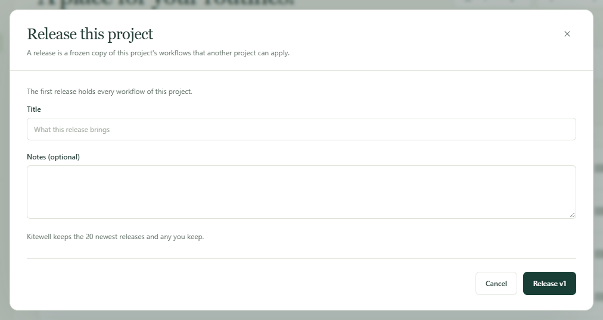

Try a change somewhere safe before it touches the work that matters. Keep one
project to build in and another to run for real, freeze the workflows you are
happy with as a numbered release, and hand that release to the other project
when you are ready.

Each project keeps its own servers, models, API connections, queues, and
secret values, so the same workflow talks to the test system in one and the
real system in the other.

## What you need

Two or more projects on the same computer, named however you like — **Dev**,
**Staging**, and **Prod** is the usual set. A computer holds one project on
the free plan, so staging needs Kitewell Personal, which holds up to ten, or
Team, which holds 15. Cutting
and applying a release needs edit access to the project.

## Cut a release

1. Open **Workflows** in the project you build in. The line above the list
   shows the newest release and how many workflows changed since it.
2. Choose **Release…**. The first release holds every workflow in the project
   and the dialog says so; after that it lists what changed, with **Compare**
   beside each workflow.
3. Fill in **Title**, add **Notes (optional)** if they help, and choose the
   button that names the next number — **Release v1** for the first one.

A release is a frozen copy of the project's workflows and the names of the
secrets they read. It never changes, so anything you edit afterwards waits for
the next one. When nothing has changed since the newest release, no release is
made and Kitewell says so.

Kitewell keeps the 20 newest releases and deletes older ones. **Delete**
removes one sooner, except the newest, because it numbers the next one.
Projects that already took a deleted release keep its workflows; it just
cannot be applied again.

To hold on to a version you trust however many releases follow it, choose
**Keep** beside it in **Releases**. A kept release is never removed, on any
computer or in Dagu Cloud, and cannot be deleted until someone chooses
**Stop keeping**. Up to 20 releases can be kept.

In a [synced project](/docs/cloud-sync/), releases sync like everything else,
so every teammate can apply the same one. Releases are left out of
[project exports](/docs/sharing/) but kept in [backups](/docs/backups/).

## Apply a release

1. Choose **Releases**, then **Apply to…** beside the release you want.
2. Under **Apply to**, pick the project it goes to — another project on this
   computer. A project you may only view cannot be chosen.
3. Read the preview. For each workflow, **What happens** says whether it is
   **New · arrives paused**, **Updated**, **Kept** because it was edited there
   and the release did not change it, or **Unchanged**. **Compare** shows the
   difference. Where there is a choice, tick **Keep Prod's version** — the
   receiving project's name — to leave its own copy alone.

   The preview also warns you when a workflow would not run in that project,
   calls a workflow or uses a queue the project does not have, has a name
   another workflow there already uses, or changes a schedule that takes
   effect the moment you apply.
4. Choose the button that names how many changes it makes, such as
   **Apply 3 changes**.

Only workflows move. The other project keeps its own servers, models, queues,
and secret values. It does gain the names of the secrets the release reads;
set their values on each of its computers from **Secrets** or the
**Overview**.

New workflows arrive paused. Turn on the ones that project should run. A
workflow that was already there keeps whether it is on, where it runs, its
alerts, and its failure-diagnosis choice.

If the project changed since the preview was drawn, Kitewell asks you to look
at the preview again. If applying stops partway — at the plan's workflow
limit, for instance — the preview names what has not been applied yet; apply
again to finish.

If the release has nowhere to go, Kitewell says to create or download the
project it goes to first.

## See what is running where

A project that took a release shows where it came from above its workflows,
such as **From Dev v13**, and each workflow shows the release it arrived in.
This shows on every computer that syncs the project.

Edit a workflow there afterwards and it is marked **edited here**. The next
release keeps that edit by default when the release did not touch the same
workflow. When it did, the preview warns you and lets you keep the project's
own version.

A workflow changed in the building project since its newest release is marked
**Unreleased**, so you can see at a glance what the next release would carry.

## Roll back

Apply an older release the same way. Two things differ:

- Workflows that a newer release added are listed on their own, under a
  heading naming the release they are not in. They are removed only if you
  tick them.
- Every workflow the older release replaces also stays in the project's edit
  history on this computer, so a single one can be put back on its own.

You can also start from the project that runs the release. Beside
**From Dev v13**, choose **Releases of Dev…** to see that project's releases,
with the one running here marked **Running here**, and choose **Apply here**
on the one you want. This works while the other project is on the same
computer.
