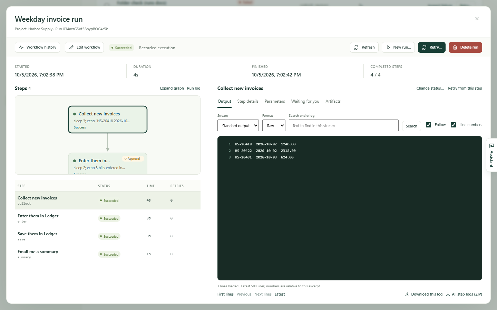
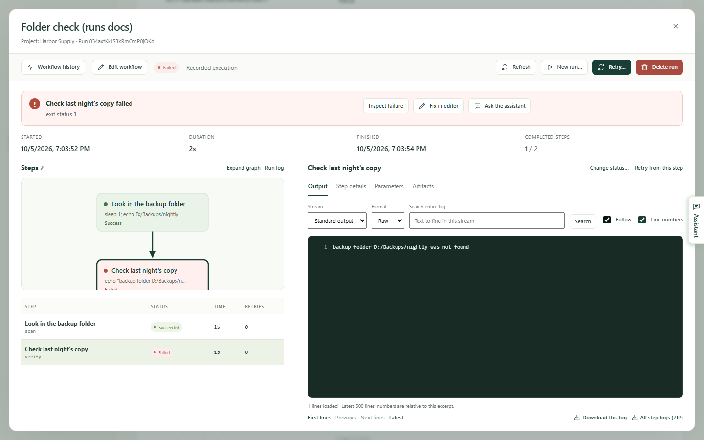

Every time a workflow runs, Kitewell writes down what happened: which steps
ran, what each one printed, which files it made, and how it all ended. When a
run worked you rarely need to look. When it did not, this is where you find
out why and put it right.

**Runs & logs** in the sidebar opens that record, under the heading
**Execution history**.

## Find the run you want

The newest runs are at the top. Narrow the list when there are too many:

- **Workflow** keeps one workflow's runs. **All workflows** shows them all.
- **Created within** sets the period. It opens on **Last 7 days**; the other
  choices go up to **All time**.
- **Run ID** finds one run when you have its identifier — the short code
  under the workflow's name in the list, which you can copy from there.
- Choose **Apply filters** to use them, or **Reset** to clear them. Reset
  widens the period to **All time**.

Along the top of the list, **All runs**, **Running / queued**, **Waiting**,
**Failed**, **Succeeded** and **Cancelled** switch between kinds of result.
Above it, **This page**, **In progress**, **Failed runs** and **Success rate**
count what this page of runs holds.

Each row says which workflow ran, how it ended, what started it, when, and how
long it took. What started it is one of manual, scheduled, catch-up, retry,
API, webhook, or sub-workflow.

Three more things live on this page:

- **Queues** shows how many runs each queue is running and how many are
  waiting, and lets you take a waiting run out.
- **Pause updates** stops the list refreshing while you read; it becomes
  **Resume updates**.
- **Export page** saves the rows you can see as a spreadsheet file. It does
  not export runs on other pages.
- **Batches** opens the [batch sheets](/docs/batches/).

## Read a run

Choose **View run** at the end of a row, or **Inspect failure** when the run
failed.

The run opens on its own. Across the top: when it **Started**, its
**Duration**, when it **Finished**, and how many **Completed steps** it got
through.

On the left, **Steps** draws the run as a map and then lists every step with
its **Status**, **Time** and **Retries**. **Expand graph** gives the map more
room, and **Run log** shows the run's own record rather than a step's.

On the right is whatever you selected. Choose a step, and:

- **Output** shows what it printed. **Stream** switches between
  **Standard output** and **Errors (stderr)**; a step that failed opens on its
  errors. The **Run log** shows **Run events** instead.
- **Step details** shows how the step ended and what it was told to do.
- **Parameters** shows the values this run was given.
- **Artifacts** holds the files the run saved.
- **Items** appears for a step that worked through a list, with one row per
  item.
- **Waiting for you** appears when somebody has to answer.

## Search a log, or keep it

Logs can be long, and the pane shows the newest part of one.

- **Search entire log** looks through the whole file, not only what is on
  screen, for the stream you are looking at. Type the text and choose
  **Search**. A long log reports **Continue search** when there is more to
  look through.
- **First lines**, **Previous**, **Next lines** and **Latest** move through
  it. **Follow** keeps the newest lines in view while a run is going;
  **Line numbers** adds numbers.
- **Download this log** saves the stream you are reading.
  **All step logs (ZIP)** saves every step's, in one file.

## When someone has to act

A run that waits for a person says so at the top, and counts the steps, with
**Review steps** to go straight there. The same runs are under the
**Waiting** tab in the list.

**Waiting for you** holds one card per waiting step. A person's task offers
**Complete task**; an approval offers **Approve**, **Send back** or
**Reject run**; an automatic step that asked a question takes **Your answer**.
See [Build a workflow](/docs/workflow-builder/#stop-and-ask-a-person).

## Fix a failed run

A failed run opens with the failure at the top: which step failed and how.

From there:

- **Inspect failure** selects the failed step so you can read its output.
- **Fix in editor** opens the workflow at that run, with the run's inputs and
  the values its earlier steps collected standing in. Correct the step, then
  choose **Save and continue…**, pick where to **Start from**, and Kitewell
  starts a new run from there with the same inputs and files. The failed run
  stays in the record.
- **Ask the assistant** hands the failure to [the
  assistant](/docs/ai/#the-assistant) to find the cause and propose a fix.
- With [failure diagnosis](/docs/ai/#failure-diagnosis) on, the run also says
  what the failure calls for and which step to look at.

## Run it again

- **Retry…** continues the same run, under the same run ID, using the workflow
  and the inputs it was recorded with. **Retry scope** chooses
  **Failed and unfinished steps** or **A selected step**. Choose
  **Start retry**. Earlier attempts stay part of the run.
- **Retry from this step**, above a step's output, opens the same form at that
  step, with **Also retry downstream steps** for the work that follows it.
- **New run…** starts a separate run with a new ID. The recorded inputs are
  filled in and you can change them, and **Run using** chooses between the
  workflow as it is saved now and the workflow as this run recorded it. Choose
  **Start new run**. The original run stays in the record.
- **Cancel run** stops a run that is still going or still queued.
- **Change status…**, above a step's output, records a step as **Succeeded**
  or **Failed** without running it — for when you fixed its effect by hand.
  The run's own result is worked out again. It is offered once the run has
  finished and no automatic retry is still owed.

## Delete runs

**Delete run** removes one finished run with its logs, outputs and files.
In the list, tick several and choose **Delete…**. A run that is still going,
or that finished moments ago, is kept and Kitewell says so.

You do not have to tidy up by hand. Kitewell removes runs older than
**Device settings → Run history retention → Keep run history for**, which
starts at 30 days, once a day. **Project settings → Storage** shows how much
each workflow's history takes, with **Delete history…** per workflow.

## The files a run made

**Artifacts** in the sidebar lists the files every finished run in the project
saved, newest first. A step saves one by writing it to
`$DAG_RUN_ARTIFACTS_DIR`, or by filling in **Artifact name (optional)** in the
step editor.

Filter by **Workflow**, by **Created within**, or by **File name**, and by
kind: **All files**, **Markdown**, **Images**, **Data**, **Text & logs**.
Select a file to preview it, **Full view** to fill the window, and
**Open run →** to go to the run that made it. **Show older files** reaches
back further. Files are removed with their runs and are included in
[backups](/docs/backups/).

## If something goes wrong

- **The run you want is not in the list.** The period starts at the last 7
  days. Widen **Created within**, or clear the filters with **Reset**.
- **A button you expect is missing.** Retrying, cancelling, answering a
  waiting step and changing a status need permission to run workflows;
  deleting a run, **Fix in editor** and **Ask the assistant** need permission
  to edit.
- **An old run has gone.** Runs older than the retention setting are removed
  once a day, and deleting a workflow can take its history with it.

## Details

- The list shows up to 50 runs a page, newest created first. Periods and
  ordering use the time a run was created, and a retry keeps that time.
- An open run re-reads itself every 3 seconds while it is still going.
- A log pane loads 500 lines at a time, and a run opens on the last 500 lines
  of a step and the last 200 of the run's own events. A search returns up to
  100 matching lines at a time and stops after 30 seconds, saying where to
  continue.
- **All step logs (ZIP)** holds every step's standard output and errors. The
  run's own event log is not in it; download that on its own.
- **Change status…** sets a step, never a whole run, and only to **Succeeded**
  or **Failed**.
