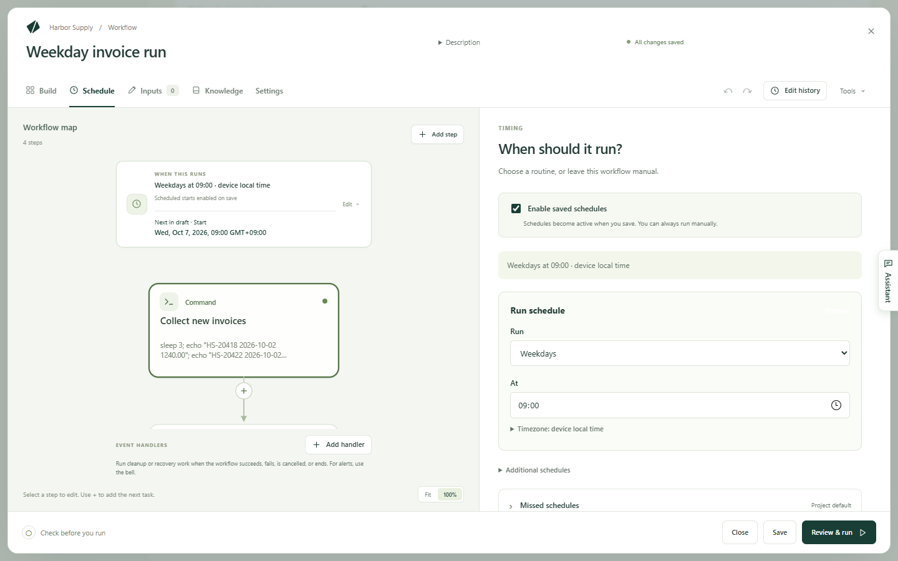

Kitewell can start a workflow for you — every weekday at nine, once an hour,
or the moment another service sends it a request — so nobody has to remember
to. The work happens on this computer, while it is on and you are signed in.

## What has to be true

- **The computer is awake and you are signed in.** Kitewell does not wake a
  sleeping computer, and a machine that is off, asleep, or logged out cannot
  run anything at its scheduled time.
- **Kitewell is running.** Closing the window is fine: it keeps running in the
  menu bar on a Mac and in the notification area on Windows.

## Set a schedule

1. Open the workflow and choose **Schedule**.
2. Make sure **Enable saved schedules** is ticked. Without it the workflow
   runs only when you start it yourself.
3. Under **Run**, choose how often: **Manually**, **Every day**, **Weekdays**,
   **Every week**, **Every hour**, or **Custom schedule**.
4. Set the time. A daily, weekday or weekly schedule asks for it in **At**; a
   weekly one also asks **On** which day; an hourly one asks
   **Minutes past the hour**; a custom one takes a **Cron expression** of five
   fields — minute, hour, day, month, weekday.
5. Open **Timezone** if the time belongs to a particular place, and type a
   zone such as `Asia/Tokyo`. Left alone, the schedule follows this
   computer's own clock, including its daylight saving changes.
6. Choose **Save**. The schedule starts applying from then on.

**Next 5 scheduled events** below the form shows when the workflow would
actually run, so you can check a schedule before trusting it. The project's
**Overview** gathers the same thing for every workflow under **Coming up**.

A workflow can have more than one schedule, and can be told to stop or restart
at a time as well: **Additional schedules** holds those.

To take one workflow out of the rota without changing it, use
**Pause schedule** on the **Workflows** list; its status becomes **Paused**
and **Resume schedule** brings it back. A project downloaded from a workspace
arrives with its workflows paused, so nothing starts running on this computer
until you say so.

## Keep Kitewell running

On a Mac, closing the window, or **Keep Running in Menu Bar** (⌘Q), hides the
window and leaves the service and the project engines running.
**Open Kitewell** brings the window back. **Quit Kitewell** stops everything;
if runs are in progress it warns you first, and then interrupts them.

On Windows, closing the window hides it and Kitewell stays in the notification
area. Click the icon, or choose **Open Kitewell** in its menu, to bring the
window back. **Quit Kitewell** behaves as it does on a Mac.

**Start at login** opens Kitewell when you sign in to the computer. Both menus
also list the projects, so you can start and stop each one on its own.
Switching projects in the window does not stop any other project's schedules.

These menu items are in English on both systems, whatever language the rest of
Kitewell is set to.

## Sleep, and the runs that were missed

A computer that goes to sleep stops running workflows. Two settings help:

- **Device settings → Sleep protection → Prevent idle sleep during active runs**
  keeps the computer awake while work is actually running. It is off to begin
  with. **Keep awake while workflows run** in the menu bar or
  notification-area menu is the same switch. Neither wakes the computer for a
  schedule that has not started, and neither stops sleep you ask for by
  closing the lid.
- Catch-up runs the starts that were missed once the computer is back. By
  default Kitewell looks back 24 hours and runs every missed start.

Change catch-up for one workflow under **Schedule → Missed schedules**:

- **Catch up missed schedules**: **Follow the project default**, **Off**, or
  **Custom lookback**.
- **Lookback window**: how far back to look, up to 30 days.
- **Missed schedule policy**: **Run every missed occurrence**,
  **Run only the latest missed occurrence**, or
  **Skip while a run is active**.

**Project settings → Workflow defaults** sets the same thing for a whole
project, and **Device settings → Workflow defaults** sets the starting values
for new projects only.

With Kitewell Personal or Team, a [missed-schedule alert](/docs/alerts/) tells you how many
scheduled runs did not start and why — the computer was asleep, Kitewell was
not running, and so on.

## Start a workflow from another service

A workflow can also start when another service sends it a request: GitHub
when an issue opens, Stripe after a payment, a form when someone submits it,
Zapier for the apps it connects. Turn on the workflow's **Webhook** in the
same **Schedule** view, beside the schedule. [Start a workflow from a
webhook](/docs/webhooks/) walks through it and says what a request carries.

## Queues

Queues stop everything starting at once. Every project has a **default** queue
that runs 5 at a time; change it, or add your own, under **More → Queues**
with **Simultaneous runs**. A workflow picks its queue in its **Settings**.

A queue paces manual starts, catch-up runs, retries, webhook runs and
[batch](/docs/batches/) rows: each waits for a free slot. A run that its
schedule starts on time is not held back. **Runs & logs** shows what each
queue is running and what is waiting.

## Before you leave it running alone

A scheduled run has nobody watching it, so check what each step needs first:

- A command runs with the permissions of whoever is running Kitewell.
- A Docker step needs Docker running.
- An AI step needs its model or agent set up on this device.
- A step on another machine needs that machine reachable and its host key
  accepted.
- A [website step](/docs/browser/) needs Chrome and a successful
  **Check the browser**.
- A run that needs a secret with no value on this device fails at the start.

Test each of those by hand before you leave the work to a schedule.

## If something goes wrong

- **The time came and nothing ran.** Check the computer was awake and signed
  in, that Kitewell was running, and that **Enable saved schedules** is ticked
  and the workflow is not **Paused**.
- **It ran at the wrong time.** Check **Timezone** on the schedule, and the
  times under **Next 5 scheduled events**, which follow that zone and its
  daylight saving changes.
- **Several runs started at once after the computer woke.** That is catch-up.
  Set **Missed schedule policy** to **Run only the latest missed occurrence**,
  or turn catch-up **Off**.
- **The webhook address never appears.** Kitewell is still asking its relay.
  Check this device is signed in and online.

More in [Troubleshooting](/docs/troubleshooting/).

## Details

- Run history is kept for 30 days to begin with, under
  **Device settings → Run history retention**. See
  [Runs and logs](/docs/runs/).
- Catch-up looks back 24 hours by default, at most 30 days, and at most 1,000
  missed starts are kept per workflow.
- The default queue runs 5 at a time; a queue a project does not define admits
  one run at a time.
- A webhook address looks like `https://hooks.kitewell.app/…`. A request must
  be a POST; the reply is `202` and says nothing about the run.
- A step reads the request's body from `$WEBHOOK_PAYLOAD` and its headers from
  `$WEBHOOK_HEADERS`, as environment variables. Authorization, cookie and
  routing headers are stripped before the request reaches the run.
- A webhook accepts about 60 requests a minute, a body up to 512 KiB, and
  headers up to 16 KiB. The last 20 requests are kept in **Recent requests**.
  Kitewell does not check a sender's signature.
- On Windows, a request body over roughly 32,000 characters may not start a
  run at all, because of a limit on how long a command line may be. Ask the
  sending service for a smaller payload where you can.
- The menu bar and notification-area items — **Keep Running in Menu Bar**,
  **Open Kitewell**, **Quit Kitewell**, **Start at login**,
  **Keep awake while workflows run** — are English on every system.
  **Keep Running in Menu Bar** is a Mac item only.
