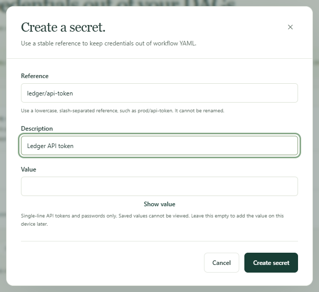
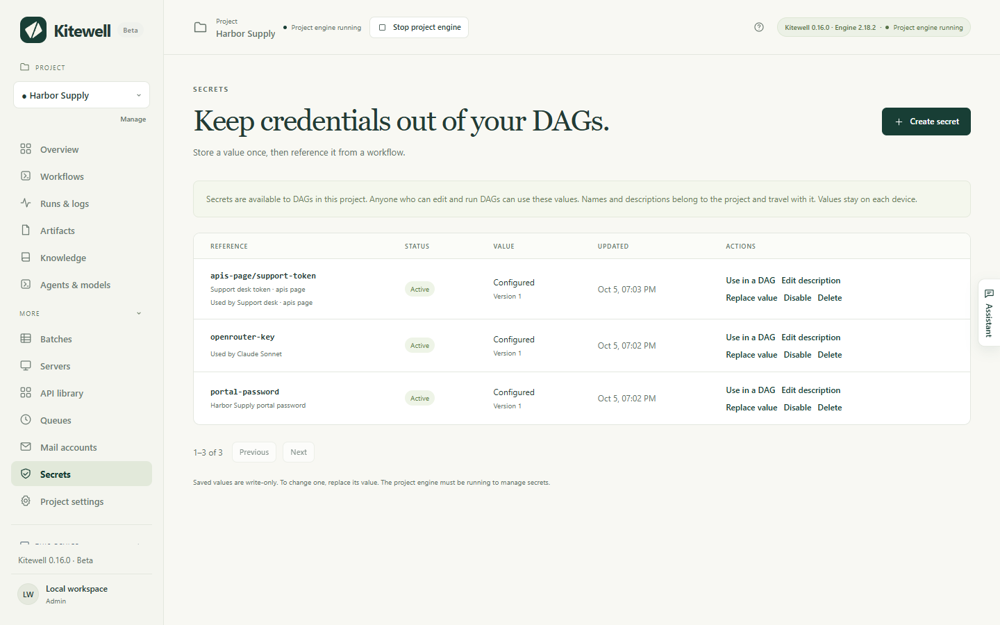

A workflow often needs a password, an API token, or a key. Store it once as a
secret — a credential Kitewell keeps for you — and the workflow reads it by
name. Nobody has to type it again, it never appears in a workflow definition,
and logs show the name instead of the value.

## What you need

- Administrator access on this device. **Secrets** appears under **More** in
  the sidebar; if it does not, ask the person who set Kitewell up.
- The project's engine running. Secrets cannot be stored or changed while the
  project is stopped, and the page says so.

## Store a credential

1. Open **More → Secrets** and choose **Create secret**.
2. Type a **Reference** — the name the workflow will use, such as
   `services/api-token`. Use lowercase letters, digits, and hyphens, in parts
   separated by slashes. The reference cannot be renamed later.
3. Add a **Description** so the next person knows what it opens.
4. Type the credential into **Value**. **Show value** lets you check what you
   pasted. Leave it empty to add the value on this device later.
5. Choose **Create secret**.

The secret appears in the list as **Configured**, with **Version** 1 beside
it. The value itself is never shown again, here or anywhere else.

## Use it in a workflow

In the workflow editor, choose the secret for the field that needs it. Three
settings ask for one by name instead of a value:

- A model's API key, under **Agents & models**.
- A server's or jump host's password, under **Servers**.
- An imported connection's credential, under **API library**.

For a step whose YAML you write yourself, choose **Use in a DAG** on the
secret's row. Kitewell shows the two lines to paste and the name the step
reads the value through.

In a [website step](/docs/browser/) or a desktop step, choose the secret under
**Values the browser types** or **Values the step types**. The instructions,
the model, and the logs carry only the name, written as `%name%`; the browser
types the value.

[The assistant](/docs/ai/#the-assistant) can ask for one as it builds a
workflow. A card appears asking to add a secret by that name; you type the
credential into **Value** and choose **Save**, and the assistant never sees
what you typed.

## When a device has no value yet

A secret's name and description belong to the project. Its value belongs to
the device you typed it on. A project that arrives by import or by
[sync](/docs/cloud-sync/) brings the names and needs the values.

- **Value needed** marks a secret the project uses with no value here. Choose
  **Set value**.
- **Overview** lists every secret this device still needs, with **Set value**
  beside each.
- **Only on this device** marks a secret this device holds that the project
  does not list. Choose **Declare** to add it to the project.
- A line beginning **Used by** names what needs each secret — a model, a
  workflow, a server, or a connection — so you can tell which credential to go
  and find.

Until a value is set, Kitewell refuses the work rather than failing it
halfway. Running a workflow, retrying a run, starting a batch, refreshing a
sheet's rows, and testing one step all stop before they start, with "Set a
value for … on the Secrets page, then run again." A scheduled run is not
refused: it starts and fails.

## Change or remove one

- **Replace value** stores a new credential under the same reference. The
  **Version** number goes up, and nothing that uses the secret has to be
  edited.
- **Edit description** changes the description and nothing else.
- **Disable** stops the secret being read; the value stays. A run that needs
  it fails. **Enable** puts it back.
- **Delete** removes the secret from the project and its value from this
  device. Every device that syncs the project loses the name too, and
  anything using that reference needs another secret.

## If something goes wrong

- **"Set a value for … on the Secrets page, then run again."** This device has
  no value for that secret. Open **Secrets**, choose **Set value**, and run
  again.
- **The page says the engine must be running.** The project is stopped. Start
  it, then try again.
- **A value on more than one line is refused.** Only single-line tokens and
  passwords are supported. A key that spans lines has to reach the step
  another way, such as a file the step reads.
- **"already has a value on this device".** Creating a secret never writes
  over a stored value. Use **Replace value** instead.

## What this protects, and what it does not

Secrets are encrypted on disk by the project's engine, and the key that
deciphers them stays on this device. Steps receive the value only while they
run.

It is not a sandbox. Anyone who can edit and run this project's workflows can
write a step that reads its secrets, and a step runs with the permissions of
the person running Kitewell. Separate projects separate secrets; they do not
limit what a command can do.

Kitewell masks a secret's exact value in logs. A value a step encodes, trims,
or transforms before printing may not be masked. Do not print credentials.

## Exports, sync, and backups

| Where the project goes | Names and descriptions | Values |
| --- | --- | --- |
| A project [export](/docs/sharing/) | Included, references and all | Left out |
| [Dagu Cloud sync](/docs/cloud-sync/) | Synced with the project | Never sent |
| A device [backup](/docs/backups/) | Included | Left out, with their keys |

Everyone who receives the project sees each secret as **Value needed** and
sets their own value. After restoring a backup, enter the credentials again:
the restore lists them by name. Keep a separate, protected record of the
credentials you would need to recover.

If Dagu Cloud does not accept a new secret for the project, the value is still
saved on this device. Others who sync the project do not see the name until it
is declared.

Exports and backups are not encrypted. A credential typed straight into a
workflow, an OpenAPI file, or a source URL stays in the archive as written.
Review an archive before sharing it, and encrypt it yourself before putting it
in shared storage.

## Details

- A reference matches `^[a-z0-9][a-z0-9-]*(/[a-z0-9][a-z0-9-]*)*$` and is at
  most 80 characters. A description is one line of at most 200 characters.
- Values are single-line only, because the engine's log masker works a line at
  a time.
- The store is Dagu's AES-256-GCM secret registry under
  `engines/<project>/data/secrets`, and its key is
  `engines/<project>/data/auth/encryption_key`. Neither is in a backup.
- A value is read through the engine's own command at the moment a step needs
  it, and is written nowhere else.
- The list shows 50 secrets a page, with **Previous** and **Next**.
- Container registry sign-ins are kept as engine-internal values and are not
  listed here. Manage them under **Project settings**.
