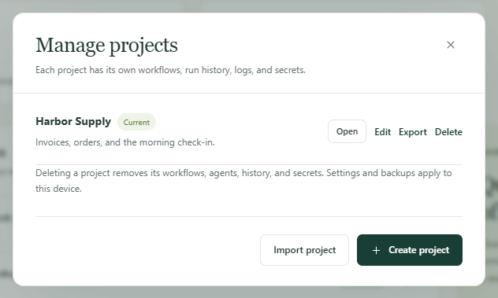

Build a routine once and hand the whole project to a colleague, or to your own
second computer. They get the workflows, the names of the settings those
workflows need, and nothing of yours that should stay put: no passwords, no
run history, no mailbox sign-ins.

To keep every copy the same as the workflows change, [sync the project with
Dagu Cloud](/docs/cloud-sync/) instead. An export is a snapshot, and it stops
being current the moment you edit something.

## Send a project to another computer

1. Open the project selector at the top of the sidebar and choose **Manage**.
2. In **Manage projects**, choose **Export** beside the project. Kitewell
   downloads one file: `kitewell-project-harbor-supply-20261005T091500.tgz`,
   with the project's name and the time in it.
3. Send the file however your team sends files.
4. On the receiving computer, open **Manage projects**, choose
   **Import project**, and pick the file.
5. Kitewell says "This device has to supply the rest" and lists what is
   missing: each secret that needs a value, a mailbox to connect, a machine
   whose host key nobody has approved yet, a custom command, and the
   workflows that arrived paused. Choose **Open** and work down that list.



Importing always makes a new project; it never replaces one you have. If a
project of that name is already there, Kitewell asks for another name.

The new project counts against that computer's limit: one project on the free
plan, up to ten on Kitewell Personal, and up to 15 on Team. A project with
more workflows than the plan holds — 10 on the free plan, 100 on Personal and
Team — cannot be imported at all. The file
itself may be up to 16 MiB.

## What travels, and what does not

The file holds the project as a set of plain documents:

- workflow definitions, with their schedules;
- named agents and models;
- imported OpenAPI documents and their API connection settings;
- server addresses and server groups, queues, and image registries;
- batch sheets;
- the names and descriptions of secrets, but never their values;
- the project's workflow defaults and its
  [knowledge](/docs/knowledge/);
- which release the project last took.

The receiving computer supplies the rest itself:

- secret values and registry passwords;
- SSH private key paths and approved host keys;
- custom agent commands, installed tools, and agent sign-ins;
- mailbox connections;
- external scripts, input files, and data mounted into Docker.

Left out entirely: run history, logs, artifacts, releases, the local edit
history, project alert rules, failure-diagnosis settings, website sign-ins,
device settings, and this computer's API keys.

:::caution
The file is not encrypted. Anything typed straight into a workflow command, an
OpenAPI document, a server address, or another project setting travels as
written. Read those fields before you send the file, and keep credentials in
[secrets](/docs/secrets/) so they stay behind.
:::

## Decide which computer runs the schedules

Imported workflows arrive paused, on purpose. Run one by hand first, check
what it did, then turn on the schedules this computer should keep.

Two computers that both enable the same schedule both run it, independently.
For a routine that must happen once, pick one computer to run it and leave the
other copies paused. That computer has to be on and awake at the time. See
[Schedules and background operation](/docs/scheduling/).

## Let a teammate drive the workflows on one computer

Sometimes the work should stay on one machine and your colleagues just need to
start it, watch it, or change it. Give each of them a key instead of a copy of
the project.

1. On that computer, open **This device → MCP**.
2. Choose **Connect an AI agent** and make one key per person or per client,
   with the **Permission** their role needs: **Read only** to look,
   **Run workflows** to start work, **Edit and run** to change workflows.
3. Limit each key to the projects that person needs, under
   **Allowed projects**.

They then use any MCP client, or plain HTTP requests, against that computer.
The free plan holds one API key or connected app in total; Kitewell Personal
and Team hold any number. Every run still happens as that computer's own user, so a key
limits which projects a person reaches, not what a workflow may do once it
runs. The optional sign-in on the app itself is separate; these keys do not
create logins for it.

A client on another computer needs an address it can reach over HTTPS, which
you set up. See [MCP and API access](/docs/mcp/) for that and for the
permissions in full.

## Keep the definitions in version control

A project's documents are ordinary JSON and YAML files, so a team can review
and version them in its own Git repository. Kitewell does not push, pull, or
merge that repository for you.

The files sit under Kitewell's data folder, which is
`~/Library/Application Support/Kitewell` on a Mac and
`%LOCALAPPDATA%\Kitewell` on Windows.

```text
data/workspace/project-<id>/
  project.json
  workflows/
  batch-sets/
  knowledge/
  agents/  apis/  queues/  registries/  secrets/  server-groups/  servers/
  releases/
```

`project.json` holds the project's name, description, workflow defaults, and
the release it last took. `workflows` holds one YAML file per workflow,
`batch-sets` one file per batch sheet, `knowledge` one per knowledge page,
`releases` one per release, and each remaining folder one JSON file per
agent, API connection, queue, registry, secret name, server group, or server.
Version the whole `project-<id>` folder; find the right one by the name inside
its `project.json`. Keep the file layout and the document IDs as they are.

Quit Kitewell before you replace files or apply changes from the repository,
resolve the conflicts, then open it again and look over the project before
running anything. Quitting interrupts runs in progress, so wait for them to
finish first. Do not manage a [synced project](/docs/cloud-sync/) this way:
Kitewell owns those files and replaces them when a change arrives from Dagu
Cloud.

Share this one folder rather than the whole data folder. Device credentials,
secret values, and run data belong to each computer. Someone new is better
served by **Import project** and a reviewed export.

## Export a robot ledger

Many teams keep a robot ledger: one row per automation, saying what it does,
what it reaches, and who looks after it. On the **Workflows** page,
**Export ledger** downloads one as an Excel workbook, one row per workflow,
with the columns in the order the Center for Financial Industry Information
Systems (FISC) lists a robot's management items.

Kitewell fills in what it can read from each workflow and its
[knowledge](/docs/knowledge/), without asking a model:
**Robot name** and **Robot ID**, **Run cycle** and **Status**,
**Follow-on conditions** for the workflows it starts, **Business description**,
**Input and output data** for the workbooks it opens, **Connected systems**
for the sites, APIs, servers, mailboxes, and models it reaches, and
**Documents**, which carries its knowledge pages in full.

Six columns are left empty for you to fill in: **Manager in charge**,
**Contractor**, **Error handling policy**, **Business importance**,
**Customer impact**, and **Legal and regulatory impact**. The column names
follow the language Kitewell is shown in.
