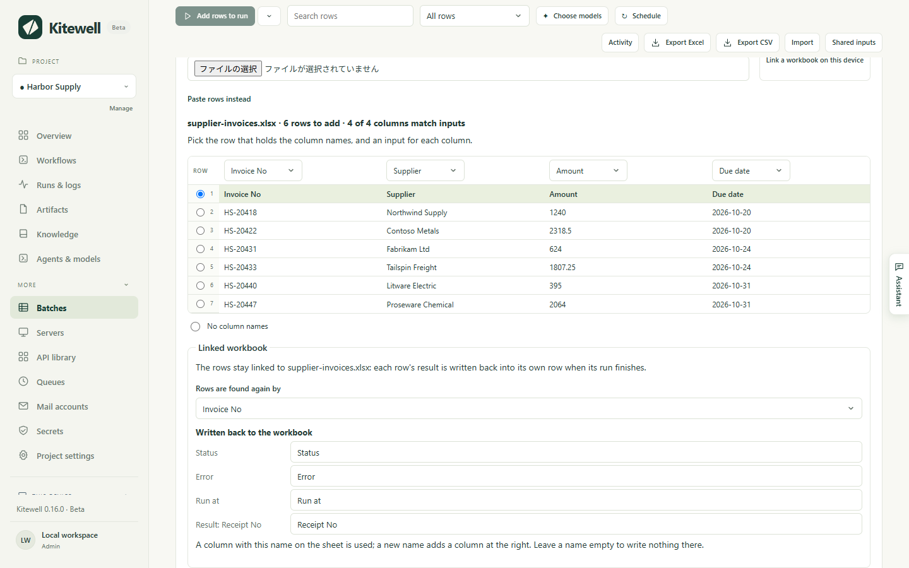

You have a list in Excel — this month's invoices, one to a row — and something
to do with each one. Kitewell runs your workflow once for every row and writes
each result back into the row it came from. Open the same file afterwards and
the receipt numbers are beside the invoices.

Excel never opens. Kitewell reads and writes the `.xlsx` file directly, so it
keeps working overnight on a locked screen.

## Link your workbook

You need the Kitewell app on the computer that holds the file. A browser
cannot reach the file, so it does not offer this.

1. Make a sheet for the workflow that should run once per row, as
   [Run a workflow over a sheet](/docs/batches/) shows.
2. Choose **Import** in the sheet's toolbar, then
   **Link a workbook on this device**, and pick the `.xlsx` file. Dropping the
   file on the Kitewell window does the same.
3. Check what Kitewell found: the **Sheet**, the row that holds the column
   names, and which column fills which input. Columns whose names match an
   input are mapped for you.
4. Under **Rows are found again by**, choose the column that tells rows
   apart, such as the invoice number.
5. Under **Written back to the workbook**, see the columns results go into:
   **Status**, **Error**, **Run at**, and one per result. Rename any, or clear
   a name to write nothing there.
6. Choose **Link and add 6 rows**.

The sheet now shows the workbook's rows, and the toolbar shows **Linked to**
with the file's name.

## Run the rows

Run them as you would any sheet. A cell that cannot become what its input
expects — "twelve" in an amount column — is outlined, and that row waits until
you fix it.

When rows finish, Kitewell writes their results into the workbook on its own
within about half a minute. **Write results now** does not wait.

| Column | What goes in |
| --- | --- |
| Status | Done, Partly failed, Failed, Stopped, or Rejected |
| Error | Why the row failed, in one line |
| Run at | When the row ran |
| One per result | A value the run produced, such as a receipt number |

A workbook with Japanese headers gets Japanese words: 状態, エラー, 実行日時,
and 済 for Done.

## If the file is open in Excel

Nothing fails. The sheet says the results are ready and will be written when
the file is closed in Excel, and writes them the moment you close it.
**Save results to a copy now** writes `supplier-invoices (results).xlsx`
beside the file instead.

## Every morning

Give the sheet a [schedule](/docs/scheduling/). It asks two more things:
**Read supplier-invoices.xlsx first**, and **Which rows run** — **Every row**,
or **Only the rows the workbook added or changed**.

With the second, each morning reads the file, runs what is new, writes the
results back, and starts nothing when nothing changed. Schedule it on the
computer that holds the file; another computer cannot run it.

## If something goes wrong

- **Somebody sorted or filtered the sheet.** Kitewell reads the file again
  before every write and follows each row by its key. A row that moved is left
  out and named; the rest are written.
- **A result went in and should not have.** **Undo** puts the file back.
  Kitewell keeps a copy from before each of the last ten writes.
- **The workbook changed on disk.** The sheet offers
  **Read the workbook again**, which brings new and changed rows in and marks
  rows the workbook no longer has as **No longer listed**.
- **A step fails.** See
  [Troubleshooting](/docs/troubleshooting/#a-spreadsheet-step-fails).

## More about Excel

[Excel reference](/docs/reference/spreadsheets/) covers the rest: reading a
quote or order laid out as a form, the ten spreadsheet steps a workflow can
use, building the same job as steps instead of a sheet, what stays on your
computer, and limits.
