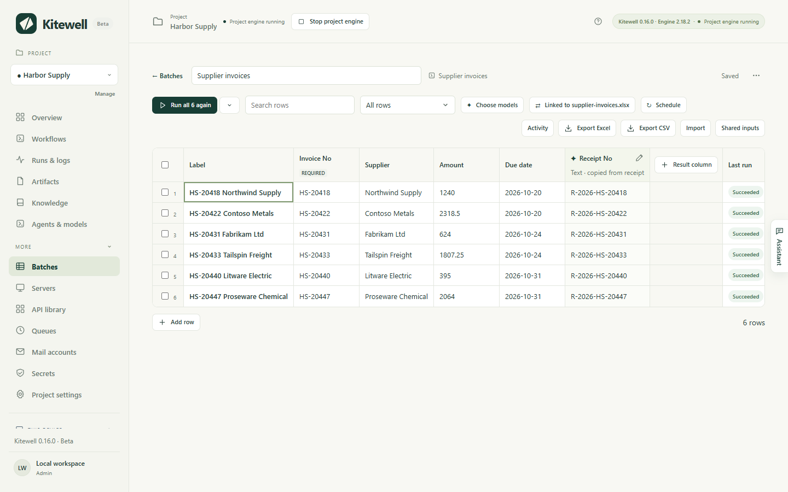

You have a list in Excel — this month's invoices, say, one to a row — and
something that has to be done with each one: registered on a supplier's
portal, entered in an accounting system, looked up and priced. Kitewell reads
the rows out of your workbook, runs your workflow once for each row, and
writes each result back into the row it came from. At the end you open the
same file and the receipt numbers are beside the invoices.

Nothing appears on screen while it works. Kitewell opens the `.xlsx` file
directly, so Excel never starts, a locked screen at night stops nothing, and
no spreadsheet process is left hanging.

It reads the workbooks your office already has. A title row above the table, a
header merged across two rows, subtotals in the middle, notes underneath,
full-width digits, Japanese era dates, postal codes with leading zeros:
Kitewell works out where the table is and what each column holds. Nobody
reshapes a file for the robot.

Spreadsheet steps are in every plan.

## Two ways to use a workbook

As the rows of a sheet: link the workbook to a sheet, and each row becomes one
run whose result goes back into that row. Use this when the workbook *is* the
job, a list of work to get through. This is the rest of this page.

As steps inside a workflow: add a task from the **Spreadsheets** group of the
task picker and give it the file's path, and it reads or writes at that point
in the run. Use this when a workbook is one part of a larger job — a file that
arrives by email, a monthly invoice filled from a template. See
[Spreadsheet steps](#spreadsheet-steps) below.

## Link a workbook to a sheet

You need the Kitewell app on the computer that holds the file. Linking reads
and writes a file on that device, so it is not offered in a browser.

1. Make a sheet for the workflow that should run once per row, as
   [Run a workflow over a sheet](/docs/batches/) describes.
2. Choose **Import** in the sheet's toolbar to open **Import rows**, then
   **Link a workbook on this device** and choose the `.xlsx` or `.xlsm` file.
   Dropping the file on the Kitewell window does the same.
3. Choose the **Sheet** inside the workbook, then the row that holds the
   column names. Each row of the preview offers
   **Use row 3 as column names**, and **No column names** is there for a bare
   list. Rows above the names, blank rows and total rows are left out, each
   counted; a tickbox offers to include the total rows after all, and another
   to leave out rows that are hidden in Excel.
4. Map each column to one of the workflow's inputs. Columns whose names match
   an input are mapped for you.
5. Under **Rows are found again by**, choose the column that tells rows apart
   — an invoice number, an order number. Only columns whose values never
   repeat and are never blank can be chosen; the rest are shown greyed as
   "values repeat or are missing". **Row position** is the fallback, and then
   you must not sort or insert rows while results are pending.
6. Under **Written back to the workbook**, check the columns Kitewell will
   add: **Status**, **Error**, **Run at**, and one **Result: Receipt No** per
   result column. Each name can be changed, and clearing a name writes nothing
   there.
7. Choose **Link and add 6 rows**.



The sheet now shows the workbook's rows with the workflow's input columns, and
the toolbar carries **Linked to** and the file's name. Run the rows as you
would any sheet. A cell that cannot become what its input expects — "twelve"
in an amount column — is kept, outlined, and that row waits until you fix it.

Nothing is written into your workbook until rows have finished.

## What goes back into your file

When rows finish, Kitewell writes their results into the workbook on its own,
within about half a minute. **Write results now** does not wait. A column of
that name on the sheet is used; a new name adds a column at the right.

| Column | Holds |
| --- | --- |
| Status | Done, Partly failed, Failed, Stopped, or Rejected |
| Error | Why the row failed, in one line |
| Run at | When the row ran, as `2026-10-01 09:30` |
| One per result column | A value the run produced, such as a receipt number |

The words follow the language of the workbook's own headers: a sheet whose
headers are in Japanese gets 状態, エラー, 実行日時 and 済 / 一部失敗 / 失敗
/ 中止 / 却下. No run ID, no internal key column and no cell comments are
added.

Three things that go wrong in an office, and what Kitewell does:

- The file is open in Excel. Nothing fails. The sheet says "Results are
  ready. They are written when supplier-invoices.xlsx is closed in Excel", and
  the write
  happens by itself once you close it. **Save results to a copy now** writes
  `supplier-invoices (results).xlsx` beside it instead — `受注一覧 (結果).xlsx` for a
  Japanese file name. If Excel was closed without saving and left its lock
  file behind, **It isn't open** clears it.
- Somebody sorted or filtered the sheet. Before every write Kitewell reads
  the file again and checks that each row's key is still where it was. A row
  that moved is left out and named; every other row is written. With a key
  column, sorting and filtering between runs are safe.
- A result went in and should not have. **Undo** puts the file back:
  Kitewell copies the workbook before every write and keeps the last ten
  copies. If you have edited the workbook since, Undo refuses rather than
  discard your edits, and leaves the current file beside itself as
  `supplier-invoices (before undo).xlsx`.

**Unlink** ends the connection. The rows stay in the sheet; results stop going
back to the workbook.

## Read the workbook again

When the file changes on disk, the sheet says "The workbook changed since its
rows were read" and offers **Read the workbook again**. It reports what it
found — "Read supplier-invoices.xlsx: 1 new · 1 updated · 1 no longer in the
sheet" — and
then a new row joins the sheet, a changed cell updates its row, a row that
moved is followed, and a row the workbook no longer holds is kept but marked
**No longer listed** rather than deleted.

If the header row has lost the column rows are found by, or a column an input
takes, the read stops and names what is gone. Relink the workbook to pick the
columns again.

## Every morning

A linked sheet can run on a [schedule](/docs/scheduling/), which asks two more
things: **Read supplier-invoices.xlsx first**, and **Which rows run** — **Every row**, or
**Only the rows the workbook added or changed**. With the second, each due
time reads the file, runs only what changed, writes the results back, and
starts no run at all when nothing changed.

This is the job people buy RPA for: a shared order list worked every morning,
with no robot PC and nobody watching. A linked sheet runs on the computer that
holds the file, so schedule it there. Scheduling it anywhere else is refused,
and a due time on the wrong device is skipped with a note saying which device
has the file.

<a id="spreadsheet-steps"></a>

## Spreadsheet steps

Inside a workflow, the **Spreadsheets** group of the task picker offers ten
tasks:

| Task | Does |
| --- | --- |
| Read a spreadsheet | Rows from a sheet, only the rows you want, each column read as text, number, or date |
| Check a spreadsheet | Stop before anything else happens when cells are wrong |
| Write results back | Status and values into the rows they came from |
| Write a spreadsheet | A new workbook or sheet, replaced or appended |
| Add rows to a spreadsheet | Rows under the last row, matched to the header |
| Fill a template | Cells or named cells of a template, saved as a copy |
| Convert a spreadsheet | A sheet to CSV (UTF-8 or Shift_JIS), JSON, or JSON Lines |
| Add, copy, rename, or delete a sheet | Start a month from a template sheet, safely rerun |
| Describe a workbook | Sheets, headers, and types for later steps |
| Read a form | Fields from a quote or an order laid out as a form, whatever its layout |

Choosing the **Workbook** in a step shows its sheets as tabs and the first 20
rows converted as the step will read them, with the detected table and header
row named.

**Check** asks the engine whether the step would fail on this computer — a
missing workbook, sheet, or column — before you run anything, and every cell
address in its answer is a button that shows you that cell. **Test** shows the
rows as a table. A step that writes only reports what it would change during a
test, unless you tick **Save the file during tests**. Convert a spreadsheet is
the exception: a test of it really writes its output file.

## Forms, not tables

A quote or an order laid out as a form — labels and values scattered over the
sheet rather than rows under a header — is read by **Read a form**. Under
**What this form is, and what to find**, say what the form is. Under
**Fields to find**, name each field, its type, and what its label looks like
on the sheet, in the sheet's own language.

A model answers with the cell each field is in, and the engine then reads the
values from those cells itself, so no value is invented. Turning off
**Send the cells' values to the model** leaves the model seeing only what
kind of thing is in each cell, which keeps amounts and dates on this computer.

**Remember this layout, so the same form is read without the model** is on by
default, so the same template costs no further model calls.
**Forget remembered cells** makes the next run ask again — use it when a form's layout
changed, or when a field was read from the wrong cell.

## Privacy

- The workbook is read on this computer, by Kitewell. The file is never
  uploaded, and its path never leaves the device.
- **Set up from this file** asks the assistant to build the workflow from the
  open workbook. It sends the column names, the type seen in each, and the
  first 10 rows, with each cell cut to one line. **Send only column names**
  sends the names alone. When the assistant then sets a sheet up, Kitewell
  reads the rows itself; they do not pass through the model.
- A workbook with a password is opened only on this computer. The password is
  kept as a [secret](/docs/secrets/) reference under
  **Password, as a secret reference**, never written into the workflow and
  never logged. A protected
  workbook cannot be previewed, and cannot be imported at all until the
  password is removed in Excel.
- The link that [syncs with Dagu Cloud](/docs/cloud-sync/) carries the file's
  name, the sheet, which device holds it, and the column mapping — never the
  path. The sheet's rows travel with it, and those rows hold the cell values
  that were read from the workbook, so treat a synced sheet as carrying that
  much of the file.
- The file's path, which Excel row each sheet row came from, the results read
  from runs, and the copies kept for Undo stay on the device that ran the
  sheet. A [workspace backup](/docs/backups/) is the exception: it is an
  archive of the whole workspace and does include those copies.

See [What leaves this computer](/docs/data-flow/) for the whole picture.

## Limits

- `.xlsx` and `.xlsm`. An `.xls` or `.ods` file has to be saved as `.xlsx` in
  Excel first.
- One read holds 5,000 rows and about 900 KB. Over either, the step says what
  it kept and asks for a narrower range, fewer columns, or a row filter.
- A sheet holds 5,000 rows and 30 result columns, and a loop runs 1,000 items.
  An imported file is at most 16 MiB.
- A linked workbook's hidden rows are read along with the rest. Only an
  imported file offers to leave them out.
- Charts, pivot tables, conditional formatting and validation rules that are
  already in a file are kept, but none are created, and a pivot table is not
  refreshed. On Windows a macro step can refresh one.
- Google Sheets is not supported yet.

A step that drives a website or a desktop app still needs that application, so
only the spreadsheet steps are free of the screen.

If a spreadsheet step fails, see
[Troubleshooting](/docs/troubleshooting/#a-spreadsheet-step-fails).

## Details

The same work written as a workflow. The write-back sits inside the loop and
addresses one row by its row number, so a row that failed keeps its empty
status and the next run picks it up again:

```yaml
type: graph
steps:
  - id: orders
    name: Read the invoices not done yet
    action: xlsx.read
    with:
      path: ~/Documents/supplier-invoices.xlsx
      sheet: Invoices
      columns:
        - {Invoice No: invoice}
        - {Amount: amount}
        - Status
      types: {Amount: number}
      where: {Status: ""}
  - id: each
    name: For each invoice
    depends: [orders]
    foreach:
      items: ${steps.orders.outputs.rows}
      as: row
      key: ${foreach.row.invoice}
      max_concurrent: 1
      steps:
        - id: register
          name: Register it on the portal
          run: echo "${foreach.row.invoice}"
          output:
            ticket: {from: stdout}
        - id: mark
          name: Write the receipt number back
          depends: [register]
          action: xlsx.update_rows
          with:
            path: ~/Documents/supplier-invoices.xlsx
            sheet: Invoices
            key: _row
            rows: '[{"_row": ${foreach.row._row}, "ticket": "${steps.register.outputs.ticket}"}]'
            set:
              Status: {value: Done}
              Receipt No: ticket
            wait_for_unlock: 5m
```

A column a later step refers to needs a plain ASCII name without spaces, which
is what the `{Invoice No: invoice}` items in `columns` give it. The editor
offers one, and the review asks for it when a loop refers to a header that
cannot be written in a reference. On a sheet, each row keeps the workbook's
own header as its title.

Every writer takes `dry_run: true`, which reports changes without saving;
`wait_for_unlock`, a duration such as `5m` to keep retrying while Excel has
the file open; and `atomic`, on by default, which saves through a temporary
file.

A portal with no API takes a [website step](/docs/browser/) in place of the
command above, and an application with neither takes a
[desktop step](/docs/desktop/). The spreadsheet steps around them stay off the
screen either way.
