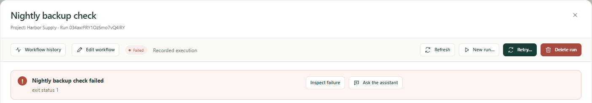
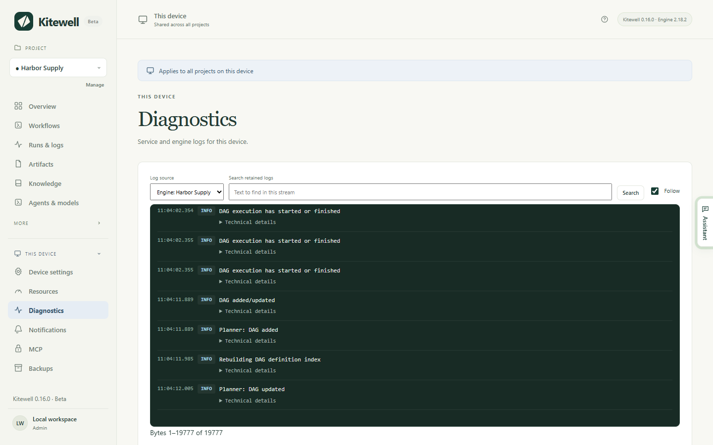

Find the thing that went wrong, and what to do about it. If none of these fit,
[open a support issue](/support/) with your versions, what you did, and the
output with any passwords removed.

## A run failed

Open the run from **Runs & logs**. A summary at the top names the step that
failed and what it said.

- **Inspect failure** shows that step and its log.
- **Ask the assistant** looks into it for you.
- **Fix in editor** opens the workflow at the failed step, so you can correct
  it and continue the run from a step you choose. It is offered on a run
  opened from the workflow's own history: in **Workflows**, choose
  **View run history** beside the workflow.

With [failure diagnosis](/docs/ai/#failure-diagnosis) turned on, the run also
says whether to try again, what needs you, or what to change. See
[Runs and logs](/docs/runs/#fix-a-failed-run).

## A command works in a Terminal but fails in Kitewell

Kitewell's environment is not the one your terminal gives you. Give the
program its full path, set a working folder on the step, and set the variables
it needs rather than relying on ones your shell set for you. Check too whether
the command waits for someone to type an answer, or uses a credential that
only exists inside your terminal session.

## A scheduled workflow did not run

Check, in this order:

1. The workflow's **Schedule** is saved with **Enable saved schedules**
   ticked.
2. Its timezone is the one you meant.
3. The project's engine is running. **Overview** says so, and offers to start
   it.
4. The computer was awake and you were signed in at that time.

**Overview** also names the other things that stop scheduled work: a workflow
the engine will not accept, which leaves every other workflow running;
workflows that arrived from a teammate paused; and secrets that still need a
value on this device.

A start the computer slept through is only made up later if the workflow asks
for it. See its **Schedule → Missed schedules**.

## A website step fails

Look at the step's screenshots in the run's artifacts first. A sign-in page, a
cookie banner, or a bot check usually explains it. Then check that:

- Chrome is installed, or Microsoft Edge on Windows, and **Check the browser**
  succeeds;
- the page's hosts are in **Allowed websites · one per line (optional)**, if
  you filled it in;
- the waits are long enough for the page;
- no instruction contains a password; put it in **Values the browser types**;
- the step or the workflow has a model chosen.

If the site changed and a replayed action no longer works, clear it under
**Project settings → Storage → Replay cache**. See
[Automate a website](/docs/browser/).

## A spreadsheet step fails

Most refusals name the workbook, the sheet, and the cell. **Check** in the
step asks the engine before anything runs. Common causes:

- the path is not the full path to an `.xlsx` or `.xlsm` file on this
  computer. An `.xls` or `.ods` file has to be saved as `.xlsx` in Excel
  first;
- the sheet or a column the step names is no longer in the workbook. The
  message lists what is there instead;
- a cell will not convert to the type a column is pinned to, such as a
  quantity written out in words;
- the file is open in Excel, which holds up a write until it closes;
- a merged cell covers where the step would write. The message names the range
  to unmerge.

A write into a linked workbook can be undone from the sheet, as long as the
file has not changed since Kitewell wrote it. See
[Automate Excel](/docs/spreadsheets/).

## A desktop step fails

Look at the step's screenshots in the run's artifacts first. Then check that:

- **Device settings → Desktop automation → Check desktop access** reports
  every permission as allowed. On a Mac, **Kitewell Agent** is what needs
  Screen Recording and Accessibility;
- the screen is unlocked and the computer is awake. A locked screen fails
  every desktop step;
- on Windows, the app is not running as administrator while Kitewell is not;
- the task fits within **Most actions per task**, or is split into smaller
  tasks;
- the model has a computer-use tool, or the step uses **Plain tools, for any
  vision model**;
- no instruction contains a password; put it in **Values the step types**.

A step that waited for the desktop to be free was paused by your own mouse or
keyboard. On a computer nobody works at, shorten or turn off that wait under
**Desktop settings**. If an app changed and a replayed task no longer works,
clear it under **Project settings → Storage → Replay cache**. See
[Automate a desktop app](/docs/desktop/).

## Google says "This app is blocked"

Until Google finishes reviewing Kitewell's access to Gmail, it blocks
Kitewell's browser sign-in for most accounts, and the page offers no way past
it. Close it, return to Kitewell, and choose **Use an app password instead**.
See [Automate email](/docs/email/).

## A mailbox needs reconnecting

A run that names a mailbox this computer cannot sign in to is refused, and
**Overview** says which address to connect or reconnect. Open
**Mail accounts** and choose **Reconnect**. Common causes:

- the account's password changed, or an administrator ended its sessions;
- a Google sign-in went unused for six months, or a Microsoft sign-in was last
  refreshed more than 90 days ago because the computer was off;
- an app password was deleted on the provider's site;
- a Microsoft 365 administrator turned off IMAP or authenticated SMTP, or
  requires their approval for Kitewell. The error carries the link to send
  them;
- a Google Workspace administrator blocks third-party apps.

A project that arrived from a teammate or from Dagu Cloud lists its mailboxes
as not connected until you connect them here. See
[Automate email](/docs/email/).

## An AI task fails

Check that the agent is installed and signed in, or that the model you chose
has a working provider credential. **Test agent** and **Test model** in
**Agents & models** check both before a run. Then look at the recorded prompt,
the task's error output, and whether the provider has cut you off for limits
or billing. Leave real credentials out of anything you report.

## Docker is unavailable

Start Docker on this computer, then use **Check Docker** in the workflow
editor. Kitewell neither installs nor starts Docker. Check too that the
folders and files a container mounts exist on the machine that runs it.

## A run is missing from history

Runs older than the project's run history retention are removed
automatically, and anyone who can edit may delete a run. See
[Runs and logs](/docs/runs/#delete-runs).

## ChatGPT and Claude

### The app says Kitewell is not reachable

The computer is asleep, off, or not running Kitewell. Right after it goes to
sleep, ChatGPT or Claude can take up to about 45 seconds to notice. Open
Kitewell on that computer, check that **This device → MCP** shows **Online**,
and try again.

### A call is refused because the connection may not do that

The refusal says what the connection's permission allows, such as "This
connection is read-only" or "This connection can run workflows but not edit
them", and where to change it. Open **This device → MCP → Connected apps**.
The change applies to the app's next call.

### The consent page says the computer is offline, or has no room

- "Open Kitewell on that computer to continue": the computer is asleep,
  off, or not running Kitewell. Open Kitewell, wait for **This device → MCP**
  to show **Online**, then choose **Try again**.
- No room: the free plan holds one API key or connected app together, and
  this computer already has one. Revoke it under **This device → MCP**, or
  subscribe to Kitewell Personal or Team, then connect again.

### The app connects, but only reads

ChatGPT can use only read-only tools on some plans, whatever permission you
allowed. See [ChatGPT](/docs/mcp/#chatgpt).

### Adding the connection fails outright

Remove Kitewell from ChatGPT or Claude and add it again. See
[Connect ChatGPT or Claude](/docs/mcp/#connect-chatgpt-or-claude).

## Windows shows a SmartScreen notice

Windows warns about an installer from a publisher it has not seen often.
Check that the downloaded file's SHA256 matches the one on the
[download page](/download/), then choose **More info** and **Run anyway**. If
Windows says the installer's signature is *invalid*, stop and
[report it](/support/) instead.

## Kitewell was installed but did not start

On Windows, the installer opens Kitewell at the end. If Kitewell exits
immediately — no window, nothing on screen — the installer says so in a
message box, and writes the same line to
`%LOCALAPPDATA%\Kitewell\logs\shell.log`.

Windows application control is the usual reason. Smart App Control, which a
clean Windows 11 installation turns on, refuses to load an unsigned build of
Kitewell, and the app is stopped before any of its own code runs. Two places
confirm it:

- **Settings → Privacy & security → Windows Security → App & browser control
  → Smart App Control** says whether it is on.
- **Event Viewer → Windows Logs → Application** holds a .NET Runtime 1026
  `FileLoadException` for `Kitewell.dll`.

Install a signed release from the [download page](/download/). A build you
compiled yourself is not signed, and will not run on such a PC.

## Kitewell asks to install WebView2

Kitewell's window is built on the Microsoft Edge WebView2 runtime. The Windows
installer sets it up when it is missing. If Kitewell opens without it anyway,
choose **Install WebView2** in the window. It downloads the runtime from
Microsoft and takes about a minute.

## Kitewell cannot start its background service

The window stays on the starting screen and then shows what the service said,
with **Try again** and **Open data folder**. Two reasons have a fix you can
apply yourself.

### Something else is using Kitewell's port

The message ends with `bind: address already in use` for `127.0.0.1:19741`.
Another copy of Kitewell is usually the culprit — a second installation, or a
development build running beside the installed app. Quit it, then choose
**Try again**.

The same message can say the port is reserved or blocked on this device, by
Hyper-V, WSL, or a firewall policy. Whoever administers the PC has to free
that port.

### The data folder path is too long

On Windows, the service refuses to run when its data folder path is longer
than 79 characters, and says so with the length it found. Kitewell starts
programs inside run folders beneath that one, and Windows will not start a
program in a folder whose path is too long. Every run of every workflow would
fail, saying only that a directory name is invalid.

The usual cause is a redirected `%LOCALAPPDATA%`, pointing somewhere deeper or
onto a network drive. The default, `%LOCALAPPDATA%\Kitewell\data`, is around
42 characters. Ask whoever administers the PC to leave `%LOCALAPPDATA%` on the
local disk.

## Kitewell MCP is not listening

**This device → MCP** shows a warning when its listener could not start. The
most common reason is that another program holds port 19742, which is the same
on every device — often a second copy of Kitewell, such as a development build
beside the installed app. Quit that program and restart Kitewell, or give
Kitewell a different **Listen address**.

## An update check fails

Check your network and the [release status](/releases/). Until the first
public release for your system, there is no update feed to read, and a check
that cannot reach one is a failed check rather than proof that you are up to
date. Report a checksum or installer verification failure instead of working
around it.

## Find logs

For a step that failed, start in **Runs & logs**.

For everything else, open **This device → Diagnostics**. **Log source** picks
between the service's own output, its errors, and each project's engine. You
can search what is kept and download it.

## Details

- Each log file rotates at 10 MiB and keeps three older copies.
- Log files sit in `~/Library/Application Support/Kitewell/logs` on a Mac and
  `%LOCALAPPDATA%\Kitewell\logs` on Windows. On Windows, `shell.log` beside
  them records what the app itself did: starts, restarts, and quits.
- Kitewell's own interface listens on `127.0.0.1:19741`. Kitewell MCP listens
  on `127.0.0.1:19742` by default. Each project's workflow engine takes a
  loopback port of its own, chosen when it starts.
