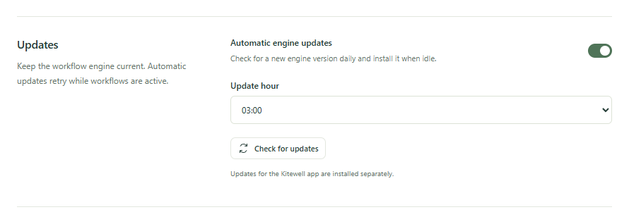

Two things update, on their own schedules. The Kitewell app tells you when
there is a new version and installs it when you say so. The workflow engine
underneath it updates by itself, at night, when nothing is running.

## Update the Kitewell app

Kitewell looks for a new version once a day on its own. It never interrupts
you: when one is out, you get one notification, and the Kitewell menu reads
**Update to Kitewell x.y.z…** instead of **Check for Updates…**. Nothing is
installed until you choose it.

1. Click the notification, or open the Kitewell menu: on a Mac, the Kitewell
   menu in the menu bar at the top of the screen, or the application menu; on
   Windows, right-click the Kitewell icon in the tray.
2. Choose **Update to Kitewell x.y.z…**, or **Check for Updates…** to look
   right now. If you already have the newest version, Kitewell says so and
   stops there.
3. When there is a new version, Kitewell names it and asks. Choose **Download
   and Install**, or **Later** to keep working; the menu keeps offering it.

Kitewell downloads the installer for your system and checks its SHA256
fingerprint before anything runs. Then:

- On a Mac, the macOS installer opens. Follow it.
- On Windows, the installer runs on its own. Kitewell asks about unsaved
  changes, closes, and the installer replaces the app and opens the new
  version.

Save your edits and let running workflows finish first. Installing restarts
Kitewell and its background service. Runs already in progress carry on, and
the engine that comes back finds them, but unsaved drafts in the editor are
lost.

## Update the workflow engine

Kitewell keeps a workflow engine of its own, called Dagu, and looks after it
for you. Open **This device → Device settings** and find **Updates**.

- **Automatic engine updates** is on from the start. Kitewell checks once a
  day and installs a new engine when nothing is running.
- **Update hour** is when it tries. It starts at 03:00, in this device's own
  time.
- **Check for updates** looks now. **Install update** appears when there is
  one, and installs it.

An update waits until no project has a workflow running, queued, or waiting.
If something is busy, Kitewell tries again every 15 minutes. Before it
switches engines it keeps a copy of their data, and puts the copy back if the
new engine does not start. Updating the engine does not change the Kitewell
app, and updating the app does not change the engine.

## If something goes wrong

- The check fails. Check your network and the
  [release status](/releases/). Until the first public release for your
  system, there is no update feed to read, and a check that cannot reach one
  says so rather than claiming you are up to date.
- The fingerprint does not match, or the installer will not verify. Stop, and
  [report it](/support/). Do not work around it.
- You need to go back a version. Older installers stay on the
  [GitHub releases page](https://github.com/dagucloud/kitewell/releases).
  Installing an older app does not bring back older data; restore a
  [backup](/docs/backups/) for that.

When you report a problem, include the Kitewell version, the engine version,
and your operating system version. The sidebar shows the Kitewell version at
the bottom left. The pill in the top bar shows the Kitewell version and the
engine version together. On a Mac, **About Kitewell** in the application menu
shows the Kitewell version; on Windows, the top of the tray menu shows the app
and service versions.

## Details

- Public builds read their update feed from
  `https://kitewell.app/updates/macos/latest.json` on a Mac and
  `https://kitewell.app/updates/windows/latest.json` on Windows.
- Checking and downloading leave workflows running. Only installing restarts
  anything.
- The daily look happens a minute after Kitewell opens and then every 24
  hours while it runs. If it cannot reach the feed, it tries again an hour
  later and says nothing; only **Check for Updates…** reports a failure.
- The notification comes once per version, and only where Kitewell's
  notifications are allowed. The menu names the new version either way.
- On Windows, stopping the service for an update does not reach the runs under
  it: each run has a process group of its own, outside the one that ends with
  the service. Only **Quit Kitewell** cancels runs.
- The engine Kitewell installs is the latest stable Dagu release, verified by
  its SHA256 fingerprint before it is used.
