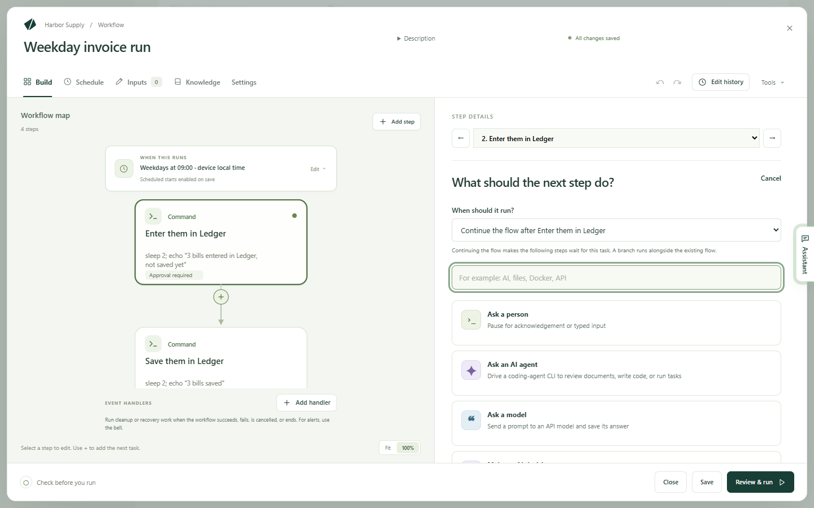
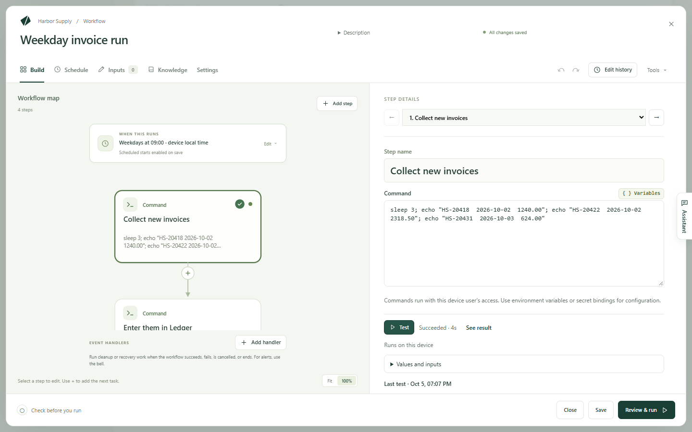
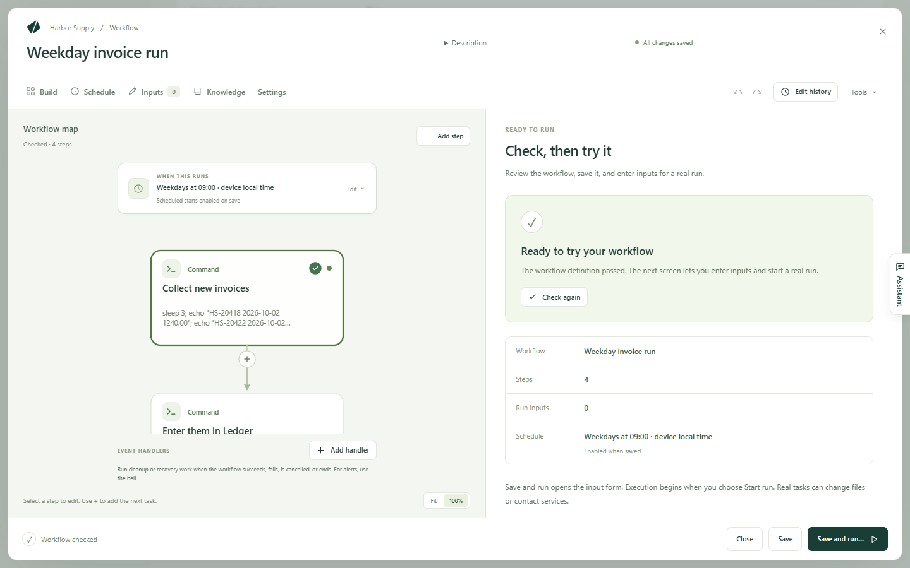
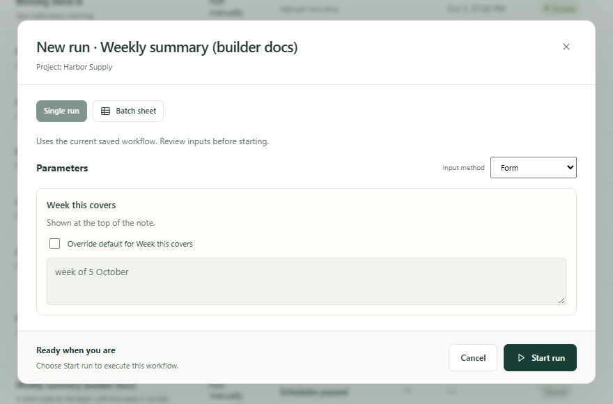

A workflow is a job you do by hand, written down once so Kitewell can do it
for you: collect the invoices, enter them, email a summary. You build it one
piece at a time, try each piece on its own, then run the whole thing and watch
it work.

Each piece is a step. A step does one thing — run a command, fill in a
website, read a mailbox, ask a person — and the next step waits for it. The
editor draws the steps as a map, so you can see the order at a glance.

## What you need

A project to keep the workflow in, which you have already if **Workflows** is
in the sidebar. Beyond that it depends on the steps you choose:

- A command, a website step, or a wait needs nothing else.
- An AI step needs a model or an agent set up under **Agents & models**.
- An email step needs a mailbox connected under **More → Mail accounts**.
- A password or key a step needs is stored first under **More → Secrets** — a
  secret, so the value never shows in a log.

A step that cannot find what it needs says so before you run, so you can start
building without setting all of this up first.

## Build it, one step at a time

1. Choose **Create a workflow** and give it a name. The editor opens on
   **Build** with nothing in it and asks **What would you like to automate?**
2. Choose a task. The steps you add appear on the left under **Workflow map**;
   the one you are working on opens on the right under **Step details**. That
   screen calls them *tasks*; once one is on the map, it is a step.
3. Type a name in **Step name** — plain words, such as `Collect new invoices`.
   This is the name you will look for in a log later.
4. Fill in what the task needs. A command step has one field, **Command**; a
   website step takes the address and what to do there.
5. Choose **Add step**, or the + below a step on the map, for the next one.
   **When should it run?** decides where it goes:
   - **Continue the flow after** this step, so the steps that came after now
     wait for the new one;
   - **Add a branch after** this step, for another path alongside the first;
   - **Start independently**, for work that waits for nothing.
6. Carry on until the job is written down. **Duplicate**, **Move up**,
   **Move down** and **Remove step** tidy the order afterwards.

Two shortcuts save typing on an empty workflow: describe the job under
**Describe what this workflow should do** and choose **Ask the assistant**, or
pick a card under **Or start from an example**. **Tools → Browse examples**
opens the examples again later.

## The tasks you can choose

**Find a task** searches the list, so you can type `email` or `Excel` instead
of hunting. These are the ones most people start with:

- **Run a command or script**: run something on this computer.
- **Automate a website**: open a site and click, type, read, or download,
  described in plain language. See [Automate a website](/docs/browser/).
- **Automate a desktop app**: use an app on this computer the way a person
  does. See [Automate a desktop app](/docs/desktop/).
- **Send email**, **Find emails**, **Organize emails**: write, read, and tidy
  a connected mailbox. See [Automate email](/docs/email/).
- **Ask a model**: send a question to a model and keep its answer.
- **Ask an AI agent**: hand work to a coding agent installed on this computer.
- **Make an AI decision**: sort something, score it, or answer yes or no, in a
  form the next step can read.
- **Ask a person**: stop and wait for someone to confirm or type something in.
- **Wait**: pause for a length of time, until a moment, or until a file is
  there.
- **Repeat until**: check something every so often until it is ready, up to a
  number of attempts.
- **For each item**: run steps once for every item in a list, and collect the
  results.
- **Branch by value**: send the work down one path or another.
- **Fill in a text template**: build a message or a file from a template and
  some values.
- **Run another workflow**: reuse a workflow you have already as one step.

The more technical tasks are in the same list, further down:
**Run in Docker**, **Call a web service**, **Use an API action**,
**Run on another machine**, and **Copy files to or from a machine**. Excel
tasks are grouped under the **Spreadsheets** heading at the end — see
[Automate Excel](/docs/spreadsheets/).

## Test one step before you run everything

You do not have to run the whole workflow to find out whether one step works.

1. Select the step in the map.
2. Choose **Test** — ⌘↩ on a Mac, Ctrl+Enter on Windows.
3. Watch the bar beside **Test**: it says what the step is doing, then how
   it ended. Choose **See result** to read what came back — **Output** holds
   what the step printed, **Errors (stderr)** anything it complained about.

The test runs that step and nothing else, with your unsaved changes, and it
does not save the workflow. Earlier steps do not run: their values come from
their own latest test that passed, or you type them in. **Values and inputs**
lists what the step reads and marks anything still missing.

A test is real work. Kitewell says what it will do before it starts — "Sends a
real email from me@example.com", "Runs on this device" — so read that line
first, and choose **Test anyway** only when you mean it.

Four kinds of step cannot be tested alone yet, and say so instead of running:
**Ask a person**, steps inside a **For each item** loop, event handlers, and
steps aimed at a group of servers.

## What can change each time

When the job needs a date, a folder, or a title that differs from run to run,
put it in **Inputs** rather than in the step. Each input becomes a field on
the form you fill in when you start a run.

To use one, type `${` in a step's field and choose the input from the list.
The same list offers secrets and results saved by earlier steps, and Kitewell
makes the step that uses a result wait for the step that produces it.

## Check it, then run it

**Save** keeps your work. Use it whenever you want to stop for now; the
workflow's schedule starts applying as soon as you save.

**Review & run** is the last look before real work happens. It gathers the
name, how many **Steps** and **Run inputs** the workflow has, and its
**Schedule**, and lists anything worth fixing first under **Before you run**.
**Check workflow** checks the draft for mistakes.

Then:

1. Choose **Save and run…**. The workflow is saved and the run form opens.
2. Fill in the fields under **Parameters**, if this workflow has any. A field
   that already has a value is locked until you tick the box offering to
   override its default.
3. Choose **Start run**.

The run opens as it goes, step by step. A run uses the workflow as it was when
it started, so editing afterwards does not change a run already going. See
[Runs and logs](/docs/runs/) for what to do with the result, and
[Schedules](/docs/scheduling/) to have Kitewell start it for you.

## Stop and ask a person

Some work should not finish without somebody looking at it.

**Ask a person** is a step of its own. Write the instructions, and add a form
when you need an answer — a choice, a comment, a number. The run waits until
someone completes it.

To have someone check what an automatic step did, open that step's
**Approval** section and turn on **Pause for approval after this step runs**.
Enter the question and any values to collect. **Sending back re-runs** chooses
the step to repeat if the reviewer asks for changes.

An approval pauses *after* its step has run. To require permission *before*
something happens, put an **Ask a person** step in front of it.

A person's task can hand work back as well: under **Send back for changes**,
turn on **Let the reviewer send the work back** and choose
**Send the work back to**, a step that runs before this one. AI steps and
model prompts that run again are given the feedback; a command reads each
value as a variable, empty on the first run.

Waiting runs are under **Runs & logs → Waiting**, in **Waiting for you**. A
person's task offers **Complete task**, and **Send back…** when it allows it.
An approval offers **Approve**, **Send back**, or **Reject run**. Sending back
repeats the chosen step and the work after it; rejecting ends the run.

## Run a task when the workflow ends

Event handlers run beside the workflow's steps rather than in the flow: before
the first step, while the run waits for a person, on success, on failure, on
cancel, or always at the end. Use one to delete a temporary file, undo a
change, or call a recovery service.

Under the map, **Event handlers** lists the ones this workflow has. Choose
**Add handler** and pick when it runs — **Before steps**,
**On approval wait**, **On success**, **On failure**, **On cancel**, or
**Always at the end**. The handler opens on its own; **Task type** changes
what it does, and **Back to workflow** returns to the map. **Ask a person**,
**Make an AI decision**, **Branch by value**, **For each item**, **Wait** and
**Repeat until** cannot be handlers.

A handler can read the workflow's inputs and variables and the run's status,
but not the results of its steps. In **Runs & logs**, a run lists its handlers
beside its steps.

To tell people a workflow failed, use [alerts](/docs/alerts/) rather than a
handler.

## Ask an AI agent or a model

Set up a named agent or model under **Agents & models** first, then add it to
the workflow:

- **Ask an AI agent** runs a command-line agent installed on this computer.
  Select the agent, write its prompt, and use **Agent settings and context**
  to set its project folder and any context.
- **Ask a model** sends a prompt to a model you have configured. Select the
  model and describe the answer you need.

Save the answer as a variable when a later step needs it.

**Tools → Review AI prompts** shows the instructions each AI step will
receive, before anything runs. Values are filled in at run time. See
[AI agents and models](/docs/ai/) for keys, permissions, and what each
provider needs.

## Use an imported API

[Import an OpenAPI description into the API library](/docs/apis/), then add
**Use an API action** to the workflow. Choose the API and the operation.
Kitewell builds the request fields from the description, required parameters
and request body included.

In a later step, open **Variables** and choose a field from the API step's
answer. Kitewell saves the value and makes the request finish before its
result is used.

## Run a Docker image

Start Docker on this computer. In the task list, choose **Run in Docker**.

1. Choose an **Image**, including its tag. Search the suggestions or use
   **Browse images**. **Inspect** reads the image's ports, folder, and
   variables to help you fill the step in.
2. Enter the command to run inside it. Use **Shell script** for several lines,
   pipes, or shell variables; that image must contain `/bin/sh`.
3. Expand the options you need: working folder, mounts, environment, published
   ports, network. A file created inside a container needs a mount to survive
   outside it.
4. **Check Docker** checks the connection. **Test** runs the image and command
   for real, so look over its mounts and effects first.

Kitewell does not install or start Docker. Containers are removed after a run
unless **Keep container after run** is on. Mounted files and Docker volumes
need backups of their own.

## Run commands on another machine

Open **More → Servers**. Add each server's address, username, and how to sign
in. Keep passwords in [Secrets](/docs/secrets/), or use a local private key
with no passphrase. Under **Host key checking**, keep the default and approve
the fingerprint through **Test connection**, use
**This device's known hosts**, or choose **Do not check**. A **Jump host**
reaches a server that sits behind another machine.

A group gives several servers one name. Put them in the order you want, choose
how many may run at once, and choose whether a failure stops the rollout or
lets it carry on.

In the workflow, add **Run on another machine**. Pick the server or the group
in **Where it runs**, then enter the command. A group makes a separate step
for each machine, so each result appears on its own in **Runs & logs**.

To send every command and script step to the same place, use the workflow's
**Settings → Where it runs**. A group here runs the whole workflow on each
machine in turn, as a separate run per machine. Docker, AI, web service,
imported API, and sub-workflow steps still run on the computer running
Kitewell.

## If something goes wrong

- **A step fails the moment it starts.** Usually a missing program, the wrong
  folder, or a secret with no value on this computer. **Test** the step on its
  own and read **Errors (stderr)**.
- **A step reads an empty value.** The step that produces it has to run first.
  Open **Available values** on the step that reads it, check the value is
  listed, then check **Run after**.
- **The editor will not let you change a field.** Some advanced settings live
  only in the workflow's text. The message says so, and **Tools → Edit YAML**
  opens it.
- **A command works in Terminal but not here.** A step runs with the
  permissions of whoever is running Kitewell, from the workflow's folder, and
  without your own shell setup. Give the program its full path.

More in [Troubleshooting](/docs/troubleshooting/).

## Details

- **Tools** holds **Visual editor** and **Edit YAML**, two views of the same
  workflow; **Browse examples**; **Review AI prompts**; **Check workflow**;
  and **Refresh editor suggestions**, which reloads what the text editor
  offers as you type.
- **Tools → Edit YAML** opens the workflow as text, under the label
  **Workflow YAML**. Everything the visual editor does is written there, along
  with a few things only text can say: a one-off schedule, an unusual
  executor, a comment. Ctrl+Space offers suggestions and Tab indents.
  Comments, and settings the visual editor does not show, survive the trip
  back.
- A step that prints something can keep it as a file: fill in
  **Artifact name (optional)** and the file appears among the run's
  **Artifacts**. A step can also write files into `$DAG_RUN_ARTIFACTS_DIR`.
- A workflow keeps its last 50 step tests, and one test runs at a time. The
  values a test offers come from the latest test that passed.
- Shortcuts: ⌘S on a Mac, Ctrl+S on Windows saves the workflow. ⌘↩, or
  Ctrl+Enter, tests the selected step while **Build** is open in the visual
  editor.
- The commands a step runs are the system's own: on Windows a step runs in
  PowerShell, on a Mac in the shell. `echo "…"`, `sleep 2` and `exit 1` work
  on both; `cat`, `ls`, `printf` and `&&` do not work on Windows.
- Workflow text cannot set the engine's own mail settings — `mail_on`,
  `smtp`, `error_mail`, `info_mail`, `mail_on_error`. Saving fails if it
  does; [alerts](/docs/alerts/) are set up in Kitewell instead.
