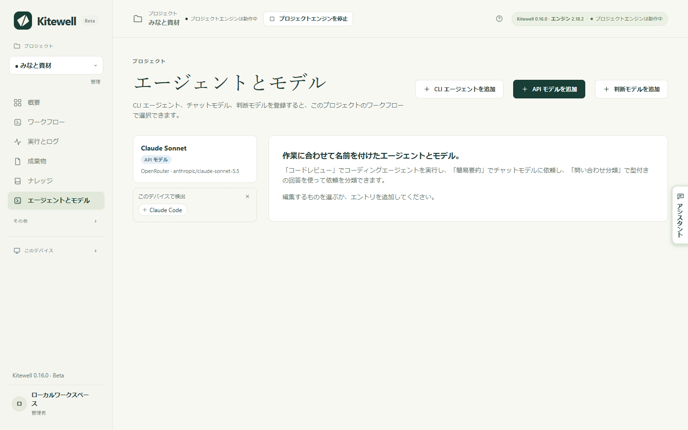
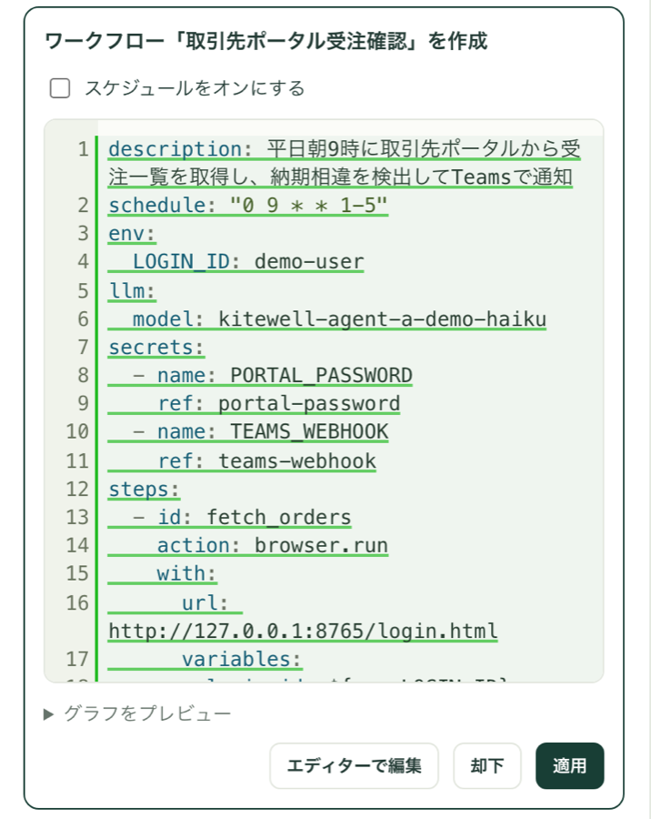

Kitewell に AI のアカウントは付いていません。プロバイダーの API キーか、このコンピューターにすでに入っているコーディングツールをご自身で用意し、プロジェクトに一度登録します。登録すると、アシスタントが一緒にワークフローを作れるようになり、失敗した実行が理由を説明できるようになり、シートが各実行から値を読み取れるようになり、ワークフローの途中でモデルに質問できるようになります。

## 必要なもの

- インターネット越しにモデルを呼ぶものには、プロバイダーの API キーが必要です。すでにプロジェクトに登録されていれば、サイドバーの **エージェントとモデル** に表示されています。
- コマンドラインのコーディングエージェントを使うには、そのツールをこのコンピューターにインストールし、そこでサインインしておきます。Kitewell はツールを起動するだけで、代わりにサインインすることはありません。
- **エージェントとモデル** のページは、管理者と編集者が使えます。費用はプロバイダーに対してご自身で負担します。

## プロジェクトで使うモデルを登録する

1. サイドバーの **エージェントとモデル** を選び、**API モデルを追加** を選びます。
2. **プロバイダー** を選びます。Anthropic、OpenAI、Google Gemini、OpenRouter、Z.ai、OpenCode Zen、Local server (Ollama, vLLM) から選べます。ローカルサーバーにキーは不要です。
3. **API キー** では、そのキーを持つプロジェクトの[シークレット](/ja/docs/secrets/)を選びます。シークレットとは、ログに残らない形で保管されたパスワードやキーのことです。管理者であれば **新しいキー…** を選び、**API キーを貼り付け** てそのまま保存することもできます。キーはこのモデルを使う各実行に結び付けられ、ワークフロー自体に含まれることはありません。
4. **モデル ID** を入力します。OpenRouter、OpenCode Zen、動作中のローカルサーバーでは、プロバイダーが提供するすべてのモデルが一覧表示されるので、名前の一部を入力して検索できます。ほかのプロバイダーでは候補が出るだけで、プロバイダーが受け付ける ID なら何でも使えます。
5. 「簡易要約」「請求書の読み取り」のように自分の言葉で名前を付け、**モデルをテスト** を選びます。送信する前に、送るプロンプト、送信先、使うキー、残るものがそのまま表示されます。

このページには **種類** で選ぶ 3 つのエントリがあります。

- **API モデル** は、プロバイダーのモデルに直接問い合わせて回答を返します。**モデルに尋ねる** タスク、アシスタント、失敗の診断、シートの結果列、**Web サイトを自動操作** と **デスクトップアプリを自動操作** のタスクで使われます。
- **判断モデル** は、分類、採点、はい / いいえの判断を、確率付きで返します。**判断モデルを追加** では OpenRouter か TypeSafe を選べます。**AI に判断を依頼** タスクはこのモデルで資料を仕分けたり採点したりし、後続のステップがその答えで分岐できます。[シート](/ja/docs/batches/)も、はい / いいえ、選択、段階の列の判断に使います。
- **CLI エージェント** は、このデバイスにインストールされたコーディングエージェントを動かします。

エントリは、失敗したときに別のエントリへ引き継げます。その場合はカードに「代替」としてその名前が並びます。引き継ぎのたびに新しいリクエストになり、そのつど課金されます。

## このコンピューターのコーディングエージェントを使う

先にツールをインストールし、サインインしておきます。Kitewell は Aider、Amp、Claude Code、Cline、Codex、Cursor、DeepSeek、Droid、Gemini、GitHub Copilot、Goose、Kiro、OpenCode、Pi、Qwen を知っていて、それ以外は **カスタムコマンド** として実行します。このコンピューターで見つかり、まだどのエージェントも使っていないツールは **このデバイスで検出** に並び、1 回のクリックでエントリにできます。

1. **CLI エージェントを追加** を選び、**ハーネス** を選びます。一覧には、このデバイスにインストール済みかどうかが表示されます。
2. Claude Code、Codex、OpenCode では、**モデルを読み込む** でそのツールが提供するモデルが入ります。ほかのツールではモデル名を入力します。
3. **エージェントをテスト** を選びます。送るプロンプト、作業するフォルダー（空の一時フォルダーで、終わると削除されます）、スキップする確認が、実行前に表示されます。
4. ワークフローに **AI エージェントに依頼** タスクを追加し、**エージェント** を選び、**プロンプト · タスクを記述** に内容を書きます。**エージェント設定とコンテキスト** を開いて、作業する **プロジェクトのフォルダー** を指定します。

コーディングエージェントは、このコンピューターであなたの権限で動くプログラムで、ツール自体に与えた権限をそのまま持ちます。ファイルの読み書きもコマンドの実行もできます。エージェントの **権限の確認をスキップ** はツール自身の確認を省く設定で、いずれかを設定したエージェントのカードには **承認をスキップ** の印が付きます。外部から届いた文章をこうしたエージェントに渡さないでください。メールの文面がエージェントに届く組み方をすると、ワークフローエディターが警告します。差出人がそのままエージェントに指示できてしまうからです。その場合は、何も実行できない **モデルに尋ねる** を使ってください。

## アシスタント

アシスタントは、ワークフローの作成や修正を一緒に進めます。どのプロジェクトページでも **アシスタント** から開くか、Mac では ⌘J、Windows では Ctrl+J を押します。管理者と編集者が使え、プロジェクトの API モデルを 1 つ使います。モデルがない場合は、管理者がパネルからそのまま接続できます。

提案は、適用するまで何も保存されません。

新規または変更したワークフローは、変更内容を載せたカードで提案されます。**グラフをプレビュー** を開くと図で確認できます。**適用**、**エディターで編集**、または理由を尋ねられる **却下** を選びます。スケジュールを持つ新しいワークフローは、**スケジュールをオンにする** にチェックしない限り一時停止の状態で保存されます。適用後は **今すぐ実行** で実行フォームが開き、**開く** でワークフローが開きます。既存のワークフローへの変更は **元に戻す** で戻せますが、新しく作られたワークフローは戻せません。

ほかにできることは次のとおりです。

- [シート](/ja/docs/batches/)の行や列を提案します。提案は、決めるまで開いているシートに表示されます。適用と同時に対象の行を実行することもでき、その場合は元に戻せません。
- 下書きを試しに実行して、動くかどうかを確かめられます。会話のなかで最初に試すときに **試行を許可** で確認します。試行では、コマンド、Web サイトのステップ、読み取り、モデルの呼び出しが、プロジェクトのシークレットを使って実際に実行されます。POST、メール、別のマシンでのコマンドなど、外に送ったり変えたりするものは、送る内容を報告するところまでで止まります。ワークフローを削除したり、本番の実行を開始したりはできません。
- 短い質問を最大 6 つ、1 つのフォームにまとめて尋ねられます。**回答を送信** で答え、**スキップ** で飛ばせます。
- 指定した公開 Web ページを読めます。このデバイスやそのネットワーク上のアドレスは読みません。
- シークレットを名前で依頼できます。値はカードに入力し、プロジェクトのシークレットストアに保存され、アシスタントが値を見ることはありません。この方法で追加できるのは管理者だけで、シークレットの名前を一覧できるのも管理者のアシスタントだけです。値は誰にも見せません。
- プロジェクトの[ナレッジ](/ja/docs/knowledge/)をメッセージのたびに読み、作業しながら分かったことを書き留めます。会話で Web ページや実行の出力を読んだあとは、[先に確認します](/ja/docs/knowledge/#what-the-assistant-does)。

失敗した実行では、**アシスタントに聞く** で原因の調査と修正案を依頼できます。

会話はこのデバイスに残ります。**デバイス設定 → アシスタント** の **プロジェクトごとに保持する会話数** で保持数を決めます。既定は 100 件で、新しい会話を始めると、この数を超えた分のうち最も長く使われていない会話が削除されます。

## 実行が失敗した理由

Kitewell は、失敗した実行を読んで、どうすればよいかを示せます。

1. **プロジェクト設定 → 失敗の診断** を開き、**失敗した実行を自動で診断** をオンにします。
2. 使う **モデル** を選びます。
3. **ワークフロー** の一覧で、各ワークフローを **プロジェクトの既定** のままにするか、**オン** か **オフ** を個別に選びます。**診断の設定を保存** を選びます。

診断されるのは、失敗が続き始めた最初の 1 回だけで、そのあとの失敗ごとではありません。成功すると、続いていた失敗は途切れます。答えは失敗した実行に、**もう一度試す**、**対応が必要**、**ワークフローの変更**、**不明** のいずれかで表示され、原因と次の一手が添えられます。どの失敗した実行でも **診断** で依頼でき、**もう一度診断** で新しい答えを得られます。

モデルには、失敗したステップの結果、そのログの末尾、ブラウザー・デスクトップ・エージェントのステップが止まったときの様子、子の実行の失敗、そしてその実行が実際に使った定義が送られます。モデルにツールは渡されないので、実行が出力した内容が何かを動かすことはありません。診断はこのデバイスに残り、実行とともに削除されます。

## このコンピューターから出るもの

プロンプトとそのコンテキストは、選んだプロバイダーまたはツールに送られ、そのプロバイダーの課金、データ保持、プライバシーのルールが適用されます。ワークスペースがこのコンピューターにあっても、すべてのタスクがここで完結するわけではありません。

- 実行する前に、ワークフローエディターの **ツール → AI プロンプトを確認** で、各 AI タスクが受け取る指示を読めます。実行時の変数は、実行が始まるときに埋められます。
- 実行したあとは、**実行とログ** にその実行が記録したプロンプトと結果が残ります。
- アシスタントは、プロジェクト名、ワークフローとエディターの下書き、ナレッジのページ、開いているブック、使ったツールが返した内容を送ります。シークレットの値を送ることはありません。
- アシスタントのモデルが OpenRouter 上の OpenRouter 標準アドレスのモデルである場合、そのリクエストは、受け取った内容を保存も学習もしないプロバイダーにだけ振り向けるよう OpenRouter に求めます。

全体像は[コンピューターの外に出るもの](/ja/docs/data-flow/)にあります。
