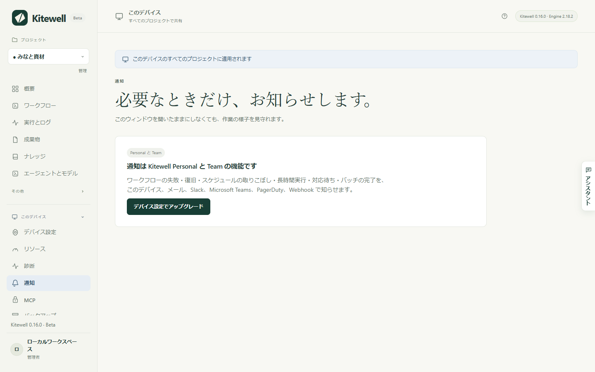

アラートは、ワークフローに対応が必要になったことを知らせます。失敗した、誰かの承認を待っている、始まるはずの時刻に始まらなかった。状況を確かめるために Kitewell を開いたままにしておく必要はありません。

## 必要なもの

アラートは Kitewell Personal と Team の機能です。無料プランでは、**通知** のページにアップグレードの案内が表示され、何も送信されません。メールもメッセージも、このコンピューターの通知も届きません。あとでまとめて送られることもないので、アラートはプランが有効になった時点から始まります。

以前のプランで保存したチャンネルは **保存済みのチャンネル** に残り、削除できます。プランが戻るまで、そこからは何も送信されません。

## アラートの送り先を決める

**このデバイス → 通知** を開きます。チャンネルとは、アラートが届く先のことです。**チャンネルを追加** を選び、**型** を選んで **名前** を付け、必要な項目を入力します。

- **このデバイス** は、このコンピューターに通知を表示します。最初から用意されています。**デスクトップ通知** の **このデバイスで通知** をオンにし、システムから確認されたら通知を許可してください。ブラウザーのウィンドウだけでなく、インストール済みの Kitewell アプリが必要です。
- **メール** には、宛先アドレスの一覧である **宛先** を入力します。送信に使うサーバーは、デバイス全体で一度だけ **メールサーバー** に設定します。**SMTP サーバー**、**ポート**、**ユーザー名**、**パスワード**、**送信元**、そして **接続のセキュリティ**（**STARTTLS（通常はポート 587）** と **TLS（通常はポート 465）**）です。暗号化された接続が必須です。プロバイダーが求める場合はアプリパスワードを使ってください。
- **Slack** には **受信 Webhook の URL** を入力します。Slack でチャンネルに Incoming Webhook を追加し、そのアドレスを貼り付けます。
- **Microsoft Teams** には **ワークフロー URL** を入力します。Teams で「Webhook 要求を受信したらチャネルに投稿する」テンプレートからワークフローを作成し、そのアドレスを貼り付けます。
- **PagerDuty** には、Events API v2 のインテグレーションから取得した **インテグレーションキー** と、**サービスリージョン**（**米国** または **欧州連合**）を入力します。アラートでインシデントが作成され、復旧すると解決されます。
- **Webhook** には **受信先 URL** を入力します。[Standard Webhooks](https://www.standardwebhooks.com/) 形式の署名付き JSON が送信されます。**署名シークレット** はチャンネルの保存時に作成され、一度だけ表示されます。受信側に渡してください。

**テスト送信** は、保存する前に、入力中の値を使ってサンプルのアラートを送ります。入力の誤りがその場でわかります。PagerDuty のテストでは、インシデントを作成してすぐに解決するので、誰も呼び出されません。

各チャンネルには、最後の送信が届いたかどうかが表示されます。**最近の通知** には、送信済みのものと再試行中のものが並びます。**ワークフローの通知を送る** をオフにすると、このデバイスからのすべてのアラートが止まります。オンに戻したときは、オフの間の出来事ではなく、その時点から再開します。

## 知らせる内容を選ぶ

ルールによって、どのイベントをどのチャンネルに送るかが決まります。3 つの段階があります。

1. **通知** のページの **既定の通知ルール** は、独自のルールを持たないすべてのプロジェクトに適用されます。初期状態では、**失敗したとき**、**入力待ちのとき**、**スケジュール実行を逃したとき**、**バッチを完了したとき** を **このデバイス** に送ります。
2. **プロジェクト設定 → 通知** では、1 つのプロジェクトに専用のルールを設定できます。**このデバイスの既定のルールに従う** ではなく **このプロジェクト専用のルールを使う** を選びます。プロジェクトのルールは既定に追加されるのではなく、既定を置き換えます。
3. ワークフローのエディターや **ワークフロー** の一覧にあるベルは、そのワークフロー 1 つに対するものです。**ミュート** を **1 時間**、**1 日**、**1 週間**、**解除するまで** から選んだり、**このワークフロー専用のルールを使う** で独自のルールを設定したり、**長時間実行とみなすタイミング** を **最近の実行から自動で判断**、**指定した時間の経過後**、**なし** から選んだりできます。最後に **通知設定を保存** を選びます。これらはこのデバイスですぐに反映され、ワークフロー自体は変わりません。ワークフローと一緒に持ち運ばれることもありません。

既定とプロジェクトのルールにある **取りこぼしと判断するまで** は、スケジュール実行が何分遅れて始まったら取りこぼしとみなすかを決めます。初期値は 5 分です。

## 各イベントの意味

- **失敗したとき**：最後の自動リトライのあとに失敗した実行です。失敗した実行のたびではなく、失敗が続き始めたときに知らせ、次の実行が成功したときにもう一度知らせます。復旧の知らせは、必ずその失敗が届いたチャンネルに届きます。
- **入力待ちのとき**：人によるタスクまたは承認が、誰かの対応を待っています。いったん回答されたステップが再び待機すると、もう一度知らせます。
- **スケジュール実行を逃したとき**：スケジュールされた実行が開始されなかったことを、件数と理由とともに知らせます。コンピューターがスリープしていた、Kitewell が動いていなかった、プロジェクトのエンジンが止まっていた、などです。再び時間どおりに実行されると、続けてもう 1 通届きます。
- **長時間実行されているとき**：最近成功した実行にかかった時間を大きく超えて、またはベルで設定した上限を超えて、実行がまだ続いています。1 回の実行につき 1 通です。
- **キャンセルされたとき** と **成功したとき**：送信先を設定しない限りオフです。
- **バッチを完了したとき**：[バッチ](/ja/docs/batches/)のすべての行が終わって値を読み取ったあとに、成功しなかった行の数と、「価格：9 件下落、3 件上昇」のような列ごとの変化を知らせます。キャンセルしたバッチは知らせません。すべての行が成功して何も変わらなかったスケジュール実行も知らせません。開始できなかったスケジュール実行は、その理由とともに知らせます。バッチの行が、ほかのイベントを 1 行ずつ出すことはありません。

PagerDuty が受け取れるのは **失敗したとき**、**スケジュール実行を逃したとき**、**長時間実行されているとき** だけです。インシデントには、あとでそれを解決する出来事が必要で、終わりがあるのはこの 3 つだからです。

## アラートに書かれていること

アラートには、プロジェクト、ワークフロー、実行のきっかけ、開始時刻、所要時間が入ります。失敗した場合は、どのステップがどのように失敗したかが、終了コードや制限時間とともに入ります。ステップが表示した内容や、実行に渡された値は含まれません。アラートはこのコンピューターの外に出るものであり、出力には何が入っているかわからないからです。

リンクは、その実行を行ったコンピューター上の Kitewell で実行を開きます。そのため、そのコンピューターの前にいる人のためのものです。スケジュールの取りこぼしのアラートはプロジェクトの **ワークフロー** のページを、バッチのアラートはそのシートを開きます。

アラートの文面は、Kitewell の表示言語にかかわらず英語です。

## アラートが送られるタイミング

コンピューターがスリープしておらず、Kitewell が動いている間に、バックグラウンドサービスが送信します。送信できなかったアラートは、間隔を広げながら最大 1 日まで再試行されます。Kitewell は外部からコンピューターを監視しません。スリープ中や電源オフの間は何も送信されず、その間に逃したスケジュールは復帰してから知らされます。終了してから 1 日以上たった実行は、あとから見つかっても知らされません。

## ハンドラーではなくアラートを使う

[イベントハンドラー](/ja/docs/workflow-builder/#run-a-task-when-the-workflow-ends)は、ワークフローが成功、失敗、キャンセル、または終了したときに実行されるタスクです。後片付けや復旧のためのものです。人に知らせるにはアラートを使ってください。

ワークフロー自身がメールを送ることはできません。`mail_on`、`smtp`、`error_mail`、`info_mail`、`mail_on_error` は保存時に拒否されます。その方法で送られる通知は、ルールにもミュートにも送信履歴にも従わないからです。

## うまくいかないときは

- **まったく届かない。** プランを確認し、次に **ワークフローの通知を送る** を確認し、最後にルールを確認してください。専用のルールを持つプロジェクトは、既定のルールに従いません。
- **このコンピューターに届かない。** **このデバイス** には、インストール済みの Kitewell アプリと、通知を表示するシステムの許可が必要です。**テスト通知を送信** で確認してください。
- **チャンネルが失敗中と表示される。** カードにエラーとその開始時刻が表示されます。**編集** して、保存する前に **テスト送信** で直ったか確認してください。
- **1 つのワークフローだけ静かになった。** **ワークフロー** の一覧でその行のベルを確認してください。ミュートされているか、専用のルールが設定されている可能性があります。

## 詳細

- アラートには Kitewell Personal か Team が必要です。設定内容の表示とチャンネルの削除は、どのプランでもできます。
- 1 つのデバイスに保存できるチャンネルは 50 件までです。
- 届かなかったアラートは、1 分後、2 分後、4 分後、8 分後、16 分後、30 分後と再試行され、1 日で打ち切られます。受信側が内容を理解したうえで拒否した場合は、再試行しません。
- **最近の通知** には直近 200 件が保持され、新しい 20 件が表示されます。
- **取りこぼしと判断するまで** は 1 分から 1,440 分まで指定できます。ワークフローごとの長時間実行の上限は最大 1 週間です。
- 「長時間実行」は、そのワークフローの最近成功した実行から自動で判断します。判断には少なくとも 5 件の成功した実行が必要です。
- Webhook のチャンネルは `https` だけでなく `http` のアドレスにも送信できます。Slack は `hooks.slack.com` のアドレスのみ、Teams は `https` のみを受け付けます。
