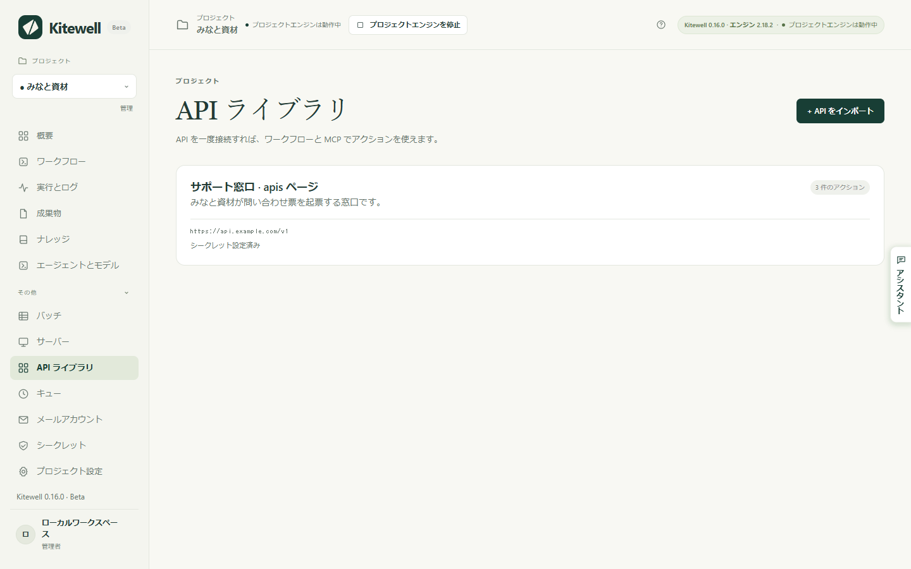
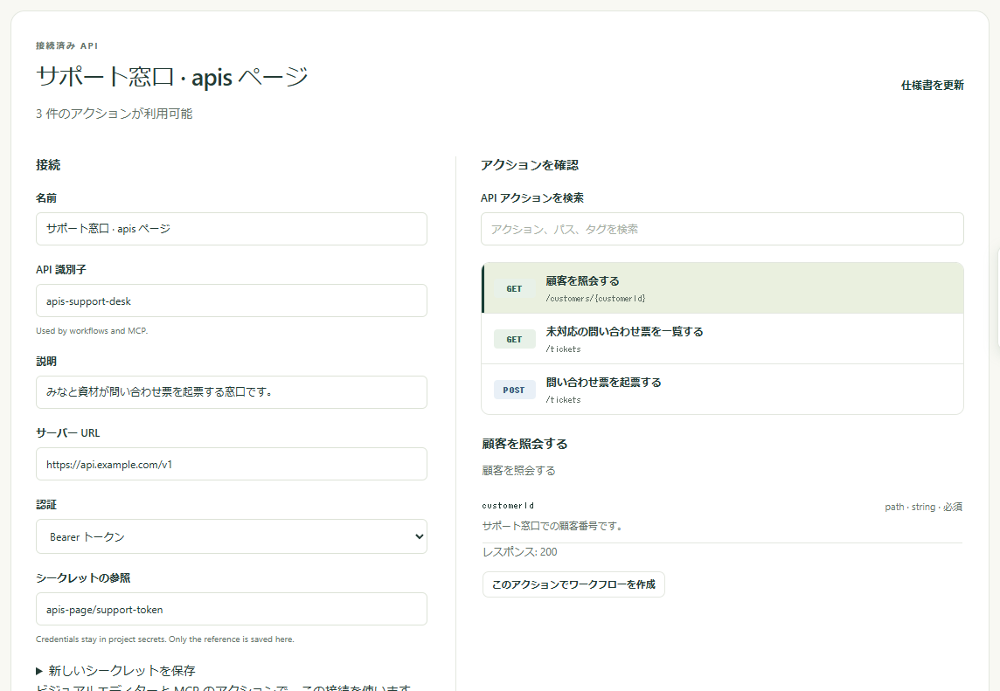

ほかのサービスがすでにできること、たとえば顧客の照会、問い合わせ票の起票、注文の登録を、一覧から選べるステップに変えられます。サービスの仕様書を一度インポートすれば、Kitewell が入力フォームを作るので、ワークフローのステップはリクエストを書く作業ではなく、いくつかの欄を埋める作業になります。

## 必要なもの

- そのサービスの OpenAPI ドキュメント。OpenAPI 3.0 または 3.1 の JSON ファイルか YAML ファイルです。サービスの提供元が公開していて、開発者向けページに「OpenAPI」や「openapi.json」という名前のリンクとして置かれていることが多いです。見つからない場合は提供元に尋ねてください。
- サービスが要求するトークン、キー、パスワード（必要な場合）。手元に用意しておきますが、ワークフローに直接入力しないでください。[シークレット](/ja/docs/secrets/)に保存するものです。

接続は 1 つのプロジェクトに属し、そのプロジェクトのすべてのワークフローから使えます。

## サービスをインポートする

1. プロジェクトのサイドバーで **その他 → API ライブラリ** を開き、**API をインポート** を選びます。
2. ドキュメントの渡し方を選びます。**ファイルをアップロード**、**URL から**、**仕様書を貼り付け** のいずれかです。
3. **アクションをプレビュー** を選びます。Kitewell がドキュメントを読み取り、**確認して接続** の画面を開いて、そのサービスにできることを一覧にします。
4. **アクションを確認** で、名前、パス、タグで検索し、アクションを選んで入力とレスポンスを確かめます。Kitewell がステップとして実行できないアクションには、その理由がその場に表示されます。
5. **接続** で、**名前**、**API 識別子**、**サーバー URL** を確認します。ドキュメントにサーバーのアドレスがない場合は、自分で入力します。
6. **認証** を選び、サービスが必要とする場合はシークレットを接続します。下の[認証情報を接続する](#connect-credentials)を参照してください。
7. **API を接続** を選びます。

接続はその後、**API ライブラリ** のカードとして、アクションの件数と、シークレットが接続されているかどうかとともに表示されます。

カードを選ぶと、いつでも同じ画面に戻れます。左に接続の設定、右にアクションが並びます。

**API 識別子** は、ワークフローがこの接続を見つけるために使う名前なので、保存後は変わりません。ドキュメント自体は、URL から取得した場合もプロジェクトに保存されるため、実行時に取得し直すことはありません。プレビューしても接続しても、サービスが呼び出されることはありません。

ドキュメントの URL 自体にサインインが必要な場合は、先にブラウザーでファイルをダウンロードし、**ファイルをアップロード** または **仕様書を貼り付け** を使ってください。

## 認証情報を接続する

**認証** で、サービスが要求する方式を選びます。**認証なし**、**Bearer トークン**、**API キー**、**ユーザー名とパスワード** のいずれかです。**API キー** の場合は **キー名** も入力し、**キーの送信先** に **ヘッダー**、**クエリパラメーター**、**Cookie** のどれかを選びます。

次に、値を保持するシークレットを指定します。同じプロジェクトにある既存の **シークレットの参照**（`services/support-token` など）を入力または選択します。ここで新しく作る場合は、**新しいシークレットを保存** を開き、**パスワードまたはアクセストークン** に値を入力して **シークレットを保存** を選びます。

Bearer トークンと API キーでは、シークレットにトークンまたはキーそのものを格納します。**ユーザー名とパスワード** の場合は、**ユーザー名** を接続に入力し、パスワードはシークレットに保持します。

接続が保存するのは参照だけです。Kitewell が値を参照して、この接続を使うすべてのリクエストに付け加えるため、値そのものがワークフローやログに現れることはありません。値を後から置き換える方法は[シークレット](/ja/docs/secrets/)を参照してください。

OAuth によるサインインとトークンの自動更新には対応していません。OAuth のアクセストークンを受け付けるサービスでは、トークンを自分で取得し、**Bearer トークン** として接続してください。トークンの有効期限が切れたら、シークレットの値を置き換えます。

## ワークフローでアクションを使う

1. ワークフローを開いて **組み立て** に移り、**ステップを追加** を選びます。
2. **API アクションを使う** を選びます。
3. **接続済み API** を選び、**API アクションを検索** で探して、使うアクションを選びます。
4. Kitewell が生成した入力欄を埋めます。必須のものが先に表示され、残りは **任意のパラメーター** を開くと出てきます。アクションがリクエスト本文を取る場合は、**リクエスト本文** のフォームが表示されます。
5. 入力欄の横の **変数** から、ワークフローの入力や前のステップの値を挿入します。
6. **ツール → ワークフローを確認** を選び、保存して実行し、**実行とログ** で結果を確認します。

サービス側から始めることもできます。**API ライブラリ** でカードを開き、**アクションを確認** でアクションを選んで、**このアクションでワークフローを作成** を選びます。

## 結果を次のステップに渡す

API ステップの **レスポンスフィールド** を開くと、ドキュメントに記述されたフィールドが表示されます。後続のステップで入力欄の横の **変数** を開き、その中から 1 つを選びます。Kitewell がマッピングを追加して 2 つのステップをつなぐため、後続のステップは API 呼び出しの完了を待ちます。

たとえば、顧客の照会で返った `id` を、問い合わせ票を起票するステップに渡せます。どのフィールドが選べるかは、ドキュメントがレスポンスの内容をどう記述しているかで決まります。詳しく記述されていない場合は、レスポンス全体が 1 つの値として使えます。

## サービスの仕様書を更新する

Kitewell は、インポートした時点のドキュメントをそのまま保持します。元の URL の内容が変わっても、プロジェクトには自動では反映されません。

1. **API ライブラリ** で接続を開き、**仕様書を更新** を選びます。
2. 新しいドキュメントをアップロード、取得、または貼り付けてから、**アクションをプレビュー** を選びます。
3. アクションを確認し、**接続設定を保存** を選びます。

Kitewell は保存前にプロジェクトのワークフローを確認します。新しいドキュメントによって保存済みのワークフローが壊れる場合、つまり使っているアクションがなくなった場合や入力が変わった場合、更新は拒否され、以前の接続が維持されます。先にそれらのワークフローを直すか、新しいドキュメントを別の **API 識別子** でインポートして、ワークフローを 1 つずつ移してください。

同じ理由で、保存済みのワークフローが使っている接続は削除できません。**API を削除** を選ぶと、使っているワークフローの名前が表示されます。

## 認証情報を含めずに接続を共有する

[プロジェクトのエクスポート](/ja/docs/sharing/)には、インポートしたドキュメントと接続の設定（サーバーのアドレス、認証の種類、シークレットの名前）が含まれます。シークレットの値は含まれません。受け取る側のデバイスでは、そのシークレットが **シークレット** に **値が必要** と表示され、そこで値を設定するか、そのプロジェクトの別のシークレットを使うように接続を変更する必要があります。

エクスポートには、ドキュメントの取得元アドレスも残ります。ドキュメント、サーバーのアドレス、ワークフローの入力に直接入力した認証情報は、自動では削除されません。ファイルを共有する前に、これらの項目を確認してください。

## インポーターが受け付けるもの

- JSON または YAML のドキュメント 1 つ、8 MiB まで。Swagger 2 のドキュメントは、先に OpenAPI 3.0 または 3.1 に変換する必要があり、そのまま試すとその旨が表示されます。
- 参照は同じドキュメント内を指している必要があります。外部参照は、インポートする前にバンドルしてください。
- リクエスト本文には JSON、URL エンコードされたフォーム、テキストを使えます。ファイルのアップロード、そのほかのマルチパートの本文、バイナリの本文は API ステップでは使えません。これらには Web サービスのステップを使ってください。
- 1 つのアクションで 2 つの認証情報を同時に要求するもの、および Kitewell が扱えない認証方式のものは、アクションの一覧に理由が表示されます。
- ページングは自動では行われません。ページやカーソルの入力を自分で指定し、リクエストの繰り返しはワークフローで組み立ててください。

同じインポート済みのアクションとスキーマは、編集権限を持つ AI アシスタントからも使えます。[MCP と API アクセス](/ja/docs/mcp/)を参照してください。
