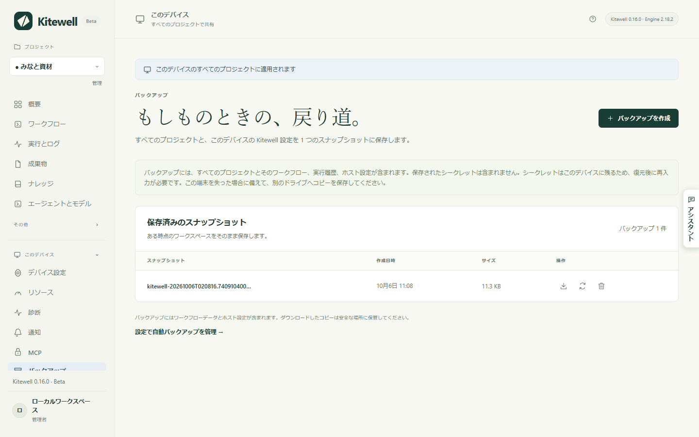
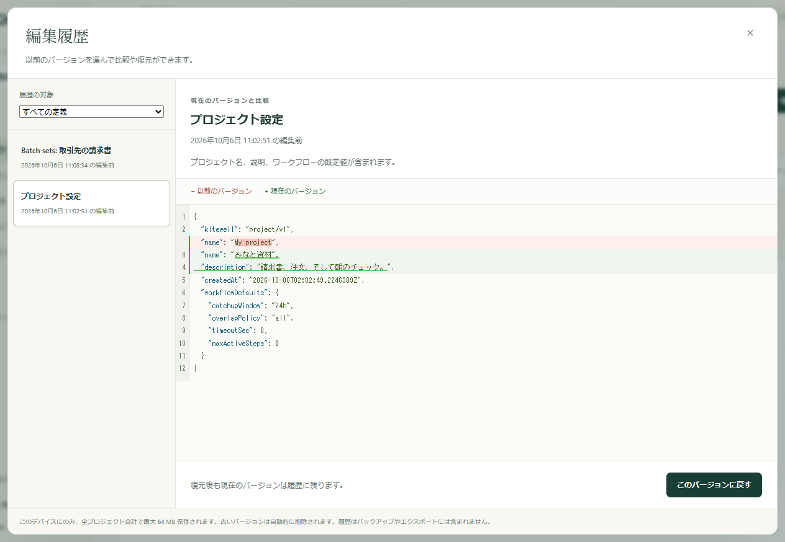

スナップショットは、このデバイスのすべてのプロジェクト（ワークフロー、実行履歴、設定、シート、ナレッジ）を 1 つのファイルにまとめます。安全な場所に保管しておけば、後で元に戻せます。Kitewell は毎晩これを自動で作ることもできます。また、編集したものの以前のバージョンも保持しているので、1 つのワークフローへの変更だけを、全体を復元せずに取り消せます。

## 必要なもの

このデバイスの管理者権限です。サイドバーの **このデバイス** に **バックアップ** が表示されます。

## いますぐバックアップを作る

1. **このデバイス → バックアップ** を開き、**バックアップを作成** を選びます。
2. 少し待ちます。スナップショットを作る間、各プロジェクトのエンジンは停止し、その後また開始します。
3. **保存済みのスナップショット** に、**作成日時** と **サイズ** とともにスナップショットが現れます。
4. スナップショットの横にある下向きの矢印、**バックアップをダウンロード** を選び、自分で管理できる場所にファイルを保存します。



このデバイスにしか置いていないスナップショットは、変更を取り消すのには役立ちます。デバイス自体を失ったり盗まれたりしたときには助けになりません。ダウンロードしたコピーを、別のドライブやチームが保護しているストレージに置いてください。

## 毎日バックアップする

**デバイス設定 → 自動バックアップ → 毎日のバックアップ** をオンにし、**バックアップの時刻** を選びます。Kitewell は、このデバイス自身のタイムゾーンで、その時刻を過ぎたころに 1 日 1 回スナップショットを作ります。その時刻にデバイスがスリープしていた場合は、起きた後に作られます。

Kitewell は自動のスナップショットを最新の 10 件だけ保持し、それより古いものを削除します。自分で作成したスナップショットと、復元の直前に作られる安全用のスナップショットは、削除するまで残ります。

自動のスナップショットが作られないことが 2 つあります。実行中、キュー待ち、承認待ちを含む待機中のワークフローがあると作成は保留され、Kitewell は 15 分ごとに再試行します。また、すべてのプロジェクトが停止しているデバイスでは、守るものが動いていないため、まったく作られません。

## 1 つの変更だけを取り消す

ワークフロー、シート、プロジェクトの設定を保存するたびに、Kitewell は置き換えられたバージョンを保持します。**ワークフロー** のページ、**プロジェクト設定**、またはワークフローエディターのツールバーで **編集履歴** を選びます。

1. 一覧からバージョンを選びます。それぞれに、上書きした日時が表示されます。
2. 比較を読みます。**以前のバージョン** がいま見ているもので、**現在のバージョン** が保存されているものです。
3. **このバージョンに戻す** を選び、**復元** で確定します。



戻しても現在のバージョンは履歴に残るので、また元に戻せます。**履歴の対象** で、一覧を 1 つのワークフローや設定に絞り込めます。削除したワークフローもここに残っていて、戻すとスケジュールを一時停止した状態で復活します。

この履歴はこのデバイスにだけあります。スナップショットにもプロジェクトのエクスポートにも含まれず、スナップショットを復元すると消去されます。

## スナップショットからすべてを復元する

1. 進行中の作業を終わらせます。実行中、キュー待ち、待機中のワークフローがある間は、復元は拒否されます。
2. **このデバイス → バックアップ** を開き、スナップショットの横にある回る矢印、**バックアップを復元** を選びます。
3. 警告を読み、**バックアップを復元** で確定します。Kitewell はまず安全用のスナップショットを作り、すべてのプロジェクトとこのデバイスの設定を置き換えて、再読み込みします。
4. 復元が報告した内容を読み、対応します。

復元は、プロジェクトごとに、入力し直すシークレット、接続し直すメールボックス、次の実行でもう一度サインインする Web サイトのステップを示します。コンテナーレジストリのサインインは消去されるので、これも入力し直してください。

このデバイス自身のもの、つまりサインイン、API キー、どのプロジェクトが停止していたかは、そのまま保持されます。スナップショットによってロックアウトされることはなく、ほかの人の鍵がスナップショットであなたのデバイスに持ち込まれることもありません。

復元が Dagu Cloud に書き込むことはありません。[同期しているプロジェクト](/ja/docs/cloud-sync/)はスナップショット時点の状態に戻り、次の更新で Dagu Cloud のコピーを取り込みます。

## スナップショットに入るもの

| スナップショットに入る | 入らない |
| --- | --- |
| デバイスの設定、アラートのチャンネルとルール | シークレットの値と、それを復号する鍵 |
| プロジェクト、ワークフローの定義、ワークフローの既定値 | アラートチャンネルのパスワード、Webhook のアドレスと鍵 |
| インポートした OpenAPI のファイルと API 接続の設定 | メールボックスのサインイン |
| バッチシート、リリース、ナレッジのページ | 保存した Web サイトのサインインとリプレイキャッシュ |
| シークレットの名前と説明 | デスクトップのステップが記録した画面の内容 |
| 実行履歴と成果物 | 実行の出力ログ |
| アシスタントの会話と失敗の診断 | 編集履歴、アラートの履歴 |
| 元に戻すために保持している Excel ファイルのコピー | このデバイスのサインインと API キー |
| このデバイスがプロジェクトごとに決めたこと：承認した SSH ホスト、鍵のパス、ここで実行するワークフロー | Dagu Cloud の接続（データフォルダー直下のファイルです） |

入らないものは、意図的に入れていません。シークレットとそれを復号する鍵の両方を持つスナップショットは、そのシークレットを平文で持っているのと同じです。そのため、復元したデバイスはもう一度認証情報を尋ねます。

ファイルは暗号化されていません。しかも中には、実行の出力と成果物、アシスタントとのやり取り、シートが書き戻す Excel ファイルの最大 10 件のコピーなど、業務データそのものが入っています。ワークフロー、OpenAPI のファイル、ソース URL に直接書いた認証情報も、書いたまま入っています。ダウンロードしたスナップショットは機密情報として扱い、共有ストレージに置く前に自分で暗号化してください。

Kitewell がバックアップするのは、Kitewell 自身が保持しているものだけです。ステップが呼び出すスクリプト、それが読むファイル、Docker のボリューム、マウントしたフォルダー、ワークフローがつなぐサービスは入っていません。これらは、このコンピューターのほかの部分と同じようにバックアップしてください。

## うまくいかないとき

- **「has a workflow running, queued, or waiting」と表示される。** まだ何かが動いています。終わるのを待つか、待機している承認に答えてから、もう一度試してください。
- **容量でバックアップが失敗する。** 1 つのスナップショットに入るのは 2 GiB のデータと 100,000 ファイルまでです。先に、必要のない実行履歴を削除してください。
- **このバージョンでは読めないレイアウトだと表示される。** そのスナップショットは別の Kitewell が作ったものです。それを作ったバージョンをインストールするか、より新しいスナップショットを復元してください。
- **復元後にワークフローが保留になっている。** 定義はそのまま保持され、その場で直せるように報告されます。ほかのワークフローは動きます。

ほかの症状については[トラブルシューティング](/ja/docs/troubleshooting/)を参照してください。

## 容量に気をつける

**プロジェクト設定 → ストレージ** には、プロジェクトが使っている容量とディスクの残りが表示され、残りが少ないと警告されます。次のものが一覧されます。

- ワークフローごとの実行履歴（**履歴を削除…**）
- 保存した Web サイトのサインイン（**サインインを削除…**）
- Web サイトとデスクトップのステップが保持しているリプレイキャッシュ（**クリア**）
- プロジェクトが持つそのほかのもの（合計のサイズ）

1 日 1 回、**バックアップの時刻** に、Kitewell は **デバイス設定 → 実行履歴の保存期間** より古い実行履歴、それに伴う完了済みのシートの実行、すでに存在しない実行のファイルを片付けます。保存期間を短くした場合は、夜を待たずにその場で古い履歴が消えます。

実行のログ自体に容量の上限はありません。出力の多い実行 1 つで、履歴の期限が来る前にディスクを埋めてしまうこともあります。

## データの場所

```text
macOS:    ~/Library/Application Support/Kitewell
Windows:  %LOCALAPPDATA%\Kitewell
```

`data` にプロジェクトと設定、`backups` にスナップショット、`runtime` にダウンロードしたエンジンのバージョン、`logs` にサービスが書いた内容が入ります。手作業で移動する前に Kitewell を終了してください。また、ダウンロード済みのスナップショットがないまま、インストールの問題を解決する目的でこのフォルダーを削除しないでください。

## 詳細

- スナップショットは `backups` の下の `kitewell-<timestamp>.tar.gz` で、gzip 圧縮した tar、所有者のみ読み取り可です。Kitewell 自身が作ったものは名前に `-auto` が入り、自動削除の対象になるのはそれだけです。
- 1 つのアーカイブの上限は、展開後のデータで 2 GiB、ファイル数で 100,000 です。
- 編集履歴の上限は、全プロジェクト合わせて 64 MB、全体で 1,000 バージョン、ワークフローや設定 1 つあたり 100 バージョンで、古いものから削除されます。場所は `data/history/<project>` です。
- バックアップは `credentials.json`、`state.json`、`mail.key`、`data/history`、各プロジェクトの `mail.json`、すべての `logs` ディレクトリ、各プロジェクトのエンジンの下の `auth`、`secrets`、`browser`、`computer` ディレクトリを除きます。このうちデバイス固有の 3 つのファイルは、アーカイブから取り出すのではなく、復元のときに現在のものが引き継がれます。
- 毎日の片付けでは、失敗の診断も削除し、どの実行も参照していない成果物の回収をエンジンに依頼します。ワークフローは YAML の `hist_retention_days` や `hist_retention_runs` で独自の保存期間を持てて、こちらがデバイスの設定より優先されます。エンジンの更新が隔離されている間は、片付けは行われません。
- 復元は、動いている MCP のリスナーをアーカイブの設定で置き換えます。すでに走っている実行は、待たれることも終了させられることもありません。
