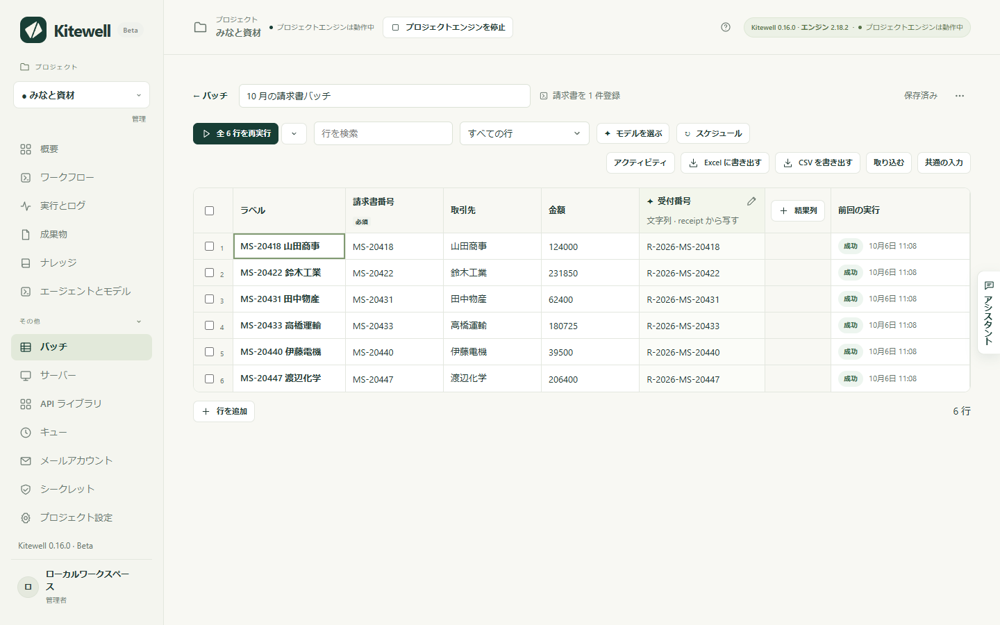

片付けるべき一覧があるとします。今月の請求書、確認したい 100 件の取引先、検索で出てきた物件。そして、そのうちの 1 件を処理するワークフローが 1 つあります。シートは、その一覧を行に並べ、ワークフローを 1 行につき 1 回、その行の値で実行します。各実行で分かったことは横の結果列に戻ってくるので、仕事全体が、並べ替えも絞り込みも書き出しもできる表になります。

失敗した行だけをもう一度実行できます。終わっている行はそのままです。人が座ってクリックし続ける必要はありません。

## 必要なもの

- 1 件分の仕事をするワークフロー。件ごとに変わる値は、名前の付いた入力にしておきます。入力のないワークフローでもシートで実行できますが、どの行も同じことをします。
- ステップがすでに集めている値を写すだけの列なら、ほかには何も要りません。各実行からモデルに値を読み取らせる場合は、プロジェクトに[エージェントとモデル](/ja/docs/ai/)の API モデルが必要です。

## シートを作る

1. サイドバーの **その他** を開いて **バッチ** を選び、**新しいシート** を選びます。
2. **ワークフロー** を選び、**シート名** を付けて、**シートを作成** を選びます。
3. シートには、ワークフローの入力ごとに 1 列が、型・既定値・選べる値も引き継いで並び、左端に **ラベル** が付きます。**ラベル** は行に付ける名前で、ワークフローには渡されません。
4. 行を入れて（下を参照）、実行ボタンを選びます。

ワークフローの実行フォームから始めることもできます。**単独実行** から **バッチシート** に切り替えると、入力済みの値が新しいシートの共通の値になります。この切り替えがあるのは新規の実行フォームだけで、再実行のフォームにはありません。

1 つのシートには最大 5,000 行、結果列は最大 30 列まで入ります。

## 行を入れる

- グリッドに直接入力するか、スプレッドシートからコピーしたセルを、選択中のセルを起点に貼り付けます。必要に応じて行が追加されます。**行を追加** で 1 行ずつ足すこともできます。
- **取り込む** で Excel ブックや CSV ファイルを選ぶか、シートのどこかにドロップするか、パネルの **行** の欄に貼り付けて **列をプレビュー** を選びます。プレビューには先頭の行が表示され、列名の行は自動で選ばれます。**3 行目を列名にする** で別の行を選ぶことも、**列名なし** にすることもできます。そのうえで、各列を入力、**ラベル**、または **列をスキップ** に割り当てます。カンマ区切りでないファイルは **区切り文字** で指定します。
- **共通の入力** は、行が独自の値を持たない限りすべての行が使う値です。空のセルには、使われる共通の値またはワークフローの既定値が、灰色の斜体で表示されます。
- **ワークフローの実行結果から行を作成** を選ぶと、検索で見つかる物件のように実行に項目を探させ、行を最新の状態に保てます。
- **この端末のブックをリンクする** では、行を取り込むのではなく Excel ファイルとのつながりを保ち、各行の結果が元の行に書き戻されます。[Excel を自動化](/ja/docs/spreadsheets/)を参照してください。
- アシスタントも行や列を提案できます。提案は、決めるまで開いているシートに表示されます。

取り込みでは、列名より上の行、空の行、合計や小計などの合計行は取り込まず、それぞれ件数が示されます。合計行を含めるチェックもあります。ブックは Excel で開いたときのシートから始まり、ほかのシートも選べます。非表示の行は、除くチェックを入れない限り取り込まれます。Kitewell はファイルを読むだけで、変更しません。

値は入力の型に従って読み取られます。文字列はそのまま、数値、`true` または `false`、リストやオブジェクトは JSON として扱います。型に合わない値は、入力しようとすると受け付けられず、貼り付けでは飛ばされ、ファイルから来た場合は残したまま印が付きます。印の付いたセルには赤い枠と理由が表示され、直すまで何も始まりません。これから実行する行に 1 つでもあると、その行を名指しして、実行全体が始まりません。

ブックのセルは Excel での表示どおりに読み取られます。

- 日付は `2026-10-01`、日付と時刻は `2026-10-01 12:00:00`、時刻は `09:30:00`。
- 数値は桁区切りや通貨記号なしで、指数表記にはなりません。パーセントは小数になり、12% は `0.12` です。
- TRUE と FALSE は小文字の `true` と `false` になります。はい / いいえの入力が求めるのはこの形です。
- `00123` のようなコードは先頭の 0 も含めて読まれます。文字列のセルでも、先頭ゼロの表示形式を付けた数値でも同じです。
- 複数の行にまたがって結合したセルは各行に繰り返され、1 行の中だけの結合は先頭のセルに残ります。
- 数式は、Excel が最後に保存した結果になります。
- `#N/A` などの Excel のエラーを表示しているセルは空として読み取られ、その数が示されます。

古い `.xls` ファイルとパスワードで保護されたブックは読み取れません。先に `.xlsx` として保存するか、パスワードを解除してください。ファイルは 16 MiB までです。`.csv`、`.tsv`、`.txt` も使えます。

シートは編集するそばから保存され、**保存済み** と表示されます。

## 行を実行する

実行ボタンは、その時点で実行すべき行のまとまりを開始し、何を実行するかを表示します。まだ 1 行も実行していなければ **未実行の 6 行を実行**、失敗した行があれば **失敗した 2 行を再実行**、というように変わり、最後はすべての行の再実行になります。横のボタンから **その他の実行方法** を開くと、まとまりを自分で選べます。**リストから消えた行** は、選択して実行する場合を除き、どのまとまりにも入りません。

その後、各行はワークフローのキューで個別の実行になります。バナーには、完了した行数、同時に実行される数、キューの名前、そして 3 行が完了した後はおおよその残り時間が表示されます。**default** キューはプロジェクト全体で同時に 5 件まで実行します。サイトが集中したリクエストを拒む場合は、バナーの **同時に実行する数を変更** から **キュー** ページでそのキューを開き、**同時実行数** を下げます。

行は 10 件ほどずつキューに入り（default キューの場合）、残りは空きができるまで **保留中**、エンジンが受け取ると **待機中** と表示されます。そのため、同じキューを使う他のワークフローの定期実行が待つのは、多くても行 1 巡分で、シート全体ではありません。

- **待機中の行をキャンセル** は、まだ待っている行をキャンセルします。実行中の行は続きます。
- **すべて停止** は、実行中の行も停止します。完了した結果は残ります。

実行を開始すると、その時点のワークフローと各行の値の写しが保存されます。後からシートやワークフローを編集しても、キューに入った実行は変わりません。前回の実行から入力が変わった行には **変わっています** と表示され、**前回の実行から変更あり** フィルターで一覧できます。共通の入力を変えると、それを使うすべての行に印が付きます。

### 行が失敗したとき

その行を選ぶと、止まったステップとそのエラーが表示されます。**ポータルに登録する の再試行を設定** を選ぶと、ワークフローエディターでそのステップが開き、**リトライの上限** をすぐに設定できます。集中したリクエストを拒むサイトも、時間をおいた再試行なら通ることがほとんどです。新しい再試行ルールは、行を再実行したときから適用され、すでにキューに入った実行には適用されません。

## 各実行から結果を集める

結果列は、各実行から値を 1 つ集めます。列を追加するときに **値の取得元** でその取り方を選びます。

**ワークフローが公開する値** は、各実行からその値をそのまま写します。モデルを使わず、費用もかからず、ステップが見つけたとおりの値が実行の完了と同時に入ります。列を作る前に実行した行も埋まります。どの値を写すかは **出力** で選びます。

- 値を公開しているワークフローの新しいシートでは、「このワークフローは次の値を公開しています。列として追加しますか?」の下に、それらがチェック済みで並びます。
- グリッド右端の **結果列** で 1 列追加できます。
- 数値の列に `¥12,800` が入った場合のように、列の型に合わない値は公開されたまま印付きで表示されます。その詳細から **列を文字列に変更** または **モデルに読み取らせる** を選べます。
- ワークフローが公開しなくなった値を写す列は、見出しに印が付きます。

写せるのは、実行の出力に届く値だけです。Web サイトやデスクトップの抽出、メールのステップ、コマンドのステップが宣言した結果が対象で、人が入力するフォームの回答やループ内のステップの値は含まれません。2 つのステップが同じ名前を公開した場合は、後に実行された方の値になります。

それ以外は **モデルが実行を読み取る** を選びます。列に名前を付け、型（**文字列**、**数値**、**はい / いいえ**、**選択**、**段階**）を選び、**読み取る内容（モデルへの説明）** に、単位や値が複数あるときにどれを取るかなど、探す内容を書きます。**選択** と **段階** には、**選択肢** または **段階（低い順）** を並べます。

これらの列は、**エージェントとモデル** の API モデルが埋めます。**モデルを選ぶ** で次を設定します。

- **抽出モデル** は、文字列と数値の列を読み取ります。判断モデルがない場合は、それ以外の列も読み取ります。各値には **実行から引用** が付き、送った内容の中に一字一句そのままでは見つからなかった場合はその旨が示されます。
- **判断モデル** は任意です。はい / いいえ、選択、段階の列を確率付きで判断します。引用はありませんが、より速く低コストです。**この確信度未満は「要確認」にする** で、人が確認する基準を決めます。既定は 70% です。

値は各実行が成功した後に読み取られます。ただし、行を開始した時点でシートに列とモデルが揃っていた場合です。バナーの **6 行を埋める** は、値が欠けている完了済みの行を読み取り、セルの詳細にある **もう一度読み取る** は、1 つの実行を読み直します。どちらもワークフローを再実行しません。列の定義を変える前に読み取った値は、古い値として示されます。モデルを変えても古い扱いにはなりません。

モデルには、その行の入力、実行の各ステップの結果、公開された出力、実行が作ったテキストファイル最大 5 件、最大 4 ステップ分のログの末尾が送られます。スクリーンショットは送られません。これらを任せられるプロバイダーを選んでください。

## 実行に行を見つけさせる

ワークフローの実行で見つかったリストから行を作れます。新しい項目は、誰かが追加しなくても行になります。**取り込む** の中、または新しいシートの空の行の下で、**ワークフローの実行結果から行を作成** を選びます。

1. **ワークフロー**（シート自身のワークフローでもかまいません）と、その実行が出力する **リスト** を選びます。[Web サイト](/ja/docs/browser/)や[デスクトップ](/ja/docs/desktop/)のステップの **項目のリスト**、**メールを検索** が見つけたメール、ステップがリストとして公開する出力が対象です。
2. 最新の実行で見つかった先頭の項目を確認します。まだ実行していない場合や、項目のフィールドが実行しないとわからない場合は、**今すぐ実行** を選びます。
3. **各入力項目を埋める値** で、各入力に同じ名前の項目のフィールドが割り当てられます。項目を識別する入力に **これで行を照合** を付け、リストを取得する実行の入力も設定します。
4. **行を作成** を選びます。ワークフローが一度実行され、見つかった項目ごとに行が追加されます。

以降はツールバーに行の取得元が表示され、**行を更新** でワークフローをもう一度実行します。実行が成功すると次のようになります。

- 項目は、同じキーを持つ行を更新します。同じキーで手で追加した行は、重複させずにそのまま引き継ぎます。キーは文字列として照合しますが、数値として読める値は数値として比べます。
- 新しい項目は行として追加され、実行するまで **新規** と表示されます。
- 項目が消えた行は残り、**リストから消えた行** として灰色で表示されます。項目が戻れば元に戻ります。**リストから消えた行** フィルターで一覧でき、まとめて削除するボタンもあります。
- キーのない項目、ほかの項目とキーが重複する項目、5,000 行の上限を超えた項目はスキップされ、その数が示されます。

実行が失敗した場合は何も変わらず、理由が表示されます。項目がまったくないリストや、キーを持つ項目がないリストでも同じです。壊れた実行でシート全体が灰色になることはありません。本当に短くなったリストでは、なくなった行に印が付きます。

取得元が合わなくなると（ワークフローが削除された、リストを出力しなくなった、埋めている入力項目の名前が変わった、リストの項目からフィールドがなくなった）、シートに理由が表示され、バッチの一覧にも印が付きます。**取得元を変更** を選ぶと、対応付けを直した状態でパネルが開きます。

## スケジュールで実行し、変化を見る

毎朝の価格や物件の確認のように値の変化を追うには、シートのツールバーで **スケジュール** を選び、**すべての行を再実行** を **毎時**、**毎日**、**平日**、**毎週**、または cron 形式の **カスタムスケジュール** に設定します。**オフ** にすると解除されます。シートの実行は 1 時間に 1 回までです。次回の実行は、ツールバーとシートの一覧に表示されます。

- スケジュールはこのデバイスに属します。シートとともに同期されないため、チームメイトが共有したシートは、誰かがスケジュールを設定したデバイスでだけ実行され、うっかり 2 台で実行されることはありません。
- このコンピューターが起動していて、プロジェクトのエンジンが動いている間に実行されます。オフやスリープ中に逃した実行については、復帰時の動きを選べます。**復帰時に実行（次の実行の方が近い場合を除く）**（既定）、**復帰時に必ず実行**、**スキップする** の 3 つです。いずれの場合も、逃した実行は最大 1 回だけ行われます。
- 前回の実行がまだ続いている時刻はスキップされ、その旨が表示されます。
- ワークフローの実行結果から行を作るシートは、先に行を更新します。新しい項目は新しい行として実行され、リストから消えた行は対象外になります。行をそのまま実行するには、**先に 新着物件を探す から行を更新する** のチェックを外します。

各行は、同じ入力での前回の実行で読み取った値を保持します。それ以降に変わった結果はセルに印が付きます。変更前と変更後がどちらも数値なら矢印、それ以外は点で示され、変更前の値はマウスを重ねたときとセルの詳細に表示されます。バナーに変化の数が表示され、**表示する** で **結果が変わった行** フィルターが適用されます。

空白や大文字・小文字の違いを無視するのは文字列の列だけで、ほかの型は厳密に比べます。モデルは同じ値を実行ごとに違う言い回しで返すことがあるため、できるだけステップが公開する値を写してください。

## 各実行で何が変わったかを見る

シートのツールバーの **アクティビティ** には、直近 50 回の完了した実行が新しい順に表示されます。各実行について、実行した行数と失敗した行数、列ごとに上がった・下がった・変わった値の数、新しい行・リストに戻った行・リストから消えた行、そして変わった値が最大 20 件、変更前の値とともに表示されます。変わった値を選ぶと、その行が開きます。

値を選ぶと **履歴** に、過去 1 年のうち値が変わった時点が並びます。数値は線でも示されます。

この履歴はシートを実行したデバイスに残ります。1 か月ごとに 1 つのファイルにまとめられ、月が終わると圧縮され、12 か月を過ぎると削除されます。

## 書き出し、複製、削除

- **Excel に書き出す** と **CSV を書き出す** は、入力、値、各判断の確率、変わった結果の変更前の値、各行の **状態**・**実行 ID**・**エラー** を、シート名と日付を付けたファイルに保存します。ブックは見出しが固定されフィルター付きで開き、数値と日付は Excel で並べ替えられるセルになり、各行の状態は色分けされます。もう一度取り込むと、入力は自動で割り当てられます。ワークフローの実行結果から行を作るシートでは、**リスト内の状態** の列に、新しい行かリストから消えた行かが入ります。
- シートのメニュー **シートの操作** には、同じ行・入力・結果列・モデルを持つ写しを作る **複製** と、同じ設定で空の行を 1 つだけ持つ **行なしで複製** があります。値はそれを生んだ実行に属するため、写しは結果のない状態で始まり、スケジュールも引き継ぎません。
- **シートを削除** は、シートと、このデバイスで読み取った値を削除します。実行は **実行とログ** に残ります。行の実行中は、そのシートを削除できません。

## 詳細

- **バッチを完了したとき** の[アラート](/ja/docs/alerts/)は、実行のすべての行が終わって値を読み取った後に、成功しなかった行の数と列ごとの変化を知らせます。先に行を更新した場合は、新しい行、リストに戻った行、リストから消えた行の数も知らせます。すべての行が成功して何も変わらなかったスケジュール実行は通知しませんが、手動の実行は通知します。開始できなかったスケジュール実行は理由とともに通知します。バッチの行は、人の対応を待つ場合を除き、1 行ずつ実行のアラートを出しません。
- [MCP クライアント](/ja/docs/mcp/)は、シートの一覧表示と読み取り（ワークフローが公開する値や、変わった値の変更前の値を含む）、作成・置き換え・削除、ワークフローの実行結果から行を作る設定とその更新、このデバイスでのスケジュール設定、行の実行、値の読み取り直し、実行のキャンセル、ブックのリンクと解除ができます。置き換えはシート全体の置き換えなので、書かなかった行や列は値ごと削除されます。
- シート自体はプロジェクトに属するため、プロジェクトの書き出しに含まれ、[Dagu Cloud と同期](/ja/docs/cloud-sync/)されます。行の値、行の取得元、リストから消えた行も一緒に同期されます。行の状態、実行から読み取った値とその変更前の値、最新の行の更新、アクティビティと値の履歴、シートのスケジュールは、実行したデバイスに残ります。
