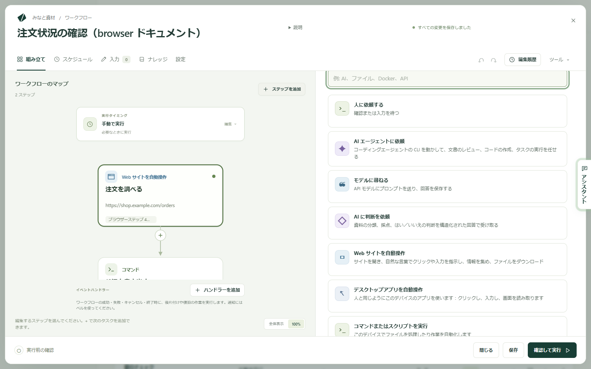
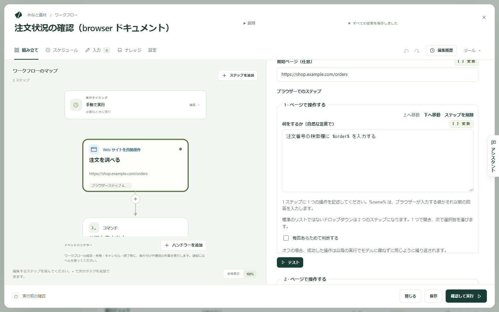

Kitewell は Web サイトの操作を代わりに行えます。ページを開き、サインインし、クリックや入力をし、ページの表示を読み取り、その結果を次のステップへ渡します。何をするかは普通の言葉で書くだけで、各ページでの操作方法はモデルが判断します。クリックを記録する必要も、セレクターを書く必要もありません。

任せられる作業の例です。

- 仕入れ先のポータルから今月の請求書をダウンロードする。
- スプレッドシートにあるすべての注文の状況を調べる。
- Web のダッシュボードの数値を日次レポートに写す。
- リストの行ごとに、同じ Web フォームへ入力する。
- リリース後に、サイトのサインインや購入手続きが動くことを確かめる。

ブラウザーはあなたのコンピューター上で動き、そこで行ったサインインもそのコンピューターに残ります。

## 必要なもの

このコンピューター上のブラウザー。Mac では Google Chrome を `/Applications` にインストールします。Windows では、すでにインストールされている Chrome または Microsoft Edge を使います。Chromium、Brave、Mac の Edge、別の場所にある Chrome を使う場合は、**デバイス設定 → ブラウザー → ブラウザーの実行ファイル** にフルパスを入れてください。ステップには、ブラウザーが見つかったかどうかと、どれを開くかが表示されます。

モデル。Web サイトのステップは、各ページで何をするかを API モデルに尋ねます。**エージェントとモデル** で[モデルを追加](/ja/docs/ai/)し、ステップの **モデル** で選びます。ワークフロー全体に設定するなら、**設定 → 実行とリトライ → ブラウザーとデスクトップのステップの既定モデル** を使います。Anthropic、OpenAI、Gemini のモデルを選んでください。小さなローカルモデルでは、通常ブラウザーを操作できません。

そのうえで、ステップまたは **デバイス設定** で **ブラウザーを確認** を選びます。実行時と同じように、Kitewell のバックグラウンドサービスからブラウザーを一度開くので、起動できないブラウザーをスケジュール実行の途中ではなく今のうちに見つけられます。Mac では、macOS の確認もあなたが見ているうちに済ませられます。

## 最初の Web サイトのステップを作る

この例では、ショップのサイトで注文を調べ、その状況を次のステップへ渡します。

1. ワークフローを開き、**ステップを追加** を選びます。タスクの選択肢が開きます。

   

2. **Web サイトを自動操作** を選びます。**ステップ名** に `注文を調べる` のような名前を付けます。**技術的な設定** の **ステップの識別子** は、このステップが集めた値を後のステップが読むときに使う短い名前です。`order` のような分かりやすいものにしてください。
3. **モデル** を選び、**開始ページ（任意）** に `https://shop.example.com/orders` など最初に開くページを設定します。
4. **ブラウザーが入力する値** で **値を追加** を選び、名前を `order` にして、**値** に注文番号を設定します。直接入力した文字列、ワークフローの入力、シークレット（ログに出ないよう保管されたパスワードやキー）のいずれも使えます。
5. **ブラウザーでのステップ** で **ブラウザーステップを追加** を使い、次の順に追加します。
   - **ページで操作する**。**何をするか（自然な言葉で）** に `注文番号の検索欄に %order% を入力する`
   - **ページで操作する**。`「検索」ボタンをクリックする`
   - **次を確認する…**。**ページは次の状態であること…** に `注文の詳細が表示されている`
   - **情報を集める**。**何を探すか** に `注文の状況と配達予定日`、**収集する値** に `status` と `delivery` の 2 つを追加し、どちらも **型** を **文字列** にします

   

6. **ブラウザー設定** を開いて **ブラウザーウィンドウを表示する** をオンにし、**テスト** を選んでステップ単体の動きを確認します。
7. 集めた値を `${steps.order.outputs.status}` のように使う後続のステップを追加します。

新しいワークフローの **または例から始める** には、**Web サイトからデータを集める** と **一度サインインしてから収集** の 2 つの例があります。

## モデルが実行できる指示を書く

1 つの指示に、1 つの操作です。**ページで操作する** は最初の操作しか実行しないため、`コードを入力して「続行」をクリックする` と書くと入力したところで止まります。2 つのステップに分けてください。

標準のリストではないドロップダウンも 2 つのステップになります。1 つで開き、次で選択肢を選びます。

同僚に伝えるように、ページ上にあるものの名前で書きます。

- `最新の請求書の横にある「ダウンロード」をクリックする`
- `「顧客」欄に %customer% を入力する`
- `「レポート」メニューを開く`

情報を集めるステップでは、操作ではなく欲しいものを書きます。`確認ページの注文番号と合計金額` のように、画面のどこにあるかではなく、その値が何かを書いてください。

## Web サイトのステップでできること

中のステップは、1 つのブラウザーで順に実行されます。

- **ページを開く** は **Web アドレス** に移動します。
- **ページで操作する** は、**何をするか（自然な言葉で）** に書いた 1 つの操作を行います。`%name%` は、ブラウザーが入力する値か、それ以前にあなたが答えた回答を入力します。
- **情報を集める** は **何を探すか** を読み、**収集する値** の各値を埋めます。各値には **名前**、**型**（**文字列**、**数値**、**はい / いいえ**、**リスト**、**項目のリスト**）、モデルに値の意味を伝える **説明（任意）** があります。**項目のリスト** では、物件の `url`、`title`、`price` のように **各項目の内容** を決めます。後のステップは各値を `${steps.<識別子>.outputs.<名前>}` として読みます。
- **次を確認する…** は、ページが思ったとおりでなければステップを失敗させます。**確認方法** で判定のしかたを選びます。**自然な言葉で（モデルが判断）** は **ページは次の状態であること…** をモデルに判断させます。**ページに次のテキストがある**、**アドレスに次を含む**、**要素が表示される（CSS セレクター）** はモデルを使わずにページ自体を読むため、毎回同じ答えになります。**確認を続ける時間（任意）** で、ページがその状態になるまで待てます。
- **待機** は、**一定時間**（**待機時間** で指定）または **要素が表示されるまで（CSS セレクター）** 待ちます。
- **スクリーンショットを撮る** は、付けた **スクリーンショット名** で PNG を実行のファイルに保存します。
- **私に入力を求める** は **あなたに表示する質問** を表示し、あなたが答えるまで実行を一時停止します。ワンタイムコードなどに使います。**回答の名前** を付けると、後のステップがその回答を入力できます。

どのステップにも **実行条件と制限時間** があり、条件を満たすときだけ実行したり、所要時間を制限したりできます。どちらも設定しない場合、1 ステップは最長 2 分です。

## パスワードをモデルに渡さない

**ブラウザーが入力する値** には、顧客番号、ワークフローの入力、パスワードなど、ステップが入力するものを登録します。指示の中では `%name%` と書き、モデルが目にするのは名前だけです。

機密の値には、シークレットを値として選んでください。指示にも、モデルにも、ログにも含まれません。シークレットの値をそのまま書いた指示は、値を送らずに失敗し、**確認して実行** が実行前に知らせます。

## 一度だけサインインする

**ブラウザー設定** の **実行をまたいでサインインを保つ** をオンにします。Cookie とサインイン情報がこのコンピューターに保存されるため、次の実行ではサインイン済みの状態でサイトが開きます。**一度サインインしてから収集** の例はこの形です。最初のステップがウィンドウを表示してあなたのサインインを待ち、以降のステップと実行はそのサインインを使います。

**プロジェクト設定 → ストレージ → サインイン** には、保存されているサインイン、それを使うワークフロー、削除するための **サインインを削除…** が並びます。バックアップにサインインは含まれないため、復元したコンピューターでは、シークレットと同じようにもう一度サインインを求められます。

項目を同時に処理するループでは、1 つのサインインを共有できません。ループを 1 項目ずつにするか、**実行をまたいでサインインを保つ** をオフにしてください。

## 実行中に見えるもの

実行は **実行とログ** から開きます。**ブラウザーが行ったこと** に、ステップごとの内容と撮影したスクリーンショットが順に並び、その横に尋ねた **モデル** と、入出力のトークン数である **モデルの使用量** が表示されます。

**モデルを使わずに再生** は、記憶から実行された操作の数です。一度うまくいった操作は記憶され、次回も同じように繰り返されます。速く、費用もかかりません。サイトが変わって記憶した操作がうまくいかない場合は、あらためてモデルに尋ねます。ステップごとの **毎回あらためて判断する** でこれを止められ、**プロジェクト設定 → ストレージ → リプレイキャッシュ** では、サイトのリニューアル後などにワークフローの記憶を消去できます。**情報を集める** と自然な言葉による確認は、毎回モデルに尋ねます。

**私に入力を求める** に達すると、実行は待機します。**実行とログ → 待機中** または通知から開き、**あなたの回答** に入力して **回答** を選びます。**却下** を選ぶとステップは失敗します。回答は実行とともに記録されるため、パスワードではなく、すぐに無効になるコードに使ってください。答える前にブラウザーが閉じた場合は、**ブラウザーステップを再開する** で最初のステップからやり直します。

## 多くの項目を処理する

- スプレッドシートのリスト。注文番号などをワークフローの入力にし、[バッチシート](/ja/docs/batches/)から 1 項目 1 行で実行します。シートには進み具合、失敗、残り時間が表示されます。
- サイトに表示されるリスト。検索結果のような **項目のリスト** を集め、[その実行にシートの行を見つけさせます](/ja/docs/batches/#実行に行を見つけさせる)。行を更新すると、新しいものが追加され、消えたものには印が付きます。
- 1 回の実行の中のリスト。ステップを **各項目を処理** のループに入れます。
- スケジュール。[スケジュール](/ja/docs/scheduling/)を追加し、作業中に Chrome が開かないよう **ブラウザーウィンドウを表示する** はオフのままにして、実行の失敗や回答待ちを[アラート](/ja/docs/alerts/)で知らせます。

## うまくいかないとき

まずステップのスクリーンショットを見てください。サインインの画面、Cookie のバナー、ボット判定が、失敗のほとんどを説明します。そのうえで次を確認します。

- 指示に合うものがページにない、とステップが言う場合。ページ上にあるものの名前で書き直すか、2 つに分けてください。
- ブラウザーが起動しない場合。**ブラウザーを確認** を実行し、見つからなければ **デバイス設定 → ブラウザー → ブラウザーの実行ファイル** を設定します。
- 必要なサイトが読み込まれない場合。**許可する Web サイト · 1 行に 1 つ（任意）** を設定しているなら、サインイン用や画像用のサーバーも含め、サイトが使うホストをすべて列挙する必要があります。

そのほかは[トラブルシューティング](/ja/docs/troubleshooting/#a-website-step-fails)にあります。

## 詳細

ステップの **ブラウザー設定** には、**スクリーンショットを保存**（**ステップが失敗したとき**、**ステップが失敗したときと、最後に**、**各ステップの後**、**なし**）と、ピクセルで指定する **ウィンドウの幅**、**ウィンドウの高さ** もあります。**許可する Web サイト · 1 行に 1 つ（任意）** には `example.com` や `*.example.com` のようなホスト名を書きます。ローカルアドレス、ポート、パスは受け付けません。

モデルに送られるのは、ページに表示されているテキストとレイアウトで、モデルが判断する操作ごとに 1 回送られ、選んだプロバイダーの料金がかかります。再生された操作と、ページを直接読む確認では何も送られません。ブラウザーが入力する値とシークレットも送られません。[コンピューターから出る情報](/ja/docs/data-flow/)を参照してください。

自動操作のブラウザーを拒否するサイトもあります。保存したサインインや、Cookie のバナーを過ぎた開始ページでよくあるケースは回避できますが、CAPTCHA は解けません。スケジュール実行には、コンピューターが起動している必要があります。

上の「最初の Web サイトのステップを作る」のワークフローは 2 つのステップです。開始ページ、`order` という値、2 つの **ページで操作する**、1 つの **次を確認する…**、状況と配達予定日を読み取る 1 つの **情報を集める** を持つ **Web サイトを自動操作** と、その 2 つの値を使う後のステップです。
