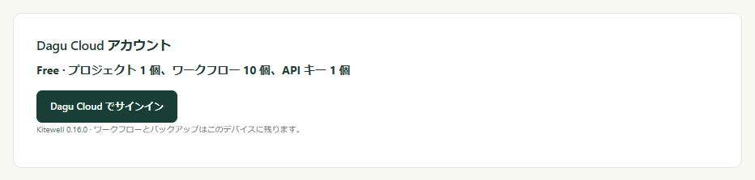

ノート PC でワークフローを直し、事務所のコンピューターにその新しい版を実行させる。ファイルを誰かに送る必要はありません。[Dagu Cloud](https://console.dagu.sh) が保持するのはプロジェクトの定義です。作業自体は引き続き各コンピューターが自分のパスワードで実行し、シークレットの値は入力したデバイスの外に出ません。

同期はプロジェクトごとに選べます。同期するまで、プロジェクトはそのコンピューターにとどまり、Dagu Cloud には何も届きません。

## 必要なもの

- Dagu Cloud のアカウント。無料で、無料アカウントでは 1 プロジェクトを同期できます。
- ほかの人と共有するには Kitewell Team。予定価格は、ワークスペースに接続するコンピューター 1 台あたり月額 4,400 円（税込 4,840 円）で、25 人まで利用できます。それより大きなチームは [Enterprise](/ja/pricing/#enterprise) をご利用ください。チームのオーナーがワークスペースの料金を支払うため、メンバーが個別にサブスクリプションを契約する必要はありません。Kitewell Personal（月額 3,000 円、税込 3,300 円の予定）は 1 人が 1 台で使うプランのため、ほかの人を招待できません。詳しくは[料金](/ja/pricing/)を参照してください。

## サインイン

1. **このデバイス → デバイス設定** を開き、**Dagu Cloud アカウント** を見つけます。このコンピューターがどのプランかが表示されます。
2. **Dagu Cloud でサインイン** を選びます。
3. Kitewell が短いコードと **ブラウザーで続ける** のボタンを表示します。ブラウザーを開いてサインインし、そこに表示されたコードが Kitewell に表示されたものと一致することを確かめて、コンピューターを接続します。

コンピューターは 1 つのワークスペースと同期し、接続後は **Dagu Cloud アカウント** にそのワークスペース名が表示されます。ワークスペースに接続できるコンピューターの台数はプランで決まります。無料アカウントと Kitewell Personal は 1 台、Kitewell Team は購入した台数です。台数を超えて接続すると、そのワークスペースにある自分の最も古いコンピューターの接続が解除されます。残りがすべてほかの人のコンピューターの場合は、どれかの接続を解除するか、プランの台数を増やすまで接続できません。

サインインしただけでは何も送信されません。サインイン済みのコンピューターが行うのは、プランの確認と、Kitewell のバージョンと自身の名前と ID の報告だけです。ワークフロー、設定、実行履歴、ログ、シークレットは送信しません。

## プロジェクトを同期する

1. プロジェクトセレクターを開き、**管理** を選びます。
2. **プロジェクトを管理** で、プロジェクトの横の **Dagu Cloud に同期** を選び、確認します。

プロジェクトがアップロードされ、**同期中** と表示され、以降の保存はすべてまず Dagu Cloud に送られます。

:::caution
ワークフローの YAML、バッチ入力、API のアドレスは、書かれたとおりに共有されます。そこに直接入力したパスワードは同期する前に削除し、代わりに[シークレット](/ja/docs/secrets/)に保存してください。
:::

アップロードが途中で止まると、プロジェクトに **アップロード未完了** と表示され、**アップロードを再開** が使えます。アップロードが終わるまで、保存は待たされます。

無料アカウントで同期できるプロジェクトは 1 つです。Kitewell Personal では最大 10 個、Kitewell Team では最大 15 個のプロジェクトを、それぞれ最大 100 個のワークフローまで同期できます。プランに空きのないプロジェクトの同期は、理由とともに拒否されます。同期プロジェクトは、コンピューター自身のプロジェクト数の上限ではなく、ワークスペースのプランに数えられます。

プランを切り替えるには、Dagu Cloud の **Kitewell** ページで **Kitewell Team に切り替える** または **Kitewell Personal に切り替える** を選びます。Team のコンピューターの台数も同じページで変更できます。どちらの変更分も、Stripe が次回の請求書で調整します。Personal に切り替える前に、ほかのメンバーを削除して招待を取り消し、接続するコンピューターを 1 台にしてください。

## 別のコンピューターでプロジェクトを使う

1. そのコンピューターを同じワークスペースにサインインさせます。
2. **プロジェクトを管理** を開き、**Dagu Cloud からダウンロード** を選びます。
3. **Dagu Cloud のプロジェクト** で、プロジェクトの横の **ダウンロード** を選びます。

一覧には、すでに **このデバイス上** にあるものが示され、閲覧だけが許可されたプロジェクトには **閲覧のみ** が付きます。コンピューターにある既存のプロジェクトと同じ名前のプロジェクトは、どちらかの名前を変えるまでダウンロードできません。

ダウンロードしたワークフローは一時停止の状態で届きます。手動で 1 回実行してから、このコンピューターが担当するものを有効にしてください。

メールボックスを扱うワークフローだけは例外で、同時に 1 台のコンピューターでしか実行されません。2 台で動くと同じメールを 2 回処理してしまうためです。すでに別のコンピューターが実行しているワークフローを有効にしようとすると、その旨が表示され、**このデバイスで実行** で移せます。

## 最新の状態に保つ

Kitewell は、起動時、プロジェクトを開いたとき、ワークフローを編集のために開いたときに、ほかの場所で行われた変更を取り込みます。Dagu Cloud への確認は最大で 1 分に 1 回です。Kitewell Personal と Team では、コンピューターがおよそ 5 分ごとに自動で確認するため、誰も触っていないコンピューターも新しい版を取り込みます。無料アカウントでは、上の 3 つのタイミングと、こちらから確認したときだけです。

それ以外のタイミングで確認するには、**プロジェクトを管理** で **Dagu Cloud から更新** を選びます。エディターで開いているワークフローは、何も入力していなければ、その場で更新を取り込みます。

変更を取り込むと、プロジェクトのエンジンが再起動します。すでに進行中の実行は、開始時の定義のまま続きます。そのコンピューターにとって新しいワークフローは一時停止の状態で届き、すでにあるワークフローは、有効かどうか、どこで実行するか、アラートをそのまま保持します。

開いた後に誰かが同じ項目を保存していた場合、保存は中断され、**Dagu Cloud で変更されています** と表示されます。相手の変更を自分の変更で置き換えるには **上書き** を、保存せずに編集内容を残すには **キャンセル** を選びます。

同期プロジェクトのファイルは Kitewell が管理します。Kitewell の外でファイルを編集しても、Dagu Cloud から変更が届いたときや、次にその項目を Kitewell で保存したときに置き換えられます。

## 同期されるものと、残るもの

同期プロジェクトに含まれる内容は、[プロジェクトのエクスポート](/ja/docs/sharing/)と同じです。ワークフローの定義とスケジュール、エージェントとモデル、API 接続とインポートしたドキュメント、サーバーとサーバーグループ、キュー、イメージレジストリ、バッチシート、シークレットの名前と説明、プロジェクトのワークフロー既定値、[ナレッジ](/ja/docs/knowledge/)です。さらに、エクスポートには含まれないプロジェクトの[リリース](/ja/docs/releases/)も同期されます。

:::note[シークレットの値はコンピューターに残ります]
同期プロジェクトは、使うシークレットを名前だけで示します。値は各コンピューターがそれぞれ保存し、そのコンピューター上で設定します。設定するまで、**シークレット** には **値が必要** と表示されます。
:::

レジストリのサインイン、SSH 鍵と承認済みのホスト鍵、作業ディレクトリ、ワークフローの有効・無効、アラート、実行履歴、ログも、各コンピューターがそれぞれ保持します。これらは Dagu Cloud には届きません。

## チームで作業する

ワークスペースのオーナーは、Dagu Cloud の **Kitewell** ページでチームを管理します。

- **招待** から、メールアドレスで相手を招待します。招待は、承諾されるか、取り消されるか、7 日後に期限切れになるまで、25 人の枠の 1 人として数えられます。招待された人は、そのアドレスで Dagu Cloud にサインインして招待を承諾します。
- **同期プロジェクト** には、チームが同期しているすべてのプロジェクトが一覧表示され、プロジェクトごとに各メンバーのロールを設定できます。
  - **閲覧者** は、プロジェクトを閲覧し、ダウンロードできます。
  - **編集者** は、さらに変更を保存できます。
  - **管理者** は、さらに Dagu Cloud からプロジェクトを削除できます。
  - **アクセスなし** では、プロジェクトは表示されません。

オーナーはすべてのプロジェクトを開けます。プロジェクトを同期したメンバーは、そのプロジェクトの管理者になります。メンバーも同じ方法でコンピューターを接続し、Dagu Cloud に尋ねられたらチームのワークスペースを選びます。

:::caution
編集者が保存した変更は、プロジェクトを同期しているすべてのコンピューターで、各コンピューターが更新を取り込んだ時点から実行されます。編集者のロールは、チームのコンピューター上でコマンドを実行させても問題ないと信頼できる人にだけ付与してください。
:::

あなたの役割が **Viewer** のプロジェクトには、ページのヘッダーとダウンロード一覧に **閲覧のみ** と表示されます。ワークフローの実行、コンピューター上でのシークレットの値の設定、このコンピューターで実行するワークフローの有効化はできます。Dagu Cloud が拒否する編集、つまりワークフローの変更、リリースの作成や適用、シークレットの宣言は表示されません。

## プランが終わったとき

有料プランが終わると、アラート、MCP Events、Webhook が止まります。それ以外は 7 日間そのまま動き、無料プランを超える分のプロジェクト、ワークフロー、API キーと接続済みのアプリがいつ止まるかが、すべてのページのバナーに表示されます。

- **残すものを選ぶ**：バナーまたは **デバイス設定** から、プランの上限まで、動かし続けるプロジェクト、ワークフロー、キーとアプリを選べます。選ばなかった場合は、最近実行したもの、最近使ったものが残ります。
- **プラン外**：上限を超えた分には **プラン外** と表示されます。スケジュールでも手動でも実行されず、編集もできませんが、開いて実行履歴を見たり、エクスポートや削除をしたりできます。実行中のものは最後まで動きます。
- **データは削除されません**：再び契約すれば、スケジュールも含めてすべて元どおりに動きます。

上限の低いプランに変えたときも同じです。Dagu Cloud につながらないデバイスは、最後の有料プランのライセンスが切れるまでそのプランのまま動き、その後に同じ 7 日間があります。

## 同期を停止する

- **プロジェクトを管理** の **同期を停止** を選ぶと、プロジェクトはこのコンピューターと Dagu Cloud の両方に残ります。以降このコンピューターで保存した内容はローカルにとどまります。
- ダウンロード一覧の **Dagu Cloud から削除** は、あなたの役割が **Admin** の場合に表示され、このコンピューターで同期していないプロジェクトを削除して、プランの枠を空けます。ほかのコンピューターのコピーは Dagu Cloud に保存できなくなります。
- 別のワークスペースと同期しているプロジェクトには **別のワークスペース** と表示され、**同期を停止** だけを選べます。

プロジェクトが Dagu Cloud から削除された場合や、そのプロジェクトへのアクセス権を失った場合、プロジェクトはローカルプロジェクトとしてコンピューターに残ります。

コンピューターがオフラインのときは、その同期プロジェクトに保存できません。ワークフローの有効化やシークレットの値の設定など、コンピューターにとどまる変更は引き続き行え、有効なワークフローはそこにあるコピーから実行されます。Dagu Cloud がコンピューターの接続を受け付けなくなった場合は、**デバイス設定** の **アカウントを再接続** を選びます。
