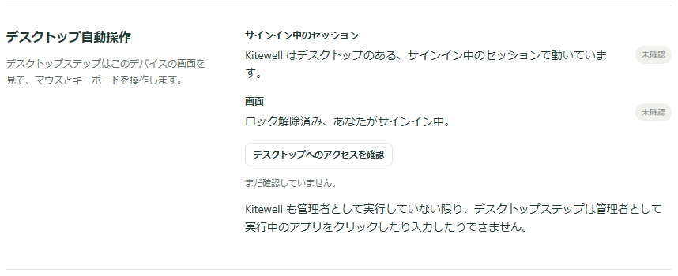
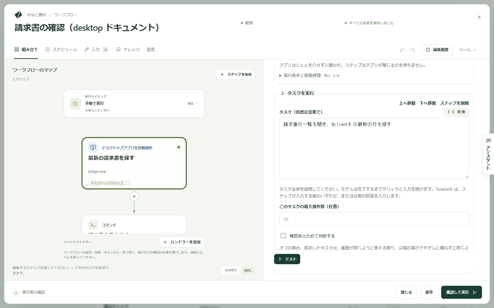

Kitewell は、人と同じようにコンピューターのアプリを使えます。画面を見て、クリックし、入力します。「%client% の請求書を作成して保存する」のように普通の言葉でタスクを書けば、モデルが終わるまで作業を続けます。

API も Web 版もない会計ソフトや ERP のクライアントにも届きます。

- スプレッドシートの各行を、会計や販売管理のアプリに入力する。
- デスクトップのダッシュボードの数値を読み取り、次のステップへ渡す。
- メニューからしか書き出せないアプリで、レポートを書き出す。
- アップデート後に、アプリが正しく表示されるかを確かめる。

macOS と Windows の、目の前の画面で動きます。実行中はマウスとキーボードを使いますが、あなたが触れた瞬間に手を離します。

## 必要なもの

コンピューターを操作できるモデル。Gemini 3.6 Flash、Claude Sonnet 5、GPT-5.4 などです。**エージェントとモデル** で[モデルを追加](/ja/docs/ai/)し、ステップの **モデル** で選びます。ワークフロー全体に設定するなら **設定 → 実行とリトライ → ブラウザーとデスクトップのステップの既定モデル** を使います。ツールを呼び出せる画像対応モデルであれば、ほかのモデルでも動きます。**デスクトップ設定** の **モデルがデスクトップを操作する方法** は通常 **自動** です。**汎用ツール（どの画像対応モデルでも可）** にすると、コンピューター操作ツールを持たないモデルでも、汎用のクリックと入力のツールで作業できます。ただし遅く、確実さも下がります。

画面を使う許可。**デバイス設定 → デスクトップ自動操作** を開きます。各行は **デスクトップへのアクセスを確認** を選ぶまで **未確認** で、確認すると **準備完了** または **対応が必要** になります。

- Mac では行は **画面収録** と **アクセシビリティ** です。最初の確認で macOS が両方を求め、そのダイアログには **Kitewell Agent**（実際に画面を操作する Kitewell のバックグラウンドサービス）の名前が出ます。許可してください。ダイアログを閉じてしまった場合は、**システム設定を開く** で該当のパネルへ移動できます。
- Windows では行は **サインイン中のセッション** です。Kitewell は Windows サービスとしてではなく、あなたのサインイン中のセッションで動いている必要があります。また、Kitewell も管理者として実行していない限り、デスクトップステップは管理者として実行中のアプリをクリックしたり入力したりできません。

ロックされていない画面と、サインイン中のあなた。デスクトップステップは目に見えている画面を使うため、ロック中やスリープ中のコンピューターでは実行できません。スケジュール実行でも同じです。

## 最初のデスクトップのステップを作る

この例では会計アプリを開き、ある取引先の最新の請求書を探して、その番号を次のステップへ渡します。

1. ワークフローを開き、**ステップを追加**、**デスクトップアプリを自動操作** の順に選びます。**ステップ名** に `最新の請求書を探す` のような名前を付けます。**技術的な設定** の **ステップの識別子** は、このステップが読み取った値を後のステップが読むときに使う短い名前です。`invoice` のような分かりやすいものにしてください。
2. **モデル** を選びます。
3. **ステップが入力する値** で **値を追加** を選び、名前を `client` にして、**値** に取引先名を設定します。直接入力した文字列、ワークフローの入力、シークレット（ログに出ないよう保管されたパスワードやキー）のいずれも使えます。
4. **デスクトップでのステップ** で **デスクトップステップを追加** を使い、次の順に追加します。
   - **アプリを開く**。Mac では **アプリ** に入力するか、**アプリを選択…** で選びます。Windows では **プログラム** にプログラムのパスを入れるか、**プログラムを選択…** で選びます。
   - **タスクを実行**。**タスク（自然な言葉で）** に `請求書の一覧を開き、%client% の最新の行を探す`
   - **画面から読み取る**。**読み取る内容（モデルへの説明）** に `その行の請求書番号と合計金額` と書き、**読み取る値** に `number`（**型** は **文字列**）と `total`（**型** は **数値**）の 2 つを追加します

   

5. **テスト** を選び、マウスとキーボードから手を離して見守ります。
6. 読み取った値を `${steps.invoice.outputs.number}` のように使う後続のステップを追加します。

新しいワークフローの **または例から始める** には **デスクトップアプリからデータを取り出す** があります。このコンピューターにすでにあるアプリを開き、その表示を読み取る例です。

## モデルが完了できるタスクを書く

Web サイトのステップは 1 回に 1 操作ですが、デスクトップのステップはタスクをまるごと受け取ります。モデルはタスクが終わるまでクリックと入力を続けるので、1 つ 1 つのクリックではなく、何を終わらせたいかを書いてください。

- `請求書の一覧を開き、%client% の最新の行を探す`
- `%client% 宛に %amount% の請求書を新規作成し、下書きとして保存する`
- `今月の売上レポートを CSV として「ドキュメント」フォルダーに書き出す`

**デスクトップ設定** の **タスクごとの最大操作数** は、1 つのタスクで行えるクリックとキー入力の上限です。既定は 50 で、**このタスクの最大操作数（任意）** を使えばタスクごとに別の上限を設定できます。上限を超えるタスクは失敗するので、分割するか上限を上げてください。

## デスクトップのステップでできること

中のステップは、このコンピューターの画面で順に実行されます。

- **アプリを開く** はアプリやプログラムを起動します。終了を待つことはありません。Mac では **代わりにコマンドを実行** で **コマンド** と **引数 · 1 行に 1 つ（任意）** を指定できます。
- **タスクを実行** は **タスク（自然な言葉で）** を実行します。`%name%` は、ステップが入力する値か、それ以前にあなたが答えた回答を入力します。
- **画面から読み取る** は **読み取る内容（モデルへの説明）** を読み、**読み取る値** の各値を埋めます。各値には **名前**、**型**、モデルに値の意味を伝える **説明（任意）** があります。後のステップは各値を `${steps.<識別子>.outputs.<名前>}` として読みます。
- **次を確認する…** は、画面が思ったとおりでなければステップを失敗させます。**画面に表示されているべきもの…** をモデルがスクリーンショットから判断し、**確認を続ける時間（任意）** でアプリがその状態になるまで待てます。
- **待機** は、指定した **待機時間** だけ待ちます。
- **スクリーンショットを撮る** は、付けた **スクリーンショット名** で画面全体の PNG を実行のファイルに保存します。
- **私に入力を求める** は **あなたに表示する質問** を表示し、あなたが答えるまで一時停止します。**回答の名前** を付けると、後のステップがその回答を入力できます。待っている間、ほかのデスクトップステップが画面を使うことがあります。

どのステップにも **実行条件と制限時間** があり、条件を満たすときだけ実行したり、所要時間を制限したりできます。どちらも設定しない場合、1 ステップは最長 5 分です。

## パスワードをモデルに渡さない

**ステップが入力する値** には、ステップが入力するものを登録し、タスクの中では `%name%` と書きます。モデルが目にするのは名前だけです。

機密の値には、シークレットを値として選んでください。タスクにも、モデルにも、ログにも含まれません。シークレットの値をそのまま書いたタスクは、値を送らずに失敗し、**確認して実行** が実行前に知らせます。

## 画面をあなたと分け合う

デスクトップステップは 1 つずつ実行されます。画面は 1 つなので、2 つ目のステップは 1 つ目を待ちます。**各項目を処理** のループの中でも、[バッチシート](/ja/docs/batches/)の中でも同じで、項目は同時にではなく順番に処理されます。

クリックや入力の前に、ステップはマウスとキーボードが 15 秒使われないのを待ち、あなたが使い始めた瞬間に一時停止します。入力を横取りすることはありません。**デスクトップ設定** の **マウスやキーボードが使われなくなってから待つ時間** でこの待ち時間を変えられ、誰も作業しないコンピューターでは `0` にして待たないようにできます。

デスクトップステップの実行中は、メニューバーまたは通知領域の Kitewell のアイコンがポインターに変わり、メニューの先頭に実行中のステップが並びます。コンピューターを使用中、あなたが使っているため一時停止中、ほかのデスクトップステップを待機中、のいずれかです。その下の **停止** は、それらのステップが属する実行だけを止めます。画面の上には何も描画されません。モデルがスクリーンショットでそれを見て、クリックしてしまうおそれがあるからです。

## 実行中に見えるもの

実行は **実行とログ** から開きます。**デスクトップで行われたこと** に、ステップごとの内容とスクリーンショットが順に並び、マウスとキーボードが空くのを待った箇所や、ほかのデスクトップステップを待った箇所も表示されます。その横には、尋ねた **モデル** と、入出力のトークン数である **モデルの使用量** が並びます。

**モデルを使わずに再生** は、記憶から実行されたタスクの数です。一度完了したタスクは、画面が同じように見えるかぎり、以降の実行でも同じように繰り返されます。速く、費用もかかりません。タスクごと、またはステップ全体の **毎回あらためて判断する**（**デスクトップ設定**）でこれを止められ、**プロジェクト設定 → ストレージ → リプレイキャッシュ** では、アプリが変わったあとにワークフローの記憶を消去できます。このキャッシュはこのコンピューターに残り、バックアップには含まれません。

## プロバイダーが確認を求めたとき

モデルのプロバイダーによっては、購入のような操作の前に人の承認を求めて止まります。ステップもそこで止まります。**デスクトップ設定** の **モデル提供元が操作の確認を求めたとき** は **ステップを止める** です。**続行する** にすると、承認なしでその操作が実行されます。より安全なのは、タスクの前に **私に入力を求める** のステップを置くことです。判断はあなたのもので、実行とともに記録されます。

## うまくいかないとき

まずステップのスクリーンショットを見てください。そのうえで次を確認します。

- 許可が足りない、とステップが言う場合。**デスクトップへのアクセスを確認** をもう一度実行し、その行が示すものを許可します。
- 画面がロックされていた、または別の人がサインインしていた場合。デスクトップステップには、あなたがサインインした、ロックされていないこのコンピューターの画面が必要です。
- タスクが操作数の上限に達した場合。2 つのタスクに分けるか、**タスクごとの最大操作数** を上げます。
- 制限時間のあいだずっと誰かがマウスやキーボードを使っていて、ステップが画面を使えなかった場合。コンピューターが空いているときに実行するか、ステップの制限時間を延ばします。

そのほかは[トラブルシューティング](/ja/docs/troubleshooting/#a-desktop-step-fails)にあります。

## 詳細

モデルが判断する操作ごとに、ほかに開いているウィンドウも含めた画面全体のスクリーンショットがモデルのプロバイダーに送られ、そのプロバイダーの料金がかかります。見られては困るものは実行前に閉じるか、誰も作業しないコンピューターを使ってください。ステップが入力する値とシークレットは送られません。実行とともに保存されたスクリーンショットは、実行の保持期間のあいだこのコンピューターに残ります。[コンピューターから出る情報](/ja/docs/data-flow/)を参照してください。

デスクトップステップが動くのは macOS と Windows だけで、このコンピューター自身の画面を使います。画面収録を拒否するアプリは操作できません。Windows で管理者として実行中のアプリも、Kitewell が管理者でなければ操作できません。

上の「最初のデスクトップのステップを作る」のワークフローは 2 つのステップです。`client` という値、Numbers を起動する **アプリを開く**、その取引先の最新の行を探す **タスクを実行**、請求書番号と合計金額を読み取る **画面から読み取る** を持つ **デスクトップアプリを自動操作** と、その 2 つの値を使う後のステップです。

Windows では **アプリを開く** に `notepad.exe` のようなプログラム名か、プログラムとそれに渡す引数を書きます。
