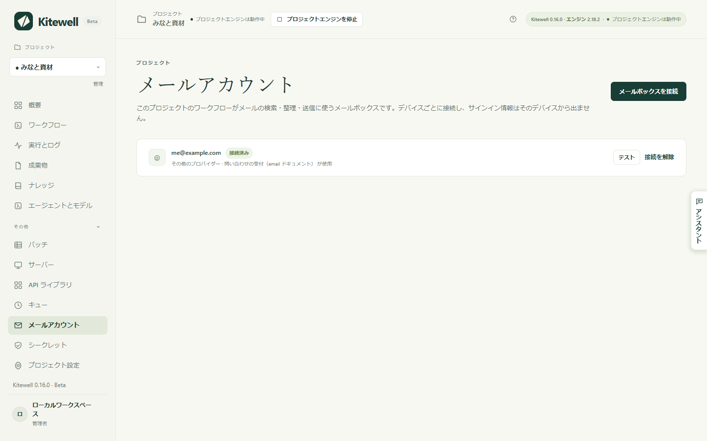
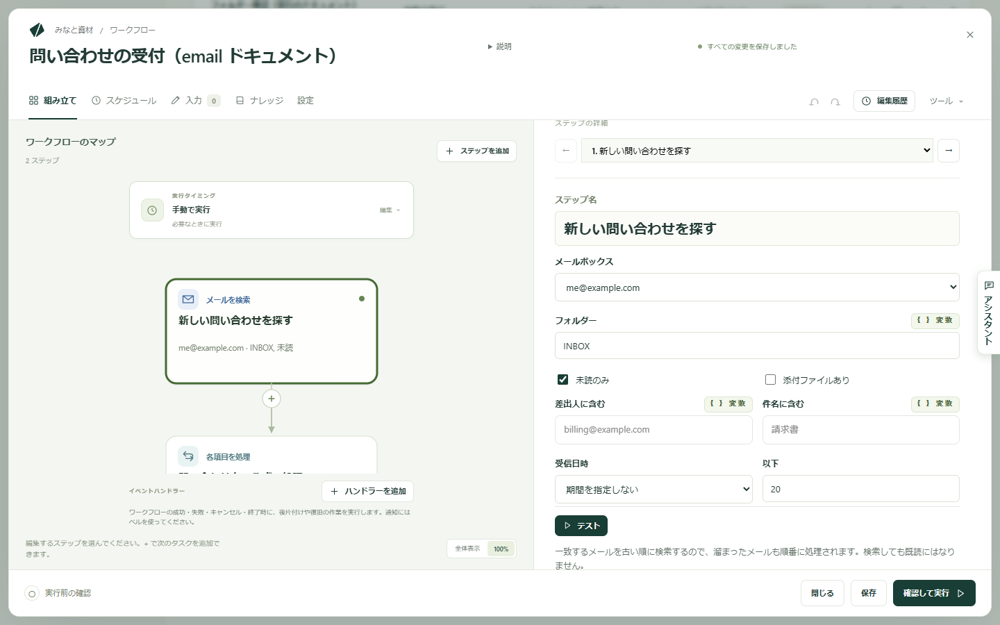

Kitewell は受信トレイの作業を代わりに行えます。必要なメールを見つけ、何らかの処理をして、片付けます。メールを作成して送ることもできます。このコンピューターで接続したメールボックスを使い、サインイン情報がコンピューターから出ることはありません。

受信トレイで始まる、あるいは終わる作業です。

- 未読の請求書メールの添付ファイルを保存し、金額を記録する。
- 問い合わせを、接続した API でチケットにする。
- 過去 24 時間に届いたメールを要約し、ダイジェストを送る。
- 届いたメールを、モデルに振り分け先を選ばせてフォルダーに整理する。
- 問い合わせごとに返信の下書きを作り、誰かの承認を得てから送信する。

## 必要なもの

このコンピューターで接続したメールボックス。Gmail と Google Workspace、Microsoft 365 と Outlook.com、iCloud、Yahoo、Fastmail、そのほかの IMAP メールボックスが使えます。プロジェクトの **メールアカウント** に、プロジェクトのワークフローが使うメールボックスと、このコンピューターでの状態が一覧されます。

追加するには、そこで **メールボックスを接続** を選ぶか、いずれかのメールタスクの **メールボックス** で **メールボックスを接続…** を選び、アドレスを入力します。Kitewell はアドレスから、または独自ドメインのメールの配送先からプロバイダーを判別し、間違っていれば **プロバイダー** のリストで直せます。

| プロバイダー | 接続方法 |
| --- | --- |
| Gmail、Google Workspace | Google が Kitewell を審査している間はアプリパスワード |
| Microsoft 365、Outlook.com | ブラウザーでのサインイン |
| iCloud、Yahoo、Fastmail | プロバイダーのサイトで作るアプリパスワード。ダイアログにリンクがあり、サーバーは入力済み |
| そのほかのメールボックス | IMAP と SMTP のサーバー、ポート、セキュリティ、ユーザー名、パスワード |

ブラウザーでのサインインは、プロバイダーのページを開いて待ち、あなたが許可すると自動で続きます。その後 Kitewell は一度サインインしてフォルダーを一覧し、受信トレイの未読数を表示します。失敗した場合はその理由を表示します。この確認を通るまで、何も保存されません。

プロバイダーごとの注意点です。

- Google は、Kitewell の Gmail アクセスの審査が終わるまで、ほとんどのアカウントでブラウザーでのサインインをブロックします。ページには「このアプリはブロックされています」と表示され、先へ進む方法はありません。それまでは、ダイアログがアプリパスワードで Gmail のメールボックスを作ります。2 段階認証プロセスをオンにし、Kitewell という名前でアプリパスワードを作り、貼り付けてください。ブラウザーでのサインインが使える場合も、入力したアドレスでサインインし、Gmail のチェックボックスをオンにする必要があります。サードパーティ製アプリを制限している Google Workspace の管理者は、API の制御で Kitewell を許可する必要があります。
- Microsoft 365 のメールボックスでは IMAP と認証済み SMTP を有効にする必要があります。管理者が Microsoft 365 管理センターの、該当ユーザーのメール、メールアプリの管理で設定します。承認済みのアプリだけを許可している組織には、管理者が一度 Kitewell を承認するためのリンクが表示されます。共有メールボックスは、それを開けるメンバーとしてサインインして接続します。
- アプリパスワードはプロバイダーのサイトで作成し、同じ場所で無効化できます。

接続は、プロバイダーが終了させるまで続きます。コンピューターが動いている間、Kitewell がブラウザーでのサインインを更新し続けるからです。サインインが使えなくなったメールボックスには、**メールアカウント**、**概要**、失敗した実行のそれぞれに **再接続** が表示されます。

## 最初のメールのワークフローを作る

この例では、問い合わせ用の受信トレイで未読メールを探し、接続した API でそれぞれのチケットを作り、チケットができたメールを既読にします。

1. ワークフローを開き、**ステップを追加**、**メールを検索** の順に選びます。**メールボックス** を選び、**フォルダー** は `INBOX`、**未読のみ** はオンのままにして、**ステップ名** に `新しい問い合わせを探す` のような名前を付けます。**テスト** を選ぶと、どのメールが該当するか分かります。テストで既読になることはありません。

   

2. **メールごとに…** を選びます。見つかったメールを回す **各項目を処理** のループが追加され、その最後に、現在のメールを既読にする **メールを整理** のステップが入ります。
3. ループの中、そのステップの前に **API アクションを使う** を追加し、チケットシステムの「課題を作成」の操作を選びます。その入力欄では、変数の選択肢に現在のメールの差出人、件名、日時、本文が並びます。
4. [スケジュール](/ja/docs/scheduling/)を追加します。5 分ごとなどです。

新しいワークフローの **または例から始める** には **新着メールを 1 通ずつ処理** があります。この形のまま、各メールの作業だけを埋める例です。

## メールのステップでできること

**メールを検索** は、**フォルダー** の中の該当するメールを古い順に一覧し、差出人、件名、日時、本文を取り出します。**未読のみ**、**添付ファイルあり**、**差出人に含む**、**件名に含む**、**受信日時**（**期間を指定しない**、**過去 1 時間**、**過去 24 時間**、**過去 7 日**、**過去 30 日**）で絞り込めます。**添付ファイルを実行のファイルに保存** をオンにすると、添付ファイルが実行の成果物として保存されます。**以下** には取得する最大件数を入れます。既定は 20 件、最大は 50 件で、たまったメールは数回の実行に分けて古い順に処理されます。検索でメールが既読になることはありません。後のステップは一覧を `${steps.<識別子>.outputs.messages}` として読みます。

**メールを整理** は、**メール** に指定したものを処理します。**メールを検索** のステップが見つけたもの、そのうちの 1 通、または各メールと移動先を示す AI タスクの回答を指定できます。**状態** では **既読にする**、**未読にする**、**フラグを付ける**、**フラグを外す**、**そのままにする** を選びます。**移動** では **移動しない**、**フォルダーへ移動**（**フォルダー** で名前を指定し、同名のフォルダーがなければ作成されます）、**アーカイブ**、**ゴミ箱へ移動** を選びます。完全に削除されることはありません。すでに誰かが移動したメールは見つからなかったものとして報告され、ステップは失敗しません。**テスト** は変更内容を確認するだけです。

**メールを送信** は **送信元** のメールボックスから送ります。**宛先**、**件名**、**メッセージ**、**添付ファイル · 1 行に 1 つのファイルパス** を指定します。見つけたメールを回すループの中で **現在のメールに返信** をオンにすると、そのメールのスレッドに返信が付き、宛先は差出人、件名は `Re:` と元の件名になります。**宛先** と **件名** を自分で書いた場合はそちらが使われます。Gmail と Microsoft 365 は送信済みにコピーを残しますが、ほかのプロバイダーでは残らないことがあります。

## 各メールを一度だけ処理する

**未読のみ** をオンのままにして、ループの中で、そのメールの作業のすぐ後に既読にするか移動してください。作業が失敗したメールは未読のまま残るので、次の実行ではそのメールだけが再試行されます。

ループの後で印を付けると、失敗したメールにも印が付いてしまいます。ループ後のステップは、一部の項目が失敗しても実行されるからです。そのメールは二度と試されません。ダイジェストのようにまとめて行う作業であれば、最後に **メールを整理** を 1 つ置くのが正解です。

**確認して実行** は、見つけたメールに印が付かない場合、ループの後でだけ印が付く場合、そしてメールの本文がコマンドやコマンドを実行できる AI エージェントに渡る場合に警告します。その本文を書いたのはメールの送り主なので、送り主のものとして扱ってください。メールを読むモデルには、コマンドを実行できない **モデルに尋ねる** のステップを使います。

## チームで使う

メールボックスのアドレスは、ほかのテキストと同じようにワークフローの中を運ばれますが、接続そのものは運ばれません。同僚や [Dagu Cloud](/ja/docs/cloud-sync/) から届いたプロジェクトは、接続が必要なメールボックスを **概要** に一覧し、それが必要な実行は、このコンピューターで接続するまで拒否されます。

同期されたプロジェクトでは、メールボックスを扱うスケジュール実行のワークフローは 1 台のコンピューターでのみ実行されます。2 台が同じメールを処理することはありません。別のコンピューターで実行中のものをここでオンにすると、こちらへ移すかどうかを尋ねられ、もう一方は次回の同期でオフになります。どのコンピューターが実行するかは、ワークフローの一覧に表示されます。

## うまくいかないとき

- メールボックスがここで接続されていないため実行が拒否される場合。**メールアカウント** を開き、**接続** または **再接続** を選びます。プロバイダーが何を拒否したかはダイアログに表示されます。
- Google が「このアプリはブロックされています」と表示する場合。そのページを閉じて Kitewell に戻り、**代わりにアプリパスワードを使う** を選びます。
- 毎回同じメールが見つかる場合。メールに印が付いていません。ループの中に、**状態** を **既読にする** にした **メールを整理** のステップを追加してください。

そのほかは[トラブルシューティング](/ja/docs/troubleshooting/#a-mailbox-needs-reconnecting)にあります。

## 詳細

サインイン情報は、バックアップ、エクスポート、同期のいずれにも含まれません。復元したコンピューターでは、もう一度接続を求められます。ステップが読んだメールは、実行の保持期間のあいだこのコンピューターに実行とともに保存され、AI タスクで選んだモデルなど、あなたのワークフローが送る先にしか出ていきません。[コンピューターから出る情報](/ja/docs/data-flow/)を参照してください。

Gmail のブラウザーでのサインインが求めるのは、メールの読み取り、ラベル付け、ゴミ箱への移動、送信（`gmail.modify`）で、完全に削除する権限は求めません。同意画面と[プライバシーポリシー](/ja/privacy/)にもそう書かれています。一方、アプリパスワードはメールボックス全体への IMAP と SMTP のアクセスを与えます。

**メールを検索** の 1 回の実行で取得できるのは最大 50 件です。転送、下書き、メール 1 通ごとのトリガーはありません。**未読のみ** とスケジュールの組み合わせが同じ役目を果たします。IMAP または認証済み SMTP を無効にしている Microsoft 365 のテナントでは、そもそも接続できません。

上の「最初のメールのワークフローを作る」のワークフローは 3 つのステップです。**未読のみ** をオンにした **メールを検索**、見つかったメールを回す **同時に処理する項目数** が 1 の **各項目を処理** のループ、そしてループの中の、チケットシステムの「課題を作成」の操作を選んだ **API アクションを使う** と、現在のメールを既読にする **メールを整理** です。
