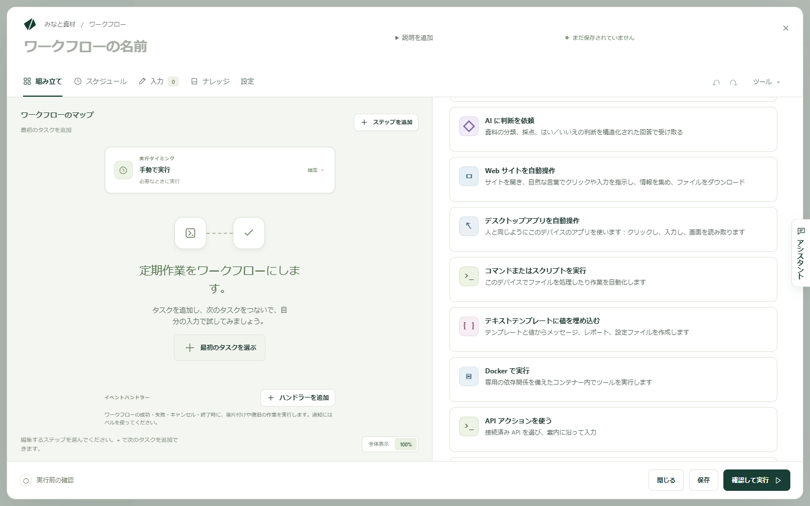
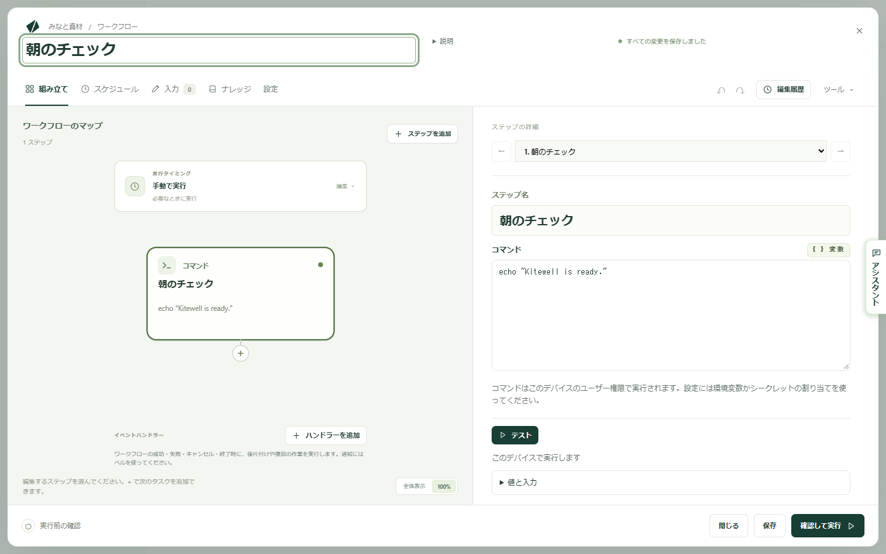
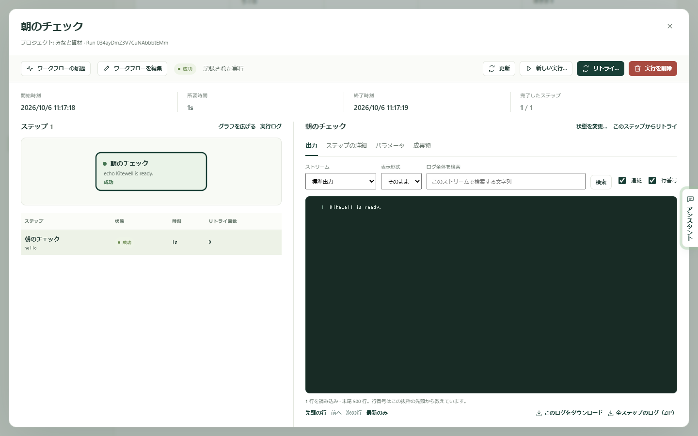

ワークフローとは、ステップを組み合わせた 1 つの定期作業です。このページでは、その中でいちばん小さいものを作ります。1 行を表示するだけのコマンドが 1 つ。すべて自分のコンピューターの中で動き、どこにも接続せず、AI のアカウントも要りません。これが動いたら、コマンドを本当にやりたい内容に差し替えて、スケジュールを付けます。

## 必要なもの

[インストール](/ja/docs/install/)済みの Kitewell が開いていて、プロジェクトがあること。初めて Kitewell を開くときは、**このデバイスで始める** を選ぶとプロジェクトが 1 つ作られます。続けて、画面の各部を案内する短いツアーが表示されます。**ツアーをスキップ** で閉じられ、上部バーの疑問符、**使い方を見る** からもう一度見られます。

## 組み立てる

1. **ワークフローを作成** を選びます。エディターが **組み立て** の画面で開き、マップは空の状態です。
2. **ワークフロー名** に `Morning check-in` と入力します。
3. **最初のタスクを選ぶ** を選びます。ステップにできることの一覧が表示されます。
4. **コマンドまたはスクリプトを実行** を選びます。

   

5. **コマンド** に、次の 1 行を入力します。

   ```sh
   echo "Kitewell is ready."
   ```

6. **ステップ名** にも `Morning check-in` と入力します。マップでも各実行でも、ステップの内容が読み取りやすくなります。

左のマップにステップが 1 つ表示されます。ステップを選ぶと、右側で編集できます。ステップの下の **+** で次のステップを追加でき、**ステップを追加** ではどこにでも追加できます。



## 実行する

1. **確認して実行** を選びます。Kitewell がワークフローを検証し、実行できる状態かを伝えます。
2. **保存して実行…** を選びます。ワークフローが保存され、その実行に必要な値を入力するフォームが開きます。今回は必要な値はありません。
3. **実行を開始** を選びます。

保存と実行は別の操作です。**保存** はワークフローを保存するだけで実行はしません。作業中は何度でも保存できます。

## 結果を見る

**実行とログ** を開きます。いちばん新しい実行が先頭にあります。その横の **実行を表示** を選びます。

実行の画面には、結果、ステップ、そして選んだステップの出力が表示されます。コマンドが表示した行はここにあります。



## スケジュールを付ける

1. ワークフローをもう一度開き、**スケジュール** を選びます。
2. **実行** で **毎日** を選び、時刻を決めます。
3. **保存済みのスケジュールを有効にする** がオンになっているか確認します。スケジュールは保存した時点から有効になります。
4. **保存** を選びます。

Kitewell は、コンピューターがスリープしておらず、あなたがサインインしていて、Kitewell が動いている限り、毎日その時刻にワークフローを実行します。ウィンドウは閉じてかまいません。メニューバーやトレイで動き続けます。無人での実行に頼る前に、[スケジュール](/ja/docs/scheduling/)を読んでください。

## うまくいかないとき

- 実行が失敗した。**実行とログ** から開きます。上部の要約が、失敗したステップを名指しし、**失敗を確認** を示します。そのステップのログが見られます。
- ターミナルでは動くコマンドが、ここでは動かない。Kitewell の環境はターミナルの環境とは違います。プログラムはフルパスで指定し、ステップに作業フォルダーを設定してください。[トラブルシューティング](/ja/docs/troubleshooting/#a-command-works-in-a-terminal-but-fails-in-kitewell)を参照してください。

## 自分の作業に変える

サンプルのコマンドを、普段手作業でやっていることに置き換えます。そのうえで、

- 実行ごとに変わる値は **入力** に移します。実行のたびに値を渡せます。
- パスワードやキーはコマンドに直接書かず、[シークレット](/ja/docs/secrets/)に保存します。
- Docker、AI、人による一時停止、別のマシンでのコマンドなど、ほかの種類のステップは[ワークフローを組み立てる](/ja/docs/workflow-builder/)から追加します。
- 同じワークフローをリストの行ごとに 1 回ずつ実行するには、[バッチシート](/ja/docs/batches/)を使います。

API モデルを設定していれば、作りたいワークフローを言葉で説明して、[アシスタント](/ja/docs/ai/#the-assistant)に下書きさせることもできます。提案を受け入れるまで、何も保存されません。

## 技術的な詳細

- `echo "…"` は、Windows の PowerShell でも Mac のシェルでも同じように動く数少ないコマンドの 1 つです。片方のシステム向けに書いたコマンドが、もう片方でも動くとは限りません。
- コマンドは、Kitewell を実行しているユーザーアカウントの権限で動きます。
- **ツール → ワークフローを確認** は、保存も実行もせずに、インストールされているワークフローエンジンで下書きを検証します。**確認して実行** は、同じ検証を要約の一部として行います。
