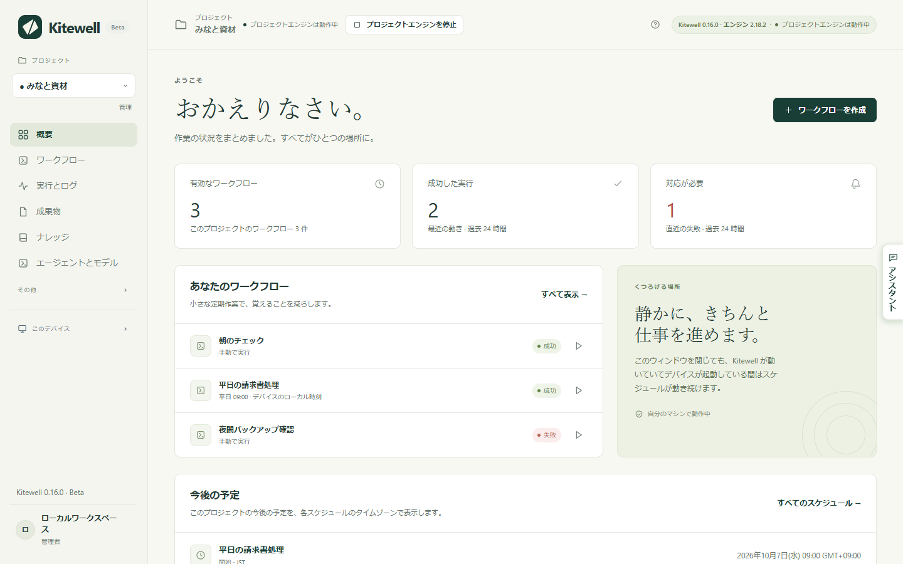

Kitewell は、チームが手作業でこなしている定期的な仕事を代わりに実行します。手順を一度だけ書いておけば、あとは自分のコンピューターの中で、決めた時刻に実行されます。実行はすべて、結果と出力つきで記録に残ります。

## はじめに

1. Mac または Windows の PC に [Kitewell をインストールする](/ja/docs/install/)。
2. [最初のワークフローを作る](/ja/docs/getting-started/)。ワークフローとは、ステップを組み合わせた 1 つの定期作業です。
3. [スケジュールを設定する](/ja/docs/scheduling/)。無人で実行するために何が必要かも、ここで確かめます。
4. [ワークフローをチームと共有する](/ja/docs/sharing/)。

始めるのにアカウントは必要ありません。

## ワークフローにできること

- **[ステップを組み合わせて作る](/ja/docs/workflow-builder/)**：コマンドやスクリプト、コンテナー、SSH 経由の別のマシン、Web リクエスト、AI、そして人が承認するまでの一時停止。
- **[Webhook で開始する](/ja/docs/webhooks/)**：GitHub、Stripe、フォーム、Zapier からリクエストが届いたときに実行を始めます。ポートを開けたり、トンネルを用意したりする必要はありません。
- **[Web サイト](/ja/docs/browser/)**、**[デスクトップアプリ](/ja/docs/desktop/)**、**[メール](/ja/docs/email/)** を、コードではなく自然な言葉で自動操作します。
- **[Excel を自動化](/ja/docs/spreadsheets/)**：現場にあるブックをそのまま読み、結果を元の行に書き戻します。
- **[シートで一括実行](/ja/docs/batches/)**：行ごとに 1 回ずつ実行し、各実行の結果を集めます。
- **[アシスタントに任せる](/ja/docs/ai/#the-assistant)**：ワークフローの下書きや修正を頼み、失敗した実行を[診断](/ja/docs/ai/#failure-diagnosis)させます。
- **[OpenAPI の定義をインポート](/ja/docs/apis/)**：そこから Kitewell が作るリクエストフォームに入力します。
- **[プロジェクトを共有](/ja/docs/sharing/)**、または **[Dagu Cloud と同期](/ja/docs/cloud-sync/)** して、すべてのコピーを同じ状態に保ちます。各デバイスは独自の認証情報を用意し、そのデバイスで実行すべきワークフローだけを有効にします。

:::note[初期リリースについて]
Kitewell は公開されたばかりのため、機能や制限は今後変更される可能性があります。公開インストーラーは macOS と Windows 向けです。Linux への対応も予定しています。現在の提供状況は[ダウンロード](/ja/download/)で確認してください。
:::

## 料金

プロジェクト 1 つ、その中のワークフロー 10 個まで、API キーまたは接続済みのアプリ 1 つまでは無料で、Kitewell アカウントも必要ありません。プロジェクトごとに、ワークフロー、履歴、シークレットは分かれています。

Kitewell Personal は 1 人・1 台で月額 3,000 円（税込 3,300 円）の予定で、それぞれ最大 100 個のワークフローを持つプロジェクトを最大 10 個、無制限の API キーと接続済みのアプリ、[アラート](/ja/docs/alerts/)、[Webhook](/ja/docs/webhooks/)を利用できます。Kitewell Team はコンピューター 1 台あたり月額 4,400 円（税込 4,840 円）の予定で、最大 25 人で、最大 15 個のプロジェクトと、それを同期するチームを利用できます。詳しくは[料金](/ja/pricing/)を参照してください。

## どこで何が実行されるか

[Dagu Cloud と同期](/ja/docs/cloud-sync/)することを選ばない限り、プロジェクトはデバイス上にとどまります。シークレットの値がデバイスの外に出ることはありません。アシスタントとの会話、失敗の診断、シートに読み取った値もデバイスに残ります。

AI のステップは、読み取った内容を選んだモデルのプロバイダーに送ります。実行の出力、ワークフローの定義、ページのテキストなどです。送り先の一覧は[コンピューターの外に出るもの](/ja/docs/data-flow/)にあります。

ウィンドウを閉じても何も止まりません。Kitewell は Mac ではメニューバー、Windows ではトレイに残って動き続け、スケジュールもそのまま実行されます。そのメニューの **Quit Kitewell** が、サービスとワークフローエンジンを止める操作です。

スケジュールされた作業を実行するには、コンピューターがスリープしておらず、あなたがサインインしている必要があります。Kitewell はクラウド上のマシンを提供しません。AI プロバイダー、リモートサーバー、コンテナー、外部サービスには、それぞれ独自の要件と費用があります。

## 技術的な詳細

Kitewell は、プロジェクトごとにローカルの Dagu ワークフローエンジンを実行します。エンジンはそれぞれ独自のデータディレクトリ、スケジューラー、暗号鍵を持ちます。ステップは Kitewell を実行しているユーザーアカウントの権限で動くため、信頼できるワークフロー定義とコマンドだけを実行してください。
