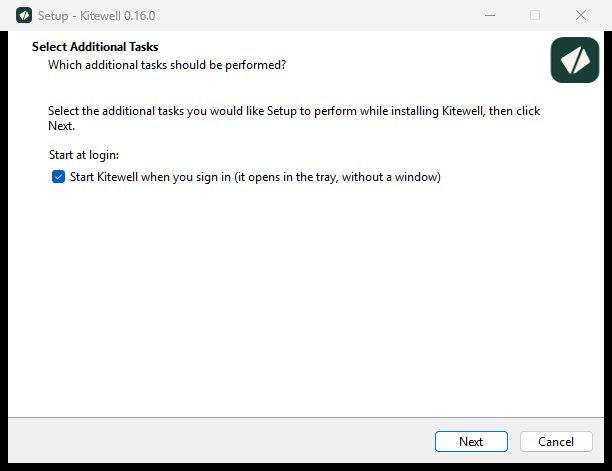

Kitewell は、お使いの Mac または Windows の PC にインストールする 1 つのアプリです。インストールは数分で終わり、最初のワークフローを作れる空のプロジェクトが用意されます。

## 必要なもの

- macOS 13 以降の Mac、または Windows 10 バージョン 1809 以降か Windows 11（64 ビット）の PC。
- お使いのシステム向けのインストーラー。提供状況は[ダウンロードページ](/ja/download/)で確認できます。掲載されていない場合、そのシステム向けのパッケージはまだ準備中です。

アカウントは必要ありません。Python、Docker、AI のツールも、最初は必要ありません。ワークフローで使うことになったときにインストールしてください。

## Mac にインストールする

1. [ダウンロードページ](/ja/download/)を開き、お使いの Mac 向けのダウンロードを選びます。Apple シリコンか Intel かは、**アップルメニュー → このMacについて** で確認できます。
2. ダウンロードした `.pkg` を開き、インストーラの指示に従います。Kitewell は「アプリケーション」フォルダーに入り、管理者のパスワードを求められます。
3. 「アプリケーション」フォルダーから **Kitewell** を開きます。
4. **このデバイスで始める** を選びます。Kitewell が最初のプロジェクトを作って開きます。すでにアカウントがあり、[プロジェクトを同期](/ja/docs/cloud-sync/)したい場合は、代わりに **Dagu Cloud でサインイン** を選びます。

Kitewell は初回起動時に **Start at login** をオンにするので、Mac を再起動してもスケジュールは実行され続けます。オフにしたいときは、メニューバーのメニューでいつでも切り替えられます。

続けて、[最初のワークフローを作りましょう](/ja/docs/getting-started/)。

## Windows にインストールする

1. [ダウンロードページ](/ja/download/)を開き、`Kitewell-<version>-amd64-setup.exe` をダウンロードします。
2. ダウンロードしたファイルを開きます。Kitewell は新しい発行元のため、Windows が SmartScreen の警告を表示することがあります。ファイルの SHA256 がダウンロードの横に表示された値と一致することを確認してから、**詳細情報** → **実行** を選びます。
3. インストーラーの指示に従います。**Start Kitewell when you sign in**（サインイン時に Kitewell を起動する）が最初からオンになっています。PC を再起動してもスケジュールが実行され続けるよう、オンのままにしておいてください。

   

4. 最後の画面では **Open Kitewell** をオンのままにして完了します。Kitewell が開きます。
5. **このデバイスで始める** を選びます。Kitewell が最初のプロジェクトを作って開きます。すでにアカウントがあり、[プロジェクトを同期](/ja/docs/cloud-sync/)したい場合は、代わりに **Dagu Cloud でサインイン** を選びます。

ウィンドウを閉じても Kitewell は止まりません。時計のそばに並ぶアイコンの集まり、トレイに残って動き続けます。もう一度ウィンドウを開くには、トレイの Kitewell アイコンを左クリックします。

続けて、[最初のワークフローを作りましょう](/ja/docs/getting-started/)。

## うまくいかないとき

- 不明な発行元のインストーラーだと Windows が表示する。ファイルの SHA256 を[ダウンロードページ](/ja/download/)の値と照合してから、**詳細情報** → **実行** を選びます。署名が「無効」だと表示された場合は、実行せずに[報告](/ja/support/)してください。
- インストールは終わったのに Kitewell が起動しない。インストーラーがメッセージでそう伝え、同じ内容を `%LOCALAPPDATA%\Kitewell\logs\shell.log` にも書きます。Windows のスマート アプリ コントロールは、署名のない Kitewell のビルドを読み込みません。リリースページで配布されているビルドには署名があります。[トラブルシューティング](/ja/docs/troubleshooting/#kitewell-was-installed-but-did-not-start)を参照してください。
- ウィンドウが真っ白、または WebView2 のインストールを求められる。**Install WebView2** を選びます。1 分ほどで終わります。[トラブルシューティング](/ja/docs/troubleshooting/#kitewell-asks-to-install-webview2)を参照してください。
- macOS がインストーラを検証できないと表示する。作業を中止し、ダウンロード URL とバージョンを添えて、[表示されたメッセージをそのまま報告](/ja/support/)してください。

## 新しいバージョンを上書きインストールする

先に編集内容を保存し、実行中のワークフローが終わるのを待ってください。プロジェクト、実行履歴、ログイン時に起動する設定はすべて保持され、実行中の処理もそのまま続きます。

- Mac では、新しい `.pkg` を実行します。動いているアプリを閉じ、置き換えて、バックグラウンドサービスを再起動します。エディターで保存していない下書きは失われます。アプリが閉じない場合は、メニューバーで **Quit Kitewell** を選んでから、もう一度インストーラを実行してください。
- Windows では、新しいセットアップファイルを実行します。動いている Kitewell に終了を求め、エディターに保存していない変更があれば、破棄してよいか Kitewell が確認して、答えを待ちます。そのうえでアプリを置き換え、新しいバージョンを開きます。Kitewell がまだ実行中だとインストーラーが表示した場合は、トレイメニューで **Quit Kitewell** を選んでから、もう一度実行してください。

Kitewell 自身に新しいバージョンを取ってこさせることもできます。[更新](/ja/docs/updates/)を参照してください。

## 技術的な詳細

- Windows へのインストールはユーザー単位で、`%LOCALAPPDATA%\Programs\Kitewell` に入り、管理者の確認は出ません。データはそれとは別に `%LOCALAPPDATA%\Kitewell` に置かれます。
- Windows のインストーラーは、WebView2 ランタイムがない場合に Microsoft のインストーラーを実行します。Kitewell のウィンドウはこのランタイムの上に作られています。
- **Start Kitewell when you sign in** とトレイの **Start at login** は、Windows の同じ設定を書き換えます。そのため上書きインストールは、前回のインストール時の選択ではなく、トレイで最後に選んだ状態に合わせて始まります。
- Mac の `.pkg` は「アプリケーション」フォルダーに入れるため管理者のパスワードを求めます。代わりに `Kitewell.app` を自分の `~/Applications` フォルダーにコピーすれば、パスワードなしで使えます。
- Kitewell は、Apple シリコンの Mac、Intel プロセッサの Mac、そして Intel または AMD のプロセッサを搭載した 64 ビットの Windows PC 向けにビルドされています。
