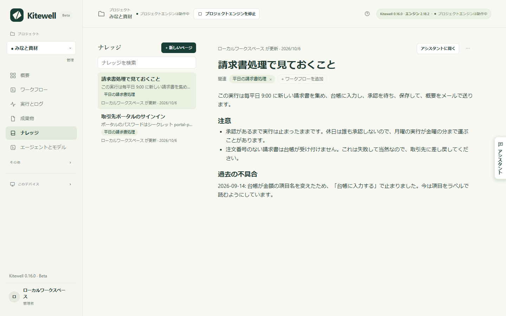
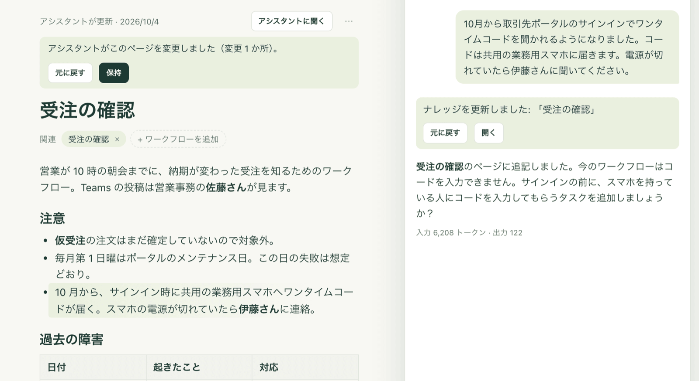

どのチームにも、書き残していないことがあります。なぜ月はじめはポータルがコードを聞いてくるのか、どの請求書は失敗して当然なのか、去年の 9 月に何が壊れてどう直したのか。ナレッジは、プロジェクトがそうしたメモを置く場所です。アシスタントは答える前にナレッジを読み、作業に合わせて書き足します。次の会話も次の担当者も、チームがすでに知っていることから始められます。

ページには、ワークフローの定義からは分からないことを書きます。ステップ、スケジュール、入力はワークフローにあり、ページにはその理由を書きます。

## ページを書く

1. サイドバーの **ナレッジ** を選びます。プロジェクトのページが新しい順に並び、開いたページがその横に表示されます。
2. **新しいページ** を選び、タイトルを入力します。タイトルを付けた時点でページが作成されます。
3. メモを書きます。`/` を入力すると見出し、リスト、チェックリスト、引用、コード、表、区切り線を挿入できます。テキストを選択すると、**太字**、**斜体**、**取り消し線**、**コード**、**リンク** の小さなツールバーが出ます。入力中に `## ` で見出し、`- ` でリスト、`1. ` で番号付きリストになります。日本語入力のままでも、`＃`、`・`、`１．`、`／` で同じことができます。
4. **ワークフローを追加** を選び、そのページが扱うワークフローを選びます。名前が **関連** の横に並び、クリックするとそのワークフローが開きます。取引先の Web サイトやチームのルールのように、特定のワークフローに関係しないページもあって構いません。
5. 保存の操作はありません。入力を止めて少しすると、ページの上の表示が **保存中…** から **保存済み** に変わります。Mac では ⌘S、Windows では Ctrl+S ですぐに保存でき、ページを離れたときにも保存されます。

一覧の各ページには、本文の 1 行目、関連するワークフロー、最後に変更した人が表示されます。アシスタントが書いたページには AI の印が付きます。**ナレッジを検索** では、タイトルや本文のどの言葉でもページを探せます。全角と半角のどちらで入力しても見つかります。

同じページは、役に立つ場所にも出てきます。

- ワークフローエディターの **ナレッジ** タブには、そのワークフローに関するページが表示されます。**ページを追加** を選ぶと、そのワークフローに関連付けた状態でページを作れます。
- 失敗した実行では、エラーの下に **関連ナレッジ** が表示されます。過去に何が壊れてどう直したかが書かれていることがよくあります。

## アシスタントがすること

アシスタントは、メッセージのたびにプロジェクトのナレッジを読みます。すべてのページの 1 行の要約と、開いているページ、そして見ているワークフローに関するページを最大 3 件、全文で読みます。必要であれば、ほかのページを読んだり、すべてのページを検索したりもできます。

書くこともします。続く事実、ルール、訂正を伝えたとき、定義からは分からない理由でワークフローを変えたとき、失敗が直ったときには、すぐページに保存し、パネルに記録を表示します。新しいページなら「ナレッジを追加しました」、変更なら「ナレッジを更新しました」と表示され、**元に戻す** と **開く** が付きます。ワークフローを新しく作るときは、そのページも同じカードに載り、**適用** で両方が保存されます。

書かれたときにそのページを開いていれば、変更された部分に印が付き、上に **元に戻す** と **保持** が表示されます。入力を始めると印は消えます。

任せきりにしても安全なように、2 つの決まりがあります。

- 外部の内容を読んだ会話では、先に確認します。アシスタントが Web ページを取得したり、実行のログ、成果物、シートを読んだりしたあとは、自分で保存するのをやめます。変更は、内容をそのまま見せるカードになり、**適用** を選ぶまで何も保存されません。Web ページやログにある文章が、気付かないうちに全員のナレッジに入ることはありません。
- 事実だけを書きます。書くのは、あなたが言ったことや決めたこと、実行で確かめられたことだけで、あなたが使う言語で書きます。ページとワークフロー自体の内容が食い違うときはワークフローが正しく、アシスタントがページを直します。

ページは参考資料としてアシスタントに渡されます。ページに書かれていることが、アシスタントへの指示として扱われることはありません。

## ほかの人が同じページを変えたとき

入力中のページを、チームの誰か、別のデバイス、またはアシスタントが変更しても、入力した内容は失われません。誰が変更したかが表示され、**自分の版を残す** か **相手の版を使う** かを選べます。相手の版にしたあとも、Mac では ⌘Z、Windows では Ctrl+Z で戻せます。開いている間にページが削除された場合は、**新しいページとして残す** か **自分の編集を破棄** かを選びます。

## うまくいかないとき

- 表示が **保存されていません** になる。タイトルがないか、本文が 2,000 文字を超えています。直してから **もう一度試す** を選びます。保存できなかった編集はページに残り、Kitewell を開いている間に同じページを開けば戻ってきます。再起動をまたいでは残りません。
- ページが Markdown で開く。画像、HTML、または `https://` 以外のリンクが含まれていて、書式付きのエディターではそれらを失わずに表示できません。そのまま Markdown で編集するか、その部分をページの外に移してください。

## 詳細

- 1 つのページは、タイトルが 60 文字まで、本文が 2,000 文字まで、関連付けられるワークフローが 20 件までです。1 プロジェクトには 100 ページまで入ります。1,800 文字を超えるとページの上に文字数が表示され、上限を超えると保存を拒否し、残りを別のページに移すよう求めます。
- **⋯** → **Markdown で編集** で、Markdown のまま編集できます。**書式付きで編集** で元に戻ります。**⋯** → **ページを削除** は、確認のうえ、プロジェクトの全員からページを削除します。
- 貼り付けでは、ページが持てる形に整えます。表計算ソフトからコピーした表は 1 行目を見出しにした表になり、Markdown のテキストは書式付きのテキストになります。リンクは `https://` のものだけが残ります。
- ページは 1 つのプロジェクトに属します。プロジェクトの全員が読め、編集者とアシスタントが変更できます。ページは [Dagu Cloud と同期](/ja/docs/cloud-sync/)され、[プロジェクトのエクスポート](/ja/docs/sharing/)にも含まれます。[リリース](/ja/docs/releases/)には含まれません。リリースが持つのはワークフローとシークレットの名前だけです。
- [MCP クライアント](/ja/docs/mcp/)は、`read` に `target: "knowledge"` を指定してページを読めます。一覧全体、ID による 1 ページ、検索のいずれもできます。**編集と実行** の権限があれば、`change` に `upsert_knowledge` または `delete_knowledge` を指定して書き込めます。ワークフローを読むと、そのワークフローに関するページも返ります。
