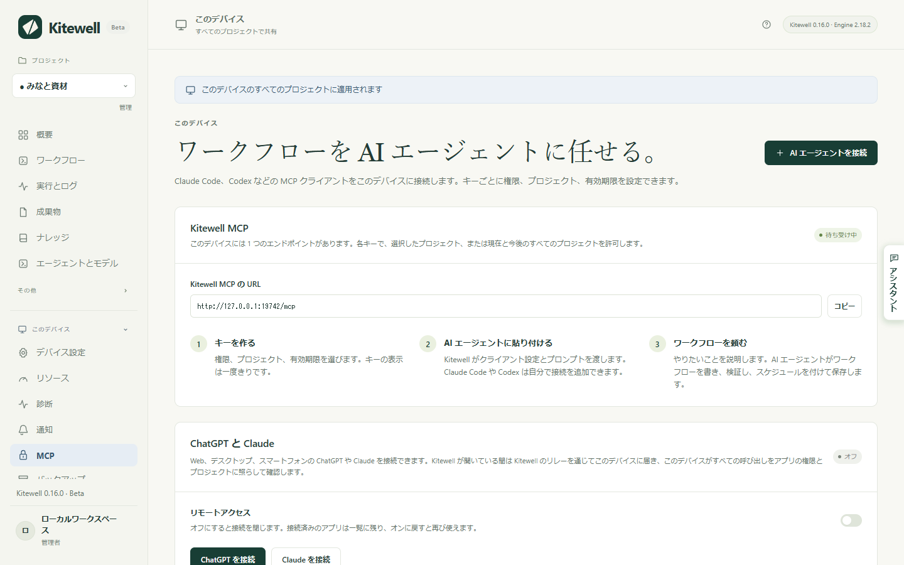
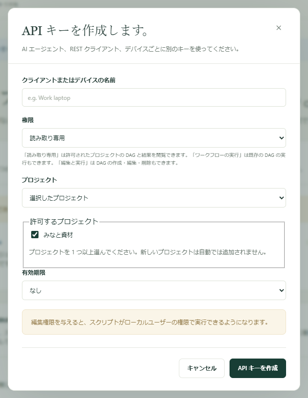
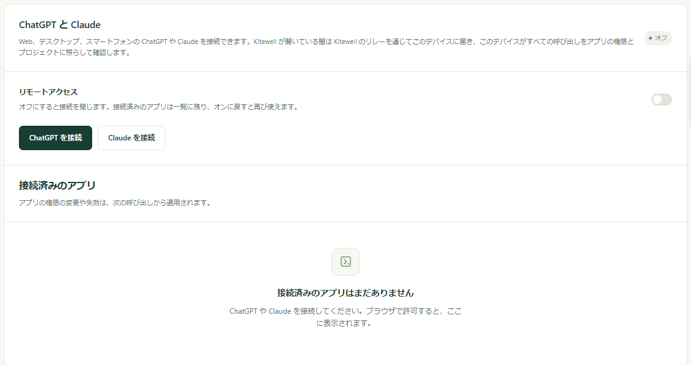

ChatGPT、Claude、Claude Code に、ワークフローの実行や、実行結果の確認、新しいワークフローの作成を頼めます。処理はこれまでどおりお使いのコンピューター上で、許可したプロジェクトの中だけで行われ、アクセス権はいつでも取り消せます。

## 必要なもの

- ワークフローがあるコンピューターで Kitewell が開いていて、そのコンピューターがスリープしていないこと。スリープ中のコンピューターには呼び出しが届きません。
- Claude Code や Codex など、同じコンピューターで動かすアシスタントの場合は、ほかに何も必要ありません。Kitewell はすでに `http://127.0.0.1:19742/mcp` で待ち受けています。
- Web、デスクトップ、スマートフォンの ChatGPT と Claude の場合は、Dagu Cloud のアカウントと、このコンピューターがそこに[サインイン](/ja/docs/cloud-sync/#サインイン)していること。これらはそれぞれのクラウドから呼び出すため、上のアドレスではなく Kitewell のリレーを通じてお使いのコンピューターに接続します。

以下はすべて **このデバイス → MCP** の 1 ページにまとまっています。接続の準備ができていると、**Kitewell MCP** の横のバッジに **待ち受け中** と表示され、その下の **Kitewell MCP の URL** がクライアントに渡すアドレスです。



無料プランで使える API キーと接続済みのアプリは、合わせて 1 つです。Kitewell Personal と Team では何個でも使えます。どれかを取り消すと、その分だけ新しく追加できます。有料プランが終わると、その 7 日後に、無料プランを超える分のキーとアプリが使えなくなります。どれを残すかは選べます。[プランが終わったとき](/ja/docs/cloud-sync/#プランが終わったとき)を参照してください。

## このコンピューターのアシスタントを接続する

Claude Code、Codex、そのほか自分で動かすクライアントは、この方法で接続します。使うのはキー、つまりクライアントが呼び出しごとに送る長い秘密の文字列です。

1. **このデバイス → MCP** を開き、**AI エージェントを接続** を選びます。
2. **クライアントまたはデバイスの名前** に、「仕事用ノート PC の Claude Code」などと入力します。この名前は、後から見分けるためのものです。
3. **権限** を選びます。**読み取り専用**、**ワークフローの実行**、**編集と実行** のいずれかです。それぞれで何ができるかは次のセクションで説明します。
4. **プロジェクト** を選びます。**選択したプロジェクト** では **許可するプロジェクト** でチェックしたものだけが対象になります。**現在と今後のすべてのプロジェクト** では、後から作るプロジェクトも対象になります。
5. **有効期限** を選びます。**なし**、**30 日**、**90 日**、**日時を指定** のいずれかです。
6. **API キーを作成** を選びます。



Kitewell はキーを一度だけ **API キー** に表示し、その横に渡し方を 3 つ用意します。

- **Kitewell MCP の URL** は、クライアントが接続するアドレスです。
- **Kitewell MCP クライアントの設定** は、同じ内容を、多くのクライアントがそのまま受け付ける設定のかたまりにしたものです。
- **AI エージェント向けのプロンプト** は、Claude Code や Codex に貼り付けると、その場で接続を追加してくれる依頼文です。キーが含まれるので、信頼できるアシスタントにだけ貼り付けてください。

ダイアログを閉じる前に、必要なものをコピーしてください。キーが再び表示されることはありません。紛失した場合は、そのキーを失効させて新しく作ります。

手作業で設定するクライアントには、URL、Streamable HTTP、そして `Authorization: Bearer <キー>` ヘッダーが必要です。クライアントが、自分で入力した認証情報に対応している必要があります。ChatGPT と Claude はこれに対応していないため、下で説明するようにサインインで接続します。

ページに戻ると、**頼めること** に、接続したアシスタントに貼り付けて試せる依頼文が 3 つあります。**コマンドをスケジュールする**、**AI エージェントのステップをスケジュールする**、**失敗を調べる** です。どれも、開いているプロジェクトを指定し、ワークフローを確認して、こちらが読むまではスケジュールをオフのままにするよう依頼します。

## それぞれの権限でできること

| 権限 | アシスタントにできること |
| --- | --- |
| **読み取り専用** | プロジェクト、ワークフロー、実行、そのログ、実行が残したファイル、プロジェクトのナレッジを見ます。何も変更しません。 |
| **ワークフローの実行** | 上のすべてに加えて、実行の開始、再試行、再実行、キャンセル。人の対応を待つステップの承認、却下、差し戻し、完了。入力を待つ Web サイトやデスクトップのステップへの回答。シートの行の実行。 |
| **編集と実行** | 上のすべてに加えて、ワークフロー、エージェントとモデル、サーバー、キュー、ワークフローの既定値、API 接続、シート、ナレッジのページの作成・変更・削除。 |

必要最小限の権限から始めてください。「昨夜は何が失敗したか」を尋ねるだけなら **読み取り専用** で足ります。実行を頼むだけなら **ワークフローの実行** で足ります。アシスタントがワークフローを書けるのは **編集と実行** のときだけで、ワークフローのコマンドはそのコンピューター上であなた自身と同じ権限で動きます。つまり、ファイルを変更したり、ほかのサービスにアクセスしたりできます。**編集と実行** は、自分の代わりにそのコンピューターでコマンドを実行させても問題ないと信頼できるアシスタントにだけ与えてください。

権限が効くのは、許可したプロジェクトの中だけです。コンピューターのほかの部分を守る仕組みではありません。

接続から見えるのは、許可したプロジェクトにあるものすべてです。ワークフローのコマンドの文面、その実行のログ、実行に渡された値も含まれます。見えないのは、シークレットの値、メールボックスのパスワード、Dagu Cloud のサインイン、ほかの API キー、そして許可していないプロジェクトの中身です。シークレットはデバイスに残り、ワークフローは実行中に名前で読み取ります。

<a id="connect-chatgpt-or-claude"></a>

## ChatGPT や Claude を接続する

ChatGPT と Claude は、`https://mcp.kitewell.app/mcp` を通じて、お使いのコンピューターが自分から開いた接続でつながります。ネットワークのポートは開きません。コンピューターは、キーの場合とまったく同じように、すべての呼び出しを承認した権限とプロジェクトに照らして確認します。

1. Kitewell で **このデバイス → MCP** を開き、**ChatGPT を接続** または **Claude を接続** を選びます。Dagu Cloud にまだサインインしていないコンピューターでは先にサインインし、**リモートアクセス** がオンになります。
2. **権限** と **プロジェクト** を選び、**保存して手順を表示** を選びます。URL と、そのアプリ向けの手順が表示されます。選んだ内容は、次に同じアプリを接続するときのために保存されます。
3. 下の [Claude](#claude) または [ChatGPT](#chatgpt) の手順で、その URL をアプリに追加します。
4. アプリが Dagu Cloud を開きます。このコンピューターがサインインしているアカウントでサインインします。
5. 同意のページは、選んだ内容が入力された状態で開きます。コンピューター、権限、プロジェクトを確認し、必要なら変更してから **許可** を選びます。



その後、アプリは **接続済みのアプリ** に、**権限**、**プロジェクト**、接続した日、最後に呼び出した日時とともに表示されます。

### Claude

1. Claude で **カスタマイズ → コネクタ** を開き、**+ 追加** を選んでから **カスタムコネクタを追加** を選びます。
2. 名前を Kitewell とし、URL を貼り付けて **続行** を選びます。提案されたサインインの設定はそのままにして **追加** を選びます。
3. Dagu Cloud にサインインし、権限とプロジェクトを確認して、**許可** を選びます。

Team プランと Enterprise プランでは、先にオーナーが **組織設定 → コネクタ** で Kitewell を追加し、その後メンバーがそれぞれ **接続** を選びます。Claude の Free プランで使えるカスタムコネクタは 1 つです。

### ChatGPT

ChatGPT は Web 版からだけ、開発者モードで接続できます。登録する項目に Kitewell のアイコンを付けるには、先に <a href="/kitewell-icon-256.png" download>Kitewell のアイコン（PNG）をダウンロード</a>してください。256 × 256 px で、ChatGPT の上限の 10 KB に収まります。

1. Web 版の ChatGPT で **プラグイン** を開き、**追加** を選んでから **カスタム MCP サーバーを作成** を選びます。見つからない場合は、先に **設定 → セキュリティとログイン**（Business、Enterprise、Edu では **設定 → アプリ → 詳細設定**）で **開発者モード** をオンにします。
2. 名前を Kitewell とし、必要なら Kitewell のアイコンを追加して、**サーバーURL** に URL を貼り付けます。**OAuth** はそのままにし、**理解したうえで続けます** にチェックを入れて、**プラグインとして作成** を選びます。
3. **Kitewell に進む** を選び、Dagu Cloud にサインインして、権限とプロジェクトを確認し、**許可** を選びます。
4. **チャットで試す** を選びます。以降はどのチャットでも、**@** を入力して Kitewell を選ぶか、**+** のツールメニューから選べます。

Kitewell は **プラグイン → 個人用 → 自分で作成** に表示され、そのページにはサインインしたアカウントが表示されます。

ここでの制限は 2 つとも ChatGPT 側のもので、Kitewell の制限ではありません。

- Plus と Pro では、ChatGPT が使えるのは Kitewell の読み取り専用のツールだけです。実行の開始やワークフローの編集には、ChatGPT Business、Enterprise、Edu が必要です。
- Business では、開発者モードを使えるのは管理者とオーナーだけです。Enterprise と Edu では、まず管理者が許可します。

ChatGPT は、カスタム MCP サーバーにはリスクがあるとも警告します。Kitewell が受け取るのは、あなたが承認した権限とプロジェクトだけです。

### コンピューターに接続できないと返るとき

コンピューターの電源が入り、スリープしておらず、Kitewell が動いている必要があります。そうでない場合も、アプリには Kitewell のツールが表示されますが、どの呼び出しにも、そのコンピューターの Kitewell に接続できないという答えと、最後に確認できた時刻が返ります。そのコンピューターで Kitewell を開いてから、もう一度尋ねてください。それでも失敗する場合は、[トラブルシューティング](/ja/docs/troubleshooting/#chatgpt-and-claude)を参照してください。

## アクセスを変更する、取り消す

- キーの場合：**API キー** の **編集** で、秘密の文字列は変えずに、名前、権限、プロジェクト、有効期限を変更できます。**失効させる** で終わります。
- 接続済みのアプリの場合：**接続済みのアプリ** の **変更** と **失効させる** を使います。ChatGPT や Claude の側で接続を解除した場合も、5 分以内にお使いのコンピューターに伝わります。
- ChatGPT と Claude をまとめて止める場合：**リモートアクセス** をオフにします。接続は閉じますが、接続済みのアプリは一覧に残り、オンに戻すと再び使えます。このコンピューターのキーには影響しません。

変更、失効、有効期限は、次の呼び出しから適用されます。すでに始まった実行はそのまま続きます。期限切れのキーは、有効期限を延ばすか外せば再び使えます。

ワークフローの Webhook は同じリレーを使いますが、URL は別で、**リモートアクセス** がオフでも動き続けます。[別のサービスからワークフローを開始する](/ja/docs/webhooks/)を参照してください。

## 何かが起きたら ChatGPT に知らせる

MCP Events に対応したアプリは、繰り返し問い合わせる代わりに、知らせを受け取れます。

- `run.finished`：実行が終了した。1 つの実行や、知らせる結果を指定できます。
- `run.needs_input`：実行が承認、人のタスク、質問で待っている。
- `batch.finished`：シートの行の[バッチ](/ja/docs/batches/)が終了した。
- `schedule.missed`：スケジュールの実行を逃した。

各アプリの購読は **接続済みのアプリ** のアプリの下に、直近の配信とともに表示され、**削除** で 1 つずつ取り除けます。アプリを失効させると、すべて終わります。**リモートアクセス** がオフの間は一時停止し、アプリが更新しなければ最長 1 週間で切れます。イベントを見つけて送るのはお使いのコンピューターなので、届くのは Kitewell が動いている間だけです。MCP Events は、[アラート](/ja/docs/alerts/)と同じく Kitewell Personal と Team の機能です。

## 詳細

### 接続から見えるツール

接続には、その権限で使えるツールだけが表示されます。読み取り専用の接続に、書き込むツールが見えることはありません。

| ツール | 権限 | 何をするか |
| --- | --- | --- |
| `read` | **読み取り専用** | プロジェクト、ワークフローとそのスキーマ、ログや成果物を含む実行、エージェントと API モデル、サーバー、キュー、メールボックス、ワークフローの既定値、インポートした API、[バッチシート](/ja/docs/batches/)とその値、プロジェクトの[ナレッジ](/ja/docs/knowledge/)を読み取ります。失敗した実行には、[失敗の診断](/ja/docs/ai/#failure-diagnosis)があればそれも含まれます。`target: "reference"` を指定すると使い方のガイドが返ります。**ワークフローの実行** では再実行で再利用できるステップのプレビューが、**編集と実行** ではワークフローの YAML を保存せずに行う確認と、このコンピューターの Excel ブックを開く操作が加わります。 |
| `show` | **読み取り専用** | ワークフローの依存関係のグラフを描き、実行を指定すると各ステップの状態も示します。ChatGPT と Claude では進行中の実行を追いかける表示になり、ほかのクライアントにはステップが順にテキストで返ります。 |
| `execute` | **ワークフローの実行** | `start`、`retry`、`rerun`、`cancel`、`approve`、`reject`、`push_back`、`complete`、`answer`、`restart`、`resume`、`run_sheet`、`read_sheet_values`、`cancel_sheet`。**編集と実行** では `refresh_sheet`、`link_workbook`、`unlink_workbook` が加わります。 |
| `change` | **編集と実行** | ワークフロー、エージェント、サーバーとサーバーグループ、キュー、ワークフローの既定値、API 接続、シートとこのデバイスでのシートのスケジュール、ナレッジのページを作成、置き換え、削除します。 |
| `preview_api` | **編集と実行** | 渡された OpenAPI ドキュメントを読むか、URL から取得して、そのオペレーションを一覧にします。何も保存しませんが、URL から取得するときはコンピューターの外にアクセスします。 |

権限で許可されていない呼び出し（以前の権限のときのツール一覧をクライアントが使い続けた場合など）は拒否され、Kitewell のどこで権限を変更できるかが示されます。

既存の定義を置き換えたり削除したりするには、直前の読み取りで返された `version` が必要です。これにより、クライアントが確認していない変更を上書きすることはありません。競合した場合は、もう一度読み取り、内容を確認してから意図して送り直してください。

繰り返し問い合わせずに実行を見届けるには、開始、再試行、再実行のときの `execute`、または `target: "run"` を指定した `read` に、最大 60 秒の `wait` を渡します。実行が終わるか、人の対応を待つステップで止まると、すぐに答えが返ります。先に時間切れになった場合は、その時点の実行が返ります。

リンクしたブックへの結果の書き込みと、その取り消しは、どの接続にも開かれていません。どちらも人がアプリの中で行います。

### プロジェクトの指定

`target: "projects"` を指定した `read` は、その接続がアクセスできるプロジェクトだけを一覧にし、プロジェクトの指定は要りません。ほかの呼び出しは `projectId` で、REST のルートでは `?projectId=<id>` でプロジェクトを指定します。1 つのプロジェクトだけにアクセスできる接続では省略できますが、複数にアクセスできる接続では 1 つを指定する必要があります。まずプロジェクトの一覧を取得させ、依頼に合う名前の ID を渡してください。

エージェント、サーバー、キュー、ワークフローの既定値はプロジェクトに属するため、同じキーでも、指定したプロジェクトによって変更する対象が変わります。

### MCP からインポートした API を使う

**編集と実行** の権限を持つアシスタントは、OpenAPI ドキュメントをインポートして、そのオペレーションからワークフローを作成できます。

1. `preview_api` に、`spec`（JSON または YAML のテキスト）か `url` のどちらかを指定してプレビューします。何も保存されず、オペレーションも呼び出されません。
2. `change` に `type: "upsert_api"`、`id`、`api` 定義を指定して保存します。`api.spec` を指定するか、省略して `api.sourceUrl` から 1 回だけ取得させます。`api.auth.type` には `none`、`bearer`、`apiKey`、`basic` のいずれかを設定し、`api.auth.secretRef` で既存のプロジェクトシークレットを指定します。シークレットの値の作成と置き換えはアプリの中だけで行い、MCP からはできません。
3. `read` でオペレーションを探します。`target: "apis"` は接続を一覧表示し、`target: "api_operations"` は `id` と任意の `query` で 1 つの API を検索します。`target: "api_operation"` に `id` と `operationId` を指定すると、その入力、レスポンス、出発点となるワークフローステップが返ります。
4. `api.request` ステップを追加し、通常のツールでワークフローを確認、保存、実行します。返されるステップはテンプレートです。実行する前に例を確認し、プレースホルダーを置き換えてください。

`upsert_api` は接続全体を置き換えます。先に `target: "api"` を読み取り、残したいフィールドを保持して、その `definitionVersion` を `version` として渡してください。`change` に `type: "delete_api"` を指定した削除は、保存済みのワークフローがその接続を使っていない場合だけ行えます。インポーターが受け付けるものについては [API のインポート](/ja/docs/apis/)を参照してください。

### スクリプト向けの REST

同じキーは、スクリプトやその他の連携のための素の HTTP インターフェースでも使えます。ベースアドレスは MCP の URL のオリジンに `/api` を足したものです。このコンピューター上でも、すべてのリクエストに `Authorization: Bearer <キー>` が必要です。ブラウザー側のサインインはキーではありません。

```http
GET /api/jobs HTTP/1.1
Host: your-host
Authorization: Bearer <Kitewell API key>
```

| ルート | 必要な最小の権限 |
| --- | --- |
| `GET /api/projects`、`/api/jobs`、`/api/runs`、`/api/queues` | **読み取り専用** |
| `GET /api/runs/{jobId}/{id}`、`/api/jobs/{id}/graph` | **読み取り専用** |
| `GET /api/runs/{jobId}/{id}/logs` と `/logs/download` | **読み取り専用** |
| `GET /api/dags/schema`、`/api/harnesses`、`/api/data/usage` | **読み取り専用** |
| `POST /api/jobs/{id}/run` | **ワークフローの実行** |
| `POST /api/runs/{jobId}/{id}/resume` | **ワークフローの実行** |
| `POST /api/runs/{jobId}/{id}/approvals/{stepId}/approve`、`/reject`、`/push-back` | **ワークフローの実行** |
| `POST /api/runs/{jobId}/{id}/human-tasks/{stepId}/complete` | **ワークフローの実行** |
| `POST /api/jobs`、`PUT` と `DELETE /api/jobs/{id}` | **編集と実行** |
| `POST /api/jobs/{id}/pause`、`POST /api/dags/validate` | **編集と実行** |
| `POST /api/runs/delete`、`DELETE /api/run-history/{jobId}` | **編集と実行** |

ログの読み取りでは、`stepId`、`stream=stdout`、`stderr`、`run`、`tail=500`、または最大 500 行までの `offset` と `limit`、検索用の `query=<text>` を指定できます。実行のリクエストは `{"params":{"region":"west"}}` のような本文を受け付けます。

REST で扱えるのはワークフローとバッチシートです。デバイス設定、シークレット、API キーの管理、Dagu Cloud のアカウント、バックアップ、エンジンの操作はアプリの中だけで、公開されません。インポートした API の管理は、アプリまたは MCP の `change` ツールで行います。

### 別のコンピューターのクライアント

リスナーが受け付けるのは `127.0.0.1:19742` へのローカル接続だけです。ChatGPT と Claude はリレーを通じて接続するため、以下の設定は要りません。

別のコンピューターのクライアントには、そのクライアントから HTTPS で到達できるアドレスが必要で、その用意と運用はご自身で行います。**Kitewell MCP の接続** で **Kitewell MCP を有効にする** をオンのままにし、**TLS とリモート接続** を開いて、**公開用 Kitewell MCP URL** に `/mcp` で終わる URL を入力します。そのうえで、**待ち受けアドレス** を `127.0.0.1:19742` のままにして自前の HTTPS プロキシをそこに向け、`/mcp` と `/api/` の両方を `Authorization` ヘッダーごと転送するか、アドレスを `0.0.0.0:19742` にして **証明書ファイル** と **秘密鍵ファイル** に絶対パスを入力します。最後に **接続設定を保存** を選びます。

ほかのコンピューターから到達できるアドレスにすると、ファイアウォールが Kitewell の接続受け付けを許可するか尋ねます。ここで拒否すると、どのクライアントも待たされたままになります。Kitewell は DNS、証明書、ルーターの転送設定を行わず、ワークフローを動かすコンピューターも提供しません。保護されていない HTTP のリスナーをインターネットに公開しないでください。

バッジに **利用できません** と表示され、ポート 19742 を別のプログラムが使っているという説明が出る場合、たいていは 2 つ目の Kitewell、たとえばインストール済みのアプリと並んで動いている開発ビルドです。そのプログラムを終了してから、Kitewell を再起動してください。

キーはハッシュとして保存され、そのままの形では保存されません。[バックアップ](/ja/docs/backups/)を復元すると、このコンピューターのキーはそのまま残ります。内容を確認し、アクセスさせたくないキーは失効させてください。クライアントの認証情報の設定がはっきりしない場合は、[サポートにお問い合わせください](/ja/support/)。
