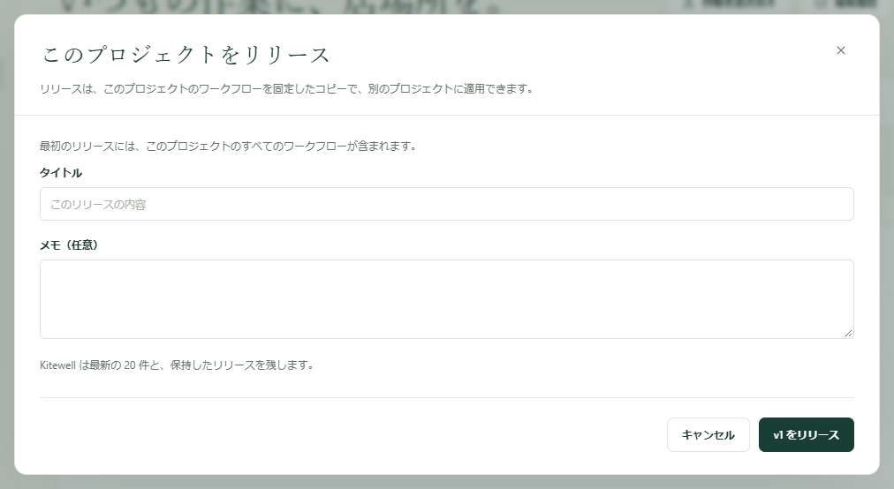

本番の作業に影響する前に、安全な場所で変更を試せます。作る用のプロジェクトと、実際に動かすプロジェクトを分けて持ち、満足できたワークフローを番号付きのリリースとして固定し、準備ができたらそのリリースをもう一方のプロジェクトに渡します。

サーバー、モデル、API 接続、キュー、シークレットの値はプロジェクトごとに保持されるため、同じワークフローが、一方ではテスト用のシステム、もう一方では本番のシステムにつながります。

## 必要なもの

同じコンピューター上に 2 つ以上のプロジェクト。名前は自由ですが、**Dev**、**Staging**、**Prod** という組み合わせがよく使われます。1 台のコンピューターで持てるプロジェクトは無料プランでは 1 つなので、段階的な運用には、最大 10 個まで持てる Kitewell Personal か、15 個まで持てる Team が必要です。リリースの作成と適用には、プロジェクトの編集権限が必要です。

## リリースを作成する

1. 作る用のプロジェクトで **ワークフロー** を開きます。一覧の上に、最新のリリースと、それ以降に変更されたワークフローの数が表示されます。
2. **リリース…** を選びます。最初のリリースにはプロジェクトのすべてのワークフローが含まれ、ダイアログにそう表示されます。2 回目以降は変更内容が並び、ワークフローごとに **比較** があります。
3. **タイトル** を入力し、必要なら **メモ（任意）** を加えて、次の番号が入ったボタンを選びます。最初のリリースなら **v1 をリリース** です。

リリースは、プロジェクトのワークフローと、それらが読むシークレットの名前を固定したコピーです。作成後に変わることはないため、その後の編集は次のリリースを待ちます。最新のリリース以降に変更がなければ、リリースは作成されず、その旨が表示されます。

Kitewell は最新の 20 件のリリースを保持し、それより古いものを削除します。**削除** でそれより早く消すこともできますが、最新のリリースは次の番号の基準になるため削除できません。削除したリリースを取り込んだプロジェクトは、そのワークフローをそのまま保持します。以後そのリリースを適用できなくなるだけです。

信頼できる版を、その後いくつリリースを作っても残しておくには、**リリース** でそのリリースの横の **保持** を選びます。保持したリリースは、誰かが **保持を解除** を選ぶまで、どのコンピューターからも Dagu Cloud からも消えず、削除もできません。保持できるリリースは 20 件までです。

[同期しているプロジェクト](/ja/docs/cloud-sync/)では、リリースもほかのものと同じように同期されるため、チームの誰でも同じリリースを適用できます。リリースは[プロジェクトのエクスポート](/ja/docs/sharing/)には含まれませんが、[バックアップ](/ja/docs/backups/)には含まれます。

## リリースを適用する

1. **リリース** を選び、使いたいリリースの横の **適用先…** を選びます。
2. **適用先** で、適用先のプロジェクト、つまりこのコンピューター上の別のプロジェクトを選びます。閲覧だけが許可されたプロジェクトは選べません。
3. プレビューを読みます。**どうなるか** の欄が、ワークフローごとに、**新規 · 一時停止の状態で届きます**、更新される、適用先で編集されていてリリースが変更していないため **保持**、**変更なし** のどれかを示します。**比較** で違いを確認できます。選べる場合は **Prod の版を保持** にチェックを入れると、適用先のコピーがそのまま残ります。ここには適用先のプロジェクト名が入ります。

   プレビューはこのほか、ワークフローが適用先で実行できない場合、適用先にないワークフローやキューを使う場合、適用先の別のワークフローと名前が重なる場合、適用するとすぐに効くスケジュールの変更がある場合にも警告します。
4. 変更の件数が入ったボタン（**3 件の変更を適用** など）を選びます。

移るのはワークフローだけです。適用先はサーバー、モデル、キュー、シークレットの値を自身のまま保ちます。ただし、リリースが読むシークレットの名前は適用先に追加されます。値は、適用先の各コンピューターで **シークレット** または **概要** から設定してください。

新しいワークフローは一時停止の状態で届きます。そのプロジェクトで実行するものを有効にしてください。すでにあったワークフローは、有効かどうか、どこで実行するか、アラート、失敗の診断の設定をそのまま保ちます。

プレビューを描いた後に適用先が変わった場合は、プレビューを見直すよう求められます。プランのワークフロー数の上限などで適用が途中で止まった場合は、まだ適用されていないものがプレビューに示されます。もう一度適用して完了させてください。

リリースの適用先がない場合は、先に適用先のプロジェクトを作るかダウンロードするよう表示されます。

## どこで何が動いているか確認する

リリースを取り込んだプロジェクトでは、ワークフロー一覧の上に **Dev の v13** のように取り込み元が表示され、各ワークフローにも、どのリリースで届いたかが表示されます。これはプロジェクトを同期しているすべてのコンピューターで表示されます。

その後にワークフローを編集すると **ここで編集** と表示されます。次のリリースが同じワークフローを変更していなければ、その編集は既定で保持されます。変更していれば、プレビューで警告され、適用先の版を保持することもできます。

作る用のプロジェクトで、最新のリリース以降に変更したワークフローには **未リリース** と表示されるため、次のリリースに何が入るかがひと目で分かります。

## 元に戻す

古いリリースも同じ手順で適用できます。違いは 2 点です。

- 新しいリリースで追加されたワークフローは、そのリリースにないものとして別の見出しの下に並びます。チェックしたものだけが削除されます。
- 古いリリースが置き換えるワークフローは、このコンピューター上のプロジェクトの編集履歴にも残るため、1 つだけ元に戻すこともできます。

リリースを取り込んだプロジェクトの側から始めることもできます。**Dev の v13** の横の **Dev のリリース…** を選ぶと、そのプロジェクトのリリースが一覧になり、ここで動いているものに **ここで実行中** と印が付きます。使いたいリリースの **ここに適用** を選びます。これは、もう一方のプロジェクトが同じコンピューターにある場合に使えます。
