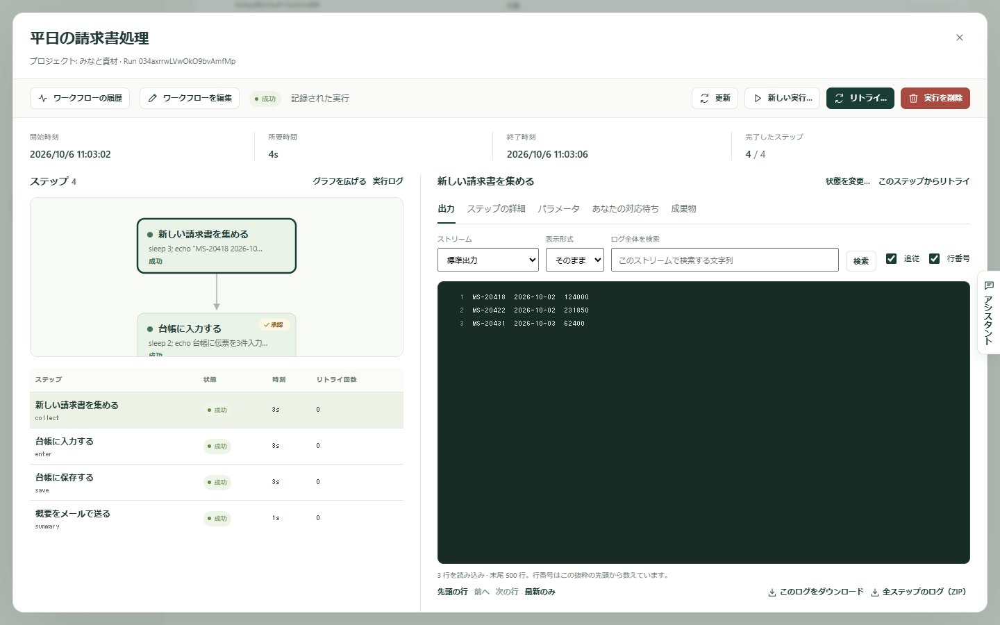
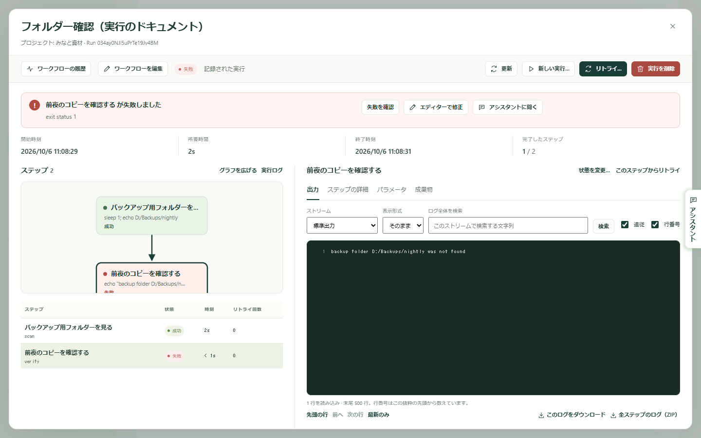

ワークフローが実行されるたびに、Kitewell は起きたことを記録します。どのステップが動いたか、それぞれが何を表示したか、どんなファイルを作ったか、最後はどうなったか。うまくいった実行を見返すことはめったにありません。うまくいかなかったときに、原因を調べて直す場所がここです。

サイドバーの **実行とログ** を開くと、**実行履歴** という見出しでその記録が表示されます。

## 目的の実行を探す

新しい実行が上に並びます。数が多いときは絞り込みます。

- **ワークフロー** で 1 つのワークフローの実行だけに絞ります。**すべてのワークフロー** を選ぶと全部が表示されます。
- **作成期間** で期間を決めます。最初は **過去 7 日** で、**全期間** まで広げられます。
- **実行 ID** は、識別子がわかっているときに 1 件を探します。一覧でワークフロー名の下に表示される短い文字列で、そこからコピーできます。
- **フィルターを適用** で絞り込み、**リセット** で解除します。リセットすると期間は **全期間** に広がります。

一覧の上にある **すべての実行**、**実行中 / 待機中**、**待機中**、**失敗**、**成功**、**中止** で、結果の種類を切り替えます。さらにその上の **このページ**、**進行中**、**失敗した実行**、**成功率** は、このページの実行の件数を示します。

各行には、どのワークフローが動いたか、どう終わったか、何がきっかけで始まったか、いつ、どれだけかかったかが表示されます。きっかけは、手動、スケジュール実行、キャッチアップ、リトライ、API、Webhook、サブワークフローのいずれかです。

このページには、ほかに次のものがあります。

- **キュー** には、キューごとの実行中と待機中の件数が表示され、待機中の実行を取り除けます。
- **更新を一時停止** は、読んでいる間に一覧が更新されるのを止めます。押すと **更新を再開** に変わります。
- **このページを書き出す** は、表示されている行を表計算ファイルとして保存します。ほかのページの実行は含まれません。
- **バッチ** から[バッチシート](/ja/docs/batches/)を開けます。

## 実行を読む

行の右端の **実行を表示** を選びます。失敗した実行では **失敗を確認** になります。

実行は専用の画面で開きます。上部には、**開始時刻**、**所要時間**、**終了時刻**、**完了したステップ** の数が並びます。

左側の **ステップ** には、実行がマップとして描かれ、その下に各ステップの **状態**、**時刻**、**リトライ回数** が一覧表示されます。**グラフを広げる** でマップを広く表示し、**実行ログ** でステップではなく実行自体の記録を表示します。

右側には、選択したものが表示されます。ステップを選ぶと次が見られます。

- **出力**：そのステップが表示した内容です。**ストリーム** で **標準出力** と **エラー出力（stderr）** を切り替えます。失敗したステップはエラー出力から開きます。**実行ログ** では代わりに **実行イベント** が表示されます。
- **ステップの詳細**：そのステップがどう終わったか、何をするよう指示されていたかです。
- **パラメータ**：この実行に渡された値です。
- **成果物**：実行が保存したファイルです。
- **項目**：リストを順に処理したステップで表示され、項目ごとに 1 行が並びます。
- **あなたの対応待ち**：誰かの回答が必要なときに表示されます。

## ログを検索する、手元に残す

ログは長くなることがあり、画面にはその新しい部分だけが表示されます。

- **ログ全体を検索** は、画面に出ている部分だけでなく、表示中のストリームのファイル全体を探します。文字列を入力して **検索** を選びます。ログが長い場合は **検索を続ける** が表示されます。
- **先頭の行**、**前へ**、**次の行**、**最新のみ** で移動します。**追従** は実行中に新しい行を表示し続け、**行番号** は行番号を付けます。
- **このログをダウンロード** は、表示中のストリームを保存します。**全ステップのログ（ZIP）** は、すべてのステップのログを 1 つのファイルにまとめて保存します。

## 人の対応が必要なとき

人の対応を待っている実行は、上部に対応待ちのステップ数が表示され、**ステップを確認** でそこへ移動できます。同じ実行は、一覧の **待機中** にも並びます。

**あなたの対応待ち** には、待機中のステップごとにカードが表示されます。人によるタスクでは **タスクを完了**、承認では **承認**、**差し戻す**、**実行を却下**、質問をした自動のステップでは **あなたの回答** を使います。[ワークフローを組み立てる](/ja/docs/workflow-builder/#stop-and-ask-a-person)を参照してください。

## 失敗した実行を直す

失敗した実行は、どのステップがどのように失敗したかを上部に表示して開きます。

そこから次のことができます。

- **失敗を確認** は、失敗したステップを選択して出力を読めるようにします。
- **エディターで修正** は、その実行の時点のワークフローを開きます。実行の入力と、前のステップが集めた値が入った状態になります。ステップを直したら **保存して続行…** を選び、**開始するステップ** を選びます。同じ入力とファイルを使って、そこから新しい実行が始まります。失敗した実行は記録に残ります。
- **アシスタントに聞く** は、[アシスタント](/ja/docs/ai/#the-assistant)に原因の調査と修正案を依頼します。
- [失敗の診断](/ja/docs/ai/#failure-diagnosis)がオンの場合は、その失敗に必要な対応と、どのステップを見ればよいかも表示されます。

## もう一度実行する

- **リトライ…** は、同じ実行 ID のまま、記録されたワークフローと入力を使って実行を続けます。**リトライの範囲** で **失敗および未完了のステップ** か **選択中のステップ** を選び、**リトライを開始** を選びます。前の試行も同じ実行の一部として残ります。
- ステップの出力の上にある **このステップからリトライ** は、同じフォームをそのステップで開きます。後続の処理も実行するには **後続のステップもリトライする** を使います。
- **新しい実行…** は、新しい ID で別の実行を始めます。記録された入力があらかじめ入っていて、変更できます。**実行方法** では、現在保存されているワークフローと、この実行が記録したワークフローのどちらを使うかを選びます。**新しい実行を開始** を選びます。元の実行は記録に残ります。
- **実行を中止** は、まだ動いている実行や待機中の実行を止めます。
- ステップの出力の上にある **状態を変更…** は、ステップを実行せずに **成功** または **失敗** として記録します。手作業で影響を直したときに使います。実行全体の結果は計算し直されます。この操作は、実行が終了し、自動のリトライが残っていない場合に選べます。

## 実行を削除する

**実行を削除** は、終了した実行を 1 件、そのログ、出力、ファイルとともに削除します。一覧で複数にチェックを入れて **削除…** を選ぶこともできます。まだ動いている実行や、終わった直後の実行は削除されず、その旨が表示されます。

自分で片づける必要はありません。Kitewell は、**デバイス設定 → 実行履歴の保存期間 → 実行履歴の保存期間**（最初は 30 日）より古い実行を 1 日 1 回削除します。**プロジェクト設定 → ストレージ** には、ワークフローごとの履歴の使用量が表示され、ワークフローごとに **履歴を削除…** を選べます。

## 実行が作ったファイル

サイドバーの **成果物** には、プロジェクトで終了したすべての実行が保存したファイルが、新しい順に表示されます。ステップは、`$DAG_RUN_ARTIFACTS_DIR` に書き込むか、ステップエディターで **成果物の名前（任意）** を入力するとファイルを保存します。

**ワークフロー**、**作成期間**、**ファイル名** で絞り込み、種類でも絞り込めます。**すべてのファイル**、**Markdown**、**画像**、**データ**、**テキストとログ** です。ファイルを選ぶとプレビューが表示され、**全画面表示** で画面いっぱいに広げ、**実行を開く →** でそのファイルを作った実行に移動します。**さらに古いファイルを表示** でさらに前までさかのぼれます。ファイルは実行とともに削除され、[バックアップ](/ja/docs/backups/)に含まれます。

## うまくいかないときは

- **探している実行が一覧にない。** 期間は過去 7 日から始まります。**作成期間** を広げるか、**リセット** でフィルターを解除してください。
- **あるはずのボタンがない。** リトライ、中止、待機中のステップへの回答、状態の変更には、ワークフローを実行する権限が必要です。実行の削除、**エディターで修正**、**アシスタントに聞く** には編集の権限が必要です。
- **古い実行が消えている。** 保存期間より古い実行は 1 日 1 回削除されます。ワークフローを削除すると、その履歴も削除されることがあります。

## 詳細

- 一覧は 1 ページに最大 50 件、作成が新しい順に表示されます。期間と並び順は実行の作成時刻を基準にし、リトライしても作成時刻は変わりません。
- 開いている実行は、動いている間は 3 秒ごとに読み直されます。
- ログは 1 回に 500 行ずつ読み込まれ、実行を開いた直後はステップの最後の 500 行と、実行自体のイベントの最後の 200 行が表示されます。検索は 1 回に最大 100 行の該当行を返し、30 秒で打ち切って続きの位置を知らせます。
- **全ステップのログ（ZIP）** には、各ステップの標準出力とエラー出力が入ります。実行自体のイベントログは含まれないので、別途ダウンロードしてください。
- **状態を変更…** はステップに対する操作で、実行全体には使えません。設定できるのは **成功** と **失敗** だけです。
