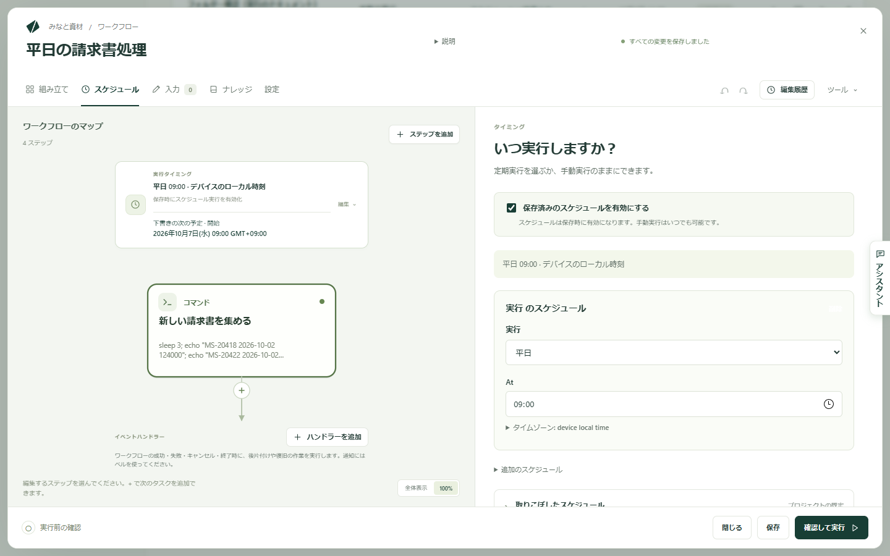

Kitewell はワークフローを自動で開始できます。毎平日の 9 時、1 時間ごと、あるいは別のサービスからリクエストが届いた瞬間に実行できるので、誰かが覚えておく必要はありません。作業は、このコンピューターが動いていて、ユーザーがサインインしている間に行われます。

## 前提になること

- **コンピューターがスリープしておらず、サインインしていること。** Kitewell はスリープ中のコンピューターを復帰させません。電源が切れている、スリープしている、サインアウトしているマシンでは、予定の時刻に何も実行できません。
- **Kitewell が動いていること。** ウィンドウは閉じてかまいません。Mac ではメニューバー、Windows では通知領域に残って動き続けます。

## スケジュールを設定する

1. ワークフローを開き、**スケジュール** を選びます。
2. **保存済みのスケジュールを有効にする** にチェックが入っていることを確認します。入っていないと、自分で開始したときだけ実行されます。
3. **実行** で頻度を選びます。**手動で**、**毎日**、**平日**、**毎週**、**毎時**、**カスタムスケジュール** から選べます。
4. 時刻を指定します。毎日・平日・毎週のスケジュールは **At** で時刻を指定します。毎週はさらに **On** で曜日を選びます。毎時は **毎時の何分** を指定します。カスタムは、分・時・日・月・曜日の 5 項目からなる **cron 式** を入力します。
5. 時刻を特定の地域に合わせたい場合は **タイムゾーン** を開き、`Asia/Tokyo` のようにゾーンを入力します。空欄のままなら、このコンピューターの時計に従い、夏時間の切り替えも反映されます。
6. **保存** を選びます。スケジュールはその時点から効き始めます。

フォームの下の **次の予定5件** には、このワークフローが実際に実行される時刻が表示されます。スケジュールを信頼する前に確認できます。プロジェクトの **概要** には、すべてのワークフローの同じ情報が **今後の予定** としてまとまっています。

1 つのワークフローに複数のスケジュールを持たせたり、指定の時刻に停止・再起動させたりもできます。それらは **追加のスケジュール** にあります。

ワークフローを変えずに一時的に対象から外すには、**ワークフロー** の一覧で **スケジュールを一時停止** を使います。状態が **一時停止中** になり、**スケジュールを再開** で戻せます。ワークスペースからダウンロードしたプロジェクトは、ワークフローが一時停止の状態で届くので、許可するまでこのコンピューターで何かが動き出すことはありません。

## Kitewell を動かしたままにする

Mac では、ウィンドウを閉じるか **Keep Running in Menu Bar**（⌘Q）を選ぶと、ウィンドウが隠れ、サービスとプロジェクトのエンジンは動いたままになります。**Open Kitewell** でウィンドウが戻ります。**Quit Kitewell** はすべてを停止します。実行中の処理があるときは、警告を表示してから中断します。

Windows では、ウィンドウを閉じると非表示になり、Kitewell は通知領域に残ります。アイコンをクリックするか、メニューで **Open Kitewell** を選ぶとウィンドウが戻ります。**Quit Kitewell** の動作は Mac と同じです。

**Start at login** をオンにすると、コンピューターにサインインしたときに Kitewell が起動します。どちらのメニューにもプロジェクトが一覧表示され、プロジェクトごとに開始と停止ができます。画面上でプロジェクトを切り替えても、ほかのプロジェクトのスケジュールは止まりません。

これらのメニュー項目は、Kitewell の表示言語にかかわらず、どちらの OS でも英語で表示されます。

## スリープと、取りこぼした実行

コンピューターがスリープすると、ワークフローは実行されません。これに関わる設定が 2 つあります。

- **デバイス設定 → スリープ防止 → ワークフロー実行中の自動スリープを防ぐ** は、実際に作業が動いている間、コンピューターをスリープさせません。初期設定はオフです。メニューバーや通知領域のメニューにある **Keep awake while workflows run** も同じスイッチです。どちらも、これから始まる予定のためにコンピューターを起こすことはなく、蓋を閉じるなど自分でスリープさせた場合も防ぎません。
- 取りこぼしの実行は、コンピューターが戻ったあとに、逃した開始を実行します。既定では 24 時間さかのぼり、逃した回をすべて実行します。

1 つのワークフローの設定は **スケジュール → 取りこぼしたスケジュール** で変更します。

- **取りこぼしたスケジュールを実行**：**プロジェクトの既定に従う**、**オフ**、**さかのぼる期間を指定** から選びます。
- **さかのぼる期間**：どこまでさかのぼるか。最大 30 日です。
- **取りこぼし時の動作**：**取りこぼした回をすべて実行**、**取りこぼした最新の回のみ実行**、**実行中はスキップ** から選びます。

**プロジェクト設定 → ワークフローの既定値** でプロジェクト全体の既定を決められます。**デバイス設定 → ワークフローの既定値** は、新しいプロジェクトの初期値だけを決めます。

Kitewell Personal と Team では、[スケジュールの取りこぼしのアラート](/ja/docs/alerts/)で、開始されなかった実行の件数と理由（コンピューターがスリープしていた、Kitewell が動いていなかったなど）がわかります。

## 別のサービスからワークフローを開始する

ほかのサービスからリクエストが届いたときに実行を始めることもできます。GitHub で Issue が開いたとき、Stripe の決済後、フォームの送信時、Zapier がつなぐアプリからなどです。同じ **スケジュール** の画面で、スケジュールの横にある **Webhook** をオンにします。手順と、リクエストが運ぶものについては[Webhook でワークフローを開始する](/ja/docs/webhooks/)を参照してください。

## キュー

キューは、すべてが一度に始まるのを防ぎます。どのプロジェクトにも、同時に 5 件まで実行する **default** キューがあります。変更やキューの追加は **その他 → キュー** で、**同時実行数** を指定して行います。ワークフローは **設定** でキューを選びます。

キューは、手動の開始、取りこぼしの実行、リトライ、Webhook による実行、[バッチ](/ja/docs/batches/)の行の実行ペースを調整し、それぞれ空きを待ちます。スケジュールどおりの時刻に始まる実行は待たされません。**実行とログ** には、キューごとの実行中と待機中の状況が表示されます。

## 無人で動かす前に

スケジュール実行は誰も見ていません。各ステップに必要なものを先に確認してください。

- コマンドは、Kitewell を実行している人の権限で実行されます。
- Docker のステップには、起動中の Docker が必要です。
- AI のステップには、このデバイスで設定したモデルまたはエージェントが必要です。
- 別のマシンで実行するステップには、接続できるマシンと、承認済みのホスト鍵が必要です。
- [Web サイトのステップ](/ja/docs/browser/)には、Chrome と、成功した **ブラウザーを確認** が必要です。
- このデバイスに値のないシークレットを使う実行は、開始時に失敗します。

スケジュールに任せる前に、これらを手動で確認してください。

## うまくいかないときは

- **時刻になっても実行されなかった。** コンピューターがスリープしておらずサインインしていたか、Kitewell が動いていたか、**保存済みのスケジュールを有効にする** にチェックが入っていてワークフローが **一時停止中** でないかを確認してください。
- **違う時刻に実行された。** スケジュールの **タイムゾーン** と、**次の予定5件** に表示される時刻を確認してください。これらはそのゾーンと夏時間の切り替えに従います。
- **コンピューターの復帰後に実行がまとめて始まった。** 取りこぼしの実行です。**取りこぼし時の動作** を **取りこぼした最新の回のみ実行** にするか、取りこぼしの実行を **オフ** にしてください。
- **Webhook のアドレスが表示されない。** Kitewell がまだリレーに問い合わせ中です。このデバイスがサインインしていて、オンラインかどうかを確認してください。

ほかの症状は[トラブルシューティング](/ja/docs/troubleshooting/)にあります。

## 詳細

- 実行履歴は、はじめは 30 日間保持されます。**デバイス設定 → 実行履歴の保存期間** で変更できます。[実行とログ](/ja/docs/runs/)を参照してください。
- 取りこぼしの実行は、既定で 24 時間、最大 30 日までさかのぼります。保持されるのはワークフローごとに最大 1,000 件です。
- 既定のキューは同時に 5 件まで実行します。プロジェクトで定義されていないキューは、同時に 1 件ずつ実行します。
- Webhook のアドレスは `https://hooks.kitewell.app/…` という形です。リクエストは POST である必要があり、応答は `202` で、実行については何も返しません。
- ステップは、リクエストの本文を `$WEBHOOK_PAYLOAD`、ヘッダーを `$WEBHOOK_HEADERS` という環境変数から読み取ります。認証、Cookie、経路に関するヘッダーは、リクエストが実行に届く前に取り除かれます。
- Webhook が受け付けるのは、1 分あたり約 60 リクエスト、本文は 512 KiB まで、ヘッダーは 16 KiB までです。**最近のリクエスト** には直近 20 件が残ります。Kitewell は送信元の署名を検証しません。
- Windows では、本文がおよそ 32,000 文字を超えると、コマンドラインの長さの制限により実行が始まらないことがあります。可能であれば、送信側のサービスで本文を小さくしてください。
- メニューバーと通知領域の項目（**Keep Running in Menu Bar**、**Open Kitewell**、**Quit Kitewell**、**Start at login**、**Keep awake while workflows run**）は、どの OS でも英語です。**Keep Running in Menu Bar** は Mac だけの項目です。
