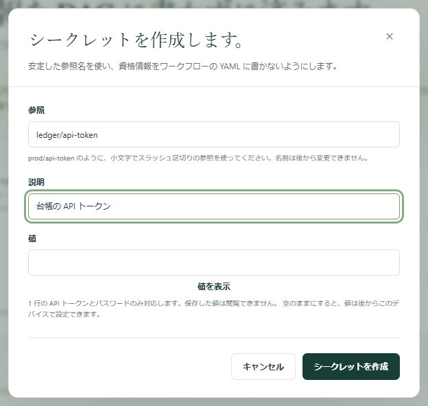
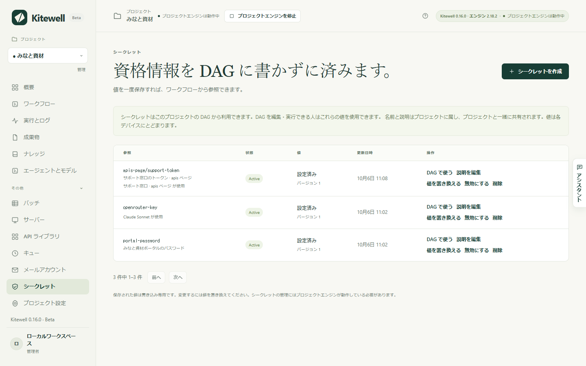

ワークフローには、パスワード、API トークン、鍵などが必要になることがよくあります。シークレット（Kitewell が預かる認証情報）として一度保存すれば、ワークフローは名前でそれを読みます。もう誰も入力し直す必要はなく、ワークフローの定義に値が現れることもなく、ログには値ではなく名前が出ます。

## 必要なもの

- このデバイスの管理者権限。サイドバーの **その他** に **シークレット** が表示されます。表示されない場合は、Kitewell を設定した人に相談してください。
- プロジェクトのエンジンが動いていること。プロジェクトが停止している間はシークレットを保存も変更もできず、ページにそう表示されます。

## 認証情報を保存する

1. **その他 → シークレット** を開き、**シークレットを作成** を選びます。
2. ワークフローが使う名前を **参照** に入力します。たとえば `services/api-token` です。小文字の英字、数字、ハイフンを使い、各部分をスラッシュで区切ります。参照は後から変更できません。
3. 何を開くための認証情報かが次の人に分かるよう、**説明** を書きます。
4. 認証情報を **値** に入力します。**値を表示** で、貼り付けた内容を確かめられます。空のままにすると、後でこのデバイスで値を追加できます。
5. **シークレットを作成** を選びます。

シークレットが一覧に **設定済み** として表示され、横に **バージョン** 1 が出ます。値そのものは、ここでもほかのどこでも、二度と表示されません。

## ワークフローで使う

ワークフローエディターで、そのシークレットが必要なフィールドにシークレットを選びます。次の 3 つの設定では、値ではなく名前でシークレットを指定します。

- モデルの API キー（**エージェントとモデル**）。
- サーバーや踏み台ホストのパスワード（**サーバー**）。
- インポートした接続の認証情報（**API ライブラリ**）。

YAML を自分で書くステップでは、シークレットの行で **DAG で使う** を選びます。貼り付ける 2 行と、ステップが値を読むための名前が表示されます。

[Web サイトのステップ](/ja/docs/browser/)やデスクトップのステップでは、**ブラウザーが入力する値** または **ステップが入力する値** でシークレットを選びます。指示、モデル、ログに届くのは `%name%` と書かれた名前だけで、値はブラウザーが入力します。

[アシスタント](/ja/docs/ai/#the-assistant)は、ワークフローを組む途中でシークレットを依頼できます。その名前のシークレットを追加するカードが現れるので、認証情報を **値** に入力して **保存** を選びます。入力した内容をアシスタントが見ることはありません。

## デバイスにまだ値がないとき

シークレットの名前と説明はプロジェクトに属し、値は入力したデバイスに属します。インポートや[同期](/ja/docs/cloud-sync/)で届いたプロジェクトは、名前を持っていて、値を必要としています。

- **値が必要** は、プロジェクトが使うシークレットのうち、このデバイスに値がないものです。**値を設定** を選んでください。
- **概要** には、このデバイスでまだ値が必要なシークレットがすべて並び、それぞれに **値を設定** があります。
- **このデバイスのみ** は、このデバイスが持っていてプロジェクトには載っていないシークレットです。**宣言** を選ぶとプロジェクトに追加されます。
- 各シークレットの行には、「Claude Sonnet が使用」のように、それを必要としているもの（モデル、ワークフロー、サーバー、接続）が示されるので、どの認証情報を探せばよいか分かります。

値が設定されるまで、Kitewell は途中で失敗させるのではなく、作業そのものを拒否します。ワークフローの実行、実行のリトライ、バッチの開始、シートの行の更新、ステップのテストは、いずれも開始前に止まり、「Set a value for … on the Secrets page, then run again.」と表示されます。スケジュール実行は拒否されず、開始してから失敗します。

## 変更する、削除する

- **値を置き換える** は、同じ参照のまま新しい認証情報を保存します。**バージョン** の番号が上がり、そのシークレットを使っているものを編集する必要はありません。
- **説明を編集** は、説明だけを変えます。
- **無効にする** を選ぶと、そのシークレットは読み取られなくなりますが、値は残ります。それを必要とする実行は失敗します。**有効にする** で元に戻ります。
- **削除** は、プロジェクトからシークレットを、このデバイスから値を削除します。そのプロジェクトを同期するすべてのデバイスから名前も消え、その参照を使っているものには別のシークレットが必要になります。

## うまくいかないとき

- **「Set a value for … on the Secrets page, then run again.」** このデバイスにそのシークレットの値がありません。**シークレット** を開いて **値を設定** を選び、もう一度実行してください。
- **エンジンが動いている必要があると表示される。** プロジェクトが停止しています。開始してから、もう一度試してください。
- **複数行の値が拒否される。** 対応しているのは 1 行のトークンとパスワードだけです。複数行にまたがる鍵は、ステップが読むファイルなど、別の方法で渡してください。
- **「already has a value on this device」と表示される。** シークレットの作成が、保存済みの値を上書きすることはありません。**値を置き換える** を使ってください。

## 守られるもの、守られないもの

シークレットはプロジェクトのエンジンによってディスク上で暗号化され、それを復号する鍵はこのデバイスに残ります。ステップが値を受け取るのは、実行している間だけです。

これはサンドボックスではありません。このプロジェクトのワークフローを編集・実行できる人は、そのシークレットを読むステップを書けます。また、ステップは Kitewell を実行している人の権限で動きます。プロジェクトを分ければシークレットは分かれますが、コマンドにできることが制限されるわけではありません。

Kitewell はログの中でシークレットの値そのものをマスクします。ステップがエンコード、切り詰め、変換をしてから出力した値は、マスクされないことがあります。認証情報を出力しないでください。

## エクスポート、同期、バックアップ

| プロジェクトの行き先 | 名前と説明 | 値 |
| --- | --- | --- |
| プロジェクトの[エクスポート](/ja/docs/sharing/) | 参照も含めて含まれる | 含まれない |
| [Dagu Cloud との同期](/ja/docs/cloud-sync/) | プロジェクトと一緒に同期される | 送信されない |
| デバイスの[バックアップ](/ja/docs/backups/) | 含まれる | 鍵とともに含まれない |

プロジェクトを受け取った人には、各シークレットが **値が必要** と表示され、それぞれが自分で値を設定します。バックアップを復元した後は、認証情報をもう一度入力してください。入力し直すものは、復元が名前で示します。復旧に必要な認証情報は、別に安全な場所へ記録しておいてください。

Dagu Cloud が新しいシークレットをプロジェクトに受け付けなかった場合も、値はこのデバイスに保存されます。ほかの同期先には、宣言されるまで名前が表示されません。

エクスポートとバックアップは暗号化されません。ワークフロー、OpenAPI のファイル、ソース URL に直接書いた認証情報は、書いたままアーカイブに残ります。共有する前にアーカイブを確認し、共有ストレージに置く前に自分で暗号化してください。

## 詳細

- 参照は `^[a-z0-9][a-z0-9-]*(/[a-z0-9][a-z0-9-]*)*$` に一致し、80 文字以内です。説明は 1 行で 200 文字以内です。
- 値が 1 行だけなのは、エンジンのログのマスク処理が 1 行ずつ動くためです。
- 保存先は `engines/<project>/data/secrets` にある Dagu の AES-256-GCM のシークレットレジストリで、その鍵は `engines/<project>/data/auth/encryption_key` です。どちらもバックアップには入りません。
- 値は、ステップが必要とした時点でエンジン自身のコマンドを通して読まれ、ほかのどこにも書かれません。
- 一覧は 1 ページ 50 件で、**前へ** と **次へ** で移動します。
- コンテナーレジストリのサインインはエンジン内部の値として保存され、このページには並びません。**プロジェクト設定** で管理してください。
