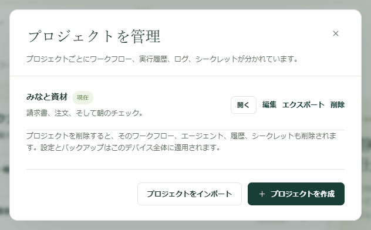

定型作業を一度作れば、プロジェクトごと同僚に渡せます。自分の 2 台目のコンピューターに渡すこともできます。相手にはワークフローと、それらが必要とする設定の名前が渡り、こちらに残すべきものは渡りません。パスワード、実行履歴、メールボックスのサインインは含まれません。

ワークフローを変更してもすべてのコピーを同じ状態に保ちたい場合は、代わりに[プロジェクトを Dagu Cloud と同期](/ja/docs/cloud-sync/)してください。エクスポートはその時点のスナップショットで、何かを編集した瞬間から最新ではなくなります。

## プロジェクトを別のコンピューターに送る

1. サイドバー上部のプロジェクトセレクターを開き、**管理** を選びます。
2. **プロジェクトを管理** で、プロジェクトの横の **エクスポート** を選びます。`kitewell-project-harbor-supply-20261005T091500.tgz` のように、プロジェクト名と日時が入った名前のファイルが 1 つダウンロードされます。
3. チームで普段使っている方法でファイルを渡します。
4. 受け取る側のコンピューターで **プロジェクトを管理** を開き、**プロジェクトをインポート** を選んで、そのファイルを指定します。
5. Kitewell が「残りはこのデバイスで用意してください」と表示し、足りないものを一覧にします。値が必要なシークレット、接続するメールボックス、まだホスト鍵が承認されていないマシン、カスタムのコマンド、そして一時停止の状態で届いたワークフローです。**開く** を選んで、その一覧を上から片付けていきます。



インポートすると必ず新しいプロジェクトが作られ、既存のプロジェクトが置き換えられることはありません。同じ名前のプロジェクトがすでにある場合は、別の名前を尋ねられます。

新しいプロジェクトは、そのコンピューターの上限に数えられます。無料プランでは 1 つ、Kitewell Personal では最大 10 個、Team では最大 15 個です。プランの上限（無料プランでは 10 個、Personal と Team では 100 個）を超えるワークフローを含むプロジェクトは、そもそもインポートできません。ファイル自体は 16 MiB までです。

## 含まれるものと含まれないもの

ファイルには、プロジェクトが一連のテキストのドキュメントとして収められています。

- ワークフローの定義とそのスケジュール
- 名前を付けたエージェントとモデル
- インポートした OpenAPI ドキュメントと API 接続の設定
- サーバーのアドレスとサーバーグループ、キュー、イメージレジストリ
- バッチシート
- シークレットの名前と説明（値は含まれません）
- プロジェクトのワークフロー既定値と[ナレッジ](/ja/docs/knowledge/)
- プロジェクトが最後に取り込んだリリースの記録

残りは、受け取る側のコンピューターで用意します。

- シークレットの値とレジストリのパスワード
- SSH 秘密鍵のパスと承認済みのホスト鍵
- カスタムエージェントのコマンド、インストール済みのツール、エージェントのサインイン
- メールボックスの接続
- 外部スクリプト、入力ファイル、Docker でマウントするデータ

まったく含まれないもの：実行履歴、ログ、成果物、リリース、ローカルの編集履歴、プロジェクトのアラートルール、失敗の診断の設定、Web サイトのサインイン、デバイス設定、このコンピューターの API キー。

:::caution
ファイルは暗号化されていません。ワークフローのコマンド、OpenAPI ドキュメント、サーバーのアドレス、そのほかのプロジェクト設定に直接入力した内容は、書かれたとおりに渡ります。送る前にこれらの項目を確認し、認証情報は[シークレット](/ja/docs/secrets/)に保存して、こちらに残るようにしてください。
:::

## どのコンピューターがスケジュールを実行するか決める

インポートしたワークフローは、意図して一時停止の状態で届きます。まず手動で 1 回実行して結果を確かめ、そのうえでこのコンピューターが担当するスケジュールを有効にしてください。

2 台のコンピューターで同じスケジュールを有効にすると、それぞれが独立して実行します。一度だけ実行すべき作業では、実行するコンピューターを 1 台選び、ほかのコピーは一時停止のままにしてください。そのコンピューターは、その時刻に起動していてスリープしていない必要があります。詳しくは[スケジュールとバックグラウンド動作](/ja/docs/scheduling/)を参照してください。

## 1 台のコンピューターのワークフローをチームメイトに操作させる

作業自体は 1 台のマシンに置いたままにして、同僚にはそれを開始したり、見守ったり、変更したりしてほしいこともあります。その場合は、プロジェクトのコピーではなくキーを渡します。

1. そのコンピューターで **このデバイス → MCP** を開きます。
2. **AI エージェントを接続** を選び、人ごと、またはクライアントごとにキーを作って、役割に合う **権限** を与えます。見るだけなら **読み取り専用**、作業を開始するなら **ワークフローの実行**、ワークフローを変更するなら **編集と実行** です。
3. **許可するプロジェクト** で、各キーをその人に必要なプロジェクトに限定します。

あとは、どの MCP クライアントからでも、あるいは素の HTTP リクエストからでも、そのコンピューターを操作できます。無料プランで使える API キーと接続済みのアプリは合わせて 1 つで、Kitewell Personal と Team では何個でも使えます。どの実行も、そのコンピューターのユーザーとして行われるため、キーで決まるのはアクセスできるプロジェクトの範囲で、ワークフローが動き出した後にできることではありません。アプリ自体の任意のサインインは別のもので、これらのキーでそのログインが作られるわけではありません。

別のコンピューターのクライアントには、HTTPS で到達できるアドレスが必要で、その用意はご自身で行います。権限の詳細とあわせて [MCP と API アクセス](/ja/docs/mcp/)を参照してください。

## 定義をバージョン管理する

プロジェクトのドキュメントは通常の JSON ファイルと YAML ファイルなので、チームは自分たちの Git リポジトリでレビューし、バージョン管理できます。Kitewell がそのリポジトリへのプッシュ、プル、マージを代行することはありません。

ファイルは Kitewell のデータフォルダーの下にあります。macOS では `~/Library/Application Support/Kitewell`、Windows では `%LOCALAPPDATA%\Kitewell` です。

```text
data/workspace/project-<id>/
  project.json
  workflows/
  batch-sets/
  knowledge/
  agents/  apis/  queues/  registries/  secrets/  server-groups/  servers/
  releases/
```

`project.json` には、プロジェクトの名前、説明、ワークフロー既定値、最後に取り込んだリリースが入ります。`workflows` にはワークフローごとに 1 つの YAML ファイル、`batch-sets` にはバッチシートごとに 1 つ、`knowledge` にはナレッジのページごとに 1 つ、`releases` にはリリースごとに 1 つが入り、残りの各フォルダーには、エージェント、API 接続、キュー、レジストリ、シークレット名、サーバーグループ、サーバーごとに 1 つの JSON ファイルが入ります。`project-<id>` フォルダー全体をバージョン管理してください。目的のフォルダーは、その中の `project.json` にある名前で特定します。ファイル構成とドキュメント ID はそのまま維持してください。

ファイルを置き換えたり、リポジトリからの変更を適用したりする前に Kitewell を終了し、競合を解決してから再度開いて、実行前にプロジェクトを確認してください。終了すると実行中の処理は中断されるため、先に終わるのを待ってください。[同期しているプロジェクト](/ja/docs/cloud-sync/)はこの方法で管理しないでください。そのファイルは Kitewell が管理し、Dagu Cloud から変更が届くと置き換えられます。

共有するのは、データフォルダー全体ではなくこのフォルダーだけにしてください。デバイスの認証情報、シークレットの値、実行データは各コンピューターに属するものです。新しく加わる人には、**プロジェクトをインポート** と、確認済みのエクスポートのほうが向いています。

## ロボット管理台帳を書き出す

自動化ごとに、何をしているか、どこにつながっているか、誰が管理しているかを 1 行ずつまとめたロボット管理台帳を持つチームは少なくありません。**ワークフロー** ページの **台帳を書き出す** で、それを Excel のブックとしてダウンロードできます。ワークフローごとに 1 行で、列は金融情報システムセンター（FISC）が示すロボットの管理項目の順に並びます。

Kitewell は、各ワークフローとその[ナレッジ](/ja/docs/knowledge/)から読み取れる項目を、モデルを使わずに埋めます。**ロボット名称** と **ロボットID**、**稼働周期** と **状態**、起動するワークフローを示す **稼動後続条件**、**業務内容**、開くブックを示す **インプットデータ・アウトプットデータ**、接続するサイト・API・サーバー・メールボックス・モデルを示す **接続システム・アプリケーション名**、そしてナレッジのページを全文そのまま収める **ドキュメント類** です。

記入できるように空けてある列は 6 つです。**管理責任者・担当者**、**委託先**、**エラー時対応方針**、**業務における重要性**、**顧客影響**、**法令・規制の影響有無**。列の名前は、Kitewell の表示言語に合わせます。
