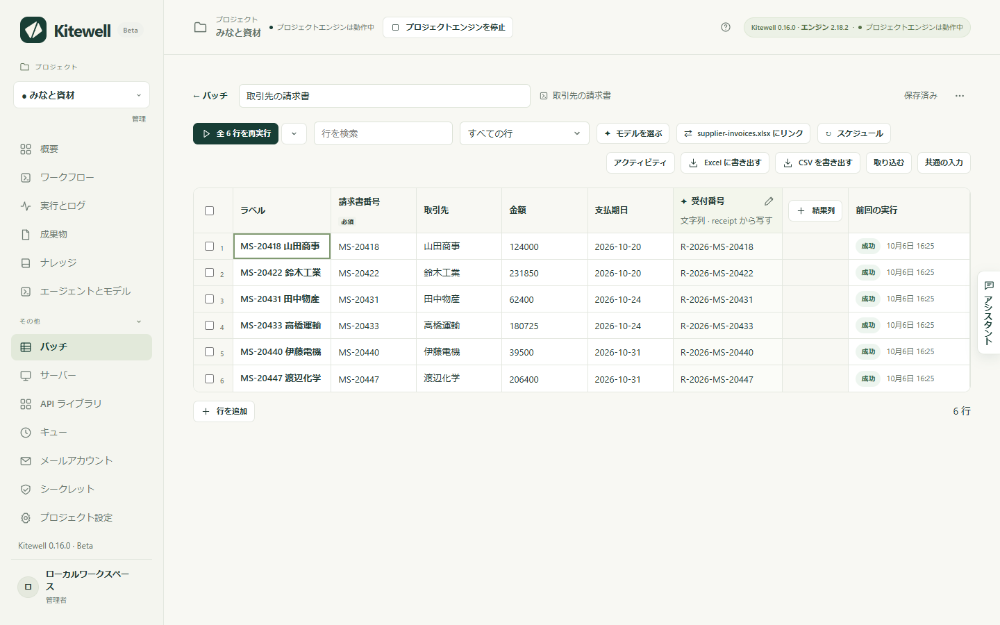
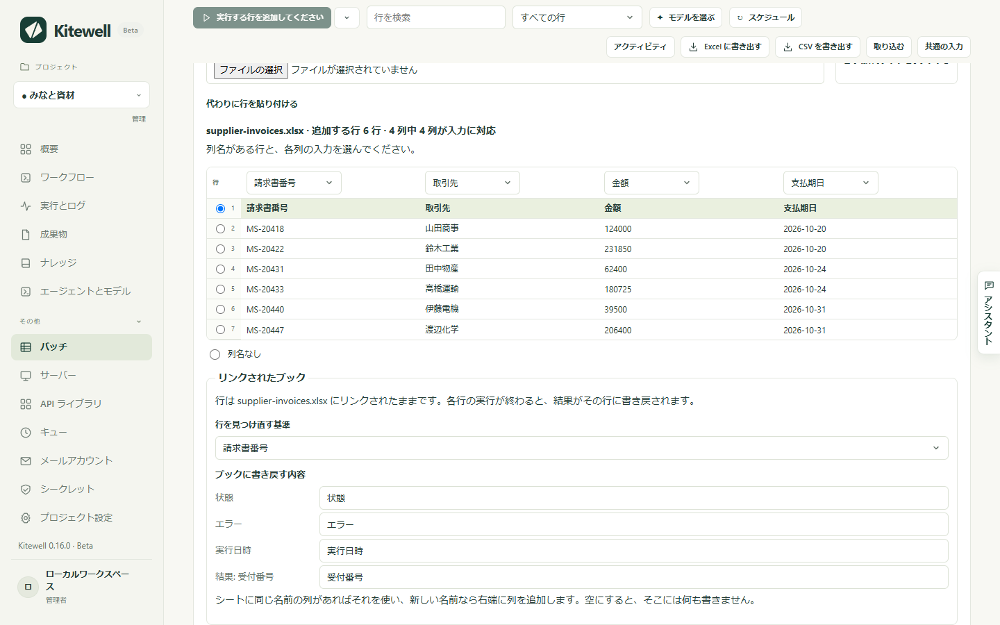

Excel に一覧があるとします。今月の請求書が 1 行に 1 件、そしてそれぞれにやるべきことがある。Kitewell はワークフローを 1 行につき 1 回実行し、結果を元の行に書き戻します。あとで同じファイルを開くと、請求書の横に受付番号が並んでいます。

Excel は起動しません。Kitewell は `.xlsx` ファイルを直接読み書きするので、夜間に画面がロックされていても動き続けます。

## ブックをリンクする

ファイルがあるコンピューターの Kitewell アプリが必要です。ブラウザーからはファイルに届かないため、この操作は表示されません。

1. 1 行につき 1 回実行するワークフローのシートを作ります。作り方は[シートでワークフローを一括実行](/ja/docs/batches/)にあります。
2. シートのツールバーで **取り込む** を選び、**この端末のブックをリンクする** から `.xlsx` ファイルを選びます。ファイルを Kitewell のウィンドウにドロップしても同じです。
3. Kitewell が見つけたものを確認します。**シート**、列名が入っている行、どの列がどの入力に入るか。入力と名前が一致する列は自動で割り当てられます。
4. **行を見つけ直す基準** で、請求書番号など、行を識別する列を選びます。
5. **ブックに書き戻す内容** で、結果が入る列を確認します。**状態**、**エラー**、**実行日時**、そして結果ごとに 1 列。名前は変更でき、空にするとその列には何も書きません。
6. **リンクして 6 行を追加** を選びます。

シートにはブックの行が並び、ツールバーには **リンク先** とファイル名が表示されます。

## 行を実行する

通常のシートと同じように行を実行します。入力の型に合わないセル（金額に「十二」など）には印が付き、その行は直すまで待ちます。

行が終わると、Kitewell は 30 秒ほどのうちに自動で結果をブックに書き込みます。**結果を今すぐ書き込む** を選べば待ちません。

| 列 | 入るもの |
| --- | --- |
| 状態 | 済、一部失敗、失敗、中止、却下 |
| エラー | その行が失敗した理由を 1 行で |
| 実行日時 | その行を実行した時刻 |
| 結果ごとに 1 列 | 受付番号など、実行が作った値 |

ヘッダーが英語のブックには英語の言葉が入ります。Status、Error、Run at、そして「済」は Done です。

## ファイルが Excel で開かれているとき

失敗にはなりません。シートに、結果の準備ができていて、Excel でファイルを閉じると書き込まれると表示され、閉じた瞬間に書き込みます。**結果をコピーに保存する** を選ぶと、代わりに `supplier-invoices (results).xlsx` を横に作ります。

## 毎朝の処理

シートに[スケジュール](/ja/docs/scheduling/)を付けます。さらに 2 つを選びます。**先に supplier-invoices.xlsx を読む** と、**実行する行** — **すべての行** か、**ブックで追加・変更された行だけ** か。

後者にすると、毎朝ファイルを読み、新しい行だけを実行し、結果を書き戻し、何も変わっていなければ何も始めません。スケジュールは、ファイルがあるコンピューターで設定してください。ほかのコンピューターでは実行できません。

## うまくいかないとき

- **誰かがシートを並べ替えた、または絞り込んだ。** Kitewell は書き込みの前に毎回ファイルを読み直し、各行をキーで追いかけます。移動した行は除外して名前を挙げ、ほかの行は書き込みます。
- **書き込むべきでない結果が入ってしまった。** **元に戻す** でファイルを戻せます。Kitewell は直近 10 回の書き込みの前のコピーを保持しています。
- **ディスク上のブックが変わった。** シートに **ブックをもう一度読む** が表示されます。新しい行と変わった行を取り込み、ブックにもうない行には **リストから消えた行** と印を付けます。
- **ステップが失敗する。** [トラブルシューティング](/ja/docs/troubleshooting/#a-spreadsheet-step-fails)を参照してください。

## Excel についてもっと知る

[Excel リファレンス](/ja/docs/reference/spreadsheets/)に残りをまとめています。フォーム形式の見積や注文の読み取り、ワークフローで使える 10 個のスプレッドシートのステップ、シートの代わりにステップで同じ仕事を組む方法、コンピューターに残るもの、そして制限です。
