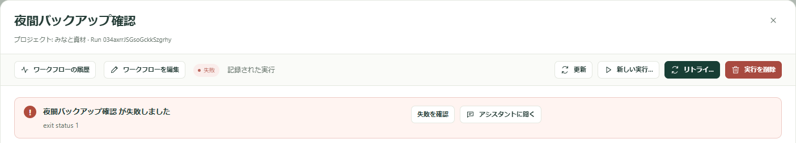
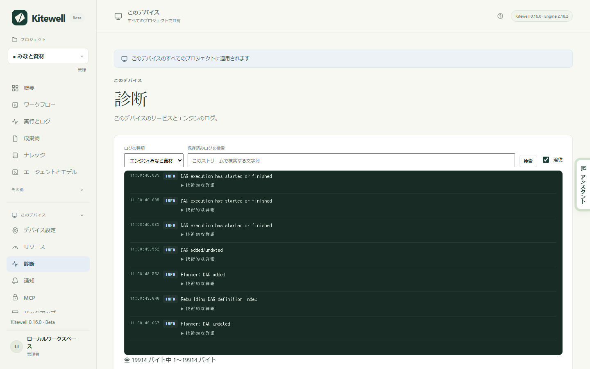

起きたことを探して、その対処を読んでください。どれにも当てはまらない場合は、バージョン、行った操作、パスワードを取り除いた出力を添えて、[サポートの Issue を作成](/ja/support/)してください。

## 実行が失敗した

**実行とログ** から実行を開きます。上部の要約が、失敗したステップとその内容を伝えます。

- **失敗を確認** は、そのステップとログを表示します。
- **アシスタントに聞く** は、原因を調べてもらう操作です。
- **エディターで修正** は、失敗したステップの位置でワークフローを開きます。直したうえで、選んだステップから実行を続けられます。ワークフロー自身の履歴から開いた実行で表示されます。**ワークフロー** でその行の **実行履歴を表示** を選んでください。

[失敗の診断](/ja/docs/ai/#failure-diagnosis)をオンにしていると、もう一度試すべきか、何に対応が必要か、何を変えるべきかも表示されます。[実行とログ](/ja/docs/runs/#fix-a-failed-run)を参照してください。

## ターミナルでは動くコマンドが Kitewell では失敗する

Kitewell の環境は、ターミナルが用意する環境とは違います。プログラムはフルパスで指定し、ステップに作業フォルダーを設定し、必要な変数はシェル任せにせず自分で指定してください。コマンドが入力待ちになっていないか、ターミナルのセッションの中にしかない認証情報を使っていないかも確認してください。

## スケジュールしたワークフローが実行されなかった

次の順に確認してください。

1. ワークフローの **スケジュール** が、**保存済みのスケジュールを有効にする** をオンにした状態で保存されていること。
2. タイムゾーンが意図したものであること。
3. プロジェクトのエンジンが動いていること。**概要** に状態が表示され、開始する操作も用意されています。
4. その時刻に、コンピューターがスリープしておらず、あなたがサインインしていたこと。

**概要** には、スケジュールされた作業を止めるほかの原因も表示されます。エンジンが受け付けないワークフロー（ほかのワークフローは実行を続けます）、同僚から一時停止の状態で届いたワークフロー、このデバイスでまだ値が必要なシークレットです。

スリープ中に過ぎた開始時刻は、ワークフローがそう求めている場合だけあとから実行されます。ワークフローの **スケジュール → 取りこぼしたスケジュール** を確認してください。

## Web サイトのステップが失敗する

まず、実行の成果物にあるステップのスクリーンショットを見てください。サインインページ、Cookie のバナー、ボット対策の確認が原因であることがほとんどです。次の点も確認してください。

- Chrome（Windows では Microsoft Edge でも可）がインストールされ、**ブラウザーを確認** が成功すること
- **許可する Web サイト · 1 行に 1 つ（任意）** を設定している場合は、ページが使うホストが含まれていること
- 待機時間がページの表示に十分であること
- 指示にパスワードが含まれていないこと。**ブラウザーが入力する値** に入れてください
- ステップまたはワークフローでモデルが選ばれていること

サイトが変わって、再現した操作がうまくいかなくなった場合は、**プロジェクト設定 → ストレージ → リプレイキャッシュ** で消去します。[Web サイトを自動操作](/ja/docs/browser/)を参照してください。

## スプレッドシートのステップが失敗する

多くの拒否メッセージは、ブック、シート、セルを名指しします。ステップの **チェック** を押すと、何も実行する前にエンジンに問い合わせられます。よくある原因は次のとおりです。

- パスがこのコンピューター上の `.xlsx` または `.xlsm` ファイルのフルパスになっていない。`.xls` や `.ods` は Excel で先に `.xlsx` として保存する必要があります
- ステップが指定したシートや列がブックにもうない。メッセージには現在ある名前が並びます
- 列に指定した型にセルを変換できない。数量に「十二」と入っている場合などです
- ファイルが Excel で開かれている。閉じるまで書き込みは保留されます
- 書き込み先を結合セルが覆っている。メッセージが解除すべき範囲を示します

リンクしたブックへの書き込みは、Kitewell が書いたあとファイルが変わっていなければ、シートから元に戻せます。[Excel を自動化](/ja/docs/spreadsheets/)を参照してください。

## デスクトップのステップが失敗する

まず、実行の成果物にあるステップのスクリーンショットを見てください。次の点も確認してください。

- **デバイス設定 → デスクトップ自動操作 → デスクトップへのアクセスを確認** で、すべての許可が与えられていること。Mac では **Kitewell Agent** に画面収録とアクセシビリティの許可が必要です
- 画面のロックが解除され、コンピューターがスリープしていないこと。ロック中はすべてのデスクトップステップが失敗します
- Windows で、Kitewell が管理者でないのに対象のアプリが管理者として動いていないこと
- タスクが **タスクごとの最大操作数** に収まっていること。収まらなければ小さなタスクに分けます
- モデルがコンピューター操作ツールを備えていること。または、ステップが **汎用ツール（どの画像対応モデルでも可）** を使っていること
- 指示にパスワードが含まれていないこと。**ステップが入力する値** に入れてください

デスクトップが空くのを待ったステップは、あなたのマウスやキーボードの操作で一時停止しています。誰も作業しないコンピューターでは、**デスクトップ設定** で待ち時間を短くするか、オフにします。アプリが変わって、再現したタスクがうまくいかなくなった場合は、**プロジェクト設定 → ストレージ → リプレイキャッシュ** で消去します。[デスクトップアプリを自動操作](/ja/docs/desktop/)を参照してください。

## Google に「このアプリはブロックされます」と表示される

Google が Kitewell の Gmail アクセスの審査を終えるまで、ほとんどのアカウントでブラウザーからのサインインはブロックされ、そのページから先には進めません。ページを閉じて Kitewell に戻り、**代わりにアプリパスワードを使う** を選んでください。[メールを自動化](/ja/docs/email/)を参照してください。

## メールボックスの再接続が必要

このコンピューターでサインインできないメールボックスを指定した実行は拒否され、**概要** にどのアドレスを接続または再接続すべきかが表示されます。**メールアカウント** を開き、**再接続** を選んでください。よくある原因は次のとおりです。

- アカウントのパスワードが変わった、または管理者がセッションを終了させた
- Google のサインインが 6 か月間使われなかった、または Microsoft のサインインの最後の更新から 90 日以上たった（コンピューターが停止していた）
- プロバイダーのサイトでアプリパスワードが削除された
- Microsoft 365 の管理者が IMAP または認証済み SMTP を無効にした、または Kitewell に管理者の承認を求めている。エラーに、管理者に送るリンクが含まれます
- Google Workspace の管理者がサードパーティアプリをブロックしている

同僚や Dagu Cloud から届いたプロジェクトでは、ここで接続するまでメールボックスは未接続と表示されます。[メールを自動化](/ja/docs/email/)を参照してください。

## AI タスクが失敗する

エージェントがインストールされてサインイン済みであること、または選んだモデルに有効なプロバイダーの認証情報があることを確認してください。**エージェントとモデル** の **エージェントをテスト** と **モデルをテスト** で、実行前に両方を確認できます。そのうえで、記録されたプロンプト、タスクのエラー出力、プロバイダーが制限や請求で止めていないかを見てください。実際の認証情報は報告に含めないでください。

## Docker を利用できない

このコンピューターで Docker を起動し、ワークフローエディターで **Docker を確認** を使います。Kitewell は Docker のインストールも起動も行いません。コンテナーがマウントするフォルダーやファイルが、それを実行するマシン上にあるかも確認してください。

## 実行が履歴に見当たらない

プロジェクトの実行履歴の保存期間より古い実行は自動的に削除され、編集できるユーザーは実行を削除できます。[実行とログ](/ja/docs/runs/#delete-runs)を参照してください。

## ChatGPT と Claude

### そのコンピューターの Kitewell に接続できないと返る

コンピューターがスリープしているか、電源が切れているか、Kitewell が動いていません。スリープした直後は、ChatGPT や Claude がそれに気づくまで最大 45 秒ほどかかることがあります。そのコンピューターで Kitewell を開き、**このデバイス → MCP** が **オンライン** になっていることを確認してから、もう一度試してください。

### 接続にその操作は許可されていないとして拒否される

拒否のメッセージには、その接続の権限でできることと、どこで変えられるかが示されます。たとえば「この接続は読み取り専用です」「この接続はワークフローを実行できますが、編集はできません」といった内容です。**このデバイス → MCP → 接続済みのアプリ** を開いてください。変更はアプリの次の呼び出しから適用されます。

### 同意のページに、コンピューターがオフライン、または空きがないと表示される

- 「続けるには、そのコンピューターで Kitewell を開いてください。」：コンピューターがスリープしているか、電源が切れているか、Kitewell が動いていません。Kitewell を開き、**このデバイス → MCP** が **オンライン** になるのを待ってから、もう一度試してください。
- 空きがない：無料プランでは API キーと接続済みのアプリが合わせて 1 つまでで、このコンピューターにはすでに 1 つあります。**このデバイス → MCP** でそれを取り消すか、Kitewell Personal か Team を契約してから、もう一度接続してください。

### 接続はできるが、読み取りしかしない

ChatGPT は、どの権限を許可しても、一部のプランでは読み取り専用のツールしか使えません。[ChatGPT](/ja/docs/mcp/#chatgpt) を参照してください。

### そもそも接続を追加できない

ChatGPT や Claude から Kitewell を削除し、もう一度追加してください。[ChatGPT や Claude を接続する](/ja/docs/mcp/#connect-chatgpt-or-claude)を参照してください。

## Windows に SmartScreen の警告が表示される

Windows は、あまり見慣れていない発行元のインストーラーについて警告します。ダウンロードしたファイルの SHA256 が[ダウンロードページ](/ja/download/)の値と一致することを確認してから、**詳細情報** → **実行** を選んでください。インストーラーの署名が「無効」だと Windows が表示した場合は、実行せずに[報告](/ja/support/)してください。

## インストールは終わったのに Kitewell が起動しない

Windows では、インストーラーが最後に Kitewell を開きます。Kitewell がすぐ終了してしまう場合、つまりウィンドウも何も出ない場合は、インストーラーがメッセージボックスでそう伝え、同じ内容を `%LOCALAPPDATA%\Kitewell\logs\shell.log` にも書きます。

原因はたいてい Windows のアプリケーション制御です。クリーンインストールした Windows 11 でオンになっているスマート アプリ コントロールは、署名のない Kitewell のビルドを読み込まず、アプリ自身のコードが動く前に止めます。次の 2 か所で確認できます。

- **設定 → プライバシーとセキュリティ → Windows セキュリティ → アプリとブラウザー制御 → スマート アプリ コントロール** で、オンかどうかがわかります。
- **イベント ビューアー → Windows ログ → Application** に、`Kitewell.dll` に対する .NET Runtime 1026 の `FileLoadException` が残ります。

[ダウンロードページ](/ja/download/)から署名済みのリリースをインストールしてください。自分でビルドしたものには署名がないため、そうした PC では動きません。

## Kitewell が WebView2 のインストールを求める

Kitewell のウィンドウは Microsoft Edge WebView2 ランタイムの上に作られています。Windows のインストーラーは、未インストールのときにこれを導入します。それでも WebView2 がない状態で Kitewell が開いた場合は、ウィンドウの **Install WebView2** を選んでください。Microsoft からダウンロードされ、1 分ほどで終わります。

## Kitewell がバックグラウンドサービスを起動できない

ウィンドウが起動中の画面のまま止まり、サービスが返した内容と、**Try again** と **Open data folder** が表示されます。原因が 2 つあり、どちらも自分で対処できます。

### Kitewell のポートを別のものが使っている

メッセージの末尾が `127.0.0.1:19741` に対する `bind: address already in use` になります。たいていは Kitewell のもう 1 つのコピーが原因です。2 つ目のインストールや、インストール済みのアプリと並んで動いている開発用ビルドなどです。それを終了してから **Try again** を選んでください。

同じメッセージが、Hyper-V、WSL、ファイアウォールのポリシーによって、そのポートが予約済みまたはブロック済みだと伝えることもあります。その場合は、PC を管理している担当者にそのポートを空けてもらう必要があります。

### データフォルダーのパスが長すぎる

Windows では、データフォルダーのパスが 79 文字を超えるとサービスが起動を拒否し、見つかった文字数とともにそう伝えます。Kitewell はそのフォルダーの下にある実行用フォルダーの中でプログラムを起動しますが、Windows はパスが長すぎるフォルダーではプログラムを起動できません。そのままだと、すべてのワークフローのすべての実行が、「ディレクトリ名が無効です」とだけ言って失敗します。

よくある原因は、`%LOCALAPPDATA%` がより深い場所やネットワークドライブにリダイレクトされていることです。既定の `%LOCALAPPDATA%\Kitewell\data` は 42 文字ほどです。PC を管理している担当者に、`%LOCALAPPDATA%` をローカルディスクに置いたままにしてもらってください。

## Kitewell MCP が待ち受けできない

リスナーを起動できなかったとき、**このデバイス → MCP** に警告が表示されます。いちばん多い原因は、ポート 19742 を別のプログラムが使っていることです。このポートはどのデバイスでも同じで、インストール済みのアプリと並んで動く開発用ビルドなど、Kitewell のもう 1 つのコピーであることがよくあります。そのプログラムを終了して Kitewell を再起動するか、Kitewell に別の **待ち受けアドレス** を設定してください。

## 更新の確認に失敗する

ネットワークと[リリース状況](/ja/releases/)を確認してください。お使いのシステム向けの最初の公開リリースまでは、読みに行く更新フィードがありません。フィードに到達できない確認は、最新であることの証明ではなく、確認の失敗です。チェックサムやインストーラーの検証が失敗した場合は、回避せずに報告してください。

## ログを探す

失敗したステップについては、まず **実行とログ** を見てください。

それ以外は、**このデバイス → 診断** を開きます。**ログの種類** で、サービス自身の出力、そのエラー、各プロジェクトのエンジンを切り替えられます。保存されている内容の検索とダウンロードもできます。

## 技術的な詳細

- 各ログファイルは 10 MiB でローテーションされ、古いものを 3 つ保持します。
- ログファイルは、Mac では `~/Library/Application Support/Kitewell/logs`、Windows では `%LOCALAPPDATA%\Kitewell\logs` にあります。Windows ではその隣の `shell.log` に、起動、再起動、終了など、アプリ自身の動作が記録されます。
- Kitewell 自身の画面は `127.0.0.1:19741` で待ち受けます。Kitewell MCP の既定は `127.0.0.1:19742` です。各プロジェクトのワークフローエンジンは、起動時に決まる独自のループバックポートを使います。
