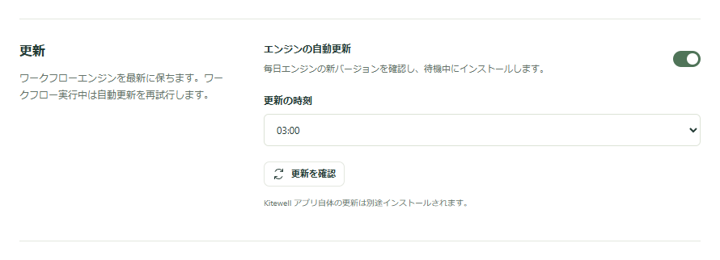

更新されるものは 2 つあり、それぞれ別の仕組みで動きます。Kitewell アプリは、新しいバージョンが出たことを知らせ、あなたが指示したときにインストールします。その下で動くワークフローエンジンは、夜間に、何も実行されていないときに自分で更新されます。

## Kitewell アプリを更新する

Kitewell は 1 日に 1 回、自分で新しいバージョンを探します。作業を邪魔することはありません。新しいバージョンが出ると通知が 1 回届き、Kitewell のメニューの **Check for Updates…** が **Update to Kitewell x.y.z…** に変わります。あなたが選ぶまで、何もインストールされません。

1. 通知をクリックするか、Kitewell のメニューを開きます。Mac では画面上部のメニューバーにある Kitewell のメニュー、またはアプリケーションメニュー。Windows ではトレイの Kitewell アイコンを右クリックします。
2. **Update to Kitewell x.y.z…** を選びます。今すぐ探すには **Check for Updates…** を選びます。すでに最新であれば、Kitewell がそう伝えてそこで終わります。
3. 新しいバージョンがある場合は、Kitewell がバージョンを示して確認します。**Download and Install** を選びます。あとにするなら **Later** を選びます。メニューはそのまま更新を案内し続けます。

Kitewell はお使いのシステム向けのインストーラーをダウンロードし、実行の前に SHA256 のフィンガープリントを検証します。そのあと、

- Mac では macOS のインストーラが開きます。指示に従ってください。
- Windows ではインストーラーが自動で実行されます。Kitewell が保存していない変更について確認してから終了し、インストーラーがアプリを置き換えて新しいバージョンを開きます。

先に編集内容を保存し、実行中のワークフローが終わるのを待ってください。インストールすると Kitewell とそのバックグラウンドサービスが再起動します。すでに進行中の実行は続き、戻ってきたエンジンがそれを見つけますが、エディターで保存していない下書きは失われます。

## ワークフローエンジンを更新する

Kitewell は Dagu というワークフローエンジンを自分で持っていて、その面倒も見ます。**このデバイス → デバイス設定** を開き、**更新** を探してください。

- **エンジンの自動更新** は最初からオンです。Kitewell は 1 日に 1 回確認し、何も実行されていないときに新しいエンジンをインストールします。
- **更新の時刻** は、それを試す時刻です。初期値は 03:00 で、このデバイスのローカル時刻です。
- **更新を確認** はその場で確認します。新しいエンジンがあると **更新をインストール** が現れ、選ぶとインストールされます。

更新は、どのプロジェクトにも実行中・キュー待ち・待機中のワークフローがなくなるまで待ちます。何か動いている場合は、15 分ごとに再試行します。エンジンを切り替える前にエンジンのデータの写しを取り、新しいエンジンが起動しなければ写しを戻します。エンジンを更新しても Kitewell アプリは変わらず、アプリを更新してもエンジンは変わりません。

## うまくいかないとき

- 確認に失敗する。ネットワークと[リリース状況](/ja/releases/)を確認してください。お使いのシステム向けの最初の公開リリースまでは、読みに行く更新フィードがありません。フィードに到達できない確認は、最新であることの証明ではなく、確認の失敗です。
- フィンガープリントが一致しない、またはインストーラーを検証できない。作業を中止して[報告](/ja/support/)してください。回避しないでください。
- 前のバージョンに戻したい。過去のインストーラーは [GitHub のリリースページ](https://github.com/dagucloud/kitewell/releases)に残っています。古いアプリをインストールしても古いデータは戻りません。それには[バックアップ](/ja/docs/backups/)から復元してください。

問題を報告するときは、Kitewell のバージョン、エンジンのバージョン、OS のバージョンを添えてください。Kitewell のバージョンはサイドバーの左下にあります。上部バーのピルには、Kitewell のバージョンとエンジンのバージョンが並んで表示されます。Mac ではアプリケーションメニューの **About Kitewell** に Kitewell のバージョンが、Windows ではトレイメニューの先頭にアプリとサービスのバージョンが表示されます。

## 技術的な詳細

- 公開ビルドは、Mac では `https://kitewell.app/updates/macos/latest.json`、Windows では `https://kitewell.app/updates/windows/latest.json` を更新フィードとして読みます。
- 確認とダウンロードはワークフローを止めません。再起動が起きるのはインストールのときだけです。
- 自動の確認は、Kitewell を開いてから 1 分後に行われ、その後は起動している間、24 時間ごとに行われます。フィードに到達できなければ 1 時間後にもう一度試し、何も言いません。失敗を報告するのは **Check for Updates…** だけです。
- 通知はバージョンごとに 1 回だけで、Kitewell の通知が許可されている場合に限ります。どちらにしても、メニューには新しいバージョンが表示されます。
- Windows では、更新のためにサービスを止めても、その下の実行には届きません。各実行は独自のプロセスグループを持ち、サービスと一緒に終わるグループの外にあります。実行を取り消すのは **Quit Kitewell** だけです。
- Kitewell がインストールするのは Dagu の最新の安定版で、使う前に SHA256 のフィンガープリントで検証されます。
