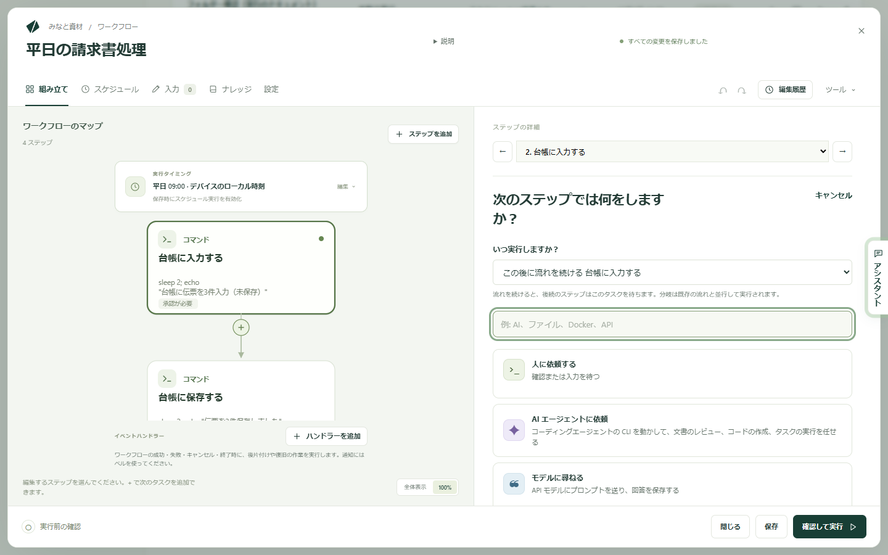
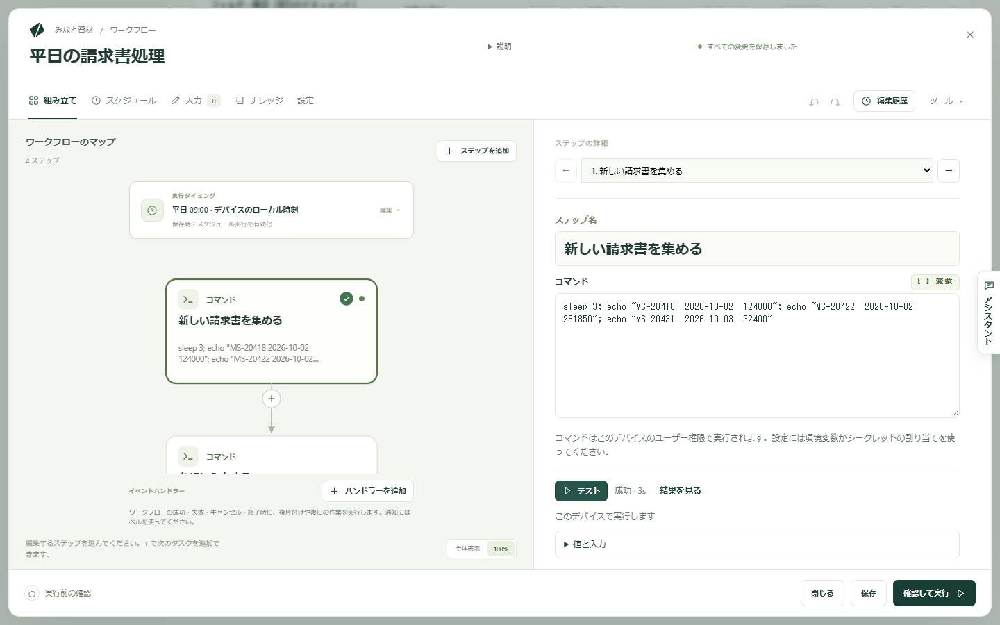
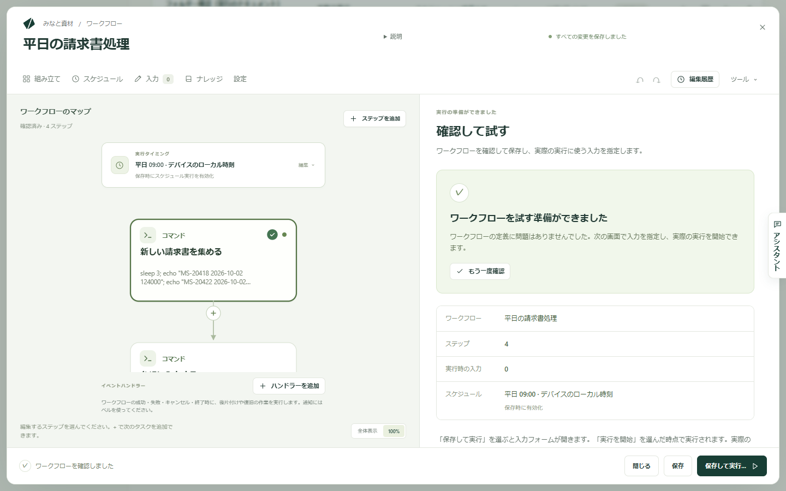
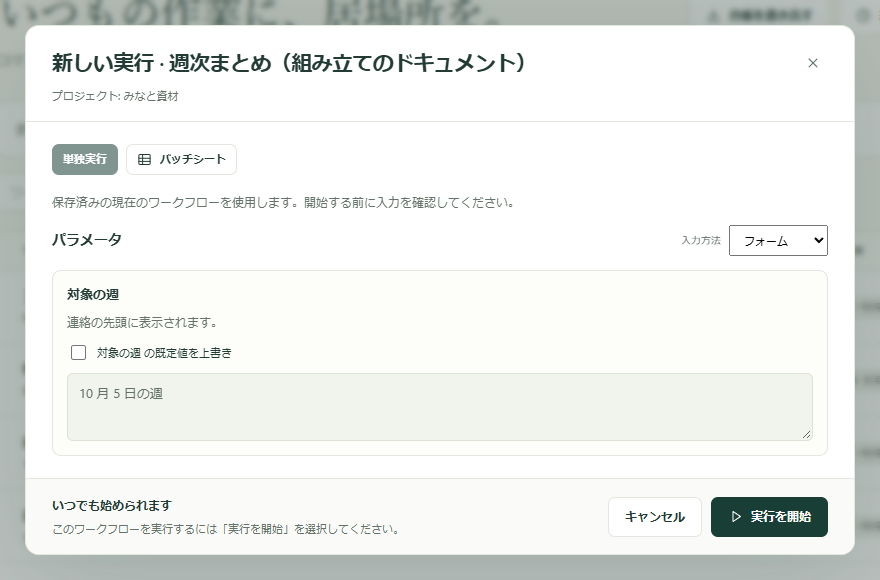

ワークフローとは、ふだん手作業で行っている仕事を一度書き留めて、Kitewell に任せられるようにしたものです。請求書を集め、入力し、概要をメールで送る、といった仕事です。小さな単位でひとつずつ組み立て、それぞれを単独で試し、最後に全体を実行して動きを確かめます。

その小さな単位がステップです。1 つのステップは 1 つのことだけを行います。コマンドを実行する、Web サイトに入力する、メールを読む、人に尋ねる。次のステップは、前のステップが終わるのを待ちます。エディターはステップを地図のように描くので、順序がひと目でわかります。

## 必要なもの

ワークフローを入れておくプロジェクトです。サイドバーに **ワークフロー** があれば、すでに用意できています。あとは選ぶステップによって変わります。

- コマンド、Web サイトのステップ、待機だけなら、ほかに必要なものはありません。
- AI のステップには、**エージェントとモデル** で設定したモデルまたはエージェントが必要です。
- メールのステップには、**その他 → メールアカウント** で接続したメールボックスが必要です。
- ステップで使うパスワードや鍵は、先に **その他 → シークレット** に保存します。シークレットとは、ログに値が残らないように保管されるパスワードや鍵のことです。

必要なものが見つからないステップは、実行前にその旨を表示します。ですから、これらをすべて先に用意しなくても組み立て始められます。

## ひとつずつ組み立てる

1. **ワークフローを作成** を選び、名前を付けます。エディターは空の **組み立て** で開き、**何を自動化しますか？** と尋ねます。
2. タスクを 1 つ選びます。追加したステップは左の **ワークフローのマップ** に並び、編集中のステップは右の **ステップの詳細** に開きます。この画面では「タスク」と呼びますが、マップに入ったあとはステップです。
3. **ステップ名** に名前を入力します。`新しい請求書を集める` のような、わかりやすい言葉にします。あとでログを見るときに探す名前です。
4. そのタスクに必要な項目を入力します。コマンドのステップなら **コマンド** という項目が 1 つ、Web サイトのステップならアドレスとそこで行う操作です。
5. 次のステップは **ステップを追加**、またはマップのステップの下にある + で足します。**いつ実行しますか？** で入る位置を決めます。
   - **この後に流れを続ける**：後ろにあったステップが、新しいステップを待つようになります。
   - **次の位置に分岐を追加**：今の流れと並ぶ、もう 1 本の経路を作ります。
   - **独立して開始**：何も待たない処理を追加します。
6. 仕事を書き終えるまで続けます。順序の整理は、あとから **複製**、**上へ移動**、**下へ移動**、**ステップを削除** で行えます。

空のワークフローには、手早く始める方法が 2 つあります。**このワークフローにさせたいことを説明してください** に仕事の内容を書いて **アシスタントに聞く** を選ぶか、**または例から始める** からカードを選びます。後から例を開くには **ツール → 例を見る** を使います。

## 選べるタスク

**タスクを検索** で一覧を絞り込めるので、`メール` や `Excel` と入力すれば探し回る必要はありません。多くの人が最初に使うのは次のタスクです。

- **コマンドまたはスクリプトを実行**：このコンピューターで何かを実行します。
- **Web サイトを自動操作**：サイトを開き、クリック、入力、読み取り、ダウンロードを、ふつうの言葉で指示します。[Web サイトを自動操作](/ja/docs/browser/)を参照してください。
- **デスクトップアプリを自動操作**：このコンピューターのアプリを、人が使うのと同じように操作します。[デスクトップアプリを自動操作](/ja/docs/desktop/)を参照してください。
- **メールを送信**、**メールを検索**、**メールを整理**：接続したメールボックスで、メールを書く、読む、片づけます。[メールを自動化](/ja/docs/email/)を参照してください。
- **モデルに尋ねる**：モデルに質問を送り、その答えを保存します。
- **AI エージェントに依頼**：このコンピューターにインストールしたコーディングエージェントに作業を任せます。
- **AI に判断を依頼**：分類、点数付け、はい / いいえの判断を、次のステップが読める形で行います。
- **人に依頼する**：いったん止まり、誰かの確認や入力を待ちます。
- **待機**：一定の時間、指定した時刻、またはファイルが現れるまで待ちます。
- **条件まで繰り返す**：準備ができるまで一定間隔で確認します。試行回数の上限も指定できます。
- **各項目を処理**：リストの項目ごとにステップを実行し、結果をまとめます。
- **値で分岐**：処理をどちらの経路に進めるかを決めます。
- **テキストテンプレートに値を埋め込む**：テンプレートと値から、メッセージやファイルを作ります。
- **別のワークフローを実行**：すでにあるワークフローを 1 つのステップとして使い回します。

技術寄りのタスクも同じ一覧の下のほうにあります。**Docker で実行**、**Web サービスを呼び出す**、**API アクションを使う**、**別のマシンで実行**、**マシンとの間でファイルをコピー** です。Excel のタスクは末尾の **スプレッドシート** にまとめられています。[Excel を自動化](/ja/docs/spreadsheets/)を参照してください。

## 全体を実行する前に 1 つのステップをテストする

1 つのステップが動くかどうかを確かめるために、ワークフロー全体を実行する必要はありません。

1. 地図でステップを選択します。
2. **テスト** を選びます（Mac では ⌘↩、Windows では Ctrl+Enter）。
3. **テスト** の横のバーを見ます。実行中の様子と、終わったときの結果が表示されます。**結果を見る** を選ぶと内容を読めます。**出力** にはステップが表示した内容、**エラー出力（stderr）** にはエラーの内容が入ります。

テストは、保存していない変更を使って、そのステップだけを実行します。ワークフローは保存されません。前のステップは実行されず、その値は直近に成功したテストのものが使われるか、自分で入力します。**値と入力** には、ステップが読み取る値と、まだ足りない値が表示されます。

テストは実際の作業です。Kitewell は実行前に「me@example.com から実際にメールを送信します」「このデバイスで実行します」のように何が起きるかを伝えます。まずその一文を読み、納得したうえで **このままテスト** を選んでください。

次の 4 種類のステップは、まだ単独でテストできません。実行する代わりに、その旨が表示されます。**人に依頼する**、**各項目を処理** のループの中にあるステップ、イベントハンドラー、サーバーグループを実行先にしたステップです。

## 実行ごとに変わるもの

日付、フォルダー、タイトルのように実行ごとに変わるものは、ステップに直接書かず **入力** に置きます。入力はそれぞれ、実行を開始するときに記入するフォームの項目になります。

使うときは、ステップの入力欄で `${` と入力し、一覧から選びます。同じ一覧からシークレットや前のステップが保存した結果も選べます。結果を使うステップは、その結果を作るステップを待つように Kitewell が自動でつなぎます。

## 確認してから実行する

**保存** は作業を保存します。いったん中断したいときはいつでも使ってください。ワークフローのスケジュールは、保存した時点から効き始めます。

**確認して実行** は、実際の作業が始まる前の最後の確認です。名前、**ステップ** の数、**実行時の入力** の数、**スケジュール** がまとめて表示され、先に直しておきたいことが **実行する前に** に並びます。**ワークフローを確認** は下書きの間違いを調べます。

続けて次のようにします。

1. **保存して実行…** を選びます。ワークフローが保存され、実行のフォームが開きます。
2. ワークフローに入力があれば、**パラメータ** の項目を記入します。すでに値が入っている項目は、その上にある既定値を上書きするチェックボックスをオンにすると変更できます。
3. **実行を開始** を選びます。

実行は進みながら表示されます。実行は開始した時点のワークフローを使うので、あとから編集しても、すでに動いている実行は変わりません。結果の扱いは[実行とログ](/ja/docs/runs/)、Kitewell に自動で開始させる方法は[スケジュール](/ja/docs/scheduling/)を参照してください。

## 人の判断を待つ

誰かが目を通さないまま終わらせたくない作業もあります。

**人に依頼する** は、それ自体が 1 つのステップです。指示を書き、回答が必要ならフォームを追加します。選択肢、コメント、数値などです。誰かがタスクを完了するまで、実行は待機します。

自動で実行されたステップの結果を誰かに確認してもらうには、そのステップの **承認** を開き、**このステップの実行後に承認を待つ** をオンにします。質問と、入力してもらう値を入力します。**差し戻し時に再実行するステップ** では、レビュー担当者が修正を求めたときに繰り返すステップを選びます。

承認はステップが実行されたあとに一時停止します。何かが起きる前に許可を必須にするには、その手前に **人に依頼する** のステップを置きます。

人によるタスクから作業を差し戻すこともできます。**修正のために差し戻す** で **レビュー担当者が作業を差し戻せるようにする** をオンにし、**差し戻し先** としてこのタスクより前に実行されるステップを選びます。再実行される AI のステップやモデルへのプロンプトには、フィードバックが渡されます。コマンドは各値を変数として読み取り、最初の実行では空になります。

待機中の実行は **実行とログ → 待機中** の **あなたの対応待ち** にあります。人によるタスクでは **タスクを完了** を選べ、差し戻しを許可している場合は **差し戻す…** も選べます。承認では **承認**、**差し戻す**、**実行を却下** を選べます。差し戻すと、選んだステップとそれ以降の処理が再実行されます。却下すると実行は終了します。

## ワークフローの終了時にタスクを実行する

イベントハンドラーは、流れの中ではなくワークフローのステップと並んで実行されるタスクです。最初のステップの前、実行が人の対応を待っている間、成功時、失敗時、キャンセル時、または終了時に必ず実行できます。一時ファイルの削除、変更の取り消し、復旧用サービスの呼び出しなどに使います。

地図の下にある **イベントハンドラー** に、このワークフローのハンドラーが一覧表示されます。**ハンドラーを追加** を選び、実行するタイミングを選びます。**ステップ実行前**、**承認待ち時**、**成功時**、**失敗時**、**キャンセル時**、**最後に必ず** です。ハンドラーは単独で開きます。**タスクの種類** で内容を変え、**ワークフローに戻る** で地図に戻ります。**人に依頼する**、**AI に判断を依頼**、**値で分岐**、**各項目を処理**、**待機**、**条件まで繰り返す** はハンドラーにできません。

ハンドラーは、ワークフローの入力と変数、実行のステータスを読めますが、ステップの結果は読めません。**実行とログ** では、実行ごとにステップと並んでハンドラーが表示されます。

ワークフローの失敗を人に知らせるには、ハンドラーではなく[アラート](/ja/docs/alerts/)を使ってください。

## AI エージェントやモデルに依頼する

まず **エージェントとモデル** で名前付きのエージェントまたはモデルを設定し、それをワークフローに追加します。

- **AI エージェントに依頼** は、このコンピューターにインストールしたコマンドライン型のエージェントを実行します。エージェントを選択してプロンプトを書き、**エージェント設定とコンテキスト** でプロジェクトフォルダーとコンテキストを設定します。
- **モデルに尋ねる** は、設定済みのモデルにプロンプトを送ります。モデルを選択し、必要な回答の内容を書きます。

後続のステップで答えが必要な場合は、結果を変数として保存します。

**ツール → AI プロンプトを確認** では、各 AI ステップが受け取る指示を、実行前に確認できます。実行時の値は、実行するときに埋め込まれます。キー、権限、プロバイダーごとの要件については、[AI エージェントとモデル](/ja/docs/ai/)を参照してください。

## インポートした API を使う

[OpenAPI の定義を API ライブラリにインポート](/ja/docs/apis/)してから、ワークフローに **API アクションを使う** を追加します。API とオペレーションを選ぶと、必須パラメーターやリクエストボディを含むリクエストの項目を、Kitewell が定義から組み立てます。

後続のステップで **変数** を開き、API のステップの応答から項目を選びます。Kitewell は値を保存し、その結果が使われる前にリクエストが終わるようにします。

## Docker イメージを実行する

このコンピューターで Docker を起動します。タスクの一覧から **Docker で実行** を選びます。

1. タグを含めて **イメージ** を選びます。候補を検索するか、**イメージを探す** を使います。**検査** はイメージのポート、フォルダー、変数を読み取り、ステップの設定を手助けします。
2. イメージ内で実行するコマンドを入力します。複数行、パイプ、シェル変数を使う場合は **シェルスクリプト** を使います。その場合、イメージに `/bin/sh` が含まれている必要があります。
3. 必要なオプションを展開します。作業フォルダー、マウント、環境、公開ポート、ネットワークです。コンテナー内で作成したファイルをコンテナーの外に残すには、マウントが必要です。
4. **Docker を確認** で接続を確認します。**テスト** はイメージとコマンドを実際に実行するので、先にマウントと影響を確認してください。

Kitewell は Docker をインストールしたり起動したりしません。**実行後もコンテナーを残す** をオンにしない限り、コンテナーは実行後に削除されます。マウントしたファイルと Docker ボリュームには、別途バックアップが必要です。

## 別のマシンでコマンドを実行する

**その他 → サーバー** を開きます。各サーバーのアドレス、ユーザー名、サインインの方法を追加します。パスワードは[シークレット](/ja/docs/secrets/)に保存するか、パスフレーズのないローカルの秘密鍵を使います。**ホスト鍵の検証** では、既定のまま **接続をテスト** でフィンガープリントを確認して承認するか、**この端末の known_hosts** を使うか、**検証しない** を選びます。**踏み台ホスト** を使うと、別のマシンの先にあるサーバーに接続できます。

グループを作ると、複数のサーバーを 1 つの名前で扱えます。サーバーを必要な順序に並べ、同時に実行できる数を選び、失敗時にロールアウトを止めるか続けるかを選びます。

ワークフローには **別のマシンで実行** を追加します。**実行先** でサーバーまたはグループを選び、コマンドを入力します。グループを選ぶとマシンごとに別のステップが作られるため、結果は **実行とログ** にマシンごとに表示されます。

すべてのコマンドステップとスクリプトステップを同じ実行先に送るには、ワークフローの **設定 → 実行先** を使います。ここでグループを指定すると、ワークフロー全体が各マシンで順番に実行され、マシンごとに別の実行になります。Docker、AI、Web サービス、インポートした API、サブワークフローのステップは、引き続き Kitewell を実行しているコンピューターで実行されます。

## うまくいかないときは

- **ステップが開始した直後に失敗する。** たいていは、プログラムが見つからない、フォルダーが違う、このコンピューターに値のないシークレットを使っている、のいずれかです。ステップを単独で **テスト** し、**エラー出力（stderr）** を読んでください。
- **ステップが読む値が空になる。** その値を作るステップが先に実行される必要があります。値を読むステップの **利用できる値** を開いて値が並んでいるか確認し、続けて **この後に実行** を確認してください。
- **エディターで項目を変更できない。** 一部の高度な設定は、ワークフローのテキストにしか書けません。その旨が表示され、**ツール → YAML を編集** で開けます。
- **ターミナルでは動くコマンドが、ここでは動かない。** ステップは Kitewell を実行している人の権限で、ワークフローのフォルダーから、自分のシェルの設定なしに実行されます。プログラムはフルパスで指定してください。

ほかの症状は[トラブルシューティング](/ja/docs/troubleshooting/)にあります。

## 詳細

- **ツール** には、同じワークフローの 2 つの見方である **ビジュアルエディター** と **YAML を編集**、**例を見る**、**AI プロンプトを確認**、**ワークフローを確認**、そして入力時の候補を読み直す **エディターの候補を更新** があります。
- **ツール → YAML を編集** は、ワークフローを **ワークフローの YAML** というラベルのテキストとして開きます。ビジュアルエディターでできることはすべてここに書かれており、一度きりのスケジュール、特殊な実行方式、コメントなど、テキストにしか書けないものもあります。Ctrl+Space で候補が出て、Tab でインデントできます。コメントや、ビジュアルエディターに表示されない設定は、戻っても残ります。
- 何かを表示するステップは、その出力をファイルとして保存できます。**成果物の名前（任意）** を入力すると、ファイルが実行の **成果物** に表示されます。ステップが `$DAG_RUN_ARTIFACTS_DIR` にファイルを書き込む方法もあります。
- ワークフローは直近 50 回分のステップのテストを保持し、テストは一度に 1 つずつ実行されます。テストが差し出す値は、直近に成功したテストのものです。
- ショートカット：Mac では ⌘S、Windows では Ctrl+S でワークフローを保存します。ビジュアルエディターで **組み立て** を開いている間は、⌘↩ または Ctrl+Enter で選択中のステップをテストします。
- ステップが実行するコマンドは、そのコンピューターのものです。Windows では PowerShell、Mac ではシェルで実行されます。`echo "…"`、`sleep 2`、`exit 1` はどちらでも動きますが、`cat`、`ls`、`printf`、`&&` は Windows では動きません。
- ワークフローのテキストでは、エンジン自体のメール設定（`mail_on`、`smtp`、`error_mail`、`info_mail`、`mail_on_error`）は設定できません。書くと保存に失敗します。代わりに Kitewell 側で[アラート](/ja/docs/alerts/)を設定します。
